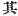
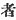
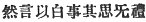
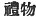
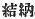

  
[Intangible Textual Heritage](../../index)  [Shinto](../index) 
[Index](index)  [Previous](kj150)  [Next](kj152) 

------------------------------------------------------------------------

[Buy this Book at
Amazon.com](https://www.amazon.com/exec/obidos/ASIN/B0028Y4SZY/internetsacredte)

------------------------------------------------------------------------

  
*The Kojiki*, translated by Basil Hall Chamberlain, \[1919\], at
Intangible Textual Heritage

------------------------------------------------------------------------

p. 378

## \[SECT. CXLIV.—EMPEROR AN-KŌ (PART I.—HE SLAYS KING OHO-KUSAKA).\]

The august child [1](#fn_2242) Anaho dwelt at
the palace of Anaho at Isonokami, [2](#fn_2243) and ruled the Empire. The Heavenly
Sovereign sent the Grandee of Ne, [3](#fn_2244) ancestor of the Grandees of Sakamoto,
to the residence of King Oho-kusaka, on behalf of his younger brother
Prince Oho-hatsuse to command thus: "I wish Thine Augustness's younger
sister

p. 379

\[paragraph continues\] Queen Waka-kusaka
to wed Prince Oho-hatsuse. So do thou present her." [4](#fn_2245) Then King Oho-kusaka did obeisance
four times, and said: "Owing to a supposition that there might be some
such Great Commands, I have kept her always indoor. [5](#fn_2246) With reverence [6](#fn_2247) will I respectfully offer her
according to the Great Commands." Nevertheless, thinking it
disrespectful \[merely\] to send a message, [7](#fn_2248) he forthwith, as a ceremonial
gift [8](#fn_2249) from his younger sister,
made \[the Grandee of Ne\] take a pushwood jewel head-dress [9](#fn_2250) to present \[to the Heavenly
Sovereign\]. The Grandee of Ne forthwith stole the jewel headdress meant
as a ceremonial gift, and slandered King Oho-kusaka, saying: "King
Oho-kusaka would not receive the Imperial Commands, but said: "An soror
mea fiet ejusdem stirpis \[viri\] inferior storea?" [10](#fn_2251) and, grasping the hilt of his
cross-sword, [11](#fn_2252) was angry." So the
Heavenly Sovereign, having in his great anger slain King Oho-kusaka,
took that King's chief wife Nagata-no-oho-iratsume, [12](#fn_2253) and made her Empress.

------------------------------------------------------------------------

### Footnotes

[378:1](kj151.htm#fr_2247) *I.e.*, Prince. In
all other cases we find the word *mikoto*, "Augustness," as the title by
which the Sovereign is mentioned at the commencement of his reign.

[378:2](kj151.htm#fr_2248) See Sect. XLV, Note
16.

[378:3](kj151.htm#fr_2249) *Ne no omi*. The
etymology of *ne* is obscure.

[379:4](kj151.htm#fr_2250) Literally, as
"tribute."

[379:5](kj151.htm#fr_2251) More literally, "I
have kept her without putting her out of doors."

[379:6](kj151.htm#fr_2252) *Conf*. Sect. IX,
Note 4 and Sect. XVIII, Note 14.

[379:7](kj151.htm#fr_2253) Motowori surmises
that   may be an error for
  in the original of this
clause  .

[379:8](kj151.htm#fr_2254)  . This term corresponds to the
modern  , the name by
which the presents which are exchanged at the time of betrothal are
designated.

[379:9](kj151.htm#fr_2255) p. 380 The original term *oshi-ki no tam-akadzura*
is extremely obscure. One of Motowori s conjectures is that the
"push-wood" was a kind of frame by which the jewels or beads, strung on
an erect stem of same hard material, were kept firmly attached to the
head. Perhaps some notion of the *coiffure* intended may be gathered
from the plate opposite p. 354 of Part III of Vol. VIII of these
"Transactions" (Mr. J. Condor's paper on "The History of
[Japanese](errata.htm#91) Costume

[379:10](kj151.htm#fr_2256) *I.e.*, "An soror
mea, cujus pater Imperator Nin-toku, fiet uxor præsentis Imperatoris?
"—Hujus similitudinis rusticitas et ipsis Japonicis commentatoribus
pudori est.

[379:11](kj151.htm#fr_2257) See Sect. XLV,
Note 5.

[379:12](kj151.htm#fr_2258) See Sect. CXXXVII,
Note 5.

------------------------------------------------------------------------

[Next: Section CXLV.—Emperor An-kō (Part II.—He is Slain by King
Ma-yowa)](kj152)
