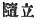
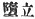

  
[Intangible Textual Heritage](../../index)  [Shinto](../index.md) 
[Index](index)  [Previous](kj152)  [Next](kj154.md) 

------------------------------------------------------------------------

[Buy this Book at
Amazon.com](https://www.amazon.com/exec/obidos/ASIN/B0028Y4SZY/internetsacredte.md)

------------------------------------------------------------------------

  
*The Kojiki*, translated by Basil Hall Chamberlain, \[1919\], at
Intangible Textual Heritage

------------------------------------------------------------------------

p. 382 \[306\]

## \[SECT. CXLVI.—EMPEROR AN-KŌ (PART III.—PRINCE OHO HATSUSE SLAYS PRINCES KURO-BIKO AND SHIRO-BIRO).\]

Then Prince Oho-hatsuse, [1](#fn_2262.md) who at
that time was a lad, was forthwith grieved and furious on hearing of
this event, and went forthwith to his elder brother King Kurobiko, [2](#fn_2263.md) and said: "They have slain [3](#fn_2264.md) the Heavenly Sovereign. What shall be
done?" But King Kurobiko was not startled, and was of unconcerned
heart. [4](#fn_2265.md) There upon King
Oho-hatsuse reviled his elder brother, saying: "For one thing it being
the Heavenly Sovereign, for another thing it being thy brother, how is
thy heart without concern? [5](#fn_2266.md) What!
not startled, but unconcerned on hearing that they have slain thine
elder brother!"—and forthwith he clutched him by the collar; dragged him
out, drew his sword, and slew him. Again, going to his elder brother
King Shiro-biko, he told him the circumstances as before. The
unconcernedness again was like \[that shown by\] King Kuro-biko. \[So
King Oho-hatsuse,\] having forthwith clutched him by the collar, pulled
him along, and dug a pit on reaching Woharida, [6](#fn_2267.md) buried him as he stood, [7](#fn_2268.md) so that by the time he had been buried
up to the loins, both his eyes burst out, and he died. [8](#fn_2269.md)

------------------------------------------------------------------------

### Footnotes

[382:1](kj153.htm#fr_2267.md) p. 382 See Sect. [CXXXVII](errata.htm#93.md), Note 11.

[382:2](kj153.htm#fr_2268.md) See Sect. CXXXVII,
Note 6.

[382:3](kj153.htm#fr_2269.md) Literally, "taken."

[382:4](kj153.htm#fr_2270.md) *I.e.*, treated the
matter with indifference.

[382:5](kj153.htm#fr_2271.md) Literally,
"[without](errata.htm#94.md) relying," as if the speaker meant to say that
the dead man could not rely on him for vengeance.

[382:6](kj153.htm#fr_2272.md) In Yamato. The name
seems to mean "new tilled field"

[382:7](kj153.htm#fr_2273.md) Written   in the text followed by
Motowori. The other reading 
 is untenable.

[382:8](kj153.htm#fr_2274.md) p. 383 In order to account for such an effect from
so apparently insufficient a cause, Motowori supposes that after the
prince had been made to stand up to the height of his loins in the pit,
the latter was filled by having stones thrown into it, whereby his feet
and legs would be crushed.

------------------------------------------------------------------------

[Next: Section CXLVII.—Emperor An-kō (Part IV.—Death of Prince Ma-yowa
and of the Grandee Tsubura)](kj154.md)
