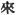
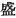
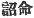
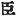
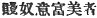
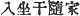
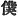
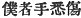
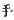

  
[Intangible Textual Heritage](../../index)  [Shinto](../index.md) 
[Index](index)  [Previous](kj153)  [Next](kj155.md) 

------------------------------------------------------------------------

[Buy this Book at
Amazon.com](https://www.amazon.com/exec/obidos/ASIN/B0028Y4SZY/internetsacredte.md)

------------------------------------------------------------------------

  
*The Kojiki*, translated by Basil Hall Chamberlain, \[1919\], at
Intangible Textual Heritage

------------------------------------------------------------------------

p. 383 \[269\]

## \[SECT. CXLVII.—EMPEROR [AN-KŌ](errata.htm#95) (PART IV.—DEATH OF PRINCE MA-YOWA AND OF THE GRANDEE TSUBURA.md).\]

Again he raised an army and beleaguered the house of the Grandee
Tsubura. Then \[the other side also\] raised an army to resist the
attack, [1](#fn_2270.md) and the arrows that were
shot forth were like unto the falling down of the \[ears of the\]
reeds. [2](#fn_2271.md) Thereupon King
Oho-hatsuse, using his spear as a staff, peeped in, [3](#fn_2272.md) and said: "Is perchance the maiden,
with whom I spoke, in this house?" [4](#fn_2273.md) Then the Grandee Tsubura, hearing
these commands, [5](#fn_2274.md) came forth
himself, and having taken off the weapons with which he was girded, did
obeisance eight times, and said: "The maiden Princess Kara, whom anon
thou deignedst to woo, is at thy service. Again in addition I will
present to thee five granaries. (What are called the
five granaries are now the gardeners of the five villages of
Kadzuraki: [6](#fn_2275).md) Meanwhile the
reason why she does not come out to meet thee in person is that from of
old down to the present time grandees and chiefs have been known to hide
in the palaces of Kings, but Kings have not yet been known to hide in
the houses of grandees. [7](#fn_2276.md)
Therefore I think that, though a vile slave of a grandees [8](#fn_2277.md) exerting his utmost
[strength](errata.htm#96.md) in the fight can scarcely conquer, yet must he
die rather than desert a Prince who, trusting in him, has entered into
his house." [9](#fn_2278.md) Having thus

p. 384

spoken, he again took his weapons and went in again to
[fight](errata.htm#97.md). Then, their strength being exhausted and their
arrows finished, he said to the Prince: "My [10](#fn_2279.md) hands are wounded, and our arrows
likewise are finished. We cannot now fight. What shall be done? "The
Prince \[266\] replied, saying: "If that be so, there is nothing more to
do. \[Do thou\] now slay me. "So \[the Grandee Tsubura\] thrust the
Prince to death with his sword, and forthwith killed himself by cutting
off his own head.

------------------------------------------------------------------------

### Footnotes

[383:1](kj154.htm#fr_2275.md) p. 384 Literally, "to wait and fight."

[383:2](kj154.htm#fr_2276.md) The character  , "to come" (here in accordance
with English idiom rendered by "down") is supposed to be an error. One
conjectural emendation of it, viz., 
, would suggest the "plentiful" falling of the flowers
of the reeds.

[383:3](kj154.htm#fr_2277.md) *I.e.*, he lifted
himself on tiptoe by leaning on his spear, so as to be able to peep in.

[383:4](kj154.htm#fr_2278.md) The maiden thus
suddenly introduced into the story is Tsubura's daughter Kara, whom it
must be supposed that the Prince had previously been wooing.

[383:5](kj154.htm#fr_2279.md) Or rather,
"Imperial words." The application of the characters   to the words of one who was
not yet actually Emperor is curious.

[383:6](kj154.htm#fr_2280.md) *I.e.*, the places
where the five granaries originally were are now the five villages
inhabited by the men who cultivate the Imperial gardens. For Kadzuraki
see Sect. LV, Note 1.

[383:7](kj154.htm#fr_2281.md) Or we may,
following Motowori's proposal, take the character   in this clause in its slightly
different acceptation of "subject," which better suits the sense. The
partly phonetic wording of the next sentence   shows how the writer was
perplexed by the double use of the term.

[383:8](kj154.htm#fr_2282.md) *Q.d.*. in
comparison with a prince of the Imperial family, even a grandee was but
a vile slave.

[383:9](kj154.htm#fr_2283.md) The character   in the original of this
passage   is corrupt. But
the sense remains clear, and it is scarcely worth while looking about
for a probable emendation. Motowori has no satisfactory proposal to
make.

[384:10](kj154.htm#fr_2284.md) The humble
character  , "servant"
here used for the First p. 385 Personal
pronoun. The expression  ,
here literally rendered "my hands are all wounded," is very curious.
Motowori reads it *ita-te ohinu*, *i.e.*, "I have received (or suffered
from) hurtful hands," and compares two somewhat similar expressions
found in Sect. XLIV (see Note 33 to that Sect). The translator may
however point out that the similarity is much more apparent in
Motowori's *kana* reading than it is in the Chinese text itself. May not
the sense of the present passage rather be: "All our men are wounded?"
for the word *te* ( )
"hand," is frequently used in Japanese,—in compounds at least,—in the
sense of "man," somewhat as it is in English naval, mining, and other
technical parlance.

------------------------------------------------------------------------

[Next: Section CXLVIII.—Emperor An-kō (Part V:—Prince Oho-Hatsuse Slays
Prince Oshiha)](kj155.md)
