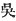
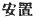

  
[Intangible Textual Heritage](../../index)  [Shinto](../index.md) 
[Index](index)  [Previous](kj157)  [Next](kj159.md) 

------------------------------------------------------------------------

[Buy this Book at
Amazon.com](https://www.amazon.com/exec/obidos/ASIN/B0028Y4SZY/internetsacredte.md)

------------------------------------------------------------------------

  
*The Kojiki*, translated by Basil Hall Chamberlain, \[1919\], at
Intangible Textual Heritage

------------------------------------------------------------------------

p. 388

## \[SECT. CLI.—EMPEROR YŪ-RIYAKU (PART II.—VARIOUS DEEDS).\]

So the Shiraka Clan [1](#fn_2292.md) was
established as the august proxy of Prince Shiraka. Again the
Hatsuse-Clan-Retainers [2](#fn_2293.md) were
established. At this time there came over people from Kure. Again the
Kahase Retainers [3](#fn_2294.md) were
established. These people from Kure [4](#fn_2295.md) were lodged [5](#fn_2296.md) at Kure-hara. So the place was called
by the name of Kure-hara. [6](#fn_2297.md)

------------------------------------------------------------------------

### Footnotes

[388:1](kj158.htm#fr_2297.md) p. 388 *Shiraka-be*.

[388:2](kj158.htm#fr_2298.md) *Hatuse-be no
tomire*. This clan was called after the reigning Emperor. Remember that
the word "Retainers" is here a "gentile name."

[388:3](kj158.htm#fr_2299.md) *Kahase no toneri*.
*Kaha-se* signifies "river-reach," and the "Chronicles," under date of
the eleventh year of this reign, tell a story of the appearance of a
white cormorant, to commemorate which this family was established.
Cormorants, it will be remembered, were used for catching fish in
rivers; hence the appropriateness of the name bestowed on the family in
question.

[388:4](kj158.htm#fr_2300.md) The name given by
the early Japanese to Wu (
), an ancient state in Eastern China to the South of
the Yang-tzo River. In Japanese it however, like other names of portions
of China, often denotes the whole of that country in a somewhat vague
manner. The derivation the word *Kura* is obscure. The most acceptable
proposition is that which would see in it corruption of the original
Chinese term *Wu*, of which *Go* is the Sinico-Japanese pronunciation.
But what of the second syllable *re*?

[388:5](kj158.htm#fr_2301.md) The phrase   is in this place used for
"lodged."

[388:6](kj158.htm#fr_2302.md) *I.e.*, Kure Moor.
It is in Yamato. According to the "Chronicles," the former name of the
place had been *Himokuma-nu*.

------------------------------------------------------------------------

[Next: Section CLII.—Emperor Yū-riyaku (Part III.—The Roof of the House
of the Great Departmental Lord of Shiki)](kj159.md)
