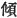
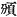
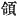
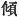
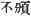
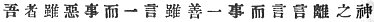
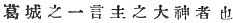
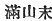
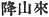

  
[Intangible Textual Heritage](../../index)  [Shinto](../index.md) 
[Index](index)  [Previous](kj164)  [Next](kj166.md) 

------------------------------------------------------------------------

[Buy this Book at
Amazon.com](https://www.amazon.com/exec/obidos/ASIN/B0028Y4SZY/internetsacredte.md)

------------------------------------------------------------------------

  
*The Kojiki*, translated by Basil Hall Chamberlain, \[1919\], at
Intangible Textual Heritage

------------------------------------------------------------------------

p. 399 \[319\]

## \[SECT. CLVIII.—EMPEROR YŪ-RIYAKU (PART IX.—REVELATION OF THE GREAT DEITY OF KADZURAKI, LORD OF ONE WORD).\]

Again once, when the Heavenly Sovereign made a progress up Mount
Kadzuraki, the various officials [1](#fn_2332.md)
were all clothed in green-stained garments with red cords that had been
granted to them. At that time there were people ascending the mountain
on the opposite mountain acclivity quite similar to the order of the
Heavenly Monarch's retinue. Again the style of the habiliments and
likewise the people were similar and not distinguishable. [2](#fn_2333.md) Then the Heavenly Sovereign gazed, and
sent to ask, saying: "There being no other King in Yamato excepting
myself, what person goeth thus?" The style of the reply again was like
unto the commands of a Heavenly Sovereign. Hereupon the Heavenly
Sovereign, being very angry, fixed his arrow \[in his bow\], and the
various officials all fixed their arrows \[in their bows\]. Then those
people also all fixed their arrows \[in their bows\]. So the Heavenly
Sovereign again sent to ask, saying: "Then tell thy name. Then let each
of us tell his name, and \[then\] let fly his arrow." Thereupon \[the
other\] replied, saying: "As I was the first to be asked, I will be the
first to tell my name. I am the Deity who dispels with a word the evil
and with a word the good,—the Great Deity of Kadzuraki, Lord of One

p. 400

\[paragraph continues\] \[320\]
Word." [3](#fn_2334.md) The Heavenly Sovereign
hereupon trembled, and said: "I reverence \[thee\], my Great Deity. I
understood not that thy great person would be revealed;" [4](#fn_2335.md)—and having thus spoken, he, beginning
by his great august sword and likewise bow and arrows, took off the
garments which the hundred officials had on, and worshipfully presented
them \[to the Great Deity\]. [5](#fn_2336.md)
Then the Great Deity, Lord of One Word, clapping his hands, [6](#fn_2337.md) accepted the offering. So when the
Heavenly Sovereign made his progress back, the Great Deity came down the
mountain, [7](#fn_2338.md) and respectfully
escorted him to the entrance [8](#fn_2339.md) of
the Hatsuse mountain. So it was at that time the Great Deity Lord of One
Word was revealed.

------------------------------------------------------------------------

### Footnotes

[399:1](kj165.htm#fr_2337.md) p. 400 Literally, "the hundred officials." This
Chinese phrase has been met with before in the "Records," and recurs in
this Section.

[399:2](kj165.htm#fr_2338.md) The original has
the character  , out of
which it is hard to make sense. Motowori's proposal to consider it put
by error for  , has
therefore been adopted, though the translator feels by no means sure
that it is a happy one. According to the strict Chinese sense of  , it would not fit with this
passage any [better](errata.htm#103.md) than 
; but in Japanese we may be justified in understanding
  to mean "not
distinguishable."

[400:3](kj165.htm#fr_2339.md) In the original:
  . The import of the obscure
expression "dispelling with a word the good" is not rendered much more
intelligible by Motowori's attempt to explain it. For Kadzuraki see LV,
Note. 1.

[400:4](kj165.htm#fr_2340.md) Literally, "that
there would be a present (or manifest) great person."

[400:5](kj165.htm#fr_2341.md) *I.e.*, he kept
nothing for himself, but from his own sword and bow and arrows down to
the ceremonial garments in which his followers were clad, gave every
thing to the god.

[400:6](kj165.htm#fr_2342.md) In token of joy,
says Motowori.

[400:7](kj165.htm#fr_2343.md) The characters
 , rendered by "came down
the mountain," are evidently the result of a copyist's carelessness. The
translation follows Motowori's proposal to emend the text to  .

[400:8](kj165.htm#fr_2344.md) Literally "mouth."

------------------------------------------------------------------------

[Next: Section CLIX.—Emperor Yū-riyaku (Part X.—The Mound of the Metal
Spade)](kj166.md)
