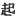

  
[Intangible Textual Heritage](../../index)  [Shinto](../index.md) 
[Index](index)  [Previous](kj173)  [Next](kj175.md) 

------------------------------------------------------------------------

[Buy this Book at
Amazon.com](https://www.amazon.com/exec/obidos/ASIN/B0028Y4SZY/internetsacredte.md)

------------------------------------------------------------------------

  
*The Kojiki*, translated by Basil Hall Chamberlain, \[1919\], at
Intangible Textual Heritage

------------------------------------------------------------------------

## \[SECT. CLXVII.—EMPEROR KEN-ZŌ (PART I.—THE OLD WOMAN OKI-ME).\]

His Augustness Woke-no-ihasu-wake dwelt at the palace of
Chika-tsu-Asuka, [1](#fn_2384.md) and ruled the
Empire for

p. 417

eight years. The Heavenly Sovereign wedded the Queen of Naniha, [2](#fn_2385.md) daughter of the King of Ihaki. [3](#fn_2386.md) He had no children. At the time when
this Heavenly Sovereign was searching for the august bones of the King
his father, King Ichinobe, [4](#fn_2387.md) there
came out from the land of Afumi \[to the palace\] a poor old woman, who
said: "The place where the prince's august bones are buried is specially
well known to me, [5](#fn_2388.md) and moreover
\[his skeleton\] can be known by his august teeth." (His august teeth were teeth uneven like a lily.)
Then people were set [6](#fn_2389.md) to dig the
\[334\] ground and search for the august bones; and the bones having
been forthwith obtained, an august mausoleum was made on the mountain
east of the Moor of Kaya, [7](#fn_2390.md) and
they were interred, and the children of Kara-fukuro [8](#fn_2391.md) were made to guard the august
mausoleum. Afterwards the august bones were brought up \[to the
Capital\]. So having returned up \[to the Capital, the Heavenly
Sovereign\] sent for the old woman, praised her for having, without
forgetting, kept the place in mind, and conferred upon her the name of
the Old Woman Oki-me: [9](#fn_2392.md) thus did
he send for her into the palace, and deign to treat her with deep and
wide kindness. So he built a house for the old woman to dwell in dose to
the palace, and always sent for her every day. So he hung a bell by the
door of the great hall, and always rang it when he wished to call the
old woman. So he composed an august Song. That Song said:

"Oh! the far-distant bell tinkles when she has past the moor with its
low eulalias and the little valley. Oh! Oki-me must be coming!" [10](#fn_2393.md)

Hereupon the old woman said: "I am very aged, \[335\]

p. 418

and would fain depart to my native land." So when the Heavenly Sovereign
let her depart according to her request, he saw her off and sang,
saying:

"Ah Okime! Okime from Afumi! from to-morrow \[onwards\] wilt \[thou\] be
hidden behind the deep mountains, and alas! not seen!" [11](#fn_2394.md)

 

p. 418

------------------------------------------------------------------------

### Footnotes

[416:1](kj174.htm#fr_2389.md) p. 418 See Sect. CXXXIII, Note 11.

[417:2](kj174.htm#fr_2390.md) *Naniha no miko*.
For *Naniha* see Sect. XLIV, Note 26

[417:3](kj174.htm#fr_2391.md) *Ihaki no miko*.

[417:4](kj174.htm#fr_2392.md) Who had been
treacherously slain by the Emperor Yū-riyaku (see Sect. CXLVIII).

[417:5](kj174.htm#fr_2393.md) *I.e.*, says
Motowori, "it is known to me, and to none besides."

[417:6](kj174.htm#fr_2394.md) The character used
is  , which is more
applicable to the raising of troops than to the setting to work of
peasants. It seems however here to be used in the latter sense; or
perhaps we should consider it to mean that people were got together.

[417:7](kj174.htm#fr_2395.md) See Sect. CXLVIII,
Note 3. Possibly the "mountain east" should be a Proper Name,—Eastern
Mountain,—but it is not taken as such by Motowori.

[417:8](kj174.htm#fr_2396.md) See Sect. CXLVIII,
Note 1.

[417:9](kj174.htm#fr_2397.md) *I.e.*, "keeping an
eye." *q.d.*, on the place of burial of the Emperor's father. Grammar
would lead us to expect the order of the words forming the name to be
reversed thus, *Mo-oki*; but see Motowori's remarks in Vol. XLIII, p.
56.

[417:10](kj174.htm#fr_2398.md) This Song is not
comprehensible except by reference to the text of the "Chronicles,"
whose author gives a somewhat varying version of the story. He tells us
that, as a support to the infirm old lady, the Emperor had a string or
rope stretched as a sort of hand-rest along the way she was obliged to
pass in order to reach the Imperial apartments, and that at the end of
the rope was a bell whose tinkling notified the Emperor of her approach.
The conjectural exclamation which [closes](errata.htm#119.md) the little
poem has therefore an obvious sense, which would be wanting if the bell
were at the other end, as in the version here given; for the Emperor
would not give expression to surprise at her approach, if he had himself
just rung for her to come.—"Far-distant" is an imperfect attempt to
represent the Pillow-Word *momo-dzutafu*, which here alludes to the
stages p. 419 along which the old woman may
be supposed to be travelling. The valley and the moor overgrown with
short grass form an allusion to the way,—long and arduous for her,—which
Oki-me had to traverse to reach the Imperial. apartments, and they
contain possibly a further allusion to her [original](errata.htm#120.md)
journey to the capital.

[417:11](kj174.htm#fr_2399.md) The meaning of
this Song is quite clear.—The second time the name Oki-me occurs, it
might, instead of being as here taken as an exclamation, be made the
subject of the sentence, thus: "Oki-me from Afumi will by to-morrow,
etc." The words "wilt \[thou\]," which represent *ka* of the original
Japanese may be taken either as an exclamation properly so-called, or as
a sort of rhetorical interrogation whose force is simply exclamatory.
The meaning comes to the same in either case, and is literally rendered
by the same English words; but according to the latter view, we should
have to replace the point of exclamation by a point of interrogation.

------------------------------------------------------------------------

[Next: Section CLXVIII.—Emperor Ken-zō (Part II.—He Slays The
Boar-Herd)](kj175.md)
