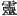
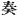
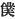
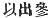

  
[Intangible Textual Heritage](../../index)  [Shinto](../index) 
[Index](index)  [Previous](kj175)  [Next](kj177) 

------------------------------------------------------------------------

[Buy this Book at
Amazon.com](https://www.amazon.com/exec/obidos/ASIN/B0028Y4SZY/internetsacredte)

------------------------------------------------------------------------

  
*The Kojiki*, translated by Basil Hall Chamberlain, \[1919\], at
Intangible Textual Heritage

------------------------------------------------------------------------

p. 420

## \[SECT. CLXIX.—EMPEROR KEN-ZŌ (PART III.—THE EMPEROR YŪ-RIYAKU'S MAUSOLEUM IS DISFIGURED).\]

The Heavenly Sovereign, deeply hating the Heavenly Sovereign
Oho-hatsuse, who had slain the King his father, wished to be revenged on
his spirit. [1](#fn_2401) So when wishing to
destroy the august mausoleum of the Heavenly Sovereign Oho-hatsuse, he
\[was about to\] send people \[to execute this design\], his elder
brother, His Augustness Ohoke, addressed' him, saying: "To demolish this
august mausoleum thou shouldst not send other people. None but myself
shall go, and I will demolish it according to the Heavenly Sovereign's
august heart. [2](#fn_2402) Then the Heavenly
Sovereign commanded: "Make thy progress, then, according to thy
decree," [3](#fn_2403) Wherefore His
Augustness Ohoke, having proceeded down himself, slightly excavated the
side of the august mausoleum, and returned up \[to the capital\], and
reported that he had dug up and demolished it. Then the Heavenly
Sovereign, astonished at the quickness of his return up, asked how he
had demolished it. He replied, saying: "I slightly excavated the earth
at the side of the august mausoleum." The Heavenly Sovereign said:
"Wishing to be revenged on the enemy, of the King our father, I had
counted on.

p. 421

the complete demolition of the mausoleum, Why hast thou \[only\]
slightly excavated it? "He replied, saying: \[337\] "The reason why I
did so was that the wish to be revenged on the spirit of the foe of the
King our father is truly just. Nevertheless the Heavenly Sovereign
Oho-hatsuse, though he were our father's foe, was still our uncle, and
moreover was an Heavenly Sovereign who ruled the Empire. So if we now,
simply from the consideration of his having been our father's enemy,
were completely to demolish the mausoleum of an Heavenly Sovereign who
ruled the Empire, after-generations would surely revile us. Meanwhile
the wrongs of the King our father must not be unrevenged. So I slightly
excavated the side of the mausoleum. This insult will quite suffice as a
token to future ages." On his thus addressing him, the Heavenly
Sovereign said: 'This also is very just, Be it as thou sayest."

------------------------------------------------------------------------

### Footnotes

[420:1](kj176.htm#fr_2406)  , read *ni tama* or
*tamashihi*. We might also translate it by the word "ghost."

[420:2](kj176.htm#fr_2407) The respectful
character   is used for
this word, and again below we have the First Personal Pronoun
represented by  ,
"servant."

[420:3](kj176.htm#fr_2408) This sentence ends
in the original with the characters 
, which it is not necessary to render into English.
They imply that the speaker will come back, and report on what he has
done.

------------------------------------------------------------------------

[Next: Section CLXX.—Emperor Ken-zō (Part IV.—His Age and Place of
Burial)](kj177)
