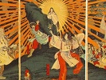

  
[Intangible Textual Heritage](../../index)  [Shinto](../index) 
[Index](index)  [Previous](kj176)  [Next](kj178) 

------------------------------------------------------------------------

[Buy this Book at
Amazon.com](https://www.amazon.com/exec/obidos/ASIN/B0028Y4SZY/internetsacredte)

------------------------------------------------------------------------

  
*The Kojiki*, translated by Basil Hall Chamberlain, \[1919\], at
Intangible Textual Heritage

------------------------------------------------------------------------

## \[SECT. CLXX.—EMPEROR KEN-ZŌ (PART IV.—HIS AGE AND PLACE OF BURIAL).\]

So the Heavenly Sovereign died, and His Augustness Ohoke ruled the
succession of Heaven's sun. [1](#fn_2404) The
Heavenly Sovereign's august years were thirty-eight

p. 422

years. His august mausoleum is on the mound of Ihatsuki at
Katawoka. [2](#fn_2405)

------------------------------------------------------------------------

### Footnotes

[421:1](kj177.htm#fr_2409) p. 422 See Sect. XXXII, Note 27.

[422:2](kj177.htm#fr_2410) For *Katawoka* see
Sect. LX, Note 29. *Iha-tsuki* probably means "rockplatter," and seems
to have been the name of a little plateau.

------------------------------------------------------------------------

[Next: Section CLXXI.—Emperor Nin-ken](kj178)
