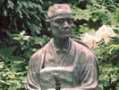

  
[Intangible Textual Heritage](../../index)  [Japan](../index)  [Wisdom
of the East](../../woe/index)  [Index](index)  [Next](msj01) 

------------------------------------------------------------------------

  
*The Master-Singers of Japan*, by Clara A. Walsh, \[1914\], at
Intangible Textual Heritage

------------------------------------------------------------------------

The Wisdom of the East Series  
Edited By  
L. CRANMER-BYNG  
Dr. S. A. KAPADIA

THE MASTER-SINGERS OF JAPAN

WISDOM OF THE EAST

# THE MASTER-SINGERS OF JAPAN

##### BEING VERSE TRANSLATIONS FROM THE JAPANESE POETS

## BY CLARA A. WALSH

#### LONDON

#### JOHN MURRAY, ALBEMARLE STREET, W.

#### \[1914\]

Scanned, proofed and formatted at Intangible Textual Heritage, February
2010, by John Bruno Hare. This text is in the public domain in the US
because it was published prior to 1923.

First Edition;
*January* 1910  
Reprinted. *September* 1914

TO

PROFESSOR H. J. WEINTZ

------------------------------------------------------------------------

[Next: Contents](msj01)

