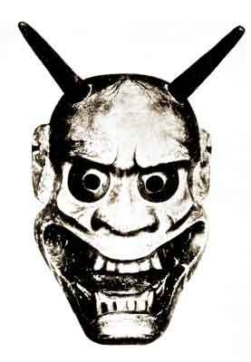

  
[Intangible Textual Heritage](../../index)  [Shinto](../index) 
[Buddhism](../../bud/index)  [Index](index)  [Previous](npj24) 
[Next](npj26) 

------------------------------------------------------------------------

p. 145

### AOI NO UYE (PRINCESS HOLLYHOCK)

REVISED BY ZENCHIKU UJINOBU (1414-1499?)

PERSONS

COURTIER.  
THE SAINT OF YOKAWA.  
WITCH.  
MESSENGER.  
PRINCESS ROKUJŌ.  
CHORUS.

(*A folded cloak laid in front of the stage symbolizes the sickbed of
Aoi*.)

COURTIER.

I am a courtier in the service of the Emperor Shujaku. You must know
that the Prime Minister's daughter, Princess Aoi, has fallen sick. We
have sent for abbots and high-priests, of the Greater School and of the
Secret School, but they could not cure her.

And now, here at my side, stands the witch of Teruhi, [1](#fn_126) a famous diviner with the bow-string. My
lord has been told that by twanging her bow-string she can make visible
an evil spirit and tell if it be the spirit of a living man or a dead.
So he bade me send for her and let her pluck her string. (Turning to the
WITCH, who has been waiting motionless.) Come, sorceress, we are ready!

WITCH (*comes forward beating a little drum and reciting a mystic
formula*).

Ten shōjō; chi shōjō.  
Naige shōjō; rokon shōjō.  
   Pure above; pure below.  
   Pure without; pure within.  
   Pure in eyes, ears, heart and tongue.

(*She plucks her bow-string, reciting the spell*.)

You whom I call  
Hold loose the reinsp. 146  
On your grey colt's neck  
As you gallop to me  
Over the long sands!

(The living phantasm of ROKUJŌ appears at the back of the stage.)

ROKUJŌ.

In the Three Coaches  
That travel on the Road of Law  
I drove out of the Burning House . . . [1](#fn_127)  
Is there no way to banish the broken coach  
That stands at Yūgao's door? [2](#fn_128)  
                                        This world  
Is like the wheels of the little ox-cart;  
Round and round they go . . . till vengeance comes.  
The Wheel of Life-turns like the wheel of a coach;  
There is no escape from the Six Paths and Four Births.  
We are brittle as the leaves of the *bashō*;  
As fleeting as foam upon the sea.  
Yesterday's flower, to-day's dream.  
From such a dream were it not wiser to wake?  
And when to this is added another's scorn  
How can the heart have rest?  
So when I heard the twanging of your bow  
For a little while, I thought, I will take my pleasure;  
And as an angry ghost appeared.  
Oh! I am ashamed!

(*She veils her face*.)

This time too I have come secretly [3](#fn_129)
p. 147  
In a closed coach.  
Though I sat till dawn and watched the moon,  
Till dawn and watched,  
How could I show myself,  
That am no more than the mists that tremble over the fields?  
I am come, I am come to the notch of your bow  
To tell my sorrow.  
Whence came the noise of the bow-string?

WITCH.

Though she should stand at the wife-door of the mother-house of the
square court . . . [1](#fn_130)

ROKUJŌ.

Yet would none come to me, that am not in the flesh. [2](#fn_131)

WITCH.

How strange! I see a fine lady whom I do not know riding in a broken
coach. She clutches at the shafts of another coach from which the oxen
have been unyoked. And in the second coach sits one who seems a new
wife. [3](#fn_132) The lady of the broken coach
is weeping, weeping. It is a piteous sight.

Can this be she?

COURTIER.

It would not be hard to guess who such a one might be. Come, spirit,
tell us your name?

ROKUJŌ.

    In this Sahā World [4](#fn_133) where days
fly like the lightning's flash  
    None is worth hating and none worth pitying.  
    This I knew. Oh when did folly master me?  
You would know who I am that have come drawn by the twanging of your
bow? I am the angry ghost of Rokujō, Lady of the Chamber.  
    Long ago I lived in the world.  
    I sat at flower-feasts among the clouds. [5](#fn_134) p. 148  
On spring mornings I rode out  
In royal retinue and on autumn nights  
Among the red leaves of the Rishis' Cave  
I sported with moonbeams,  
With colours and perfumes  
My senses sated.  
  I had splendour then;  
But now I wither like the Morning Glory  
Whose span endures not from dawn to midday.  
I have come to clear my hate.

(

She then quotes the Buddhist saying, "Our sorrows in this world are not
caused by others; for even when others wrong us we are suffering the
retribution of our own deeds in a previous existence."

But while singing these words she turns towards AOI'S bed; passion again
seizes her and she cries:)

I am full of hatred.  
I must strike; I must strike.

(*She creeps towards the bed*.)

WITCH.

You, Lady Rokujō, you a Lady of the Chamber! Would you lay wait and
strike as peasant women do? [1](#fn_135) How
can this be? Think and forbear!

ROKUJŌ.

Say what you will, I must strike. I must strike now. (*Describing her
own action*.) "And as she said this, she went over to the pillow and
struck at it." (*She strikes at the head of the bed with her fan*.)

WITCH.

She is going to strike again. (*To* ROKUJŌ.) You shall pay for this!

ROKUJŌ.

And this hate too is payment for past hate.

 

p. 149

WITCH.

"The flame of anger

ROKUJŌ

Consumes itself only." [1](#fn_136)

WITCH.

Did you not know?

ROKUJŌ

Know it then now.

CHORUS.

O Hate, Hate!  
Her [2](#fn_137) hate so deep that on her bed  
Our lady [3](#fn_138) moans.  
Yet, should she live in the world again [4](#fn_139)  
He would call her to him, her Lord  
The Shining One, whose light  
Is brighter than fire-fly hovering  
Over the slime of an inky pool.

ROKUJŌ

But for me  
There is no way back to what I was,  
No more than to the heart of a bramble-thicket.  
The dew that dries on the bramble-leaf  
Comes back again;  
But love (and this is worst)  
That not even in dream returns,--  
That is grown to be an old tale,--  
Now, even now waxes,  
So that standing at the bright mirror  
I tremble and am ashamed.

I am come to my broken coach. (*She throws down her fan and begins to
slip on her embroidered robe*.) I will hide you in it and carry you
away!

(*She stands right over the bed, then turns away and at the back of the
stage throws off her robe, which is held by* p.
150 *two attendants in such a way that she cannot be seen. She
changes her "deigan" mask for a female demon's mask and now carries a
mallet in her hand*.)

(*Meanwhile the COURTIER, who has been standing near the bed*:)

COURTIER.

Come quickly, some one! Princess Aoi is worse. Every minute she is
worse, Go and fetch the Little Saint of Yokawa. [1](#fn_140)

MESSENGER.

I tremble and obey.

(*He goes to the wing and speaks to some one aft the stage*.)

May I come in?

SAINT (*speaking from the wing*).

Who is it that seeks admittance to a room washed by the moonlight of the
Three Mysteries, sprinkled with the holy water of Yoga? Who would draw
near to a couch of the Ten Vehicles, a window of the Eight Perceptions?

MESSENGER.

I am come from the Court. Princess Aoi is ill. They would have you come
to her.

SAINT.

It happens that at this time I am practising particular austerities and
go nowhere abroad. But if you are a messenger from the Court, I will
follow you.

(*He comes on the stage*.)

COURTIER.

We thank you for coming.

SAINT.

I wait upon you. Where is the sick person?

COURTIER.

On the bed here.

SAINT.

Then I will begin my incantations at once.

p. 151  
COURTIER.

Pray do so.

SAINT.

He said: "I will say my incantations."  
Following in the steps of En no Gyōja, [1](#fn_141)  
Clad in skirts that have trailed the Peak of the Two Spheres, [2](#fn_142)  
That have brushed the dew of the Seven Precious Trees,  
Clad in the cope of endurance  
That shields from the world's defilement,  
"Sarari, sarari," with such sound  
I shake the red wooden beads of my rosary  
And say the first spell:  
*Namaku Samanda Basarada  
Namaku Samanda Basarada*. [3](#fn_143)

ROKUJŌ (*during the incantation she has cowered at the back of the stage
wrapped in her Chinese robe, which she has picked up again*.)

Go back, Gyōja, go back to your home; do not stay and be vanquished!

SAINT.

Be you what demon you will, do not hope to overcome the Gyōja's subtle
power. I will pray again.

(*He shakes his rosary whilst the* CHORUS*, speaking for him, invokes
the first of the Five Kings*.)

CHORUS.

In the east Gō Sanze, Subduer of the Three Worlds.

ROKUJŌ (*counter-invoking*).

In the south Gundari Yasha.

CHORUS.

In the west Dai-itoku.

 

p. 152

ROKUJŌ.

In the north Kongō

CHORUS.

Yasha, the Diamond King.

ROKUJŌ.

In the centre the Great Holy

CHORUS.

Fudō Immutable.*  
Namaku Samanda Basarada  
Senda Makaroshana  
Sohataya Untaratakarman*.  
"They that hear my name shall get Great Enlightenment;  
They that see my body shall attain to Buddhahood." [1](#fn_144)

ROKUJŌ (*suddenly dropping her mallet and pressing her hands to her
ears*.)

The voice of the Hannya Book! I am afraid. Never again will I come as an
angry ghost.

GHOST.

When she heard the sound of Scripture  
The demon's raging heart was stilled;  
Shapes of Pity and Sufferance,  
The Bodhisats descend.  
Her soul casts off its bonds,  
She walks in Buddha's Way.

 

  
DEMON MASK

 

------------------------------------------------------------------------

### Footnotes

[145:1](npj25.htm#fr_128) A *miko* or witch
called Teruhi is the subject of the play *Sanja Takusen*.

[146:1](npj25.htm#fr_129) Rokujō has left the
"Burning House," i. e. her material body. The "Three Coaches" are those
of the famous "Burning House" parable in the *Hokkekyō*. Some children
were in a burning house. Intent on their play, they could not he induced
to leave the building; till their father lured them out by the promise
that they would find those little toy coaches awaiting them. So Buddha,
by partial truth, lures men from the "burning house" of their material
lives. Owing to the episode at the Kamo Festival, Rokujō is obsessed by
the idea of "carriages," "wheels" and the like.

[146:2](npj25.htm#fr_130) One day Rokujō saw a
coach from which all badges and distinctive decorations had been
purposely stripped (hence, in a sense, a "broken coach") standing before
Yūgao's door. She found out that it was Genji's. For Yūgao, see [p.
142](npj24.htm#page_142).

[146:3](npj25.htm#fr_131) Rokujō went secretly
to the Kamo Festival in a closed carriage.

[147:1](npj25.htm#fr_132) Words from an old
dance-song or "*saibara*."

[147:2](npj25.htm#fr_133) "That am a ghost,"
but also "that have lost my beauty."

[147:3](npj25.htm#fr_134) Alluding to Aoi's
pregnancy.

[147:4](npj25.htm#fr_135) A Sanskrit name for
the "world of appearances."

[147:5](npj25.htm#fr_136) I.e. at the Palace.

[148:1](npj25.htm#fr_137) It was the custom for
wives who had been put away to ambush the new wife and strike her "to
clear their hate."

[149:1](npj25.htm#fr_138) From the Sutrālankära
Shāstra (Cat. No. 1182).

[149:2](npj25.htm#fr_139) Rokujō's.

[149:3](npj25.htm#fr_140) Aoi.

[149:4](npj25.htm#fr_141) I.e. recover.

[150:1](npj25.htm#fr_142) The hero of the
"Finding of Ukifune," a later episode in the Genji Monogatari.

[151:1](npj25.htm#fr_143) Founder of the sect
of the ascetics called Yamabushi Mountaineers.

[151:2](npj25.htm#fr_144) Mount Ōmine, near
Yoshino, ritual ascents of which were made by Yamabushi.

[151:3](npj25.htm#fr_145) Known as the Lesser
Spell of Fudō. The longer one which follows is the Middle Spell. They
consist of corrupt Sanskrit mixed with meaningless magic syllables.

[152:1](npj25.htm#fr_146) From the Buddhist
Sūtra known in Japan as the Hannya Kyō. It was supposed to have a
particular influence over female demons, who are also called "Hannyas."

------------------------------------------------------------------------

[Next: Chapter V](npj26)
