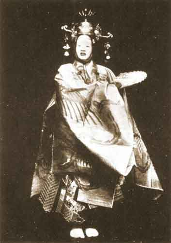

  
[Intangible Textual Heritage](../../index)  [Shinto](../index) 
[Buddhism](../../bud/index)  [Index](index)  [Previous](npj29) 
[Next](npj31) 

------------------------------------------------------------------------

p. 176

  
THE ANGEL IN *HAGOROMO*.

p. 177

### NOTE ON HAGOROMO.

THE story of the mortal who stole an angel's cloak and so prevented her
return to heaven is very widely spread. It exists, with variations and
complications, in India, China, Japan, the Liu Chiu Islands and Sweden.
The story of Hasan in the *Arabian Nights* is an elaboration of the same
theme.

The Nō play is said to have been written by Seami, but a version of it
existed long before. The last half consists merely of chants sung to the
dancing. Some of these (c. g. the words to the Suruga Dance) have no
relevance to the play, which is chiefly a framework or excuse for the
dances. It is thus a Nō of the primitive type, and perhaps belongs, at
any rate in its conception, to an earlier period than such unified
dramas as *Atsumori* or *Kagekiyo*. The words of the dances in
*Maiguruma* are just as irrelevant to the play as those of the Suruga
Dance in *Hagoromo*, but there the plot explains and even demands their
intrusion.

The libretto of the second part lends itself very ill to translation,
but I have thought it best to give the play in full.

------------------------------------------------------------------------

[Next: Hagoromo](npj31)
