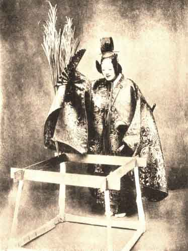

  
[Intangible Textual Heritage](../../index)  [Shinto](../index) 
[Buddhism](../../bud/index)  [Index](index)  [Previous](npj37) 
[Next](npj39) 

------------------------------------------------------------------------

 

  
IZUTSU

 

p. 217

# CHAPTER VII

### SUMMARIES

IZUTSU  
KAKITSUBATA  
HANAKATAMI  
OMINAMESHI  
MATSUKAZE  
SHUNKWAN  
AMA  
TAKE NO YUKI  
TORI-OI  
YUYA  
TANGO-MONOGURUI  
IKKAKU SENNIN  
YAMAUBA  
HOTOKE NO HARA  
MARI  
TŌRU  
MAI-GURUMA

p. 219

SUMMARIES

OF the plays which are founded on the Ise Monogatari [1](#fn_194) the best known are *Izutsu* and
*Kakitsubata*, both by Seami. *Izutsu* is founded on the episode which
runs as follows:

Once upon a time a boy and a girl, children of country people, used to
meet at a well and play there together. When they grew up they became a
little shame-faced towards one another, but he could think of no other
woman, nor she of any other man. He would not take the wife his parents
had found for him, nor she the husband that her parents had found for
her.

Then he sent her a poem which said:

"Oh, the well, the well!  
I who scarce topped the well-frame  
Am grown to manhood since we met."

And she to him:

"The two strands of my hair  
That once with yours I measured,  
Have passed my shoulder;  
Who but you should put them up?" [2](#fn_195)

So they wrote, and at last their desire was fulfilled. Now after a year
or more had passed the girl's parents died, and they were left without
sustenance. They could not go on living together; the man went to and
fro between her house and the town of Takayasu in Kawachi, while she
stayed at home.

Now when he saw that she let him go gladly and showed no grief in her
face, he thought it was because her heart had changed. And one day,
instead of going to Kawachi, he hid behind the hedge and watched. Then
he heard the girl singing:

"The mountain of Tatsuta that rises  
Steep as a wave of the sea when the wind blows  
To-night my lord will be crossing all alone!"

And he was moved by her song, and went no more to Takayasu in Kawachi.

p. 220

In the play a wandering priest meets with a village girl, who turns out
to be the ghost of the girl in this story. The text is woven out of the
words of the *Ise Monogatari*.

Kakitsubata is based on the eighth episode. Narihira and his companions
come to a place called Yatsuhashi, where, across an iris-covered swamp,
zigzags a low footpath of planks.

Narihira bids them compose an anagram on the work Kakitsubata, "iris,"
and some one sings:

"*Ka*ra-goromo  
*Ki*-tsutsu nare-ni-shi  
*Tsu*ma shi areba  
*Ba*ru-baru ki-nuru  
*Ta*bi wo shi zo omou."

The first syllables of each line make, when read consecutively, the word
*Kakitsubata*, and the poem, which is a riddle with many meanings, may
be translated:

"My lady's love  
Sat close upon me like a coat well worn;  
And surely now  
Her thoughts go after me down this long road!"

"When he had done singing, they all wept over their dried-rice till it
grew soppy."

In the play, a priest comes to this place and learns its story from a
village-girl, who turns out to be the "soul of the iris-flower." At the
end she disappears into the Western Paradise. "Even the souls of flowers
can attain to Buddhahood."

------------------------------------------------------------------------

### Footnotes

[219:1](npj38.htm#fr_196) The love-adventures
of Narihira (825-880 A.D.) in 125 episodes, supposed to have been
written by Narihira himself.

[219:2](npj38.htm#fr_197) The husband puts up
the bride's hair.

------------------------------------------------------------------------

[Next: Hanakatami (The Flower Basket](npj39)
