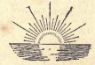

  
[Intangible Textual Heritage](../../index)  [Sikhism](../index.md)  [Wisdom
of the East](../../woe/index)  [Index](index)  [Next](rosi01.md) 

------------------------------------------------------------------------

  
*The Religion of the Sikhs*, by Dorothy Field, \[1914\], at Intangible
Textual Heritage

------------------------------------------------------------------------

The Wisdom of the East Series  
Edited By  
L. CRANMER-BYNG  
Dr S. A. KAPADIA

###### THE RELIGION OF THE SIKHS

##### WISDOM OF THE EAST

# THE RELIGION OF THE SIKHS

## BY DOROTHY FIELD

 

#### LONDON

#### JOHN MURRAY, ALBEMARLE STREET, W.

#### \[1914\]

  [  
Click to enlarge](img/cover.jpg.md)  
Front Cover  

  [  
Click to enlarge](img/title.jpg.md)  
Title Page  

------------------------------------------------------------------------

[Next: Acknowledgement](rosi01.md)

