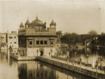

  
[Intangible Textual Heritage](../../index)  [Sikhism](../index.md)  [Wisdom
of the East](../../woe/index)  [Index](index)  [Previous](rosi05.md) 
[Next](rosi07.md) 

------------------------------------------------------------------------

  
*The Religion of the Sikhs*, by Dorothy Field, \[1914\], at Intangible
Textual Heritage

------------------------------------------------------------------------

p. 43

### CHAPTER III

### THE DOCTRINES OF THE SIKHS

*Main doctrines of all religions*.—These concern God, His nature and
attributes, and man, and the means by which salvation may be attained.
There are three aspects under which the nature of God has been
conceived. In the first He is omnipotent Being, Ruler and Creator of the
world, the Father and Judge of men, In the second He becomes incarnate
for the salvation of mankind or is specially manifested in some teacher
or Guru. In the third he is Immanent Spirit, the Life and Soul of all
that is. In each great religion, special prominence is given to some one
feature of doctrine—all others being modified accordingly—and thus
individual distinctiveness is obtained.

*Their Comparative Importance*.—For instance, in Judaism the unity and
omnipotence of God receive most emphasis, so that we always associate
the Jews with an exclusive monotheism. The same may be said of
Muhammadanism—except that here the importance of the Prophet stands out
almost as prominently. In philosophic Hinduism

p. 44

\[paragraph continues\] Divine Immanence
is the first essential, while in Christianity all else pales into
insignificance beside the splendour of the Divine Incarnation.

*Outstanding Feature of Sikhism: The One God*.—Sikhism—in common with
all great deistic religions—lays most stress on the unity and
omnipotence of God.

"There is but one God, the true," is the constant reiteration of the
hymns. He is the only Reality, beside which everything else is false. He
is formless, great, all-powerful, absolutely holy, without limits of any
kind, and He cannot be grasped by the finite mind. He has less
definiteness than the personalities of Allah or Jehovah, and He is
therefore more often described in terms of negation, calling to mind
those used in the Vedanta. [1](#fn_26.md) For
instance:

"By thinking I cannot obtain a conception of Him, even though I think
hundreds of thousands of times."

"He hath no colour nor outline."

"He is not old, nor is He young."

"He feeleth nor heat nor cold."

p. 45

"He hath no father and no mother,"

and so on. But yet He possesses many of the attributes of personality.
He is an Ocean of Mercy, the Friend of Man, the Friend of Sinners, the
Bountiful, Destroyer of Sorrow, Cherisher of the Poor. "He is wise,
generous, beautiful, infinite." He "beholdeth" and "heareth" his
servants whom He loves. He is both Father and Mother to man.

"God is the Father and Mother of all, and taketh care of them"; or He
may be described as Lover or Spouse to the human soul.

Saith Nānak, "God alone is the Spouse of all." "My Spouse hath taken my
hand and made me his Queen." This metaphor is the most usual.

But God's orders are absolutely binding, and, like Allah of the Koran,
His ways cannot be questioned. He does what He pleases; by His order
everything is maintained from moment to moment, and yet He is described
as being "perfectly unconcerned."

"God the unconcerned is happy."

His glory and splendour are a continuous source of praise in the Sikh
hymns, together with His consistency:

"Thou art the same in every age,  
 Thou art ever and ever the same,"

*Divine Incarnation denied*.—The Sikh Gurus

p. 46

denied that the Supreme Deity could take upon himself the body of an
individual man.

"God is immovable, imperishable, how can He obtain a body?"

"Some in their hearts accept incarnations of God, but I have renounced
all vain religion."

Man might achieve union with God, and the reality of this union is
emphasised in the strongest terms.

"They who meditate on God have become absorbed in Him."

But the distinction between such raising of manhood into God and the
limiting of the Godhead in an individual man was carefully guarded.
Gobind Singh says of himself:

"I performed such penance that I became blended with God."

"I am the son of the immortal God, and am sent into the world to restore
religion."

But he adds:

"They who call me the Supreme Being shall fall into the pit of hell."

This attitude was taken up by all the Gurus, who denied that they were
incarnations of the Deity, but admitted that they had obtained Divine
union.

"There is no difference between God and His saints."

*Divine Immanence*.—The splendour of the transcendent Deity and the
divine mission of the

p. 47

\[paragraph continues\] Guru are combined
with a firm belief in the indwelling and all-pervading Spirit. So strong
indeed is this that the Sikh Gurus often use terms of orthodox pantheism
very similar to those of the earlier Hindu Scriptures. [1](#fn_27.md)

"Thou art in the tree, Thou art in its leaves. Thou art space, Thou art
time, Thou art fasting, Thou art wisdom, Thou alone art, Thou alone
art."

But the pantheism of the Gurus is continually qualified by renewed
insistence on the transcendent Deity. He remains the Being distinct from
all the world. To mankind he is as the ocean to the dew-drop, complete
and self-existent, but yet the true self of every individual.

*Doctrines borrowed from Hinduism*.—The doctrines as to the general
construction of the universe are much the same as those of Hinduism in
general. All Indian thought which really belongs to the country [2](#fn_28.md) accepts in one form or another the
theories of Karma, Reincarnation, Nirvāna, Māya; and deities as
described in the Vedas. Sikhism is no exception. It stands for
monotheism placed above and beyond all these.

*Karma*.—Karma (lit. *works*) is the law by which

p. 48

a man is bound to reap the fruit of his own acts. All actions, good or
bad, carry their Karma with them. If a man lead a good life, good Karma
will be produced, and he will be born again in circumstances
advantageous for his spiritual development. If his actions are bad, he
will be set back in the spiritual path, and must find out his mistake by
suffering, either mental, or material, or both. The law of Karma is
supposed to have absolute sway throughout the universe. It accounts for
every occurrence from moment to moment, from the fall of a loaf to the
display of genius. The more orthodox philosophy of India taught that
only by *knowledge*—the understanding of spiritual realities gained
through an infinite succession of re-births, could the ego be set free
to blend with the All-Soul of the universe, that is, with the Divine
Life from which it came. Wherever the idea of a personal Deity obtained,
however, this doctrine was apt to become modified, and the law of Karma
less rigid. There was frequently the suggestion of a way of
escape—escape, that is, from payment of the uttermost farthing—which
should be open even to the uninitiated. This was sometimes by faith, or
by impassioned devotion (Bhakti) to the personality of God, as in the
Vishnuite Churches. This desire to find a short cut to Nirvāna, which
should be possible for all, gradually evolved the idea of "salvation,"
i.e. the

p. 49

alternative to an infinite round of transmigration. Nānak's special way
of salvation will be described presently.

*Nirvāna*.—The all-desirable condition of Nirvāna has always been a
subject for controversy among European scholars. The word comes from
*nir* = out, and *va* = to blow, and the meaning has been somewhat
differently interpreted even among Indians themselves. Speaking
generally, it would be safe to say that it has never meant
*annihilation*, but rather *absorption into the Absolute*. Where the
belief in a personal Deity is strong, Nirvāna has stood for unity of the
creature with the Creator, and thus in the Granth Sāhib it means the
cessation of individual consciousness in the All-consciousness of God.
Its realisation is compared to the blending of two streams.

*Māya*.—Creation, with its accompanying law of Karma, was originally
brought into being by the agency of Māya (illusion). God draws a veil of
illusion over Himself, in order that He may appear temporarily as
separate manifestations. How exactly this is done has been variously
explained by different Indian sects. Sikhism, though not altogether
consistent concerning the *nature* of the illusion, gives the *reason*
for its existence as God's sport:

"Māya bewitcheth the world,  
 All that is God's play."

p. 50

This idea frequently occurs in the Indian Scriptures.

*Creation*.—With the help of Māya God is able to assume manifoldness,
and He thus appears as demi-gods, universes, mankind, animal, and plant
life. He, however, remains *in his true nature* distinct from all, thus
bearing out the principle of monotheism, and he takes a personal
interest in this work of "Creation."

*The Hindu Trinity*,—Brahma, Vishnu, and Shiv are the first created
beings, the famous Hindu Trinity whose potential existence is admitted
by the Sikhs.

"One Māya, in union with God, gave birth to three acceptable children.
One of them is the Creator, the second the Provider, the third
performeth the function of Destroyer.

"As it pleaseth God, He directeth them by His orders," or again, with a
mysterious allusion to the Logos:

"From the self-existent proceeded Māya, whence issued a Word which
produced Brahma and the rest."

After the Hindu Trinity hundreds of demi-gods appear, and then all other
forms of life. The gods of the Hindu pantheon meet with some contempt in
the Sikh Scriptures, however, as being themselves imperfect and as
having withdrawn honour from God to themselves. Belief in their
existence in no way compromises the

p. 51

monotheism of the Sikhs. At most they only make the same spiritual
claims as the hierarchy of saints and angels in Catholic Christendom.

*Nānak's Way of Salvation*.—Subtle philosophy was foreign to the purpose
of the Sikh Gurus. They accepted the general Indian doctrine as to the
construction of the universe so long as it was possible to combine it
with their own fervent monotheism. Though they were susceptible to the
influence of mysticism, this is not their most prominent characteristic,
and their manner of controversy was somewhat crude. Their method of
reasoning was, generally speaking, a passionate declaration of the value
of real religion and bitter sarcasm against those who proved false to
it. Their service to the thought of their day was above all things a
practical one. It was the proclamation of a *new way of salvation*, a
new moans of escape from things as they were. In the somewhat
pessimistic religious thought of the time, the round of transmigration
seemed to have become so endless that the belief in a personal God who
could grant such a boon was in itself an inspiration. Nānak, starting
from these premises, evolved a purer and simpler scheme than any that
had found credence in his time.

*How to escape Karma*.—The aim was to escape from Karma. It must be
remembered that Karma, *however good*, necessitates re-birth. Until
Karma is destroyed the soul is not free

p. 52

to enter Nirvāna, and some way must therefore be found by which even
good actions shall cease to bear with them the necessity for "results."
They must be wrought "unfettered," "uninvolved," that is, only in the
love of God and without hope of fruit. Only thus can they lead *to* God
and not *away from* Him. If done from any other motive they involve the
temporary reward which befits such a motive: "As a man sows so shall he
reap," and a body must be reassumed. Thus the distinction is clearly
made by Nānak, between right actions performed for the love of God and
those which spring from any other motive. But to learn how to act
rightly was no easy task. The wish to do so was not enough; *the way
must be found*.

*The Guru*.—To this end the first essential was a true Guru.

Without the Guru man is ruined by wandering."

"Māya hath bound this world on all sides by her cable. Without a Guru it
cannot be untied. Man groweth weary in striving."

"He who serveth the Guru knoweth the way; without the Guru it cannot be
found."

In India it has at all times been the custom for young men to be
apprenticed to a Guru as religious guide. Every great saint had his
Guru. But Nānak held that the religious world had gone astray and that
therefore a now

p. 53

and direct revelation was again necessary. He therefore declared that
his own Guru was God, who had specially instructed him how to lead back
the world to right faith. All those, therefore, who came to him for
religious guidance, or who received it through his disciples, his
successors or the Sikh hymns, had found the true Guru, and thus the
possibility of emancipation.

*The First Essential. Simplicity*.—The keynote of the Guru's instruction
was greater simplicity in belief and worship. All elaboration, whether
of thought or of deed, was to be discarded. Faith in the one true God
was absolutely necessary, but the thousands of demi-gods were not to be
heeded. Pilgrimages, rosaries, fasts, asceticism, were in themselves of
no avail. Nānak admitted that with sincerely religious people these
things might be useful, but when the world was lost in error they became
mere corruptions. They helped to increase formality and hypocrisy. Some
practices were also harmful and cruel, such as the burning of widows,
the exposure of girl-babies, and the extreme asceticism practised by
hermits. Such things were to be abolished absolutely, and simple
obedience and love to God were to take their place. No idols were to be
permitted, and ceremonies should be discarded as vain.

"If I please Him, that is my place of pilgrimage to bathe in; if I
please Him not, what ablutions shall I make?"

p. 54

*Salvation for All*—The new simplicity involved *salvation for all*, in
whatever walk of life. Whether a man had the opportunity of making
pilgrimage or of practising asceticism, whether he were of high caste or
a pariah, whether he had knowledge of the sacred writings or whether he
were illiterate, mattered little; wise or foolish, ignorant or learned,
rich or poor, all had their chance of salvation. Even the sexes were to
be regarded as equal. The spiritual pride of hermits and ascetics was
especially condemned.

"Why go searching God in the forest? I have found Hine at home," says
Nānak.

*Unworldliness*.—To live the ordinary family life was deemed no
disgrace, and salvation could equally well he obtained in this way. But
such healthy saneness of outlook involved no lack of spirituality, no
compromise with materialism. "Burn worldly love," says Nānak. He
includes it as one of the five deadly sins. To be in the world but not
of the world was to be the glory of Sikhs, "They dwelt," says Bhāi Gur
Dās, "as hermits among their families."

*The Name*.—Human beings could find their ground of equality and their
way to spirituality in the repetition of God's name. The custom of
repeating a sacred word was already an inherent factor of Hindu
religion, and many worshippers of Krishna repeat his name thousands of
times daily. Nānak approved the practice, but he

p. 55

substituted a new name for God in order that there should be no
association with the various existing conceptions of the Deity. He also
made safeguards against the danger of formality. The new title was
Wāhguru, the derivation of which has been differently given in the Sikh
Scriptures. [1](#fn_29.md) To utter Wāhguru with
love and devotion and with earnest meditation was held to be an
efficient means of drawing near to God; of raising the soul above the
things of this world, and of putting all men on an equality. If done
with a perfectly pure heart the effect of this utterance might be
tremendous. It could even result in divine union. In any case it was to
supersede all the religious observances of the Hindus.

"Hearing the Name is equal to bathing at the sixty-eight places of
pilgrimage."

*Meditation*.—The Name, uttered with meditation, was declared to be by
far the best form of worship. But meditation was in itself at all times
to be recommended and should be constantly resorted to.

"They who meditate on God are emancipated; for them death's noose is
broken."

p. 56

"All fear has departed from those who meditate on the fearless God."

Meditation on the abstract virtues and on the Gurus was also
recommended, and Sikhs were never to wait for special times and special
places. No conditions were necessary, for, as Nānak once told some
astrologers:

"The auspicious time is when men turn to God."

*Other Forms of Worship*.—Meditation on God and utterance of the Name
are the most important means of worship, but other forms of devotion are
also necessary. The disciple must listen carefully to the Gurus’
instruction or read it in his hymns. He must chant God's praises in the
company of the saints. Gradually the custom grew up of chanting the
Gurus’ hymns as regular services both morning and evening and at other
stated times. The Jāpji, for instance—a collection of hymns by Guru
Nānak—is repeated in the early morning and every Sikh is supposed to
know it by heart. An additional morning service is the Asa ki Wār, [1](#fn_30.md) a collection of hymns by various Gurus.
The Rahirās are repeated in the evening when the lamps are lit, and the
Sohila at bedtime. The Anand can be read at Sikh marriages, and there
are special prayers for funerals; and also hymns to be chanted at
baptism. These

p. 57

services contain doctrine, many are in praise and adoration of God, and
a few are prayers, confessions of weakness and sin; but these last are
very much in the minority, the great bulk of the Sikh Scriptures being
either praise or precept, as will be seen by examples given later. But
none of these observances were to take the place of meditation and the
repetition of the sacred word.

*The Company of the Saints*.—Association with holy men is another very
helpful means to salvation:

"They who meet the society of the saints shall be saved," says Nānak;
and throughout the Sikh teaching the value of such company is
emphasised, Individuals may lose sight of the truth, but among the
saints fervour is increased and religious understanding is developed.

*Works*.—It is sometimes charged against religions of the East that too
much stress is laid upon meditation and mental purification, and too
little upon right action. Nānak was careful to point out that no amount
of meditation or worship could atone for faith without works. "Without
good works no one can be saved."

"Make the practice of religion your board and truth your pieces," says
Guru Arjan, using the game of dice as his simile. There were five
positive virtues to be gained, five deadly sins to be

p. 58

avoided. [1](#fn_31.md) Much stress is laid on. all
the ethical virtues. But the love of God and the love of man were to be
the principal motives, whether in worship or in action, the vanity of
everything apart from these is insisted upon.

*Predestination*.—Throughout the Sikh hymns there is a strong element of
fatalism or predestination.

"By perfect good fortune God hath caused us to meet the Guru."

"By predestination we have found the Name," and so on perpetually. It
must be remembered, however, that this quality of fatalism, usually
associated with the East, is very largely modified by conjunction with
the doctrines of Reincarnation and Karma. If a man fails in one life to
meet the Guru, to find the true Name, the society of the saints, pure
ethics, and so on, he may do so in the next; and this with increasing
probability, since obviously the new doctrines will have spread. Despite
the constant allusions to God's pre-ordained order, it cannot be said
that Nānak despised the gift of free-will. Had the Sikhs allowed
themselves to drift with circumstances they could never have defended
their religion against immense odds, or become a. powerful and separate
nation. In so

p. 59

far as a belief in destiny has actually bad hold on them it has helped
to make them fearless in battle, and able to face death unflinchingly.

*Effort*.—Indeed, the need of will-power appears everywhere throughout
the religion. It is difficult to find the true Guru; it is difficult to
repeat the Name; it is difficult to meditate rightly, to perform good
works, to escape from sin, to love God and one's brother rightly. Yet
all these things are necessary to salvation.

*Social Life among the Sikhs*.—Social life, as we have seen, was to be
definitely improved under Sikhism, and caste prejudice and Hindu
corruptions were to be abolished.

*Position of Women*.—But the most notable social improvement was the
emancipation of women. Many women found salvation through the Guru's
teaching. A woman assisted at the inauguration of the Pahul, and another
was the only disciple who managed to enter the prison where Teg Bahādur
was confined before his martyrdom. She brought him food and drink and
otherwise ministered to him. Guru Amar Dās refused to receive a Ranee
who had visited him while she was closely veiled, and on more than one
occasion the Gurus protested against the tyranny of the *parda*.

*Marriage*.—It also appears that Guru Nānak intended to establish
monogamy. On one occasion he said: "It is God who arrangeth

p. 60

marriages. He maketh no mistake, and those whom He hath once joined He
joineth for ever."

Another famous Sikh wrote: "Be chaste with one wife"; and in another
Sikh work is found "Be satisfied with one wife; that befits a good man."

The fact that certain of the Gurus married more than one wife has been
explained in this way

"The Gurus were so trusted and held in such high estimation that
religious people frequently thought it their duty to vow to them their
lives, their children, and their property. Several Sikhs used, on the
birth of daughters, to register oaths that they would only bestow them
on the Guru or his relations. Girls so dedicated were always styled
'mothers' by the Sikhs, and none might marry them except those to whom
they were vowed. This, to a large extent, will explain the polygamy of
some of the Gurus."

*Warfare*.—The teaching as to warfare appears only in the Granth of the
Tenth Guru—that is in the hymns of Gobind Singh. But we have seen that
martial tendencies were not altogether foreign to the Sikhs before that
time. Nānak's simple view of life, his teaching as to health of body,
and the special purity of his sect, had all paved the way for what was
afterwards a political development. There was no sudden change in
doctrine as the Sikhs began to take up arms. Gobind Singh quite
naturally grafted his praise

p. 61

of the sword and his promises of rewards for valour on to the quietistic
doctrines of Nānak. Singhs were forbidden to smite anyone mercilessly,
and never to attack without due cause. The defence of religion should
always be the motive. The new names for God—All-steel, All-death,
Great-steel, Great-death, and so on—were used in conjunction with the
sacred word Wāhguru. The theology remained the same, with the following
picturesque variation in the account of creation.

"God having just fashioned the Sword uttered a Word, from whence issued
Brahma, Vishnu, Shiv."

The position of the Guru, also, assumed somewhat greater significance
under the influence of Gobind Singh.

*Summary of the Sikh Religion*.—In Mr. Macauliffe's standard work on the
Sikh religion, he gives the following comprehensive summary of its
doctrine:

"It prohibits idolatry, hypocrisy, caste exclusiveness, the
con-cremation of widows, the immurement of women, the use of wine and
other intoxicants, tobacco-smoking, infanticide, slander, pilgrimages to
the sacred rivers and tanks of the Hindus, and it inculcates loyalty,
gratitude for all favours received, philanthropy, justice, impartiality,
truth, honesty, and all the moral and domestic virtues known to the
holiest citizens of any country."

p. 62

Bhāi Gur Dās—a contemporary of Guru Arjan—made an analysis of the Sikh
religion, which is interesting as showing how it impressed the people of
the day. He points out the state of spiritual darkness at the time of
Nānak, and continues:

"Sin prevailed throughout creation. God, observing men's anguish and
hearing their piteous cries, conferred supernatural attributes on Guru
Nānak. He bestowed on him the supreme wealth of the Name, and humility,
and sent him into the world to relieve its sufferings. … Guru Nānak
declared that God, who has no form or outline, was not found by wearing
religious garbs, but by humility; and that if men rejected caste and
worshipped God in spirit, they should be accepted in His court. …
Wherever the Guru planted his foot there was established a seat of
worship. Every house of his followers became a temple in which the
Lord's praises were ever sung, and the Lord's name continually repeated.
… By practising humility the Guru's Sikhs are recognised. They live as
hermits among their families, they efface their individuality, they
pronounce the ineffable Name of God, and they transgress not the will of
the Creator. … The Guru inculcated love and devotion, the repetition of
God's Name, and the lesson that as men sow so shall they reap. Thus were
men saved in every direction, and Guru Nānak became the true support of
the nine regions of the earth."

------------------------------------------------------------------------

### Footnotes

[44:1](rosi06.htm#fr_26.md) See note page
[33](rosi04.htm#page_33.md). The pantheistic doctrine of the Vedānta
necessitated the use of negations, for the absolute Brahma, the
world-soul of the Universe could possess no positive *qualities* of
goodness, mercy and the like. Thus:

"This Self is nay, nay: not to be grasped, for He is not grasped; not to
be broken, for He is not broken; unclinging, for He clings not; He is
not bound, He trembles not, He takes no hurt."
([Brihad-āranyaka](errata.htm#0) Upanishad..md)

[47:1](rosi06.htm#fr_27.md) Compare: "Thou are
woman, Thou art man, Thou art boy and maiden; Thou art the old man
tottering on the staff; Thou art born with face looking all ways.
(Svetāsvatara Upanishad.)

[47:2](rosi06.htm#fr_28.md) The religion of the
Prophet was a later and foreign element.

[55:1](rosi06.htm#fr_29.md) One explanation is that
in the four great ages of the world, God was worshipped under the names
of Wasdev, Hari, Gobind, and Rām. The Guru made out of the initials of
these four names the word Wāhguru which is praise of God and the Guru.
Gur Dās's explanation is that "wah means congratulation, and guru means
great. Both words combined, therefore, mean congratulations to the Great
God."

[56:1](rosi06.htm#fr_30.md) An account of these
services is given before the selections from the Granth Sāhib.

[58:1](rosi06.htm#fr_31.md) The five virtues were
contentment, compassion, piety, patience, and morality; the five deadly
sins, lust, anger, covetousness, worldly love, and pride.

------------------------------------------------------------------------

[Next: Chapter IV. Hymns from the Granth Sāhib, and from the Granth of
the Tenth Guru](rosi07.md)

