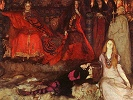

  
[Intangible Textual Heritage](../../index)  [Shakespeare](../index.md) 
[Index](index)  [Previous](flos04)  [Next](flos06.md) 

------------------------------------------------------------------------

[Buy this Book at
Amazon.com](https://www.amazon.com/exec/obidos/ASIN/B0029F209I/internetsacredte.md)

------------------------------------------------------------------------

  
*Folk-lore of Shakespeare*, by T.F. Thiselton Dyer, \[1883\], at
Intangible Textual Heritage

------------------------------------------------------------------------

p. 41

### CHAPTER III.

#### GHOSTS.

Few subjects have, from time immemorial,
possessed a wider interest than ghosts, and the superstitions associated
with them in this and other countries, form an extensive collection in
folk-lore literature. In Shakespeare's day, it would seem that the
belief in ghosts was specially prevalent, and ghost tales were told by
the firelight in nearly every household. The young, as Mr Goadby in his
"England of Shakespeare" (1881, p. 196), "were thus touched by the
prevailing superstitions in their most impressionable years. They looked
for the incorporeal creatures of whom they had heard, and they were
quick to invest any trick of moonbeam shadow with the attributes of the
supernatural." A description of one of these tale-tellings is given in
the "Winter's Tale" (ii. 1):—

   *Her*. What wisdom stirs amongst you?  
Come, sir, now I am for you again: pray you, sit by us,  
And tell’s a tale.  
   *Mam*. Merry or sad shall ’t be?  
   *Her*. As merry as you will.  
   *Mam*. A sad tale's best for winter:  
I have one of sprites and goblins.  
   *Her*. Let's have that, good sir.  
Come on, sit down: Come on, and do your best  
To fright me with your sprites: you're powerful at it.  
   *Mam*. There was a man.  
   *Her*. Nay, come, sit down; then on.  
   *Mam*. Dwelt by a churchyard: I will tell it softly; Yond crickets
shall not hear it.  
   *Her*. Come on, then,  
And give’t me in mine ear.

   The important part which Shakespeare has assigned to the ghost in
"Hamlet," has a special value, inasmuch as it

p. 42

illustrates many of the old beliefs current in his day respecting their
history and habits. Thus, according to a popular notion, ghosts are
generally supposed to assume the exact appearance by which they were
usually known when in the material state; even to the smallest detail of
their dress—so Horatio tells Hamlet, how when Marcellus and Bernado were
on their watch (i. 2):—

               "A figure like your father,  
 Armed at point exactly, cap-a-pe,  
 Appears before them, and with solemn march  
 Goes slowly and stately by them."

Further on, when the ghost appears again, Hamlet addresses it thus

"What may this mean,  
 That thou, dead corse, again, in complete steel  
 Revisit’st thus the glimpses of the moon,  
 Making night hideous."

   In the graphic description of Banquo's ghost in "Macbeth" (iii. 4).
we have a further allusion to the same belief; one, indeed, which is
retained at the present day with as much faith as in days of old.

   Shakespeare has several allusions to the notion which prevailed in
days gone by, of certain persons being able to exorcise or raise
spirits. Thus, in "Cymbeline" (iv. 2), Guiderius says over Fidele's
grave .—

"No exorciser harm thee."

   In "Julius Cæsar" (ii. 1) Ligarius says:—

"Soul of Rome!  
 "Brave son, derived from honourable loins!  
 Thou, like an exorcist, hast conjured up  
 My mortified spirit. Now bid me run,  
 And I will strive with things impossible;  
 Yea, get the better of them."

   In "All's Well that Ends Well" (v. 3) the king says:—

"Is there no exorcist  
 Beguiles the truer office of mine eyes?  
 Is’t real that I see?"

   This superstition, it may be added, has of late years gained
additional notoriety since the so-called spiritualism

p. 43

has attracted the attention and support of the credulous. As learning
was considered necessary for an exorcist, the schoolmaster was often
employed. Thus in the "Comedy of Errors" (iv. 4) the schoolmaster Pinch
is introduced in this capacity.

   Within, indeed, the last fifty years the pedagogue was still a
reputed conjuror. In "Hamlet" (i. 1), Marcellus, alluding to the ghost,
says:—

"Thou art a scholar; speak to it, Horatio."

   And in "Much Ado about Nothing" (ii. 1) Benedick says:—

"I would to God some scholar would conjure
her."

   For the same reason exorcisms were usually practised by the clergy in
Latin; and so Toby, in the "Night Walker" of Beaumont and Fletcher (ii.
1), says:—

"Let's call the butler up, for he speaks Latin,  
 And that will daunt the devil."

   It was also necessary that spirits, when evoked, should be questioned
quickly, as they were supposed to be impatient of being interrogated.
Hence in "Macbeth" (iv. 1) the apparition says

"Dismiss me. Enough."

   The spirit, likewise, in 2 Henry VI. (i. 4) utters these words:—

"Ask what thou wilt. That I had said and
done!"

   Spirits were supposed to maintain an obdurate silence till
interrogated by the persons to whom they made their special
appearance. [1](#fn_74.md) Thus Hamlet, alluding to
the appearance of the ghost, asks Horatio (i. 2)—

"Did you not speak to it?"

Whereupon he replies—

                      "My lord, I did;  
 But answer made it none: yet once, methought  
 It lifted up its head and did address  
 Itself to motion, like as it would speak."

p. 44

   The walking of spirits seems also to have been enjoined by way of
penance. The ghost of Hamlet's father (i. 5) says:—

"I am thy father's spirit,  
 Doom’d for a certain term to walk the night,  
 And for the day confined to fast in fires,  
 Till the foul crimes done in my days of nature  
 Are burnt and purged away."

And further on (iii. 2) Hamlet exclaims—

"It is a damned ghost that we have seen."

   This superstition is referred to by Spenser in his "Faerie Queen"
(Book i., canto ii.):—

"What voice of damned ghost from Limbo lake  
 Or guileful spright wand’ring in empty ayre,  
 Sends to my doubtful eares these speeches rare?"

   According to a universal belief prevalent from the earliest times, it
was supposed that ghosts had some particular reason for quitting the
mansions of the dead, "such as a desire that their bodies, if unburied,
should receive Christian rites of sepulture, that a murderer might be
brought to due punishment," &c. [1](#fn_75.md) On
this account Horatio ("Hamlet" i. 1) invokes the ghost:—

"If there be any good thing to be done,  
 That may to thee do ease and grace to me,  
 Speak to me."

   And in a later scene (i. 4) Hamlet says:—

"Say, why is this? Wherefore? What should we
do?"

   The Greeks believed that such as had not received funeral rites would
be excluded from Elysium; and thus the wandering shade of Patroclus
appears to Achilles in his sleep, and demands the performance of his
funeral. The younger Pliny tells a story of a haunted house at Athens,
in which a ghost played all kinds of pranks owing to his funeral rites
having been neglected. A further reference to the superstition occurs

p. 45

in "Titus Andronicus" (i. 1), where Lucius, speaking of the unburied
sons of Titus, says:—

"Give us the proudest prisoner of the Goths,  
 That we may hew his limbs, and, on a pile  
 Ad manes fratrum sacrifice his flesh,  
 Before this earthy prison of their bones;  
 That so the shadows be not unappeased,  
 Nor we disturb’d with prodigies on earth."

In olden times, spirits were said to have different allotments of time
suitable to the variety and nature of their agency. Prospero in the
"Tempest" (i. 2), says to Caliban:—

"Be sure, to-night, thou shalt have cramps,  
 Side-stitches that shall pen thy breath up; urchins  
 Shall, for that vast [1](#fn_76.md) of night that
they may work,  
 All exercise on thee."

According to a popular notion, the presence of unearthly beings was
announced by an alteration in the tint of the lights which happened to
be burning—a superstition alluded to in "Richard III." (v. 3), where the
tyrant exclaims, as he awakens:—

"The lights burn blue—It is now dead midnight,  
 Cold fearful drops stand on my trembling flesh—  
     \*       \*       \*       \*       \*       \*  
 Methought the souls of all that I had murder’d,  
 Came to my tent."

   So in "Julius Cæsar" (iv. 3), Brutus on seeing the ghost of Cæsar,
exclaims!—

"How ill this taper burns! Ha! who comes
here?

   It has been a widespread belief from the most remote period that
ghosts cannot bear the light and so disappear at the dawn of day; their
signal being the cock-crow. [2](#fn_77.md) The
ghost of Hamlet's father says (i. 5):—

"But, soft! methinks I scent the morning air;  
 Brief let me be"—

p. 46

and—

                    "Fare thee well at once!  
 The glow-worm shows the matin to be near,  
 And ’gins to pale his uneffectual fire:  
 Adieu, adieu! Hamlet, remember me."

   Again, in "King Lear" (iii. 4), Edgar says:—"This is the foul fiend
Flibbertigibbet: he begins at curfew, and walks till the first cock."

   The time of night as the season wherein spirits wander abroad, is
further noticed by Gardiner in Henry VIII. (v. 1):—

                     "Affairs, that walk,  
As they say spirits do, at midnight"—

   It was a prevalent notion that a person who crossed the spot on which
a spectre was seen became subject to its malignant influence. In Hamlet
(i. 1), Horatio says in reference to the ghost:—

"But soft, behold! lo, where it comes again!  
 I'll cross it, though it blast me."

   Lodge, in his "Illustrations of British History" (iii. 48), tells us
that among the reasons for supposing the death of Ferdinand, Earl of
Derby (who died young, in 1594), to have been occasioned by witchcraft,
was the following:—"On Friday there appeared a tall man, who twice
crossed him swiftly; and when the Earl came to the place where he saw
this man, he fell sick."

   Reginald Scot in his "Discovery of Witchcraft" (1584), enumerates the
different kinds of spirits, and particularly notices white, black, grey,
and red spirits. So in "Macbeth" (iv. 1), "black spirits" are
mentioned:—the charm song referred to (like the one in Act iv.), being
found in Middleton's "Witch" (v. 2):—

"Black spirits and white,  
 Red spirits and grey;  
 Mingle, mingle, mingle,  
 You that mingle many"—

   A well-known superstition which still prevails in this and foreign
countries, is that of the "spectre huntsman and his furious host." As
night time approaches, it is supposed that this invisible personage
rides through the air with his yelping

p. 47

hounds; their weird sound being thought to forebode misfortune of some
kind. This popular piece of folk-lore exists in the north of England
under a variety of forms amongst our peasantry, who tenaciously cling to
the traditions which have been handed down to them. [1](#fn_78.md)\* It has been suggested that Shakespeare
had some of these superstitions in view when he placed in the mouth of
Macbeth (i. 7), while contemplating the murder of Duncan, the following
metaphors

"And pity, like a naked new-born babe,  
 Striding the blast, or heaven's cherubim, horsed  
 Upon the sightless couriers of the air,  
 Shall blow the horrid deed in every eye,  
 That tears shall drown the wind!"

   Again, in the "Tempest" (iv. 1), Prospero and Ariel are represented
as setting on spirits, in the shape of hounds, to hunt Stephano and
Trinculo. This species of diabolical or spectral chase, was formerly a
popular article of belief. As Drake aptly remarks, [2](#fn_79.md) "the hell-hounds of Shakespeare appear to
be sufficiently formidable, for, not merely commissioned to hunt their
victims, they are ordered, likewise as goblins," to—

                      "Grind their joints  
With dry convulsions, shorten up their sinews  
With aged cramps; and more pinch-spotted make them  
Than pard or cat o’ mountain.  
                       Hark (exclaims *Ariel*), they roar!  
*Prospero*. Let them be hunted soundly."

#### TRANSMIGRATION OF SOULS.

   Shakespeare has several references to the old superstitious belief in
the transmigration of souls; traces of which may still be found in the
reverence paid to the robin, the wren, and other birds. Thus, in the
"Merchant of Venice" (iv. 1), Gratiano says to Shylock:—

"Thou almost makest me waver in my faith  
 To hold opinion with Pythagoras

p. 48

\[paragraph
continues\]  That souls of animals infuse themselves  
 Into the trunks of men: thy currish spirit  
 Govern’d a wolf, who, hang’d for human slaughter,  
 Even from the gallows did his fell soul fleet,  
 And, whilst thou lay’st in thy unhallow’d dam,  
 Infused itself in thee; for thy desires  
 Are wolvish, bloody, starved, and ravenous."

Caliban, when remonstrating with the drunken Stephano and Trinculo, for
delaying at the mouth of the cave of Prospero, instead of taking the
magician's life ("Tempest," iv. 1), says:—

"I will have none on’t: we shall lose our time,  
 And all be turn’d to barnacles, or to apes."

   In "Hamlet" (iv. 5), in the scene where Ophelia, in her mental
aberration, quotes snatches of old ballads, she says:—"They say the owl
was a baker's daughter! Lord, we know what we are, but know not what we
may be." [1](#fn_80.md)

   Again, in "Twelfth Night" (iv. 2), there is another reference in the
amusing passage where the clown, under the pretence of his being Sir
Topas, the curate," questions Malvolio, when confined in a dark room, as
a presumed lunatic:—

"*Mal*. I am no more mad than you are: make the
trial of it in any constant question.  
 *Clo*. What is the opinion of Pythagoras concerning wild fowl?  
 *Mal*. That the soul of our grandam might haply inhabit a bird.  
 *Clo*. What thinkest thou of his opinion?  
 *Mal*. I think nobly of the soul, and no way approve his opinion.  
 *Clo*. Fare thee well. Remain thou still in darkness: thou shalt hold
the opinion of Pythagoras ere I will allow of thy wits, and fear to kill
a woodcock lest thou dispossess the soul of thy grandam."

   Although this primitive superstition is almost effete amongst
civilized nations, yet it still retains an important place in the
religious beliefs of savage and uncivilized communities.

------------------------------------------------------------------------

### Footnotes

[43:1](flos05.htm#fr_74.md) We may compare the
words "unquestionable spirit" in "As You Like It" (iii. 2), which means
"a spirit averse to conversation."

[44:1](flos05.htm#fr_75.md) Douce's "Illustrations
of Shakespeare," pp. 450, 451.

[45:1](flos05.htm#fr_76.md) Vast, *i.e.*, Space of
Night. So in "Hamlet," (i. 2.)

"In the dead waist and middle of the night."

[45:2](flos05.htm#fr_77.md) See page
[98](flos08.htm#page_98.md).

[47:1](flos05.htm#fr_78.md) See Hardwick's
"Traditions, Superstitions, and Folk-lore," 1872, pp. 153–176.

[47:2](flos05.htm#fr_79.md) "Shakespeare and his
Times," i. p. 378.

[48:1](flos05.htm#fr_80.md) See Owl, chap. vi.

------------------------------------------------------------------------

[Next: Chapter IV. Demonology and Devil Lore](flos06.md)
