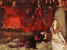

  
[Intangible Textual Heritage](../../index)  [Shakespeare](../index) 
[Index](index)  [Previous](flos14)  [Next](flos16) 

------------------------------------------------------------------------

[Buy this Book at
Amazon.com](https://www.amazon.com/exec/obidos/ASIN/B0029F209I/internetsacredte)

------------------------------------------------------------------------

  
*Folk-lore of Shakespeare*, by T.F. Thiselton Dyer, \[1883\], at
Intangible Textual Heritage

------------------------------------------------------------------------

p. 321

### CHAPTER XIII.

#### MARRIAGE.

The style of courtship which prevailed in
Shakespeare's time, and the numerous customs associated with the
marriage ceremony, may be accurately drawn from the many allusions
interspersed through his plays. From these, it would seem that the mode
of love-making was much the same amongst all classes, often lacking that
polish and refined expression which are distinguishing characteristics
now-a-days. As Mr Drake remarks, [1](#fn_710)
the amatory dialogues of Hamlet, Hotspur, and Henry the Fifth, are not
more refined than those which occur between Master Fenton and Anne Page
in the "Merry Wives of Windsor," between Lorenzo and Jessica in the
"Merchant of Venice," and between Orlando and Rosalind in "As You Like
It." These last, which may be considered as instances taken from the
middle class of life, together with a few drawn from the lower rank of
rural manners, such as the courtship of Touchstone and Audrey, and of
Silvius and Phoebe, in "As You Like It," are good illustrations of this
subject, although it must be added, that in point of fancy, sentiment,
and simplicity, the most pleasing love scenes in Shakespeare are those
of Romeo and Juliet, and of Florizel and Perdita.

The ancient ceremony of betrothing seems still to have been in full use
in Shakespeare's day. Indeed, he gives us several interesting passages
upon the subject of troth-plight. Thus, in "Measure for Measure," (iii.
1), we learn that the unhappiness of the poor, dejected Mariana was
caused by a violation of the troth-plight:—

"*Duke*. She should this Angelo have married; was
affianced to her by oath, and the nuptial appointed: between which time
of the contract and

p. 322

limit of the solemnity, her brother Frederick was wrecked at sea, having
in that perished vessel the dowry of his sister. But mark how heavily
this befell to the poor gentlewoman: there she lost a noble and renowned
brother, in his love toward her ever most kind and natural; with him,
the portion and sinew of her fortune, her marriage-dowry; with both, her
combinate husband, this well-seeming Angelo.

   *Isab*. Can this be so? did Angelo so leave her?

   *Duke*. Left her in her tears, and dried not one of them with his
comfort; swallowed his vows whole, pretending in her discoveries of
dishonour: in few, bestowed her on her own lamentation, which she yet
wears for his sake; and he, a marble to her tears, is washed with them,
but relents not."

   It is evident that Angelo and Mariana were bound by oath, the nuptial
was appointed; there was a prescribed time between the contract and the
performance of the solemnity of the Church. The lady, however, having
lost her dowry, the contract was violated by her "combinate" or
affianced husband—the oath, no doubt, having been tendered by a minister
of the Church in the presence of witnesses. In "Twelfth Night" (iv. 3),
we have a minute description of such a ceremonial; for when Olivia is
hastily espoused to Sebastian, she says—

"Now go with me and with this holy man  
 Into the chauntry by: there, before him,  
 And underneath that consecrated roof,  
 Plight me the full assurance of your faith;  
 That my most jealous and too doubtful soul  
 May live at peace. He shall conceal it,  
 Whiles you are willing it shall come to note;  
 What time we will our celebration keep  
 According to my birth."

This, then, was a private ceremony before a single witness, who would
conceal it till the proper period of the public ceremonial. Olivia,
fancying that she has thus espoused the page, repeatedly calls him
"husband;" and, being rejected, she summons the priest to declare (v.
1)—

                        "What thou dost know  
Hath newly pass’d between this youth and me."

   The priest answers—

"A contract of eternal bond of love,  
 Confirm’d by mutual joinder of your hands,

p. 323

\[paragraph
continues\]  Attested by the holy close of lips,  
 Strengthen’d by interchangement of your rings:  
 And all the ceremony of this compact  
 Seal’d in my function, by my testimony:  
 Since when, my watch hath told me, toward my grave  
 I have travell’d but two hours."

   Again, in the "Winter's Tale" (iv. 4), which contains many a perfect
picture of real rustic life, it appears that occasionally the
troth-plight was exchanged without the presence of a priest; but that
witnesses were essential to the ceremony

"*Florizel*.              O, hear me breathe my
life  
 Before this ancient sir, who, it should seem,  
 Hath sometime loved. I take thy hand, this hand,  
 As soft as dove's down and as white as it,  
 Or Ethiopian's tooth, or the fann’d snow that's bolted  
 By the northern blasts twice o’er.  
    *Polixenes*. What follows this?—  
 How prettily the young swain seems to wash  
 The hand was fair before! I have put you out:  
 But to your protestation; let me hear  
 What you profess.  
    *Flor*. Do, and be witness to ’t.  
    *Pol*. And this my neighbour too?  
    *Flor*.                        And he, and more  
 Than he, and men, the earth, the heavens, and all;  
 That, were I crown’d the most imperial monarch,  
 Thereof most worthy, were I the fairest youth  
 That ever made eye swerve, had force and knowledge  
 More than was ever man's, I would not prize them  
 Without her love; for her employ them all;  
 Commend them and condemn them to her service,  
 Or to their own perdition.  
    *Pol*.                        Fairly offer'd.  
    *Cam*. This shows a sound affection.  
    *Shep*.                       But, my daughter,  
 Say you the like to him?  
    *Per*.                        I cannot speak  
 So well, nothing so well; no, nor mean better:  
 By the pattern of mine own thoughts I cut out  
 The purity of his.  
    *Shep*.                        Take hands, a bargain!  
 And, friends unknown, you shall bear witness to ’t:

p. 324

\[paragraph
continues\]  I give my daughter to him, and will make  
 Her portion equal his. [1](#fn_711)  
 *Flor*.                        O, that must be  
 I’ the virtue of your daughter: one being dead,  
 I shall have more than you can dream of yet;  
 Enough then for your wonder. But, come on,  
 Contract us ’fore these witnesses.  
 *Shep*.                       Come, your hand;  
And, daughter, yours."

To the argument of Polixenes, that the father of Florizel ought to know
of his proceeding, the young man answers—

     "*Flor*.              Come, come, he must
not:  
Mark our contract."

And then the father, discovering himself, exclaims—

"Mark your divorce, young sir."

   Here, then, as Mr Knight remarks, [2](#fn_712) in the publicity of a village festival,
the hand of the loved one is solemnly taken by her lover, who breathes
his life before the ancient stranger who is accidentally present. The
stranger is called to be a witness to the protestation, and so is the
neighbour who has come with him. The maiden is called upon by her father
to speak, and then the old man adds—

"Take hands, a bargain!"

The friends are to bear witness to it—

"I give my daughter to him, and will make  
 Her portion equal his."

p. 325

\[paragraph continues\] The impatient
lover then again exclaims—

"Contract us ’fore these witnesses."

The shepherd takes the hand of the youth and the maiden. Again the lover
exclaims—

"Mark our contract."

The ceremony is left incomplete, for the princely father discovers
himself with—

"Mark your divorce, young sir."

   It appears, therefore, that espousals before witnesses were
considered as constituting a valid marriage, if followed up within a
limited time by the marriage of the Church. However much the Reformed
Church might have endeavoured to abrogate this practice, it was
unquestionably the ancient habit of the people. [1](#fn_713) It was derived from the Roman law, and
still prevails in the Lutheran Church.

Besides exchanging kisses, [2](#fn_714)
accompanied with vows of everlasting affection and whispering lovers’
reassurances of fidelity, it was customary to interchange rings. In
Shakespeare's plays, however, espousals are made with and without the
use of the ring. Thus, in the case of Ferdinand and Miranda, we read of
their joining hands only ("Tempest," iii. 1)—

   "*Ferd*. Ay, with a heart as willing  
 As bondage e’er of freedom; here's my hand.  
    *Mir*. And mine, with my heart in’t; and now farewell  
 Till half an hour hence."

In the passage already quoted from "Twelfth Night" (v. 1) there seems to
have been a mutual interchange of rings.

   Some, indeed, considered that a betrothal was not complete unless
each spouse gave the other a circlet. Lady Anne, in "Richard III." (i.
2), is made to share in this misconception:—

"*Gloster*. Vouchsafe to wear this ring.  
 *Anne*. To take is not to give.

p. 326

   *Gloster*. Look, how this ring encompasseth thy
finger,  
 Even so thy breast encloseth my poor heart:  
 Wear both of them, for both of them are thine."

In "Two Gentlemen of Verona" (ii. 2), we read:—

"*Julia*. Keep this remembrance for thy Julia's
sake, (*giving a ring*).  
 *Proteus*. Why, then, we'll make exchange; here, take you this.  
 *Julia*. And seal the bargain with a holy kiss."

   A joint,or gimmal ring, was anciently a common token among lovers; an
allusion to which is made by Emilia in "Othello" (iv. 3): "I would not
do such a thing for a joint-ring." Their nature will be best understood
by a passage in Dryden's "Don Sebastian," 1690 (act v.):—

               "A curious artist wrought them,  
With joints so close, as not to be perceiv’d;  
Yet are they both each other's counterpart,  
 \*              \*        and in the midst,  
A heart divided in two halves was plac’d."

   They were generally made of two or three hoops, so chased and
engraved that when fastened together by a single rivet, the whole three
formed one design—the usual device being a hand. When an engagement was
contracted the ring was taken apart, each spouse taking a division, and
the third one being presented to the principal witness of the
contract. [1](#fn_715) Hence such a ring was
known as a "Sponsalium Annulis," to which Herrick thus refers:—

"Thou sent’st me a true-love knot, but I  
 Returned a ring of jimmals, to imply  
 Thy love hath one knot, mine a triple tye."

The term is used by the Duke of Anjou, in "1 Henry VI." (i. 2):—

"I think, by some old gimmors or device  
 Their arms are set like clocks, still to strike on;  
 Else ne’er could they hold out so as they do."

Again in "Henry V." (iv. 2), Grandpré tells how:—

"In their pale dull mouths the gimmal bit  
 Lies foul with chew’d grass, still and motionless."

p. 327

   Most readers of the "Merchant of Venice," remember the mirthful use
which Shakespeare makes of lover's rings. Portia says (iii. 2), when
giving her wealth and self to Bassanio.

                "I give them with this ring;  
Which when you part from, lose, or give away,  
Let it presage the ruin of your love."

The last act, too, gives several particulars about lovers’ rings, which
in Elizabethan England, [1](#fn_716) often had
posies engraved on them, and were worn by men on the left hand.
Gratiano, for example, says:—

"About a hoop of gold, a paltry ring  
 That she did give me, whose posy was  
 For all the world's like cutler's poetry  
 Upon a knife, 'Love me and leave me not."

Again Bassiano exclaims:—

"Why, I were best to cut my left hand off,  
 And swear I lost the ring defending it."

In "Taming of the Shrew," Shakespeare gives numerous allusions to the
customs of his day connected with courtship and marriage. Indeed, in the
Second Act (2), we have a perfect betrothal scene:—

"*Petruchio*. Give me thy hand, Kate: I will unto
Venice,  
 To buy apparel ’gainst the wedding day.  
 Provide the feast, father, and bid the guests:  
 I will be sure my Katharine shall be fine.  
    *Baptista*. I know not what to say; but give me your hands;  
 God send you joy, Petruchio, ’tis a match.  
    *Gremio and Tranio*. Amen, say we; we will be witnesses.  
    *Petruchio*. Father, and wife, and gentlemen, adieu;  
 I will to Venice, Sunday comes apace;  
 We will have rings and things and fine array;  
 And kiss me, Kate, we will be married o’ Sunday."

   Although Katharina is only his spouse, and Baptista not yet his
father-in-law, Petruchio in accordance with fashion calls her "wife" and
him "father." The spouses of old times used to term one another
"husband" and "wife," for, as they argued, they were as good as husband
and wife.

p. 328

   Formerly there was a kind of betrothal or marriage contract prevalent
among the lower orders, called "hand-fasting," or "hand-festing," said
to have been much in use among the Danes, and which is mentioned by Ray
in his "Glossary of Northumbrian Words." It simply means hand-fastening
or binding. In "Cymbeline" (i. 5), the phrase is used in its secondary
sense by the Queen, who, speaking of Pisanio, declares that he is—

              "A sly and constant knave,  
Not to be shaked; the agent for his master,  
And the remembrancer of her to hold  
The hand-fast to her lord."

   In the "Christian State of Matrimony," 1543, we find the following
illustration of this custom: "Yet in this thing almost must I warn every
reasonable and honest person to beware that in the contracting of
marriage they dissemble not, nor set forth any lie. Every man, likewise,
must esteem the person to whom he is 'handfasted' none otherwise than
for his own spouse; though as yet it be not done in the church, nor in
the street. After the handfasting and making of the contract, the
church-going and wedding should not be deferred too long." The author
then goes on to rebuke a custom, "that at the handfasting there is made
a great feast and superfluous banquet." Sir John Sinclair, in the
"Statistical Account of Scotland," (1794, xii. 615), tells us that at a
fair annually held at Eskdalemuir, Co. Dumfries, "it was the custom for
the unmarried persons of both sexes to choose a companion according to
their liking, with whom they were to live till that time next year. This
was called 'handfasting,' or hand-in-fist. If they were pleased with
each other at that time then they continued together for life; if not,
they separated, and were free to make another choice as at the first."

   Shakespeare has given us numerous illustrations of the marriage
customs of our forefathers, many of which are interesting as relics of
the past, owing to their having long ago fallen into disuse. The fashion
of introducing a bowl of wine into the church at a wedding, which is
alluded to in the "Taming of the Shrew," (iii. 2), to be drunk by the
bride

p. 329

and bridegroom and persons present immediately after the marriage
ceremony, is very ancient. Gremio relates how Petruchio,—

                        "Stamp’d and swore,  
As if the vicar meant to cozen him.  
But after many ceremonies done,  
He calls for wine:—"A health," quoth he, as if  
He had been aboard, carousing to his mates  
After a storm,—quaff’d off the muscadel,  
And threw the sops all in the sexton's face;  
Having no other reason  
But that his beard grew thin and hungerly,  
And seem’d to ask him sops as he was drinking."

It existed even among our Gothic ancestors, and is mentioned in the
ordinances of the household of Henry VII., "For the Marriage of a
Princess:—'Then pottes of ipocrice to be ready, and to be put into cupps
with soppe, and to be borne to the estates, and to take a soppe and
drinke." [1](#fn_717)\* It was also practised
at the magnificent marriage of Queen Mary and Philip, in Winchester
Cathedral, and at the marriage of the Elector Palatine to the daughter
of James I., in 1612–13. Indeed, it appears to have been the practice at
most marriages. In Jonson's "Magnetic Lady" it is called a "knitting
cup"; in Middleton's "No Wit like a Woman's" the "contracting cup." In
Robert Armin's comedy of "The History of the Two Maids of More Clacke,"
1609, the play begins with,

"*Enter a maid strewing flowers, and a serving-man perfuming the door*.

*Maid*. Strew, strew.  
*Man*. The muscadine stays for the bride at church:  
The priest and Hymen's ceremonies tend  
To make them man and wife."

   Again, in Beaumont and Fletcher's "Scornful Lady," (i. 1), the custom
is referred to [2](#fn_718):—

           "If my wedding smock were on,  
Were the gloves bought and given, the licence come,  
Were the rosemary branches dipp’d, and all  
The hippocras and cakes eat and drunk off."

p. 330

   We find it enjoined in the Hereford Missal. By the Sarum missal it is
directed that the sops immersed in this wine, as well as the liquor
itself, and the cup that contained it, should be blessed by the priest.
The beverage used on this occasion was to be drunk by the bride and
bridegroom and the rest of the company.

   The nuptial kiss in the church was anciently part of the marriage
ceremony, as appears from a rubric in one of the Salisbury missals. In
the "Taming of the Shrew," Shakespeare has made an excellent use of this
custom, where he relates how Petruchio (iii. 2)

                "Took the bride about the neck  
And kiss’d her lips with such a clamorous smack  
That at the parting all the church did echo."

   Again, in "King Richard II." (v. r), where the Duke of Northumberland
announces to the king that he is to be sent to Pomfret, and his wife to
be banished to France, the king exclaims—

"Doubly divorced!—Bad men, you violate  
 A twofold marriage,—’twixt my crown and me,  
 And then betwixt me and my married wife.  
 Let me unkiss the oath ’twixt thee and me;  
 And yet not so, for with a kiss ’twas made."

   Marston, too, in his "Insatiate Countess," mentions it—

"The kisse thou gav’st me in the church, here
take."

   The practice is still kept up among the poor; and Brand [1](#fn_719) says it is "still customary among
persons of middling rank as well as the vulgar, in most parts of
England, for the young men present at the marriage ceremony to salute
the bride, one by one, the moment it is concluded."

   Music was the universal accompaniment of weddings in olden
times. [2](#fn_720) The allusions to wedding
music that may be found in the works of Shakespeare, Ben Jonson, and
other Elizabethan dramatists, testify, as Mr Jeaffreson points out,
that, in the opinion of their contemporaries, a wedding without the
braying of trumpets, and beating of drums, and

p. 331

clashing of cymbals, was a poor affair. In "As You Like It" (v. 4),
Hymen says—

"Whiles a wedlock hymn we sing."

   And in "Romeo and Juliet" (iv. 5) Capulet says—

"Our wedding cheer to a sad burial feast,  
 Our solemn hymns to sullen dirges change."

   It seems to have been customary for the bride at her wedding to wear
her hair unbraided and hanging loose over her shoulders. There may be an
allusion to this custom in "King John" (iii. 1) where Constance says—

"O Lewis, stand fast! the devil tempts thee here  
 In likeness of a new untrimmed bride."

At the celebration of her marriage with the Palatine, Elizabeth Stuart
wore "her hair dishevelled and hanging down her shoulders." Heywood
speaks of this practice in the following graphic words—

"At length the blushing bride comes, with her hair  
 Dishevelled ’bout her shoulders."

   It has been suggested that the bride's veil, which of late years has
become one of the most conspicuous features of her costume, may be
nothing more than a milliner's substitute, which in old time concealed
not a few of the bride's personal attractions, and covered her face when
she knelt at the altar. Mr Jeaffreson [1](#fn_721) thinks it may be ascribed to the Hebrew
ceremony; or has come from the East, where veils have been worn from
time immemorial. Some again connect it with the yellow veil which was
worn by the Roman brides. Strange, too, as it may appear, it is
nevertheless certain that knives and daggers were formerly part of the
customary accoutrements of brides. Thus, Shakespeare, in the old quarto,
1597, makes Juliet wear a knife at the friar's cell, and when she is
about to take the potion. This custom, however, is easily accounted for,
when we consider that women anciently wore a knife suspended from their
girdle. Many allusions to this practice occur in old writers. [2](#fn_722) In Dekker's

p. 332

\[paragraph continues\] "Match Me in
London," 1631, a bride says to her jealous husband—

"See at my girdle hang my wedding knives!  
 With those dispatch me."

   In the "Witch of Edmonton," 1658, Somerton says—

"But see, the bridegroom and bride come; the new  
 Pair of Sheffield knives fitted both to one sheath."

   Among other wedding customs alluded to by Shakespeare we may mention
one referred to in "Taming of the Shrew" (ii. 1), where Katharine,
speaking of Bianca, says to her father—

"She is your treasure, she must have a husband:  
 I must dance bare-foot on the wedding-day,  
 And, for your love to her, lead apes in hell,"

it being a popular notion that unless the elder sisters danced barefoot
at the marriage of a younger one, they would inevitably become old
maids, and be condemned "to lead apes in hell." The expression "to lead
apes in hell," applied above to old maids, has given rise to much
discussion, and the phrase has not yet been satisfactorily explained.
Steevens suggests that it might be considered an act of posthumous
retribution for women who refused to bear children, to be condemned to
the care of apes in leading strings after death. Malone says that "to
lead apes" was in Shakespeare's time one of the employments of a
bear-ward, who often carried about one of these animals with his bear."
Nares explains the expression by reference to the word ape as denoting a
fool, it probably meaning that those coquettes who made fools of men,
and led them about without real intention of marriage, would have them
still to lead against their will hereafter. In "Much Ado about Nothing"
(ii. 1), Beatrice says, "Therefore I will even take sixpence in earnest
of the bear-ward, and lead his apes into hell." Douce [1](#fn_723) tells us that homicides and adulterers
were in ancient times compelled, by way of punishment, to lead an ape by
the neck, with their mouths affixed in a very unseemly manner to the
animal's tail.

p. 333

   In accordance with an old custom, the bride on the wedding night had
to dance with every guest, and play the amiable, however much against
her own wishes. In "Henry VIII." (v. 2), there seems to be an allusion
to this practice, where the King says—

                            "I had thought  
They had parted so much honesty among ’em,  
At least, good manners, as not thus to suffer  
A man of his place, and so near our favour,  
To dance attendance on their lordships' pleasures," etc.

In the "Christian State of Matrimony" (1543), we read thus:—"Then must
the poor bryde kepe foote with a dauncers, and refuse none, how scabbed,
foule, droncken, rude, and shameless soever he be."

   As in our own time, so, too, formerly flowers entered largely into
the marriage festivities. Most readers will at once call to mind that
touching scene (iv. 5) in "Romeo and Juliet," where Capulet says,
referring to Juliet's supposed untimely death—

"Our bridal flowers serve for a buried
corse."

It seems, too, in days gone by to have been customary to deck the bridal
bed with flowers, various allusions to which are given by Shakespeare.
Thus, in "Hamlet" (v. 1), the Queen, speaking of poor Ophelia, says—

"I hoped thou shouldst have been my Hamlet's wife;  
 I thought thy bride-bed to have deck’d, sweet maid."

In the "Tempest" (iv. 1), we may compare the words of Prospero, who,
alluding to the marriage of his daughter Miranda with Ferdinand, by way
of warning, cautions them lest—

                     "Barren hate,  
Sour-eyed disdain and discord shall bestrew  
The union of your bed with weeds so loathly  
That you shall hate it both."

   In the Papal times no new married couple could go to bed together
till the bridal-bed had been blessed—this being considered one of the
most important of the marriage ceremonies. "On the evening of the
wedding day," says Mr

p. 334

\[paragraph continues\] Jeaffreson, [1](#fn_724) "when the married couple sat in state in
the bridal-bed, before the exclusion of the guests, who assembled to
commend them yet again to Heaven's keeping, one or more priests attended
by acolytes swinging to and fro lighted censors, appeared in the crowded
chamber to bless the couch, its occupants, and the truckle-bed, and
fumigate the room with hallowing incense." In "A Midsummer Night's
Dream" (v. 1), Oberon says:—

"Now, until the break of day,  
 Through the house each fairy stray.  
 To the best bride-bed will we,  
 Which by us shall blessed be  
 And the issue they create  
 Ever shall be fortunate."

Steevens in illustration of this custom quotes from Chaucer's "The
Merchant's Tale" (ed. Tyrrwhitt), line 9693:—

"And when the bed was with the preest
yblessed."

The formula for this curious ceremony is thus given in the Manual for
the use of Salisbury:—"Nocte vero sequente cum sponsus et sponsa ad
lectum pervenerint, accedat sacerdos et benedicat thalamum, dicens.
Benedic, Domine, thalamum istum et omnes habitantes in eo; ut in tua
pace consistant, et in tua voluntate pernaneant: et in tuo amore vivant
et senescant et multiplicentur in longitudine dierum. Per Dominum.—Item
benedictio super lectum. Benedic, Domine, hoc cubiculum, respice, quinon
dormis neque dormitas. Qui custodis Israel, custodi famulos tuos in hoc
lecto quiescentes ab omnibus fantasmaticis demonum illusionibus. Custodi
eos vigilantes ut in preceptis tuis meditentur dormientes, et te per
soporem sentiant; ut hic et ubique depensionis tuæ muniantur auxilio.
Per Dominum—Deinde fiat benedictio super eos in lecto tantum cum oremus.
Benedicat Deus corpora vestra et animas vestras; et det super eos
benedictionem sicut benedixit Abraham, Isaac, et Jacob, Amen.—His
peractis aspergat eos aqua benedicta, et sic discedat et dimittat eos in
pace." [2](#fn_725)

p. 335

   In the French romance of Melusine, the Bishop who marries her to
Raymondin blesses the nuptial bed. The ceremony is there presented in a
very ancient cut, of which Douce has given a copy. The good prelate is
sprinkling the parties with holy water. It appears that, occasionally
during the benediction, the married couple only sat on the bed; but they
generally received a portion of the consecrated bread and wine. It is
recorded in France, that, on frequent occasions, the priest was
improperly detained till midnight, while the wedding guests rioted in
the luxuries of the table, and made use of language that was extremely
offensive to the clergy. It was therefore ordained, in the year 1577,
that the ceremony of blessing the nuptial bed should for the future be
performed in the day-time, or at least before supper, and in the
presence of the bride and bridegroom, and of their nearest relations
only.

   On the morning after the celebration of the marriage, it was formerly
customary for friends to serenade a newly married couple, or to greet
them with a morning song to bid them good morrow. In "Othello" (iii. i),
this custom is referred to by Cassio, who speaking of Othello and
Desdemona, says to the musicians:—

"Masters, play here, I will content your pains;  
 Something that's brief; and bid—'Good morrow, general."

   According to Cotgrave, the morning-song to a newly married woman was
called the "hunt's up." It has been suggested that this may be alluded
to by Juliet (iii. 5) who, when urging Romeo to make his escape tells
him—

"Some say the lark and loathed toad change eyes;  
 O, now I would they had changed voices too!  
 Since arm from arm that voice doth us affray,  
 Hunting thee hence with hunt's-up to the day.  
 O, now be gone."

   In olden times torches were used at weddings—a practice, indeed,
dating as far back as the time of the Romans. From the following lines
in Herrick's "Hesperides," it has been suggested that the custom once
existed in this country

"Upon a maid that dyed the day she was marryed  
      That morne which saw me made a bride,

p. 336

\[paragraph
continues\]  The eve’ning witnest that I dy’d.  
 Those holy lights, wherewith they guide  
 Unto the bed the bashful bride,  
 Serv’d but as tapers for to burne  
 And light my reliques to their urne.  
 This epitaph which here you see,  
 Supply’d the Epithalamie." [1](#fn_726)

Shakespeare alludes to this custom in "1 Henry VI." (iii. 2), where Joan
of Arc, thrusting out a burning torch on the top of the tower at Rouen,
exclaims—

"Behold, this is the happy wedding torch  
 That joineth Rouen unto her countrymen."

In "Tempest," too, (iv. 1), Iris says—

                    "No bed-right shall be paid  
Till Hymen's torch be lighted."

   According to a Roman marriage custom, the bride on her entry into her
husband's house was prohibited from treading over his threshold, and
lest she should even so much as touch it, she was always lifted over it.
Shakespeare seems inadvertently to have overlooked this usage in
"Coriolanus" (iv. 5), where he represents Aufidius as saying to
Coriolanus:—

"I loved the maid I married; never man  
 Sigh’d truer breath; but that I see thee here,  
 Thou noble thing! more dances my rapt heart  
 Than when I first my wedded mistress saw  
 Bestride my threshold."

Lucan in his "Pharsalia" (lib. ii. 359), says:—

"Translata vetuit contingere limina planta."

   Once more, Sunday appears to have been a popular day for marriages;
the brides of the Elizabethan dramas being usually represented as
married on Sundays. In the "Taming of the Shrew" (ii. 1), Petruchio
after telling his future father-in-law "that upon Sunday is the
wedding-day," and laughing

p. 337

at Katharine's petulant exclamation, "I'll see thee hanged on Sunday
first," says:—

"Father, and wife, and gentlemen adieu;  
 I will to Venice, Sunday comes apace:  
 We will have rings and things and give array;  
 And, kiss me Kate, we will be married o’ Sunday."

   Thus, Mr Jeaffreson, speaking of this custom in his "Brides and
Bridals," rightly remarks,—"A fashionable wedding, celebrated on the
Lord's Day in London, or any part of England, would now-a-days be
denounced by religious people of all Christian parties. But in our
feudal times, and long after the Reformation, Sunday was of all days of
the week the favourite one for marriages. Long after the theatres had
been closed on Sundays, the day of rest was the chief day for weddings
with Londoners of every social class."

   Love charms have from the earliest times been much in request amongst
the credulous anxious to gain an insight into their matrimonial
prospects. [1](#fn_727) In the "Merchant of
Venice," (v. 1), we have an allusion to the practice of kneeling and
praying at wayside crosses for a happy marriage, in the passage where
Stephano tells how his mistress

                         "Doth stray about  
By holy crosses, where she kneels and prays  
For happy wedlock hours."

   The use of love potions by a despairing lover to secure the
affections of another was a superstitious practice much resorted to in
olden times. [2](#fn_728) This mode of
enchantment, too, was formerly often employed in our own country, and
Gay, in his "Shepherd's Week," relates how Hobnelia was guilty of this
questionable practice:—

"As I was wont, I trudged, last market-day,  
 To town with new-laid eggs, preserved in hay.  
 I made my market long before ’twas night;  
 My purse grew heavy, and my basket light.  
 Straight to the ’pothecary's shop I went,  
 And in love-powder all my money spent.

p. 338

 \[paragraph
continues\] Behap what will, next Sunday after prayers,  
 When to the ale-house Lubberkin repairs,  
 These golden flies into his mug I'll throw,  
 And soon the swain with fervent love shall glow."

   In the "Character of a Quack Astrologer," 1673, quoted by Brand, we
are told how "he trappans a young heiress to run away with a footman, by
persuading a young girl ’tis her destiny; and sells the old and ugly
philtres and love-powder to procure them sweet-hearts." Shakespeare has
represented Othello as accused of winning Desdemona "by conjuration and
mighty magic." Thus Brabantio (i. 2), says:—

"Thou hast practised on her with foul charms,  
 Abused her delicate youth with drugs or minerals  
 That waken motion."

   And in the following scene he further repeats the same charge against
Othello:—

"She is abused, stol’n from me, and corrupted  
 By spells and medicines bought of mountebanks;  
 For nature so preposterously to err,  
 Being not deficient, blind, or lame of sense,  
 Sans witchcraft could not."

   Othello, however, in proving that he had won Desdemona only by
honourable means, addressing the Duke, replies,—

                       "By your gracious patience,  
I will a round unvarnish’d tale deliver  
Of my whole course of love; what drugs, what charms,  
What conjurations and what mighty magic,  
For such proceeding I am charged withal,  
I won his daughter."

   It may have escaped the poet's notice that, by the Venetian law, the
giving love-potions was held highly criminal, as appears in the code
"Della Promission del Malefico," cap. xvii., "Dei Maleficii et
Herbarie."

   A further allusion to this practice occurs in "A Midsummer Night's
Dream" (ii. 1), where Puck and Oberon amuse themselves at Titania's
expense. [1](#fn_729)

   An expression common in Shakespeare's day for any one

p. 339

born out of wedlock is mentioned by the Bastard in "King John" (i. 1)—

"In at the window, or else o’er the hatch."

   The old saying also that "hanging and wives go by destiny," is quoted
by Nerissa in the "Merchant of Venice" (ii. 9). In "Much Ado about
Nothing" (ii. 1), Don Pedro makes use of an old popular phrase in asking
Claudio, "When mean you to go to church?" referring to his marriage.

   A solemn and even melancholy air was often affected by the beaux of
Queen Elizabeth's time, as a refined mark of gentility, a most sad and
pathetic allusion to which custom is made by Arthur in "King John" (iv.
1)—

"Methinks, nobody should be sad but I:  
 Yet, I remember, when I was in France,  
 Young gentlemen would be as sad as night,  
 Only for wantonness." [1](#fn_730)

   There are frequent references to this fashion in our old writers.
Thus, in Ben Jonson's "Every Man in His Humour" (i. 3), we read:—"Why, I
do think of it; and I will be more proud, and melancholy, and
gentlemanlike than I have been, I'll insure you."

------------------------------------------------------------------------

### Footnotes

[321:1](flos15.htm#fr_712) "Shakspeare and His
Times," 1817, i. p. 220.

[324:1](flos15.htm#fr_713) On entering into any
contract, or plighting of troth, the clapping of the hands together set
the seal, as in the "Winter's Tale" (i. 2), where Leontes says—

"Ere I could make thee open thy white hand,  
 And clap thyself my love; then thou didst utter  
 *I am yours for ever*."

   So, too, in the "Tempest" (iii. 1)—

*Mir*. "My husband then?  
 *Fer*. Ay, with a heart as willing  
      As bondage e’er of freedom: here's my hand.  
 *Mir*. And mine, with my heart in it."

And in the old play of "Ram Alley," by Barry (1611), we read, "Come,
clap hands, a match." The custom is not yet disused in common life.

[324:2](flos15.htm#fr_714) "The Stratford
Shakespeare," 1854, i. p. 70.

[325:1](flos15.htm#fr_715) Knight's "Stratford
Shakespeare," p. 73.

[325:2](flos15.htm#fr_716) Cf. "King John" (ii.
2)—

"*K. Phil.*       Young princes close your hands.  
*Aust.* And your lips too; for, I am well assured,  
That I did so, when I was first assured."

[326:1](flos15.htm#fr_717) See Nares’
"Glossary," ii. p. 363; "Archæologia," xiv. p. 7; Jones's "Finger Ring
Lore," 1877, pp. 313–318.

[327:1](flos15.htm#fr_718) See Jeaffreson's
"Brides and Bridals," 1873, i. pp. 77, 78.

[329:1](flos15.htm#fr_719) Sops in wine.

[329:2](flos15.htm#fr_720) See "Brand's Pop.
Antiq.," 1849, ii. pp. 136, 139.

[330:1](flos15.htm#fr_721) "Pop. Antiq.," ii.
p. 140.

[330:2](flos15.htm#fr_722) "Brides and
Bridals," 1873, i. p. 252.

[331:1](flos15.htm#fr_723) "Brides and
Bridals," i. p. 177.

[331:2](flos15.htm#fr_724) See Brand's "Pop.
Antiq.," 1849, ii. pp. 131–133.

[332:1](flos15.htm#fr_725) "Illustrations of
Shakspeare," p. 203.

[334:1](flos15.htm#fr_726) "Brides and
Bridals," i. p. 98; see Brand's "Pop. Antiq." ii. p. 175.

[334:2](flos15.htm#fr_727) See Douce's
"Illustrations of Shakspeare," pp. 123, 124.

[336:1](flos15.htm#fr_728) See Brand's "Pop.
Antiq." 1849, ii, p. 159.

[337:1](flos15.htm#fr_729) See "Merry Wives of
Windsor," iv. 2.

[337:2](flos15.htm#fr_730) See Potter's
"Antiquities of Greece"; Brand's "Popular Antiquities," iii, p. 306.

[338:1](flos15.htm#fr_731) See p. 215.

[339:1](flos15.htm#fr_732) See Nares’
"Glossary," ii. p. 563.

------------------------------------------------------------------------

[Next: Chapter XIV. Death and Burial](flos16)
