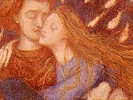

  
[Intangible Textual Heritage](../../index)  [Sub Rosa](../index.md) 
[Index](index)  [Previous](botd15)  [Next](botd17.md) 

------------------------------------------------------------------------

[Buy this Book at
Amazon.com](https://www.amazon.com/exec/obidos/ASIN/1434485382/internetsacredte.md)

------------------------------------------------------------------------

  
*Brother of the Third Degree*, by Will L. Garver, \[1894\], at
Intangible Textual Heritage

------------------------------------------------------------------------

p. 265

### CHAPTER XV.

#### A HONEYMOON?

When I returned to consciousness I was
lying in a dimly lighted-room; I felt a pair of warm lips press my
forehead and heard the loving voice of my beloved Iole say:

"My darling brother, how grand and noble! you did not fail this
time—spirit bless you—bless us both."

She had not discovered my return to consciousness; should I simulate and
enjoy her caress? No, now I could enjoy it when awake.

"Iole," I said, "I am better now. What is the matter? was it a weakness
for me thus to be overcome?"

"Far from it, brother," she replied; "the fact that you only fainted
proves that your organism is highly developed and perfected; had it not
been so, that key-note which unloosed the terrible powers of sound would
have been your death. The next time it will have even less effect, until
by and by your form will be pure sound substance.

p. 266

\[paragraph continues\] Do you know,
brother, that but for the wills which checked it, that note would have
shattered the walls of the room? To ordinary men it would have been
instant death, not unlike paralysis; it kills and not a drop of blood is
shed. When you made your choice you took your life in your hands, for no
one can enter on the path you chose unless he can pass this test, and he
who presumes must die. But you must now rest," she said, as I was about
to speak; "go to sleep, and in the morning I will tell you more."

Willing to be obedient to her orders I dropped back in my bed, and
turning off the light she left the room.

When I awoke in the morning the sun was streaming through a large window
across the room. Much refreshed I arose, and found myself in a
luxuriously furnished private apartment. On a chair at my bedside was a
suit of dark blue, broadcloth clothes, and lying upon them [a
note](errata.htm#5.md), which read as follows:

"When ready for breakfast push the button twice;
dress like a gentleman of the world.—Iole."

"Whoever furnished these clothes knows my tastes, and that I am a crank
on colors," I remarked, as I put on the elegant silk underwear, azure
blue in color, and the immaculate white shirt with black and white
interlaced triangles for studs and Chaldean swastica crosses for
cuff-buttons. "They

p. 267

have even furnished my little black tie," I exclaimed, as my favorite
bow came to view, "and this coat fits as though made to order." Not even
the shoes had been neglected, which, finely polished, were near the
chair. Having adjusted my toilet to my satisfaction before the glass, I
rang the bell. "Even a watch and chain," I remarked as I read the time
of day.

In a few moments a side-door opened and Iole appeared with a smile and
pleasant "Good-morning, brother." Stepping through the door with her I
found I was in her reception-room of the day before.

"Have they intruded me into your apartments?" I asked.

"Not without my solicitation," she answered. "Unless you object and
think it unbecoming of true modesty, we will, in a certain manner, live
together from now on."

"As brother and sister?" I asked.

"As brother and sister," she replied.

"And can I kiss you as a brother?" I ventured, as I viewed her
bewitching beauty in her morning wrapper.

"You can," she answered with an affectionate smile.

"How good and kind true brothers and sisters are, and how very, very
good are you, my loving sister," I said, as I kissed her.

p. 268

We now took seats at the table, and she removed the cover which had been
thrown over our repast.

"I will teach you some dietetic rules," she said smilingly, as she
poured out a glass of crystal water. "The first thing in the morning is
a deep inhalation of pure morning air and a drink of God's greatest
beverage—pure water."

"Blessed be the gods of crystal water," I answered, as we took our
drinks.

"Next is some genuine nutrition in the substance of a bowl of oatmeal or
cracked wheat."

"Why, even our dietetic tastes are the same," I exclaimed, as she poured
out the rich cream.

"Which may explain our other similarities," she replied; "the food we
eat determines to a wonderful extent the thoughts we think and our
habits in general; eat foods which stimulate passions and your life will
be one of passion; eat pure foods and you will think pure thoughts and
lead a pure life."

"But where is your strength-giving meat?" I asked, feigning surprise at
the absence of an article I never used.

"It is in the human slaughter-house called the world, in particular that
part called Christendom; it has no place here. Meat gives strength as
oil makes a fire—very hot, but of short duration. If you take enough of
it, and your digestive organs can stand the strain of almost constant
use, it will

p. 269

keep you going; but never expect to accomplish anything in the line of
thought so long as your stomach requires all your life energies. So long
as nature grows grains, vegetables, fruits and nuts, there is no need
for us to establish a red vibration in our bodies, or to kill a single
evolving creature."

"And do you believe, Iole, that animals are evolving men?" I asked,
seizing this opportunity to hear her ideas of evolution.

"No, it would be erroneous to so state it. There is an entity in the
animal which in time evolves into a human form; an intelligence which
has been deeply hidden within that entity then unfolds, and a human form
with a mind functioning therein is the result—in a word, man. But that
which in time evolves into man cannot be said to be man until it has so
evolved. There is that in man which has been through all the lower
kingdoms, even to the mineral; but man, as such, never was in any of
them. This is one of the great secrets of occult knowledge; through
that, in them, which has been through all kingdoms, men can know all
kingdoms; and not only know, but control great portions thereof, and
herein is the secret of magic."

"Well, do you believe that mind evolves from forms?" I asked.

"It seems to me," she answered, "that I have

p. 270

already expressed myself upon this subject, but to be clear I will
repeat: Mind in itself, as a universal, is altogether separate and
distinct from form; but it needs a form or instrument through which to
manifest itself to itself; that is, to become self-conscious it had to
become an individual, which required a form. Now mark, this does not
limit the existence of an individual to a physical body; there may be
other forms or bodies, as astral or akasic, even though their shape is
different and they are invisible to ordinary eyes. Bear in memory that
the brain and all forms and organisms are but instruments through which
mind more or less perfectly acts. Materialistic scientists, seeing the
manifestations of mind become more perfect as the instrument was
perfected, mistakenly concluded that the instrument caused the mind,
when it is really the reverse; mind, working from within, causing the
perfection of the instrument. If this were not so of what use would be
thought, study or meditation? Realizing this fact, the true student does
not study to accumulate a vast store of information, but because by so
doing he develops his brain organism and makes it a more perfect
instrument for his mind. The progress made by him who thinks exceeds
beyond all comparison that made by him who merely memorizes."

I was about to question again, when she checked me by saying: "Our
digestion will be bad if we

p. 271

put all our vital energies in our heads while eating, just as the
reverse is true. Everything at its proper time; let us now do our duty
to our bodies, we need them for the present in our labors."

The remainder of the meal was spent in more shallow water, and having
finished she insisted on a walk among the flowers in the court. I
readily consented, and for the next hour we enjoyed the beauties of
nature in the court and garden adjoining. Although the natural tendency
of our minds was to philosophy, for the time being she would talk only
upon less serious topic's; and as I wished some general information I
took advantage of this opportunity to ask her of my surroundings by
saying:

"Iole, may I ask you where I am?"

"Certainly," she answered, "you can ask any questions, and if they are
of such a nature that I cannot answer them, I will tell you so. You are
at the country chateau of Count Eugene Du Bois, about three hours’ rapid
drive from Paris."

"And do you know, Iole, that as well as I know you I do not even know
your name or nationality?"

"Oh, Iole is good enough," she answered with a smile. "I have had many
names in my time, but none suit me better than those of ancient Greece."

"But what is your nationality?" I persisted.

p. 272

\[paragraph continues\] "You speak about a
dozen languages with equal fluency and I cannot even detect any
peculiarity of accent."

"Well, I have tried as much as possible to get over this idea of
nationality, and probably I have to some extent succeeded. I believe in
but one nation, and that is the whole earth; I believe in but one race,
and that is all mankind. When I am in France, I am French; when in
England, English; and likewise wherever I am. If you desire something
more definite, consider me an Aryan from ancient Aryavarta. Now let that
suffice; it is time for us to go to the parlor and get better acquainted
with our brothers and sisters. At ten o'clock we must again appear
before the king."

As we proceeded along the hall toward the parlor, I asked:

"And who is she to whom you first took me, known as Mme. Petrovna?"

"None but the 'Third Degree' members know; she is a mysterious woman and
is here, there and everywhere. She left a few days ago for England, but
where she now is no one knows; she is always on hand when wanted."

"And whose place was that which I was ever after unable to locate
because of the glamour you threw around me?"

"It is the residence of Count Alexander Nicholsky

p. 273

to which you refer," she answered, with a smile.

"And do you stay there when in Paris?" I asked.

"No, not since Madame left," she answered.

We now entered the parlor where all were gathered together in social
converse. Esmeralda was there and greeted me in her old affectionate
way, and made me acquainted with her handsome partner, Henric Ulson from
Stockholm. Time passed and I was unconscious of its rapid flight, until
Iole came and told me it was ten o'clock and the hour for appearing
before the king. Two guards were passed before we reached the hall where
his room was located, and it was evident he received only those who had
reason for seeing him. At last we reached a door before which another
guard was sitting. Iole gave the password, but he answered that the
master was engaged at present. She then took out her watch, and I saw
that it was exactly ten o'clock. Stooping down she whispered something
in the guard's ear; he bowed and entered the room, leaving us without. I
was about to question, when she pressed her finger to her lips in token
of silence. The guard soon returned and we were both admitted to an
outer room, the guard telling us to wait until we were called. Taking
seats by the window we waited several minutes, when an

p. 274

inner door opened; and as the king appeared and invited us into an inner
room, Albarez, the mysterious adept, passed out. I could not be wrong;
it was the same tall, cloaked figure I had seen in Mexico, London and
the Grand Opera House; but without show of recognition I entered the
inner room with Iole. The brother and sister who had represented the sun
and moon were seated at the usual table in the center of the room; and,
as was the custom, we took seats opposite the king, thus all facing one
another.

"Brother and sister," said the king, "you are now both full members of
the seventh sub-degree of the fourth degree, and probationary candidates
for the exalted 'Third.' Our great degrees approach unity as they go up,
and you therefore pass through the Fourth before you enter the Third.'
Now for at least a year we have no special duty for you to perform, but
during that time you must prepare yourselves for the labors which will
then fall to your lot. This preparation requires a special course, and
must be as follows: You must live together, and attune your beings to
such a degree of responsiveness that you can communicate with one
another even though thousands of miles apart. With two natures already
as responsive as yours now are, this should not be difficult to
accomplish. The sole secret consists in throwing your minds into the
same state of

p. 275

vibration, or condition of æther, at the same time. You must, therefore,
be almost constantly together for this period; you must try to think the
same thoughts, eat the same kind of food, have the same hours for
rising, retiring and meditating; must have no secrets from one another,
must love and cherish and never allow a discordant note to come between
you—in a word, you must strive to live as one being. We will need your
services at the end of the year; we have looked into the future as so
far determined, and know what is coming. Now, to better accomplish the
desired end and prepare you for your labor, the council has voted that
you live together as man and wife. As such you are entitled to all the
privileges of true married life, subject only to the restrictions which
your souls impose. During this year of preparation you may also be doing
a certain labor. We desire that you form a personal and intimate
acquaintance with our most prominent and advanced members of the
different European capitals. To this end you are to commence a tour as
soon as possible. Call it a honeymoon tour if you so desire," he
interpolated with a smile. "When can you start?"

As he asked this question I looked at Iole, and she answered:
"To-morrow, Master."

"Very well; you must first proceed to Berlin, then to St. Petersburg,
Moscow, Vienna, Constantinople

p. 276

and Rome; and I will prepare you letters for these places. You will
communicate the secret password, Iole?"

"I will, Master," she replied.

"Then you may go and prepare for your departure; you are now man and
wife by the sacred ties of our Brotherhood."

"We witness," said the man and woman, who had heretofore been silent;
then at a motion of dismissal from the king, we left the room and
proceeded to our apartments.

"My darling wife," I said, as I caressed Iole after we had entered.

"I am your wife, and your slightest wish shall be granted," she answered
affectionately; "but do you know the rules of the Brotherhood upon this
relation?"

"Not all. What are they, dear?"

That I am your wife only as your equal, have equal rights with you in
every matter, and am sole owner and possessor of my body."

"I would have received you under no other considerations, and should
spurn to marry a woman who would not claim equal rights with me in
everything pertaining to that relation," I answered, with conviction of
the justness of my answer.

"I know that, my dear," she replied, "but shall we be husband and wife,
or ' virgin lovers?'"

"It shall be 'virgin lovers,'" I answered without

p. 277

hesitation, and she clasped her arms around my neck as I sealed the
compact with a kiss. The next morning we were ready for our wedding
tour.

"I never go encumbered by unnecessary baggage," said Iole, as she
pointed to her small leather trunk; "if necessary a grip will answer."

"Evidently no part of your education has been neglected," I answered in
admiration, recalling the luggage of the ordinary bride.

"The Master wishes to see you," said the Hindu waiter, after he had
served our breakfast.

"Then we will go immediately," answered Iole, leading the way to his
part of the building. This time the guard admitted us without question,
and we passed into the room of the king. He was alone, and as we entered
he drew forth from his robe a package of letters.

"These," he said, "will introduce you to the imperators of the different
capital groups; they are written in hieroglyphs which Iole will teach
you the meaning of, and which only the initiated can understand. But
even though this is the case, under no circumstances allow them to be
taken from you, as anything written in this manner now will excite
suspicion and lead to trouble. The first letter is to the imperial
physician at the court of Berlin, the second to the body surgeon of the
Czar, the third to Nicholas Penousky, Governor of Moscow; then there are
letters to the

p. 278

minister of war at Vienna, the physician of the king of Italy, and a
high official at the Vatican. You see that while we are comparatively
small with regard to numbers we make up in quality, and have powerful
members scattered far and wide throughout the world; but back of these,
unseen, there is a force against which no majority can prevail, and the
next cataclysm of Europe will not be a thing of chance."

As he spoke these deeply significant words he handed me a peculiarly
torn card covered with signatures, only about half of which remained,
saying:

"Should any one, at any time, present to you the missing portion of this
card, obey him as a member of the higher council and give him your full
confidence." Then handing me another paper he said:

"Here is a check on the Bank of France for frs. 500,000, signed by
Alphonso Colono. You can get him to endorse it and the full amount will
be at your disposal," he said, smiling. "We are much obliged for your
kind contribution to our cause, but we have no urgent need. Some even
say that, if we chose, we could pay the national debts of the world in a
fortnight. However true this may be, we have no need for your money at
present. The other paper we destroyed; you are now at liberty to depart.
Adhere strictly to the rules given, observe well all localities, and
learn all information

p. 279

and things which may be helpful in the future. There are certain rules
in regard to correspondence from time to time with me, but Iole will
inform you concerning them. You may now start on your journey—the
Protecting powers of the Brotherhood go with you." He bowed and we
departed.

A half hour later a carriage was announced, and with my satchel and
Iole's small trunk on top, we were soon rolling rapidly away toward
Paris. Thus commenced our peculiar wedding tour.

Nearly a year passed by, a year of happiness and study. Iole and I had
become as one being; our tastes were similar, our desires and
aspirations all alike, or tending to the same end, and a more harmonious
union could not be pictured.

We had visited nearly all the important capitals of Europe, and had
become acquainted with the members of the different lodges who, like
those of Paris, represented the most refined and intellectual people of
their respective countries. The political condition of the Continent was
anything but quiet; there was an almost universal uprising of a
revolutionary nature among the discontented masses, and governmental
circles were in a ferment. Upon all these subjects we had to keep
informed, but nothing interfered with our prescribed course of training.
All this time we lived as "virgin lovers"; and while married before the
law and so

p. 280

considered by society, were as brother and sister. The king and his
council had given full sanction to the sex relation, neither the laws of
nature nor man forbade, and I knew that my slightest wish would not be
refused by Iole; yet, notwithstanding all this, I refrained. This was
one of my most triumphant victories over the King of Evil; for, in the
words of Buddha, "Nothing is more difficult than to refrain when nothing
hinders." Temptation has no power upon the moral man when he knows that
by yielding to it he will violate a moral law. But here, without pride
or vanity, I say naught restrained except the ideal of and aspiration
for a purer love, higher life and knowledge; but these are powers the
potency of which few realize. He who has a pure ideal constantly before
him, or in his mind, will not be led astray by things debasing; and a
mind absorbed in an earnest quest for truth and knowledge will not find
time for impure thoughts.

We had left Rome and were spending the beautiful month of May near
Florence, at the suburban villa of Seg. Parodi, the head of the
Florentine group. One beautiful day Iole and I had been visiting the
places of interest in the city; we had been through the great cathedral,
spent several hours at the Loggia, and studied with delight the many
wonderful paintings of the Pitti Palace.

About three o'clock in the afternoon we started

p. 281

on our return to the villa; having reached the top of the ridge near the
suburbs of the city, we stopped our carriage and gazed back upon the
grand panorama spread out before us. It was such a day as only Italy can
boast of, and I shall always recall it with pleasure. Above, the blue
Italian sky with here and there a fleecy cloud painted in rainbow hues;
below a vast sea of roofs, and far above them the tower of the Palazzo,
Giotto's campanile, and Brunelleschi's dome.

"And this is where Dante walked the streets and with meditating mind
muttered the words of his 'Inferno,'" I said, as my mind recurred to
that little understood writer.

"Yes," replied Iole, "and do you know that his 'Inferno' is one of the
most masterful allegorical descriptions of hell that was ever written?"

"Yes, when correctly understood," I replied, "but what is your idea of
hell, Iole?"

"Hell," she replied, "is a state of conscience mind, or body; or a
condition of consciousness caused by these states, either separately or
together."

"Then you do not consider it to be a place?"

"Not in the ordinary sense of the word," she replied; "hell cannot be
geographically located either on earth or in the starry depths of space.
To explain further, hell is suffered on two planes, the material and the
astral. The earth represents

p. 282

the material plane, and on it we suffer for evil physical acts and the
mental acts which are indissolubly linked thereto; therefore, in one
sense, earth is hell. But after earth life we enter the astral plane and
suffer from the disintegration of an astral body, built up by passions
and desires during the life just passed. All punishments are suffered on
the planes in which the causes that produced them operated. Punishments
are the effects of evil or wrong acts, and not the imposed penalties of
an extraneous God."

"But may I ask where this astral plane you speak of is?"

"Astral matter in its pristine purity is everywhere; but that particular
condition to which I refer pervades and surrounds the earth. As on earth
there are great vortices of suffering and pain, so, likewise, are there
vortices of misery in the astral substance; and in this sense only can
the word place be applied to hell. When you die your astral self will be
attracted to some vortex where the conditions exist which are most
similar to its nature, just as on earth we are drawn to particular
communities; but with this difference: On earth we can, if we will,
leave any community, no matter how strong the attraction; but in the
astral world man's will has left him for the time being, and he
gravitates to where his passions and desires take him."

p. 283

"And what is your idea of heaven?" I asked.

"Heaven," she replied, "is also a state or condition of consciousness,
but its invisible plane is more properly called akasa than astral."

"When a man dies, then, he does not fly off to some remote star like
Alcyone or Arcturus?"

"He does not; his spirit simply sinks into the akasic essence which
fills all space. Verily 'the kingdom of heaven is within you,' and in
more senses than one."

As she spoke we both turned, as by a common impulse, and saw a closed
carriage rapidly approaching. Its occupant could not be seen, but as it
went rapidly by Iole turned to me and asked: "Did you hear anything?"

"Yes;" she checked me as I was about to speak, and said, "Write it out."

As she spoke, she wrote on a piece of paper, and doing likewise we
exchanged. Both had written the same words—"Report at once."

Not a vocal sound had been heard, but both had heard the same command
coming as from the inner throat.

"A high degree brother is in that cab, and we must report at once," said
Iole, as we followed in its wake.

We were but a short distance behind when it drew up at Seg. Parodi's
villa, and saw a tall man with a long indigo-colored cape get out and

p. 284

proceed quickly up the path as the carriage turned and passed us on its
way back to the city.

"That was certainly Albarez," I said to Iole, "and I expect our
honeymoon is over and he is here to call us to our labors."

"Well, this life is duty and we must not neglect it," she replied
quietly.

"Duty is our law," I replied firmly, as we turned into the lawn.

"And the doing of our duty brings us the highest happiness," she
answered; "no matter how far apart we may be in the body, we are from
now on always together in the great Soul."

We had hardly entered the front hall when the stranger, who was indeed
Albarez, and who observed no ceremonies, met us and without a word
motioned us to follow him into the parlor. Having closed the door with
the usual caution of all members, he said:

"It is hardly necessary for me to produce the duplicate half of your
cards or proceed to the formalities of passwords, as you both know me by
sight. You are both to report immediately at Paris. Europe will be in a
conflagration in a week. A train leaves Florence at nine o'clock
to-night; you have four hours in which to meet it. You know your duty.
Now find Seg. Parodi and tell him Albarez awaits him in his parlor."
Knowing that Albarez would never talk except when necessary,

p. 285

we proceeded without a word to our respective duties, Iole going to our
apartments to pack her trunk, and I in search of Seg. Parodi.

Two hours later we saw the adept and Seg. Parodi mount two of the
latter's swiftest horses and ride away towards the hills. Not another
word of instruction bad been given, but nine o'clock found us boarding
the cars for Paris, and in a few minutes we were thundering away toward
the French metropolis. Looking out the car-window, while stopping at
Milan, I saw a man dressed almost exactly like Albarez board the train.
He stepped on the platform of our car, and as I turned he entered and
approached us. There was a vacant seat just in front, and as he took it
he very furtively made the sign of the seventh degree. We answered and
he gave the password; then as we whispered the challenge and he
answered, we knew he had important business with us. Looking cautiously,
but with apparent carelessness around, he drew a small package from his
coat, and handing it to me whispered: "Give that to King Eral, and under
no circumstances let any one gain possession of it. If cornered, pull
the discharge cord." Then without another word he walked through the
coach and left the train. We saw him pass through the crowd outside and
disappear around the depot just as the train commenced to move. All went
well and we were

p. 286

approaching the French line, when a number of men dressed as soldiers
entered the car. Scarcely had they entered the door when Iole whispered:

"Give me that package—quick!"

Without a word I obeyed. "Don't know me," she whispered, and immediately
got up and went to the far end of the car. Wondering what could be the
meaning of her action, I kept my seat and looked out the car-window. The
men approached, carefully scrutinizing every one they passed, and
strange to say, while no such word was spoken, I could hear from within
in constant repetition the word—spy! spy! spy!

Reaching my seat a satisfied look came over the face of the leader and
he ordered, "Stand up!"

"By whose orders?" I asked with dignity.

"By orders of His Majesty, the King of Italy," he answered, loftily.

"And what for?" I persisted.

"For a spy with secret documents," he answered, as his men commenced to
feel and search my clothes. Iole by some strange power had divined their
intentions, by clairvoyant sight had seen their thoughts, as it were.
Would they search her also? Would I escape but to see her suffer?"
Strange," said the leader, when they were unable to find what they
expected; "where is the woman?" "There is his companion," said a
passenger, pointing to Iole. "Search her," commanded the leader. A

p. 287

feeling of fear stole over me, but recalling the rules to never fear I
became calmly indifferent, and accompanied them to where Iole was
seated.

"You have been misinformed or made a mistake," I said, as we reached
her.

"We will soon see," he answered grimly.

Iole was as calm as any one could be. "Oh," she said pleasantly, "you
take us for spies, do you? Well, you are wrong; search me if you
please."

"We must have been misinformed," said the leader, but with a suspicious
look as the search was completed and nothing found. Our grips and seats
were ransacked but no discoveries made; even Iole's checked trunk was
searched, but nothing to awaken suspicion found; indeed, our baggage was
of such a nature that it would allay suspicion. "Well, we have been
misinformed," repeated the leader, as he and his men left the car at the
frontier and we continued on our journey.

"Where is the package, Iole?" I asked, when they had gone and we were
safe in France.

"It is safe," she answered briefly, and I questioned no further; but at
her solicitation we seated ourselves in the rear of the coach.

No other incidents happened. Arriving in Paris she arose, and in a
manner that would not attract attention, reached down into the coal in
the fuelbox and drew forth the entrusted package.

p. 288

\[paragraph continues\] Putting it in the
inner folds of her garments, she said:

"We must ever be on the alert from now on, and never, not even under the
most trying circumstances, lose our self-possession. Now let me hear you
pledge that you will never- by sign or action, reveal a secret through
fear of pain that may be brought to me."

"I pledge," I answered, as we got off at the station.

As though our arrival was known in advance a special carriage met us,
and we were driven immediately to the residence of Count Nicholsky.

I had not passed beneath the little Cupid and his chained tiger for some
time, and as we now saw him again, still standing on his golden egg, I
recalled to Iole our first meeting.

"Yes," she said, "that time our victorious Cupid was a sign of meeting;
this time, no doubt, he is a sign of parting. Are you ready and prepared
to face any emergency?" she asked, in serious tones, as though she read
a dark future.

"Never fear or have a single doubt of me; let come what may, I am
ready," I answered, as the carriage drew up in front of the great
Corinthian portico. As we got out a tall, cloaked figure, with long
golden hair, passed through the entrance.

------------------------------------------------------------------------

[Next: Chapter XVI. St. Germain.—War](botd17.md)
