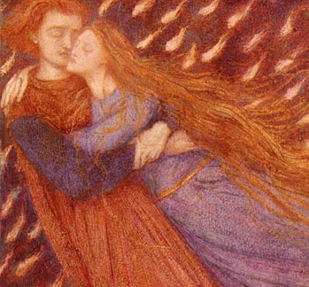

  
[Intangible Textual Heritage](../../index)  [Sub Rosa](../index) 

------------------------------------------------------------------------

[Buy this Book at
Amazon.com](https://www.amazon.com/exec/obidos/ASIN/1434485382/internetsacredte)

------------------------------------------------------------------------

<table width="75%">
<colgroup>
<col style="width: 50%" />
<col style="width: 50%" />
</colgroup>
<tbody>
<tr class="odd">
<td width="50%" data-valign="TOP"> 
Dante Gabriel Rossetti, Paolo and Francesca Da Rimini (Detail) [1855] (public domain image)</td>
<td width="50%" data-valign="CENTER"><h1 id="brother-of-the-third-degree" data-align="CENTER">Brother of the Third Degree</h1>
<h2 id="by-will-l.-garver" data-align="CENTER">by Will L. Garver</h2>
<h4 id="section" data-align="CENTER">[1894]</h4></td>
</tr>
</tbody>
</table>

------------------------------------------------------------------------

[Contents](#contents)    [Start Reading](botd00)    [Page
Index](pageidx)    [Text \[Zipped\]](botdtxt.zip)

------------------------------------------------------------------------

|                                                                                                                           |
|---------------------------------------------------------------------------------------------------------------------------|
|  |

Set in the near future (early twentieth century), this 1894 occult novel
is a tale of eternal love, albeit chaste. The protagonist, Alphonso
Colono, a Mexican, is born into a family with connected with the
Illuminati, here called the 'White Brotherhood.' He moves to Paris and
is initiated into the occult group, where he meets the woman who is to
become his soulmate: Iole. They meet [St. Germain](../csg/index) and
other adepts, help a modern Napoleon unite Europe, and eventually pass
beyond the mortal realm.

This novel may not have had the impact of [Zanoni](../zan/index), which
it bears superficial resemblances to. It does show that the modern
complex of beliefs about the Illuminati was complete in all of its
aspects in the last decade of the 19th century. The wandering eternal
masters, the use of occult power to leverage political change, and the
strange powers of the adepts, are present and accounted for. These
concepts would later become dogma for groups such as the ["I AM"
Activity](../../eso/um/index) and its modern successors.

Garver's vision of a united Europe at peace in the 20th century, (after
a period of war) was a good prediction, even if the mechanism he
proposes is a bit absurd. The narrative itself is still a good read,
despite the overblown period prose. This long-forgotten predecessor to
the Da Vinci Code moves along nicely and has memorable characters. Not
many 19th century occult fictions are half as readable.

------------------------------------------------------------------------

 [Title Page](botd00)  
[Contents](botd01)  
[Chapter I. Childhood](botd02)  
[Chapter II. Severed Ties](botd03)  
[Chapter III. Princess Louise](botd04)  
[Chapter IV. Paris—Mother!](botd05)  
[Chapter V. More Mystery](botd06)  
[Chapter VI. The Woman in Black](botd07)  
[Chapter VIII. Member of the Fifth Degree](botd08)  
[Chapter VIII. Iole](botd09)  
[Chapter IX. Love](botd10)  
[Chapter X. Tests](botd11)  
[Chapter XI. The Black Brotherhood](botd12)  
[Chapter XII. Death—Life](botd13)  
[Chapter XIII. The White Brotherhood](botd14)  
[Chapter XIV. “Virgin Lover”](botd15)  
[Chapter XV. A Honeymoon?](botd16)  
[Chapter XVI. St. Germain.—War](botd17)  
[Chapter XVII. Napoleon the Great](botd18)  
[Chapter XVIII. Lhassa](botd19)  
[Chapter XIX. Brother of the “Third Degree.”](botd20)  
[Vocabulary](botd21)  
