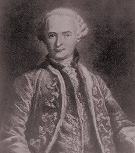

  
[Intangible Textual Heritage](../../index)  [Sub Rosa](../index.md) 

------------------------------------------------------------------------

[Buy this Book at
Amazon.com](https://www.amazon.com/exec/obidos/ASIN/B0022NGKKM/internetsacredte.md)

------------------------------------------------------------------------

<table width="75%">
<colgroup>
<col style="width: 50%" />
<col style="width: 50%" />
</colgroup>
<tbody>
<tr class="odd">
<td width="50%" data-valign="TOP"> 
Count St. Germain (18th Century) [Public Domain Image]</td>
<td width="50%" data-valign="CENTER"><h1 id="the-comte-de-st.-germain" data-align="CENTER">The Comte de St. Germain</h1>
<h2 id="by-isabel-cooper-oakley" data-align="CENTER">by Isabel Cooper-Oakley</h2>
<h4 id="section" data-align="CENTER">[1912]</h4></td>
</tr>
</tbody>
</table>

------------------------------------------------------------------------

[Contents](#contents)    [Start Reading](csg00.md)    [Page
Index](pageidx)    [Text \[Zipped\]](csg.txt.gz.md)

------------------------------------------------------------------------

|                                                                                                                           |
|---------------------------------------------------------------------------------------------------------------------------|
|  |

The original 'International Man of Mystery,' the Count St. Germain, was
an 18th century European aristocrat of unknown origin. He had no visible
means of support, but no lack of resources, and moved in high social
circles. He was a renowned conversationalist and a skilled musician. He
dropped hints that he was centuries old and could grow diamonds. He
never ate in public, was ambidextrous, and as far as anyone could tell,
totally celibate. He served as a backchannel diplomat between England
and France, and may have played some role in Freemasonry. He hobnobbed
with Marie Antoinette, Catherine the Great, Voltaire, Rousseau, Mesmer,
and Casanova. He dabbled in materials and textile technology as well as
alchemy, as did many intellectuals of the time (e.g., Newton). These are
established historical facts, documented by the extensive collection of
contemporary accounts in this book.

Less well understood are some of the other stories that have been made
about the elusive Count: he always appeared about forty years old,
popped up from time to time after his official death (on February 27th,
1784), made spot-on, unambiguous prophecies, could transmute matter, and
spontaneously teleported to distant locations. This has made him a
subject of interest for students of the esoteric. The Theosophists, (of
which Ms. Cooper-Oakley was a founding member), considered St. Germain
to be one of the hidden immortals who manipulate history. In the 20th
century, the ["I Am" Activity](../../eso/index.htm#iam.md), and its
successors such as Elizabeth Clare Prophet's adherents, elevated St.
Germain to the status of a demigod, an 'Ascended Master.'

There is probably a good explanation for some of the anomalies in the
narrative. Many of the memoirs of St. Germain were written years after
the events, and undoubtedly embellished in the telling. He appears to
have been conflated with several other aristocrats with similar last
names, which may explain the teleportation rumors. The Count also
inspired ridicule, both high and low. Voltaire made a sarcastic comment
that the Count was 'a man who knows everything and never dies,' which
some have unfortunately taken literally. (I'm guessing that Voltaire
meant that it was impossible to get him to shut up!) A contemporary
Parisian comedian named Milord Gower had a popular routine in which St.
Germain told even more extravagant stories, including having advised
Jesus, and some of these gags may have been mixed up with the Count's
own tall tales in popular memory. Then there are the imposters. Casanova
pretended to be him in 1760 during a trip to Switzerland. Aleister
Crowley toyed with the idea of disguising himself as the Count. A
mentally ill French man got on TV in 1972 and claimed to be St. Germain.

So was he a time traveler? A vampire? Secret agent of the Illuminati? Or
a hoax perpetuated by an unrelated series of charlatans? This enjoyable
book, the first biography of St. Germain, is the indispensible starting
point for any discussion of the mysterious Count.

--J.B. Hare, October 1st, 2006

Reference: *The Immortal Count*, by Doug Skinner, Fortean Times, May
2001.

------------------------------------------------------------------------

 [Title Page](csg00.md)  
[Contents](csg01.md)  
[Chapter I. Mystic and Philosopher](csg02.md)  
[Chapter II. His Travels and Knowledge](csg03.md)  
[Chapter III. The Coming Danger](csg04.md)  
[Chapter IV. Tragical Prophecies](csg05.md)  
[Chapter V. Political Work](csg06.md)  
[Chapter VI. In The ''Mitchell Papers''](csg07.md)  
[Chapter VII. Masonic Tradition](csg08.md)  
[Chapter VIII. Masonic Work and Austrian Traditions](csg09.md)  

### Appendices

[Appendix I. Documents Concerning the Apartment in Chambord...](csg10.md)  
[Appendix II. Correspondence Between The Duc De Choiseul And The Comte
D’Affry...](csg11.md)  
[Appendix III. From the Papers of Sieur Bentinck Van Rhoon](csg12.md)  
[Appendix IV. Extracts from The Memoirs of Hardenbrock...](csg13.md)  
[Appendix V. Masonic Document from the Lodge of the ''Grand Orient'' of
France](csg14.md)  
[Appendix VI. Additional Mitchell Papers...Lord Holdernesse's
Despatches...](csg15.md)  
[Appendix VII. Miscellaneous Papers From English Record Office](csg16.md)  
[Bibliography](csg17.md)  
