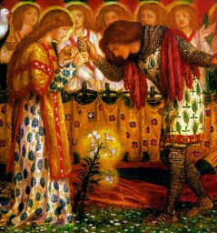

  
[Intangible Textual Heritage](../../index)  [Sub Rosa](../index.md) 

------------------------------------------------------------------------

[Buy this Book at
Amazon.com](https://www.amazon.com/exec/obidos/ASIN/1589639057/internetsacredte.md)

------------------------------------------------------------------------

<table width="75%">
<colgroup>
<col style="width: 50%" />
<col style="width: 50%" />
</colgroup>
<tbody>
<tr class="odd">
<td width="50%" data-valign="TOP"> 
</td>
<td width="50%" data-valign="CENTER"><h1 id="the-hidden-church-of-the-holy-graal" data-align="CENTER">The Hidden Church of the Holy Graal</h1>
<h3 id="by-arthur-edward-waite" data-align="CENTER">by Arthur Edward Waite</h3>
<h4 id="section" data-align="CENTER">[1909]</h4></td>
</tr>
</tbody>
</table>

------------------------------------------------------------------------

[Page Index](pageidx.md)  
[Contents](#contents)    [Start Reading](hchg00.md)  

------------------------------------------------------------------------

|                                                                                                                           |
|---------------------------------------------------------------------------------------------------------------------------|
|  |

In the 13th century, over a few decades, a huge literature emerged
around an unlikely tale. Survivors of the core of early Christianity
make a perilous journey to Western Europe. They begin a hidden
bloodline, preserve immensely powerful relics of the crucifixion, and
carry a secret which, if revealed, would turn the established church on
its head. If this seems like *déjà vu*, it is.

A.E. Waite gets to the core of the Grail legend, an interwoven mass of
narratives which started with seeds of pagan folklore and grew into a
massive allegorical Christian epic. This 700 page book will satisfy both
the academic reader who wants a survey of the Grail literature, and the
more mystically inclined who seek the Grail itself. Waite examines in
great detail every known source text for the Grail legend. His literate
style makes interesting reading for well-educated readers, despite the
repeating themes and story lines. Unlike some of the other writers on
this topic, Waite is organized, focused, and not hesitant to turn a
critical eye on half-baked theories.

In the last two hundred pages, he attempts to make some sense of it all.
He examines and dismisses 19th century theories which linked the Grail
to the Templars, or Masons, as well as the unorthodox Cathars,
Albigensians and Waldensians of Southern France. His conclusion is that
there is an 'inner church' in Christianity: not a conspiracy or a
subterranean sect, but a mystical core. Instead, Waite's concept of the
hidden church is based on a deep comprehension of the sacrament of
communion, and the Holy Grail is symbolic of this.

Waite published this *magnum opus* about the time that he (with Pamela
Smith) was putting the finishing touches on his [Tarot
deck](../../tarot/index.md). A close read of this book will illuminate much
of the Waite Tarot deck symbolism.

------------------------------------------------------------------------

 [Title Page and Front Matter](hchg00.md)  
[Preface](hchg01.md)  
[Contents](hchg02.md)  

### Book I

[The Argument](hchg03.md)  
[I. Some Aspects of the Graal Legend](hchg04.md)  
[II. Epochs of the Legend](hchg05.md)  
[III. The Environment of the Graal Literature](hchg06.md)  
[IV. The Literature of the Cycle](hchg07.md)  
[V. The Implicits of the Mystery](hchg08.md)  

### Book II

[The Argument](hchg09.md)  
[I. A Preliminary Account of Certain Root-Secrets Included in the Whole
Subject](hchg10.md)  
[II. The Institution of the Hallows, and in the First Place General
Introduction Concerning Them](hchg11.md)  
[III. The Institution of the Hallows, and, Secondly, the Variations of
the Cup Legend](hchg12.md)  
[IV. The Graal Vessel Considered as a Bowl of Plenty](hchg13.md)  

### V. The Lesser Hallows of the Legend

[§ A.--The Summary of These Matters](hchg14.md)  
[§ B.--Legends of the Sacred Lance](hchg15.md)  
[§ C.--The Broken Sword](hchg16.md)  
[§ D.--The Dish](hchg17.md)  

 

[VI. The Castle of the Holy Graal](hchg18.md)  
[VII. The Keepers of the Hallows](hchg19.md)  
[VIII. The Pageants in the Quests](hchg20.md)  
[IX. The Enchantments of Britain, the Times Called Adventurous and the
Wounding of the King](hchg21.md)  
[X. The Suppressed Word and the Mystic Question](hchg22.md)  
[XI. The Healing of the King](hchg23.md)  
[XII. The Removal of the Hallows](hchg24.md)  

### Book III

[Argument](hchg25.md)  
[I. The Antecedents of the Legend in Folk-Lore](hchg26.md)  
[II. The Welsh Perceval](hchg27.md)  
[III. The English Metrical Romance of Syr Percyvelle](hchg28.md)  

### IV. The Conte del Graal

[§ A.--Preliminary to the Whole Subject](hchg29.md)  
[§ B.--The Poem of Chrétien De Troyes](hchg30.md)  
[§ C.--The Extension of Gautier](hchg31.md)  
[§ D.--The Conclusion of Manessier](hchg32.md)  
[§ E.--The Alternative Sequel of Gerbert](hchg33.md)  
[§ F.--In Which Sir Gawain is Considered Briefly as a Companion of the
Holy Quest](hchg34.md)  

### Book IV

[Argument](hchg35.md)  
[I. The Metrical Romance of Joseph of Arimathæa](hchg36.md)  
[II. The Lesser Holy Graal](hchg37.md)  
[III. The Early History of Merlin](hchg38.md)  
[IV. The Didot Perceval](hchg39.md)  

### Book V

[The Argument](hchg40.md)  
[I. The Book of the Holy Graal and, in the First Place, the Prologue
Thereto Belonging](hchg41.md)  
[II. New Consideration Concerning the Branches of the
Chronicle](hchg42.md)  
[III. The Minor Branches of the Book of the Holy Graal](hchg43.md)  

### IV. Some Later Merlin Legends

[§ A.--The Vulgate Merlin](hchg44.md)  
[§ B.--The Huth Merlin](hchg45.md)  

 

[V. The Great Prose Lancelot](hchg46.md)  
[VI. A Preface or Introductory Portion Appertaining to All The
Quests](hchg47.md)  
[VII. The Longer Prose Perceval](hchg48.md)  
[VIII. The Quest of the High Prince](hchg49.md)  
[IX. The Welsh Quest of Galahad](hchg50.md)  

### Book VI

[Argument](hchg51.md)  
[I. The Parsifal of Wolfram Von Eschenbach](hchg52.md)  
[II. Gleanings Concerning the Lost Quest of Guiot de Provence](hchg53.md)  
[III. Sidelights From the Spanish and Portuguese Quests](hchg54.md)  
[IV. The Crown of All Adventures](hchg55.md)  
[V. The Titurel of Albrecht Von Scharfenberg](hchg56.md)  
[VI. The Dutch Lancelot](hchg57.md)  

### Book VII

[Argument](hchg58.md)  
[I. Statement of a Possible Implicit Accounting for All
Claims](hchg59.md)  
[II. The Formulæ of the Hypothesis Scheduled](hchg60.md)  
[III. In What Sense the Plea Must be Held to Fail](hchg61.md)  
[IV. The Victory of the Latin Rite](hchg62.md)  

### Book VIII

[Argument](hchg63.md)  
[I. The Introductory Words](hchg64.md)  
[II. The Position of the Literature Defined](hchg65.md)  
[III. Concerning the Great Experiment](hchg66.md)  
[IV. The Mystery of Initiation](hchg67.md)  
[V. The Mystery of Faith](hchg68.md)  
[VI. The Lost Book of the Graal](hchg69.md)  
[VII. The Declared Mystery of Quest](hchg70.md)  

### Book IX

[The Argument](hchg71.md)  
[I. Preliminary to the Whole Subject](hchg72.md)  
[II. Some Alleged Secret Schools of the Middle Ages](hchg73.md)  
[III. The Latin Literature of Alchemy and the Hermetic Secret in the
Light of the Eucharistic Mystery](hchg74.md)  
[IV. The Kabalistic Academies](hchg75.md)  
[V. The Claim in Respect of Templar Influence](hchg76.md)  
[VI. The Graal Formula in the Light of Other Gleanings from the Catholic
Sacramentary](hchg77.md)  
[VII. The Lapis Exilis](hchg78.md)  

### VIII. The Analogies of Masonry

[§ A. The Assumption of the Building Guild](hchg79.md)  
[§ B. Masonry and Moral Science](hchg80.md)  
[§ C. A Theory of Hermetic Interference](hchg81.md)  
[§ D. One Key to the Sanctuary](hchg82.md)  

 

[IX. The Hallows of the Graal Mystery Rediscovered in the Talismans of
the Tarot](hchg83.md)  

### Book X

[The Argument](hchg84.md)  
[I. The Hermeneutics of the Holy Graal](hchg85.md)  
[II. The Good Husbandman](hchg86.md)  
[III. The Catholic Secret of the Literature](hchg87.md)  
[IV. The Mystery Which Is Within](hchg88.md)  
[V. The Secluded and Unknown Sanctuary](hchg89.md)  
[VI. The Tradition of St. John the Divine and Other Traces of a Higher
Mind of the Church](hchg90.md)  
[VII. The Conclusion of This Holy Quest](hchg91.md)  

 

### Appendix: Bibliography

[Part I. The Texts](hchg92.md)  
[Part II. Some Critical Works](hchg93.md)  
[Part III. Phases of Interpretation](hchg94.md)  

 

[Index](hchg95.md)  
