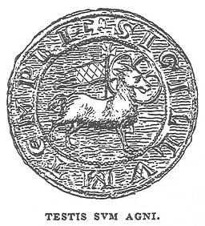

  
[Intangible Textual Heritage](../../index)  [Sub Rosa](../index) 
[Index](index)  [Next](hkt01) 

------------------------------------------------------------------------

[Buy this Book on
Kindle](https://www.amazon.com/exec/obidos/ASIN/B002RHOUAK/internetsacredte)

------------------------------------------------------------------------

  
*The History of the Knights Templar*, by Charles G. Addison, \[1842\],
at Intangible Textual Heritage

------------------------------------------------------------------------

### THE HISTORY

###### OF

# The Knights Templars,

###### THE

## TEMPLE CHURCH, AND THE TEMPLE.

### BY CHARLES G. ADDISON, ESQ.

###### OF THE INNER TEMPLE.

#### Longman, Brown, Green, and Longmans; London

#### \[1842\]

   
TESTIS SUM AGNI

  [  
Click to enlarge](img/title.jpg)  
Title Page  

 
[  
Click to enlarge](img/verso.jpg)  
Verso  

#### Scanned, proofed, and formatted at Intangible Textual Heritage, May, 2006, by John Bruno Hare. This text is in the public domain in the United States because it was published prior to 1923.

TO THE

MASTERS OF THE BENCH OF THE HONOURABLE SOCIETIES

OF THE

Inner and Middle Temple

THE RESTORERS

OF

The Antient Church of the Knights Templars

THIS WORK

Is

RESPECTFULLY DEDICATED

BY

THE AUTHOR.

------------------------------------------------------------------------

[Next: Preface](hkt01)

