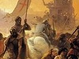

  
[Intangible Textual Heritage](../../index)  [Sub Rosa](../index) 
[Index](index)  [Previous](hkt08)  [Next](hkt10) 

------------------------------------------------------------------------

[Buy this Book on
Kindle](https://www.amazon.com/exec/obidos/ASIN/B002RHOUAK/internetsacredte)

------------------------------------------------------------------------

  
*The History of the Knights Templar*, by Charles G. Addison, \[1842\],
at Intangible Textual Heritage

------------------------------------------------------------------------

p. 141

### CHAPTER VII.

Richard Cœur de Lion joins, the Templars before
Acre--The city surrenders, and the Templars establish the chief house of
their order within it--Cœur de Lion takes up his abode with them--He
sells to them the island of Cyprus--The Templars form the van of his
army Their foraging expeditions and great exploits--Cœur de Lion quits
the Holy Land in the disguise of a Knight Templar--The Templars build
the Pilgrim's Castle in Palestine--The state of the order in
England--King John resides in the Temple at London--The barons come to
him at that place, and demand MAGNA CHARTA--The exploits of the Templars
in Egypt--The letters of the Grand Master to the Master of the Temple at
London--The Templars reconquer Jerusalem.

               "Therefore, friends,  
As far as to the sepulchre of Christ  
(Whose soldier now under whose blessed cross  
We are impressed and engag’d to fight,)  
Forthwith a power of English shall we levy,  
Whose arms were moulded in their mother's womb,  
To chase these pagans, in those holy fields,  
Over whose acres walked those blessed feet,  
Which, fourteen hundred years ago, were nail’d,  
For our advantage, on the bitter cross."

IN the mean time a third crusade had been preached in Europe. William,
archbishop of Tyre, had proceeded to the courts of France and England,
and had represented in glowing colours the miserable condition of
Palestine, and the horrors and abominations which had been committed by
the infidels in the holy city

p. 142

WALTER.  
A.D. 1191.of Jerusalem. The English and French monarchs laid
aside their private animosities, and agreed to fight under the same
banner against the infidels, and towards the close of the month of May,
in the second year of the siege of Acre, the royal fleets of Philip
Augustus and Richard Cœur de Lion floated in triumph in the bay of Acre.
At the period of the arrival of king Richard the Templars had again lost
their Grand Master, and Brother Robert de Sablé, or Sabloil, a valiant
knight of the order, who had commanded a division of the English fleet
on the voyage out, was placed at the head of the fraternity. [\*](#fn_220)ROBERT DE  
SABLÉ  
A.D. 1191. The proudest of the nobility, and the most valiant of
the chivalry of Europe, on their arrival in Palestine, manifested an
eager desire to fight under the banner of the Temple. Many secular
knights were permitted by the Grand Master to take their station by the
side of the military friars, and even to wear the red cross on their
breasts whilst fighting in the ranks.

The Templars performed prodigies of valour; "The name of their
reputation, and the fame of their sanctity," says James of Vitry, bishop
of Acre, "like a chamber of perfume sending forth a sweet odour, was
diffused throughout the entire world, and all the congregation of the
saints will recount their battles and glorious triumph over the enemies
of Christ, knights indeed from all parts of the earth, dukes, and
princes, after their example, casting off the shackles of the world, and
renouncing the pomps and vanities of this life and all the lusts of the
flesh for Christ's sake, hastened to join them, and to participate in
their holy profession and religion." [†](#fn_221)

On the morning of the twelfth of July, six weeks after the arrival of
the British fleet, the kings of England and France, the

p. 143

ROBERT DE  
SABLÉ  
A.D. 1191.christian chieftains, and the Turkish emirs with their
green banners, assembled in the tent of the Grand Master of the Temple,
to treat of the surrender of Acre, and on the following day the gates
were thrown open to the exulting warriors of the cross. The Templars
took possession of three localities within the city by the side of the
sea, where they established their famous Temple, which became from
thenceforth the chief house of the order. Richard Cœur de Lion, we are
told, took up his abode with the Templars, whilst Philip resided in the
citadel. [\*](#fn_222)

When the fiery monarch of England tore down the banner of the duke of
Austria from its staff and threw it into the ditch, it was the Templars
who, interposing between the indignant Germans and the haughty Britons,
preserved the peace of the christian army. [†](#fn_223)

During his voyage from Messina to Acre, King Richard had revenged
himself on Isaac Comnenus, the ruler of the island of Cyprus, for the
insult offered to the beautiful Berengaria, princess of Navarre, his
betrothed bride. The sovereign of England had disembarked his troops,
stormed the town of Limisso, and conquered the whole island; and shortly
after his arrival at Acre, he sold it to the Templars for three hundred
thousand livres d’or. [‡](#fn_224)

During the famous march of Richard Cœur de Lion from Acre to Ascalon,
the Templars generally led the van of the christian army, and the
Hospitaliers brought up the rear. [§](#fn_225)
Saladin, at

p. 144

ROBERT DE  
SABLÉ  
A.D. 1191.the head of an immense force, exerted all his energies
to oppose their progress, and the march to Jaffa formed a perpetual
battle of eleven days. On some occasions Cœur de Lion himself, at the
head of a chosen body of knights, led the van, and the Templars were
formed into a rear-guard. [\*](#fn_226) They
sustained immense loss, particularly in horses, which last calamity, we
are told, rendered them nearly desperate. [†](#fn_227)

The Moslem as well as the christian writers speak with admiration of the
feats of heroism performed. "On the sixth day," says Bohadin, "the
sultan rose at dawn as usual, and heard from his brother that the enemy
were in motion. They had slept that night in suitable places about
Cæsarea, and were now dressing and taking their food. A second messenger
announced that they had begun their march; our brazen drum was sounded,
all were alert, the sultan came out, and I accompanied him: he
surrounded them with chosen troops, and gave the signal for attack." . .
. . . . "Their foot soldiers were covered with thick-strung pieces of
cloth, fastened together with rings so as to resemble coats of mail. I
saw with my own eyes several who had not one nor two but *ten darts
sticking in their backs!* and yet marched on with a calm and cheerful
step, without any trepidation!" [‡](#fn_228)

Every exertion was made to sustain the courage and enthusiasm of the
christian warriors. When the army halted for the night, and the soldiers
were about to take their rest, a loud voice was heard from the midst of
the camp, exclaiming, "ASSIST THE HOLY SEPULCHRE," which words were
repeated by the leaders of the host, and were echoed and re-echoed along
their extended lines. [§](#fn_229)

p. 145

ROBERT DE  
SABLÉ  
A.D. 1191.\[paragraph continues\]
The Templars and the Hospitallers, who were well acquainted with the
country, employed themselves by night in marauding and foraging
expeditions. They frequently started off at midnight, swept the country
with their turcopoles or light cavalry, and returned to the camp at
morning's dawn with rich prizes of oxen, sheep, and provisions. [\*](#fn_230)

In the great plain near Ramleh, when the Templars led the van of the
christian army, Saladin made a last grand effort to arrest their
progress, which was followed by one of the greatest battles of the age.
Geoffrey de Vinisauf, the companion of King Richard on this expedition,
gives a lively and enthusiastic description of the appearance of the
Moslem array in the great plain around Jaffa and Ramleh. On all sides,
far as the eye could reach, from the sea-shore to the mountains, nought
was to be seen but a forest of spears, above which waved banners and
standards innumerable. The wild Bedouins, [†](#fn_231) the children of the desert, mounted on
their fleet Arab mares, coursed with the rapidity of the lightning over
the vast plain, and darkened the air with clouds of missiles. Furious
and unrelenting, of a horrible aspect, with skins blacker than soot,
they strove by rapid movement and continuous assaults to penetrate the
well-ordered array of the christian warriors. They advanced to the
attack with horrible screams and bellowings, which, with the deafening
noise of the trumpets, horns, cymbals, and brazen kettle-drums,

p. 146

ROBERT DE  
SABLÉ  
A.D. 1191.produced a clamour that resounded through the plain,
and would have drowned even the thunder of heaven.

The engagement commenced with the left wing of the Hospitallers, and the
victory of the Christians was mainly owing to the personal prowess of
King Richard. Amid the disorder of his troops, Saladin remained on the
plain without lowering his standard or suspending the sound of his
brazen kettle-drums, he rallied his forces, retired upon Ramleh, and
prepared to defend the road leading to Jerusalem. The Templars and
Hospitaliers, when the battle was over, went in search of Jacques
d’Asvesnes, one of the most valiant of King Richard's knights, whose
dead body, placed on their spears, they brought into the camp amid the
tears and lamentations of their brethren. [\*](#fn_232)

The Templars, on one of their foraging expeditions, were surrounded by a
superior force of four thousand Moslem cavalry; the Earl of Leicester,
with a chosen body of English, was sent by Cœur de Lion to their
assistance, but the whole party was overpowered and in danger of being
cut to pieces, when Richard himself hurried to the scene of action with
his famous battle-axe, and rescued the Templars from their perilous
situation. [†](#fn_233) By the valour and
exertions of the lion-hearted king, the city of Gaza, the ancient
fortress of the order, which had been taken by Saladin soon after the
battle of Tiberias, was recovered to the christian arms, the
fortifications were repaired, and the place was restored to the Knights
Templars, who again garrisoned it with their soldiers.

p. 147

ROBERT DE  
SABLÉ  
A.D. 1192.As the army advanced, Saladin fell back towards
Jerusalem, and the vanguard of the Templars was pushed on to the small
town of Ramleh.

At midnight of the festival of the Holy Innocents, a party of them
sallied out of the camp in company with some Hospitaliers on a foraging
expedition; they scoured the mountains in the direction of Jerusalem,
and at morning's dawn returned to Ramleh with more than two hundred
oxen. [\*](#fn_234)

When the christian army went into winter quarters, the Templars
established themselves at Gaza, and King Richard and his army were
stationed in the neighbouring town of Ascalon, the walls and houses of
which were rebuilt by the English monarch during the winter. Whilst the
christian forces were reposing in winter quarters, an arrangement was
made between the Templars, King Richard, and Guy de Lusignan, "the king
without a kingdom," for the cession to the latter of the island of
Cyprus, previously sold by Richard to the order of the Temple, by virtue
of which arrangement, Guy de Lusignan took possession of the island and
ruled the country by the magnificent title of emperor. [†](#fn_235)

When the winter rains had subsided, the christian forces were again put
in motion, but both the Templars and Hospitallers strongly advised Cœur
de Lion not to march upon Jerusalem, and the latter appears to have had
no strong inclination to undertake the siege of the holy city, having
manifestly no chance of success. The English monarch declared that he
would be guided by the advice of the Templars and Hospitallers, who were
acquainted with the country, and were desirous of recovering their
ancient inheritances. The army, however, advanced within a day's journey
of the holy city, and then a council was called

p. 148

ROBERT DE  
SABLÉ  
A.D. 1192.together, consisting of five Knights Templars, five
Hospitaliers, five eastern Christians, and five western Crusaders, and
the expedition was abandoned. [\*](#fn_236)

The Templars took part in the attack upon the great Egyptian convoy,
wherein four thousand and seventy camels, five hundred horses,
provisions, tents, arms, and clothing, and a great quantity of gold and
silver, were captured, and then fell back upon Acre; they were followed
by Saladin, who immediately commenced offensive operations, and laid
siege to Jaffa. The Templars marched by land to the relief of the place,
and Cœur de Lion hurried by sea. Many valiant exploits were performed,
the town was relieved, and the campaign was concluded by the
ratification of a treaty whereby the Christians were to enjoy the
privilege of visiting Jerusalem as pilgrims. Tyre, Acre, and Jaffa, with
all the sea-coast between them, were yielded to the Latins, but it was
stipulated that the fortifications of Ascalon should be
demolished. [†](#fn_237)

After the conclusion of this treaty, King Richard being anxious to take
the shortest and speediest route to his dominions by traversing the
continent of Europe, and to travel in disguise to avoid the malice of
his enemies, made an arrangement with his friend Robert de Sablé, the
Grand Master of the Temple, whereby the latter undertook to place a
galley of the order at the disposal of the king, and it was determined
that whilst the royal fleet pursued its course with Queen Berengaria
through the Straits of Gibraltar to Britain, Cœur de Lion himself,
disguised in the habit of a Knight Templar, should secretly embark and
make for one

p. 149

ROBERT DE  
SABLÉ  
A.D. 1192.of the ports of the Adriatic. The plan was carried into
effect on the night of the 25th of October, and King Richard set sail,
accompanied by some attendants, and four trusty Templars. [\*](#fn_238) The habit he had assumed, however,
protected him not, as is well known, from the cowardly vengeance of the
base duke of Austria.

The lion-hearted monarch was one of the many benefactors to the order of
the Temple. He granted to the fraternity his manor of Calow, with
various powers and privileges. [†](#fn_239)

GILBERT  
HORAL.  
A.D. 1195.Shortly after his departure from Palestine, the Grand
Master, Robert de Sablé, was succeeded by Brother Gilbert Horal or
Erail, who had previously filled the high office of Grand Preceptor of
France. [‡](#fn_240) The Templars, to retain
and strengthen their dominion in Palestine, commenced the erection of
various strong fortresses, the stupendous ruins of many of which remain
to this day. The most famous of these was the Pilgrim's Castle, [§](#fn_241) which commanded the coast-road from Acre
to Jerusalem. It derived its name from a solitary tower erected by the
early Templars to protect the passage of the pilgrims through a
dangerous pass in the mountains bordering the sea-coast, and was
commenced shortly after the removal of the chief house of the order from
Jerusalem to Acre. A small promontory which juts out into the sea a few
miles below Mount Carmel, was converted into a fortified camp. Two
gigantic towers, a hundred feet in height and seventy-four feet in
width, were erected, together with enormous

p. 150

GILBERT  
HORAL.  
A.D. 1195.bastions connected together by strong walls furnished
with all kinds of military engines. The vast inclosure contained a
palace for the use of the Grand Master and knights, a magnificent
church, houses and offices for the serving brethren and hired soldiers,
together with pasturages, vineyards, gardens, orchards, and fishponds.
On one side of the walls was the salt sea, and on the other, within the
camp, delicious springs of fresh water. The garrison amounted to four
thousand men in time of war. [\*](#fn_242)
Considerable remains of this famous fortress are still visible on the
coast, a few miles to the south of Acre. It is still called by the
Levantines, *Castel Pellegrino*. Pococke describes it as "very
magnificent, and so finely built, that it may be reckoned one of the
things that are best worth seeing in these parts." "It is encompassed,"
says he, "with two walls fifteen feet thick, the inner wall on the east
side cannot be less than forty feet high, and within it there appear to
have been some very grand apartments. The offices of the fortress seem
to have been at the west end, where I saw an oven fifteen feet in
diameter. In the castle there are remains of a fine lofty church of ten
sides, built in a light gothic taste: three chapels are built to the
three eastern sides, each of which consists of five sides, excepting the
opening to the church; in these it is probable the three chief altars
stood." [†](#fn_243) Irby and Mangles referring
at a subsequent period to the ruins of the church, describe it as a
double hexagon, and state that the half then standing had six sides.
Below the cornice are human heads and heads of animals in alto relievo,
and the walls are adorned with a double line of arches in the gothic
style, the architecture light and elegant.

p. 151

GILBERT  
HORAL.  
A.D. 1195.To narrate all the exploits of the Templars, and all
the incidents and events connected with the order, would be to write the
history of the Latin kingdom of Palestine, which was preserved and
maintained for the period of ninety-nine years after the departure of
Richard Cœur de Lion, solely by the exertions of the Templars and the
Hospitaliers. No action of importance was ever fought with the infidels,
in which the Templars did not take an active and distinguished part, nor
was the atabal of the Mussulmen ever sounded in defiance on the
frontier, without the trumpets of the Templars receiving and answering
the challenge.

PHILIP  
DUPLESSIES  
A.D. 1201.The Grand Master, Gilbert Horal, was succeeded by
Philip Duplessies or De Plesseis. [\*](#fn_244)
We must now refer to a few events connected with the order of the Temple
in England.

Brother Geoffrey, who was Master of the Temple at London at the period
of the consecration of the Temple Church by the Patriarch of Jerusalem,
died shortly after the capture of the holy city by Saladin, and was
succeeded by Brother Amaric de St. Maur, who is an attesting witness to
the deed executed by king John, A.D. 1203, granting a dowry to his young
queen, the beautiful Isabella of Angouleme. [†](#fn_245) Philip Augustus, king of France, placed
a vast sum of gold and silver in the Temple at Paris, and the treasure
of John, king of England, was deposited in the Temple at London. [‡](#fn_246) King John, indeed, frequently resided,
for weeks together, at the Temple in London, and many of his writs and
precepts to his lieutenants, sheriffs, and bailiffs, are dated
therefrom. [§](#fn_247) The orders for the
concentration of the English fleet at Portsmouth, to resist the
formidable French invasion

p. 152

PHILIP  
DUPLESSIES  
A.D. 1213.instigated by the pope, are dated from the Temple, and
the convention between the king and the count of Holland, whereby the
latter agreed to assist king John with a body of knights and
men-at-arms, in case of the landing of the French, was published at the
same place. [\*](#fn_248)

In all the conferences and negotiations between the mean-spirited king
and the imperious and overbearing Roman pontiff, the Knights Templars
took an active and distinguished part. Two brethren of the order were
sent by Pandulph, the papal legate, to king John, to arrange that famous
conference between them which ended in the complete submission of the
latter to all the demands of the holy see. By the advice and persuasion
of the Templars, king John repaired to the preceptory of Temple Ewell,
near Dover, where he was met by the legate Pandulph, who crossed over
from France to confer with him, and the mean-hearted king was there
frightened into that celebrated resignation of the kingdoms of England
and Ireland, "to God, to the holy apostles Peter and Paul, to the holy
Roman church his mother, and to his lord, Pope Innocent the Third, and
his catholic successors, for the remission of all his sins and the sins
of all his people, as well the living as the dead." [†](#fn_249) The following year the commands of king
John for the extirpation of the heretics in Gascony, addressed to the
seneschal of that province, were issued from the Temple at London, [‡](#fn_250) and about the same period the Templars
were made the depositaries of various private and confidential matters
pending between king John and his illustrious sister-in-law, "the royal,
eloquent, and beauteous" Berengaria

p. 153

PHILIP  
DUPLESSIES  
A.D. 1215.of Navarre, the youthful widowed queen of Richard Cœur
*de Lion*. [\*](#fn_251) The Templars in
England managed the money transactions of that fair princess. She
directed her dower to be paid in the house of the New Temple at London,
together with the arrears due to her from the king, amounting to several
thousand pounds. [†](#fn_252)

John was resident at the Temple when he was compelled by the barons of
England to sign MAGNA CHARTA. Matthew Paris tells us that the barons
came to him, whilst he was residing in the New Temple at London, "in a
very resolute manner, clothed in their military dresses, and demanded
the liberties and laws of king Edward, with others for themselves, the
kingdom, and the church of England. [‡](#fn_253)

King John was a considerable benefactor to the order. He granted to the
fraternity the Isle of Lundy, at the mouth of the river Severn; all his
land at Radenach and at Harewood, in the county of Hereford; and he
conferred on the Templars numerous. privileges. [§](#fn_254)

WILLIAM DE  
CHARTRES  
A.D. 1217.The Grand Master Philip Duplessies was succeeded by
Brother WILLIAM DE CHARTRES, as appears from the following letter to the
Pope:

"To the very reverend father in Christ, the Lord Honorius, by the
providence of God chief pontiff of the Holy Roman Church, William de
Chartres, humble Master of the poor chivalry of the Temple, proffereth
all due obedience and reverence, with the kiss of the foot.

p. 154

WILLIAM DE  
CHARTRES  
A.D. 1217."By these our letters we hasten to inform your
paternity of the state of that Holy Land which the Lord hath consecrated
with his own blood. Know that, at the period of the departure of these
letters, an immense number of pilgrims, both knights and foot soldiers,
marked with the emblem of the life-giving cross, arrived at Acre from
Germany and other parts of Europe. Saphadin, the great sultan of Egypt,
hath remained closely within the confines of his own dominions, not
daring in any way to molest us. The arrival of the king of Hungary, and
of the dukes of Austria and Moravia, together with the intelligence just
received of the near approach of the fleet of the Friths, has not a
little alarmed him. Never do we recollect the power of the Pagans so low
as at the present time; and may the omnipotent God, O holy father, make
it grow weaker and weaker day by day. But we must inform you that in
these parts corn and barley, and all the necessaries of life, have
become extraordinarily dear. This year the harvest has utterly
disappointed the expectations of our husbandmen, and has almost totally
failed. The natives, indeed, now depend for support altogether upon the
corn imported from the West, but as yet very little foreign grain has
been received; and to increase our uneasiness, nearly all our knights
are dismounted, and we cannot procure horses to supply the places of
those that have perished. It is therefore of the utmost importance, O
holy father, to advertise all who design to assume the cross of the
above scarcity, that they may furnish themselves with plentiful supplies
of grain and horses.

"Before the arrival of the king of Hungary and the duke of Austria, we
had come to the determination of marching against the city of Naplous,
and of bringing the Saracen chief Coradin to an engagement if he would
have awaited our attack, but we have all now determined to undertake an
expedition into Egypt

p. 155

WILLIAM DE  
CHARTRES  
A.D. 1218.to destroy the city of Damietta, and we shall then
march upon Jerusalem. . . ." [\*](#fn_255)

It was in the month of May, A.D. 1218, that the galleys of the Templars
set sail from Acre on the above-mentioned memorable expedition into
Egypt. They cast anchor in the mouth of the Nile, and, in conjunction
with a powerful army of crusaders, laid siege to Damietta. A pestilence
broke out shortly after their arrival, and hurried the Grand Master,
William de Chartres, to his grave. [†](#fn_256)
He was succeeded by the veteran warrior, Brother PETER DE MONTAIGU,
Grand Preceptor of Spain. [‡](#fn_257)PETER DE  
MONTAIGU  
A.D. 1218.

James of Vitry, bishop of Acre, who accompanied the Templars on this
expedition, gives an enthusiastic account of their famous exploits, and
of the tremendous battles fought upon the Nile, in one of which a large
vessel of the Templars was sunk, and every soul on board perished. He
describes the great assault on their camp towards the middle of the year
1219, when the trenches were forced, and all the infantry put to flight.
"The insulting shouts of the conquering Saracens," says he, "were heard
on all sides, and a panic was rapidly spreading through the disordered
ranks of the whole army of the cross, when the Grand Master and brethren
of the Temple made a desperate charge, and bravely routed the first
ranks of the infidels. The spirit of Gideon animated the Templars, and
the rest of the army, stimulated by their example, bravely advanced to
their support. . . . . Thus did the Lord on that day, through the valour
of the Templars, save those who trusted in Him." [§](#fn_258) Immediately after the surrender of
Damietta, the Grand Master of the Temple

p. 156

PETER DE  
MONTAIGU  
A.D. 1222.returned to Acre to repel the forces of the sultan of
Damascus, who had invaded the Holy Land, as appears from the following
letter to the bishop of Ely.

"Brother Peter de Montaigu, Master of the Knights of the Temple, to the
reverend brother in Christ, N., by the grace of God bishop of Ely,
health. We proceed by these letters to inform your paternity how we have
managed the affairs of our Lord Jesus Christ since the capture of
Damietta and of the castle of Taphneos." The Grand Master describes
various military operations, the great number of galleys fitted out by
the Saracens to intercept the supplies and succour from Europe, and the
arming of the galleys, galliots, and other vessels of the order of the
Temple to oppose them, and clear the seas of the infidel flag. He states
that the sultan of Damascus had invaded Palestine, had ravaged the
country around Acre and Tyre, and had ventured to pitch his tents before
the castle of the Pilgrims, and had taken possession of Cæsarea. "If we
are disappointed," says he, "of the succour we expect in the ensuing
summer, all our newly-acquired conquests, as well as the places that we
have held for ages past, will be left in a very doubtful condition. We
ourselves, and others in these parts, are so impoverished by the heavy
expenses we have incurred in prosecuting the affairs of Jesus Christ,
that we shall be unable to contribute the necessary funds, unless we
speedily receive succour and subsidies from the faithful. Given at Acre,
xii. kal. October, A.D. 1222." [\*](#fn_259)

The troops of the sultan of Damascus were repulsed and driven beyond the
frontier, and the Grand Master then returned to Damietta, to superintend
the preparations for a march upon Cairo. The results of that disastrous
campaign are detailed in the following letter to Brother Alan Marcel,
Preceptor of England, and Master of the Temple at London.

p. 157

PETER DE  
MONTAIGU  
A.D. 1222."Brother Peter de Montaigu, humble Master of the
soldiers of Christ, to our vicegerent and beloved brother in Christ,
Alan Marcel, Preceptor of England.

"Hitherto we have had favourable information to communicate unto you
touching our exertions in the cause of Jesus Christ; now, alas! such
have been the reverses and disasters which our sins have brought upon us
in the land of Egypt, that we have nothing but ill news to announce.
After the capture of Damietta, our army remained for some time in a
state of inaction, which brought upon us frequent complaints and
reproaches from the eastern and the western Christians. At length, after
the feast of the holy apostles, the legate of the holy pontiff, and all
our soldiers of the cross, put themselves in march by land and by the
Nile, and arrived in good order at the spot where the sultan was
encamped, at the head of an immense number of the enemies of the cross.
The river Taphneos, an arm of the great Nile, flowed between the camp of
the sultan and our forces, and being unable to ford this river, we
pitched our tents on its banks, and prepared bridges to enable us to
force the passage. In the mean time, the annual inundation rapidly
increased, and the sultan, passing his galleys and armed boats through
an ancient canal, floated them into the Nile below our positions, and
cut off our communications with Damietta." . . . . " Nothing now was to
be done but to retrace our steps. The sultans of Aleppo and Damascus,
the two brothers of the sultan, and many chieftains and kings of the
pagans, with an immense multitude of infidels who had come to their
assistance, attempted to cut off our retreat. At night we commenced our
march, but the infidels cut through the embankments of the Nile, the
water rushed along several unknown passages and ancient canals, and
encompassed us on all sides. We lost all our provisions, many of our men
were swept into the stream, and the further progress of our

p. 158

PETER DE  
MONTAIGU  
A.D. 1222.christian warriors was forthwith arrested. The waters
continued to increase upon us, and in this terrible inundation we lost
all our horses and saddles, our carriages, baggage, furniture, and
moveables, and everything that we had. We ourselves could neither
advance nor retreat, and knew not whither to turn. We could not attack
the Egyptians on account of the great lake which extended itself between
them and us; we were without food, and being caught and pent up like
fish in a net, there was nothing left for us but to treat with the
sultan.

"We agreed to surrender Damietta, with all the prisoners which we had in
Tyre and at Acre, on condition that the sultan restored to us the wood
of the true cross and the prisoners that he detained at Cairo and
Damascus. We, with some others, were deputed by the whole army to
announce to the people of Damietta the terms that had been imposed upon
us. These were very displeasing to the bishop of Acre, [\*](#fn_260) to the chancellor, and some others, who
wished to defend the town, a measure which we should indeed have greatly
approved of, had there been any reasonable chance of success; for we
would rather have been thrust into perpetual imprisonment than have
surrendered, to the shame of Christendom, this conquest to the infidels.
But after having made a strict investigation into the means of defence,
and finding neither men nor money wherewith to protect the place, we
were obliged to submit to the conditions of the sultan, who, after
having exacted from us an oath and hostages, accorded to us a truce of
eight years. During the negotiations the sultan faithfully kept his
word, and for the space of fifteen days furnished our soldiers with the
bread and corn necessary for their subsistence.

p. 159

PETER DE  
MONTAIGU  
A.D. 1223."Do you, therefore, pitying our misfortunes, hasten to
relieve them to the utmost of your ability. Farewell." [\*](#fn_261)

Brother Alan Marcell, to whom the above letter is addressed, succeeded
Amaric de St. Maur, and was at the head of the order in England for the
space of sixteen years. He was employed by king Henry the Third in
various important negotiations; and was Master of the Temple at London,
when Reginald, king of the island of Man, by the advice and persuasion
of the legate Pandulph, made a solemn surrender at that place of his
island to the pope and his catholic successors, and consented to hold
the same from thenceforth as the feudatory of the church of Rome. [†](#fn_262)

At the commencement of the reign of Henry the Third, the Templars in
England appear to have been on bad terms with the king. The latter made
heavy complaints against them to the pope, and the holy pontiff issued
(A.D. 1223) the bull "DE INSOLENTIA TEMPLARIORUM REPRIMENDA," in which
he states that his very dear son in Christ, Henry, the illustrious king
of the English, had complained to him of the usurpations of the Templars
on the royal domains; that they had placed their crosses upon houses
that did not belong to them, and prevented the customary dues and
services from being rendered to the crown; that they undutifully set at
nought the customs of the king's manors, and involved the bailiffs and
royal officers in lawsuits before certain judges of their own
appointment. The pope directs two abbots to inquire into these matters,
preparatory to further proceedings against the guilty parties; [‡](#fn_263) but the Templars soon became reconciled
to their sovereign, and on the 28th of April of

p. 160

PETER DE  
MONTAIGU  
A.D. 1224.the year following, the Master, Brother Alan Marcell,
was employed by king Henry to negotiate a truce between himself and the
king of France. The king of England appears at that time to have been
resident at the Temple, the letters of credence being made out at that
place, in the presence of the archbishop of Canterbury, several bishops,
and Hubert, the chief justiciary. [\*](#fn_264)
The year after, the same Alan Marcell was sent into Germany, to
negotiate a treaty of marriage between king Henry and the daughter of
the duke of Austria. [†](#fn_265)

At this period, Brother Hugh de Stocton and Richard Ranger, knights of
the convent of the New Temple at London, were the guardians of the royal
treasure in the Tower, and the former was made the depositary, of the
money paid annually by the king to the count of Flanders. He was also
intrusted by Henry the Third with large sums of money, out of which he
was commanded to pay ten thousand marks to the emperor of
Constantinople. [‡](#fn_266)

Among the many illustrious benefactors to the order of the Temple at
this period was Philip the Second, king of France, who bequeathed the
sum of one hundred thousand pounds to the Grand Master of the
Temple. [§](#fn_267)

The Grand Master, Peter de Montaigu, was succeeded by

HERMANN DE  
PERIGORD  
A.D. 1236.Brother HERMANN DE PERIGORD. [¦¦](#fn_268) Shortly after his accession to power,
William de Montserrat, Preceptor of Antioch, being "desirous of
extending the christian territories, to the honour

p. 161

HERMANN DE  
PERIGORD  
A.D. 1237.and glory of Jesus Christ," besieged a fortress of the
infidels in the neighbourhood of Antioch. He refused to retreat before a
superior force, and was surrounded and overwhelmed; a hundred knights of
the Temple and three hundred cross-bowmen were slain, together with many
secular warriors, and a large number of foot soldiers. The *Balcanifer*,
or standard-bearer, on this occasion, was an English Knight Templar,
named Reginald d’Argenton, who performed prodigies of valour. He was
disabled and covered with wounds, yet he unflinchingly bore the
Beauseant, or war-banner, aloft with his bleeding arms into the thickest
of the fight, until he at last fell dead upon a heap of his slaughtered
comrades. The Preceptor of Antioch, before he was slain, "*sent sixteen
infidels to hell*." [\*](#fn_269)

As soon as the Templars in England heard of this disaster, they sent, in
conjunction with the Hospitaliers, instant succour to their brethren.
"The Templars and the Hospitaliers," says Matthew Paris, "eagerly
prepared to avenge the blood of their brethren so gallantly poured forth
in the cause of Christ. The Hospitaliers appointed Brother Theodore,
their prior, a most valiant soldier, to lead a band of knights and of
stipendiary troops, with an immense treasure, to the succour of the Holy
Land. Having made their arrangements, they all started from the house of
the Hospitaliers at Cleekenwell in London, and passed through the city
with spears held aloft, shields displayed, and banners advanced. They
marched in splendid pomp to the bridge, and sought a blessing from all
who crowded to see them pass. The

p. 162

HERMANN DE  
PERIGORD  
A.D. 1239.brothers indeed uncovered, bowed their beads from side
to side, and recommended themselves to the prayers of all." [\*](#fn_270)

Whilst the Knights Templars were thus valiantly sustaining the cause of
the cross against the infidels in the East, one of the holy brethren of
the order, the king's special counsellor, named Geoffrey, was
signalising his zeal against infidels at home in England, (A.D. 1239,)
by a fierce destruction and extermination of the Jews. According to
Matthew Paris, he seized and incarcerated the unhappy Israelites, and
extorted from them immense sums of money. [†](#fn_271) Shortly afterwards, Brother Geoffrey
fell into disgrace and was banished from court, and Brother Roger,
another Templar, the king's almoner, shared the same fate, and was
forbidden to approach the royal presence. [‡](#fn_272) Some of the brethren of the order were
always about the court, and when the English monarch crossed the seas,
he generally wrote letters to the Master of the Temple at London,
informing him of the state of the royal health. [§](#fn_273)

It was at this period, (A.D. 1240,) that the oblong portion of the
Temple church was completed and consecrated in the presence of King
Henry the Third. [¦¦](#fn_274)

The Grand Mastership of Brother Hermann de Perigord is

p. 163

HERMANN DE  
PERIGORD  
A.D. 1242.celebrated for the treaty entered into with the
infidels, whereby the holy city was again surrendered to the Christians.
The patriarch returned thither with all his clergy, the churches were
reconsecrated, and the Templars and Hospitaliers emptied their
treasuries in rebuilding the walls.

The following account of these gratifying events was transmitted by the
Grand Master of the Temple to Robert de Sanford, Preceptor of England,
and Master of the Temple at London.

"Brother Hermann de Perigord, humble *minister* of the knights of the
poor Temple, to his beloved brother in Christ, Robert de Sanford,
Preceptor in England, salvation in the Lord.

"Since it is our duty, whenever an opportunity offers, to make known to
the brotherhood, by letters or by messengers, the state and prospects of
the Holy Land, we hasten to inform you, that after our great successes
against the sultan of Egypt, and Nassr his supporter and abettor, the
great persecutor of the Christians, they were reluctantly compelled to
negotiate a truce, promising us to restore to the followers of Jesus
Christ all the territory on this side Jordan. We despatched certain of
our brethren, noble and discreet personages, to Cairo, to have an
interview with the Sultan upon these matters. . . . . ."

The Grand Master proceeds to relate the progress of the negotiations,
and the surrender of the holy city and the greater part of Palestine to
the soldiers of Christ. . . . "whence, to the joy of angels and of men,"
says he, "Jerusalem is now inhabited by Christians alone, all the
Saracens being driven out. The holy places have been reconsecrated and
purified by the prelates of the churches, and in those spots where the
name of the Lord has not been invoked for fifty-six years, now, blessed
be God, the divine mysteries are daily celebrated. To all the sacred
places there is again free access to the faithful in Christ, nor is it
to be doubted but that in this happy and prosperous condition

p. 164

HERMANN DE  
PERIGORD  
A.D. 1242.we might long remain, if our Eastern Christians would
from henceforth live in greater concord and unanimity. But, alas!
opposition and contradiction arising from envy and hatred have impeded
our efforts in the promotion of these and other advantages for the land.
With the exception of the prelates of the churches, and a few of the
barons, who afford us all the assistance in their power, the entire
burthen of its defence rests upon our house alone. . . . . . . . . . . .
.

"For the safeguard and preservation of the holy territory, we propose to
erect a fortified castle near Jerusalem, which will enable us the more
easily to retain possession of the country, and to protect it against
all enemies. But indeed we can in nowise defend for any great length of
time the places that we hold, against the sultan of Egypt, who is a most
powerful and talented man, unless Christ and his faithful followers
extend to us an efficacious support." [\*](#fn_275)

------------------------------------------------------------------------

### Footnotes

[142:\*](hkt09.htm#fr_220) Hist. de la maison
de Sablé, liv. vi. chap. 5. p. 174, 175. Cotton MS. Nero, E. vi. p. 60.
folio 466, where he is called Robert de Sambell. L’art de Verif. p. 347.

[142:†](hkt09.htm#fr_221) *Jac. de Vitr.* cap.
65.

[143:\*](hkt09.htm#fr_222) Le roi de France ot
le chastel d’Acre, ot le fist garnir et le roi d’Angleterre se herberja
en la maison du Temple.--Contin. Hist. bell, sacr. apud *Martene*, tom.
v. col. 634.

[143:†](hkt09.htm#fr_223) *Cron. Ottonis* a S.
Blazio, c. 36. apud Scriptores Italicos, tom. vi. col. 892.

[143:‡](hkt09.htm#fr_224) *Contin. Hist. bell.
sacr.* apud Martene, tom. v. col. 633. *Trivet*, ad. ann. 1191. *Chron.
de S. Denis*, lib. ii. cap. 7. *Vinisauf*, p. 328.

[143:§](hkt09.htm#fr_225) Primariam aciem
deducebant Templarii et ultimam Hospitalarii, quorum utrique strenue
agentes magnarum virtutum prætendebant imaginem.--*Vinisauf*, cap. xii.
p. 350.

[144:\*](hkt09.htm#fr_226) Ibi rex
præordinaverat quod die sequenti primam aciem ipse deduceret, et quod
Templarii extremæ agminis agerent custodiam.--*Vinisauf*, cap. xiv. p.
351.

[144:†](hkt09.htm#fr_227) Deducendæ extremæ
legioni præfuerant Templarii, qui tot equos eâ die Turcis irruentibus, a
tergo amiserunt, quod fere desperati sunt.--Ib.

[144:‡](hkt09.htm#fr_228) *Bohadin*, cap. cxvi.
p. 189.

[144:§](hkt09.htm#fr_229) Singulis noctibus
antequam dormituri cubarent, quidam ad hoc deputatus voce p. 145 magnâ clamaret fortiter in medio exercitu
dicens, ADJUVA SEPULCHRUM SANCTUM; ad hanc vocem clamabant universi
eadem verba repetentes, et manus suas cum lacrymis uberrimis tendentes
in cælum, Dei misericordiam postulantes et adjutorium.--*Vinisauf*, cap.
xii. p. 351.

[145:\*](hkt09.htm#fr_230) Ibid. cap. xxxii. p.
369.

[145:†](hkt09.htm#fr_231) *Bedewini* horridi,
fuligine obscuriores, pedites improbissimi, arcus gestantes cum
pharetris, et ancilia rotunda, gens quidem acerrima et
expedita.--*Vinisauf*, cap. xviii. p. 355.

[146:\*](hkt09.htm#fr_232) *Vinisauf*, cap.
xxii. p. 360. *Bohadin*, cap. cxx.

[146:†](hkt09.htm#fr_233) Expedite descenderunt
(Templarii) ex equis suis, et dorsa singuli dorsis sociorum habentes
hærentia, facie versâ in hostes, sese viriliter defendere cœperunt. Ibi
videri fuit pugnam acerrimam, ictus validissimos, tinniunt galeæ a
percutientium collisione gladiorum, igneæ exsiliunt scintillæ, crepitant
arma tumultuantium, perstrepunt voces; Turci se viriliter ingerunt,
Templarii strenuissime defendunt.--Ib. cap. xxx. p. 366, 367.

[147:\*](hkt09.htm#fr_234) *Vinisauf*, cap.
xxxii. p. 369.

[147:†](hkt09.htm#fr_235) Ib. cap. xxxvii. p.
392. *Contin. Hist. Bell. Sacr.* apud *Martene*, v. col. 638.

[148:\*](hkt09.htm#fr_236) *Vinisauf*, lib. v.
cap. 1, p. 493. Ibid. lib. vi. cap. 2, p. 404.

[148:†](hkt09.htm#fr_237) Ib. cap. iv. v. p.
406, 407, &c. &c.; cap. xi. p. 410; cap. xiv. p. 412. King Richard was
the first to enter the town. Tunc rex per cocleam quandam, quam forte
prospexerat in domibus Templariorum solus primus intravit
villain.--*Vinisauf*, p. 413, 414.

[149:\*](hkt09.htm#fr_238) *Contin. Hist. Bell.
Sacr.* apud *Martene*, tom. v. col. 641.

[149:†](hkt09.htm#fr_239) Concessimus omne jus,
omne dominium quod ad nos pertinet et pertineat, omnem potestatem, omnes
libertates et liberas consuetudines quas regia potestas conferre potest.
*Cart. Ric.* 1. ann. 5, regni sui.

[149:‡](hkt09.htm#fr_240) *Hispania
Illustrata*, tom. iii. p. 59. *Hist. gen. de Languedoc*, tom. iii. p.
409. Cotton, MS. Nero E. VI. 23. i.

[149:§](hkt09.htm#fr_241) Castrum nostrum quod
Peregrinorum dicitur, see the letter of the Grand Master *Matt. Par.* p.
312, and *Jac. de Vitr.* lib. iii. apud Gest. Dei, p. 1131.

[150:\*](hkt09.htm#fr_242) "Opus egregium,"
says *James of Vitry*, "ubi tot et tantas effuderunt divitias, quod
mirum est unde eas accipiunt."--*Hist. Orient.* lib. iii. apud Gest.
Dei, tom. i. pars 9, p. 1131. *Martene*, tom. iii. col. 288. Hist. capt.
Damietæ, apud Hist. Angl. script. XV. p. 437, 438, where it is called
Castrum Filii Dei.

[150:†](hkt09.htm#fr_243) *Pococke*, Travels in
the East, book i. chap. 15.

[151:\*](hkt09.htm#fr_244) *Dufresne*, Gloss.
*Archives d’Arles*. Cotton, MS. Nero E. VI.

[151:†](hkt09.htm#fr_245) Acta et Fœdera
*Rymeri*, tom. i. p. 134, ad. ann. 1203, ed. 1704.

[151:‡](hkt09.htm#fr_246) *Rigord* in Gest.
Philippi. Acta *Rymeri*, tom. i. p. 165, 173.

[151:§](hkt09.htm#fr_247) Itinerarium regis
Johannis, compiled from the grants and precepts of that monarch, by
*Thomas Duff Hardy*, published by the Record Commissioners.

[152:\*](hkt09.htm#fr_248) Acta *Rymeri*, tom.
i. p. 170, ad. ann. 1213.

[152:†](hkt09.htm#fr_249) *Matt. Par.* ad. ann.
1213, p. 234, 236, 237. *Matt. Westr.* p. 271, 2. *Bib. Cotton.* Nero C.
2. Acta *Rymeri*, tom. i. p. 172, 173. King John resided at Temple Ewell
from the 7th to the 28th of May.

[152:‡](hkt09.htm#fr_250) Teste meipso apud
Novum Templum London . . . . Acta Rymeri, tom. i. p. 105. ad. ann. 1214,
ed. 1704.

[153:\*](hkt09.htm#fr_251) "Formam autem rei
prolocutæ inter nos et ipsos, scriptam et sigillo nostro sigillatam . .
. in custodiam Templariorum commisimus."--*Literæ Regis sorori suæ
Regina Berengariæ*, ib. p. 194.

[153:†](hkt09.htm#fr_252) Berengaria Dei
gratiâ, quondam humilis Angliæ Regina. Omnibus, &c. salutem. . Hanc
pecuniam solvet in domo Novi Templi London. Ib. p. 208, 209, ad. ann.
1215.

[153:‡](hkt09.htm#fr_253) *Matt. Par.* p. 253,
ad. ann. 1215.

[153:§](hkt09.htm#fr_254) *Monast. Angl.* vol.
vi. part ii.

[155:\*](hkt09.htm#fr_255) Ital. et Raven.
Historiarum *Hieronymi Rubei*, lib. vi. p. 380, 381, ad ann. 1217. ed.
Ven. 1603.

[155:†](hkt09.htm#fr_256) *Jac. de Vitr.* lib.
iii. ad. ann. 1218. Gesta Dei, tom i. 1, pars 2, p. 1133, 4, 5.

[155:‡](hkt09.htm#fr_257) *Gall. Christ nov.*
tom. ii. col. 714, tom vii. col. 229.

[155:§](hkt09.htm#fr_258) *Jac. de Vitr.* Hist.
Orient. ut sup. p. 1138. Bernard Thesaur. apud Muratori, cap. 190 to
200.

[156:\*](hkt09.htm#fr_259) Epist. Magni
Magistri Templi apud *Matt. Par.* p. 312, 313.

[158:\*](hkt09.htm#fr_260) Our historian, James
de Vitry; he subsequently became one of the hostages. Contin. Hist. apud
*Martene*, tom. v. col. 698.

[159:\*](hkt09.htm#fr_261) *Matt. Par.* ad ann.
1222, p. 314. See also another letter, p. 313.

[159:†](hkt09.htm#fr_262) Actum London in domo
Militiæ Templi, II. kal. Octob. *Acta Rymeri*, tom. i. p. 234, ad ann.
1219.

[159:‡](hkt09.htm#fr_263) *Acta Rymeri*, tom.
i. ad ann. 1223, p. 258.

[160:\*](hkt09.htm#fr_264) Mittimus ad vos
dilect. nobis in Christo, fratrem Alanum Marcell Magistrum milltiæ
Templi in Angliâ, &c. . . . . Teste meipso apud Novum Templum London
coram Domino Cantuar--archiepiscopo, Huberto de Burgo justitiario et J.
Bath--Sarum episcopis. *Acta Rymeri*, tom. i. p. 270, ad ann. 1224.

[160:†](hkt09.htm#fr_265) Ib. p. 275.

[160:‡](hkt09.htm#fr_266) Ib. p. 311, 373, 380.

[160:§](hkt09.htm#fr_267) Sanut, lib. iii. c.
a. p. 210.

[160:¦¦](hkt09.htm#fr_268) *Cotton*, MS. Nero
E. VI. p. 60. fol. 466. Nero E. VI. 23. i.

[161:\*](hkt09.htm#fr_269) Cecidit autem in
illo infausto certamine illustris miles Templarius, Anglicus natione,
Reginaldus de Argentomio, eâ die Balcanifer; . . . indefessus vero
vexillum sustinebat, donec tibiæ cum cruribus et manibus frangerentur.
Solus quoque eorum Preceptor priusquam trucidaretur, sexdecim hostium ad
inferos destinavit.--*Matt. Par.* p. 443, ad ann. 1237.

[162:\*](hkt09.htm#fr_270) A *Clerkenwelle*
domo sua, quæ est Londoniis, per medium civitatis, clypeis circiter
triginta detectis, hastis elevatis, et prævio vexillo, versus pontem, ut
ab omnibus videntibus, benedictionem obtinerent, perrexerunt eleganter.
Fratres verò inclinatis capitibus, hinc et inde caputiis depositis, se
omnium precibus commendaverunt.--*Matt. Par.* p. 443, 444.

[162:†](hkt09.htm#fr_271) Et eodem anno (1239)
. . . passi sunt Judæi exterminium magnum et destructionem, eosdem
arctante et incarcerante, et pecuniam ab eisdem extorquente Galfrido
Templario, Regis speciali consiliario.--*Matt. Par.* p. 489, ad ann.
1239.

[162:‡](hkt09.htm#fr_272) In ipsâ irâ aufagavit
fratrem Rogerum Templarium ab officio eleemosynariæ, et a curiâ jussit
elongari.--Ib.

[162:§](hkt09.htm#fr_273) *Rymer*, tom. i. p.
404.

[162:¦¦](hkt09.htm#fr_274) Post.

[164:\*](hkt09.htm#fr_275) *Matt. Par.* p. 615.

------------------------------------------------------------------------

[Next: Chapter VIII](hkt10)

