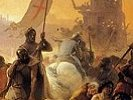

  
[Intangible Textual Heritage](../../index)  [Sub Rosa](../index.md) 
[Index](index)  [Previous](hkt12)  [Next](hkt14.md) 

------------------------------------------------------------------------

[Buy this Book on
Kindle](https://www.amazon.com/exec/obidos/ASIN/B002RHOUAK/internetsacredte.md)

------------------------------------------------------------------------

  
*The History of the Knights Templar*, by Charles G. Addison, \[1842\],
at Intangible Textual Heritage

------------------------------------------------------------------------

p. 289

### CHAPTER XI.

### THE TEMPLE CHURCH.

The restoration of the Temple Church--The beauty and
magnificence of the venerable building--The various styles of
architecture displayed in it--The discoveries made during the recent
restoration--The sacrarium--The marble piscina--The sacramental
niches--The penitential cell--The ancient Chapel of St. Anne--Historical
matters connected with the Temple Church--The holy relics anciently
preserved therein--The interesting monumental remains.

"If a day should come when pew lumber, preposterous
organ cases, and pagan altar screens, are declared to be unfashionable,
no religious building, stript of such nuisances, would come more fair to
the sight, or give more general satisfaction to the antiquary, than the
chaste and beautiful Temple Church. *Gentleman's Magazine* for May,
1808, p. 1087.

"AFTER three centuries of demolition, the solemn structures raised by
our Catholic ancestors are being gradually restored to somewhat of their
original appearance, and buildings, which, but a few years since, were
considered as unsightly and barbarous erections of ignorant times, are
now become the theme of general eulogy and models for imitation." [\*](#fn_458.md)

It has happily been reserved for the present generation, after a lapse
of two centuries, to see the venerable Temple Church, the

p. 290

chief ecclesiastical edifice of the Knights Templars in Britain, and the
most beautiful and perfect relic of the order now in existence, restored
to the simple majesty it possessed near seven hundred years ago; to see
it once again presenting the appearance which it wore when the patriarch
of Jerusalem exercised his sacred functions within its walls, and when
the mailed knights of the most holy order of the Temple of Solomon, the
sworn champions of the christian faith, unfolded the red-cross banner
amid, "the long-drawn aisles," and offered their swords upon the altar
to be blessed by the ministers of religion.

From the period of the reign of Charles the First down to our own times,
the Temple Church has remained sadly disfigured by incongruous
innovations and modern *embellishments*, which entirely changed the
antient character and appearance of the building, and clouded and
obscured its elegance and beauty.

Shortly after the Reformation, the Protestant lawyers, from an
over-anxious desire to efface all the emblems of the popish faith,
covered the gorgeously-painted ceiling of this venerable structure with
an uniform coating of simple whitewash; they buried the antique
tesselated pavement under hundreds of cart-loads of earth and rubbish,
on the surface of which, two feet above the level of the antient floor,
they placed another pavement, formed of old grave-stones. They,
moreover, disfigured all the magnificent marble columns with a thick
coating of plaster and paint, and destroyed the beauty of the
elaborately-wrought mouldings of the arches, and the exquisitely-carved
marble ornaments with thick incrustations of whitewash, clothing the
whole edifice in one uniform garb of plain white, in accordance with the
puritanical ideas of those times.

Subsequently, in the reign of Charles the Second, the fine open area of
the body of the church was filled with long rows of stiff and formal
pews, which concealed the bases of the columns, while

p. 291

the plain but handsome stone walls of the sacred edifice were
encumbered, to a height of eight feet from the ground, with oak
wainscoting, which was carried entirely round the church, so as to shut
out from view the elegant marble piscina on the south side of the
building, the interesting arched niches over the high altar, and the
sacrarium on the eastern side of the edifice. The elegant gothic arches
connecting the Round with the oblong portion of the building were filled
up with an oak screen and glass windows and doors, and with an
organ-gallery adorned with Corinthian columns and pilastres and Grecian
ornaments, which divided the building into two parts, altogether altered
its original character and appearance, and sadly marred its
architectural beauty. The eastern end of the church was, at the same
time, disfigured with an enormous altarpiece in the *classic* style,
decorated with Corinthian columns and Grecian cornices and entablatures,
and with enrichments of cherubims and wreaths of fruit, leaves, and
flowers, exquisitely carved and beautiful in themselves, but heavy and
cumbrous, and quite at variance with the gothic character of the
edifice. A huge pulpit and sounding-board, elaborately carved, were also
erected in the middle of the nave, forming a great obstruction to the
view of the interior of the building, and the walls and all the columns
were thickly clustered and disfigured with mural monuments.

All these unsightly and incongruous additions to the antient fabric
have, thanks to the good taste and the public spirit of the Masters of
the Benches of the societies of the Inner and Middle Temple, been
recently removed; the ceiling of the church has been repainted; the
marble columns and the tesselated pavement have been restored, and the
venerable structure has now been brought back to its antient condition.

The historical associations and recollections connected with the Temple
Church throw a powerful charm around the venerable

p. 292

building. During the holy fervour of the crusades, the kings of England
and the haughty legates of the pope were wont to mix with the armed
bands of the Templars in this their chief ecclesiastical edifice in
Britain. In the twelfth and thirteenth centuries some of the most
remarkable characters of the age were buried in the Round, and their
mail-clad marble monumental effigies, reposing side by side on the cold
pavement, still attract the III, wonder and admiration of the inquiring
stranger.

The solemn ceremonies attendant in days of yore upon the admission of a
novice to the holy vows of the Temple, conducted with closed doors
during the first watch of the night; the severe religious exercises
performed by the stern military friars; the vigils that were kept up at
night in the church, and the reputed terrors of the penitential cell,
all contributed in times past to throw an air of mystery and romance
around the sacred building, and to create in the minds of the vulgar a
feeling of awe and of superstitious terror, giving rise to those strange
and horrible tales of impiety and crime, of magic and sorcery, which led
to the unjust and infamous execution at the stake of the Grand Master
and many hundred Knights of the Temple, and to the suppression and
annihilation of their proud and powerful order.

The first and most interesting portion of the Temple Church, denominated
by the old writers "THE ROUND," was consecrated in the year 1185 by
Heraclius, the Patriarch of Jerusalem, on his arrival in England from
Palestine, as before mentioned, to obtain succour from king Henry the
Second against the formidable power of the famous Saladin. [\*](#fn_459.md) The old inscription which formerly
stood over the small door of the Round leading into the cloisters, and
which was broken and destroyed by the workmen whilst

p. 293

repairing the church, in the year 1695, was to the following effect:--

"On the 10th of February, in the year from the incarnation of our Lord
1185, this church was consecrated in honour of the blessed Mary by our
lord Heraclius, by the grace of God patriarch of the church of the
Resurrection, who hath granted an indulgence of fifty days to those
yearly seeking it." [\*](#fn_460.md)

The oblong portion of the church, which extendeth eastwards from the
Round, was consecrated on Ascension-day, A.D. 1240, as appears from the
following passage in the history of Matthew Paris, the monk of St.
Alban's, who was probably himself present at the ceremony.

"About the same time (A.D. 1240) was consecrated the noble church of the
New Temple at London, an edifice worthy to be seen, in the presence of
the king and much of the nobility of the kingdom, who, on the same day,
that is to say, the day of the Ascension, after the solemnities of the
consecration had been completed, royally feasted at a most magnificent
banquet, prepared at the expense of the Hospitallers." [†](#fn_461.md)

It was after the promulgation, A.D. 1162 and 1172, of the famous bull
*omne datum optimum*, exempting the Templars from the ordinary
ecclesiastical jurisdiction, and enabling them to admit priests and
chaplains into their order, and appoint them to

p. 294

their churches without installation and induction, and free from the
interference of the bishops, that the members of this proud and powerful
fraternity began to erect at great cost, in various parts of
Christendom, churches of vast splendour and magnificence, like the one
we now see at London. It is probable that the earlier portion of this
edifice was commenced immediately after the publication of the above
bull, so as to be ready (as churches took a long time in building in
those days) for consecration by the Patriarch on his arrival in England
with the Grand Master of the Temple.

As there is a difference in respect of the time of the erection, so also
is there a variation in the style of the architecture of the round and
oblong portions of the church; the one presenting to us a most beautiful
and interesting specimen of that mixed style of ecclesiastical
architecture termed the semi-Norman, and by some writers the
intermediate, when the rounded arch and the short and massive column
became mingled with, and were gradually giving way to, the early Gothic;
and the other affording to us a pure and most elegant example of the
latter style of architecture, with its pointed arches and light slender
columns. These two portions of the Temple Church, indeed, when compared
together, present features of peculiar interest to the architect and the
antiquary. The oblong portion of the venerable fabric affords, perhaps,
the first specimen of the complete conquest of the pointed style over
the massive circular or Norman architecture which preceded its erection,
whilst the Round displays the different changes which the latter style
underwent previous to its final subversion.

The Temple Church is entered by a beautiful semicircular arched doorway,
an exquisite specimen of the Norman style of architecture, still
unfortunately surrounded and smothered by the smoke-dried buildings of
studious lawyers. It is deeply

p. 295

recessed and ornamented on either side with columns bearing foliated
capitals, from whence spring a series of arched mouldings, richly carved
and decorated. Between these columns project angular piers enriched with
lozenges, roses, foliage, and ornaments of varied pattern and curious
device. The upper part of these piers between the capitals of the
columns is hollowed out, and carved half-length human figures,
representing a king and queen, monks and saints, have been inserted.
Some of these figures hold scrolls of paper in their hands, and others
rest in the attitude of prayer. Over them, between the ribs of the arch,
are four rows of enriched foliage springing from the mouths of human
heads.

Having passed this elegant and elaborately-wrought doorway, we enter
that portion of the church called by the old writers

**The Round,**

which consists of an inner circular area formed by a round tower resting
on six clustered columns, and of a circular external aisle or cloister,
connected with the round tower by a sloping roof on the outside, and
internally by a groined vaulted ceiling. The beauty and elegance of the
building from this point, with its circular colonnades, storied windows,
and long perspective of architectural magnificence, cannot be
described--it must be seen.

From the centre of the Round, the eye is carried upward to the vaulted
ceiling of the inner circular tower with its groined ribs and carved
bosses. This tower rests on six clustered marble columns, from whence
spring six pointed arches enriched with numerous mouldings. The
clustered columns are composed of four marble shafts, surmounted by
foliated capitals, which are

p. 296

each of a different pattern, but correspond in the general outline, and
display great character and beauty. These shafts are connected together
by bands at their centres; and the bases and capitals run into each
other, so as to form the whole into one column. Immediately above the
arches resting on these columns, is a small band or cornice, which
extends around the interior of the tower, and supports a most elegant
arcade of interlaced arches. This arcade is formed of numerous small
Purbeck marble columns, enriched with ornamented bases and capitals,
from whence spring a series of arches which intersect one another, and
produce a most pleasing and striking combination of the round and
pointed arch. Above this elegant arcade is another cornice surmounted by
six circular-headed windows pierced at equal intervals through the thick
walls of the tower. These windows are ornamented at the angles with
small columns, and in the time of the Knights Templars they were filled
with stained glass. Between each window is a long slender circular shaft
of Purbeck marble, which springs from the clustered columns, and
terminates in a bold foliated capital, whereon rest the groined ribs of
the ceiling of the tower.

From the tower, with its marble columns, interlaced arches, and elegant
decorations, the attention will speedily be drawn to the innumerable
small columns, pointed arches, and grotesque human countenances which
extend around the lower portion of the external aisle or cloister
encircling the Round. The more these human countenances are scrutinised,
the more astonishing and extraordinary do they appear. They seem for the
most part distorted and agonised with pain, and have been supposed, not
without reason, to represent the writhings and grimaces of the damned.
Unclean beasts may be observed gnawing the ears and tearing with their
claws the bald heads of some of them, whose firmly-compressed teeth and
quivering lips plainly denote intense

p. 297

bodily anguish. These sculptured visages display an astonishing variety
of character, and will be regarded with increased interest when it is
remembered, that an arcade and cornice decorated in this singular manner
have been observed among the ruins of the Temple churches at Acre, and
in the Pilgrim's Castle. This circular aisle or cloister is lighted by a
series of semicircular-headed windows, which are ornamented at the
angles with small columns.

Over the western doorway leading into the Round, is a beautiful Norman
wheel-window, which was uncovered and brought to light by the workmen
during the recent reparation of this interesting building. It is
considered a masterpiece of masonry.

The entrance from the Round to the oblong portion of the Temple Church
is formed by three lofty pointed arches, which open upon the nave and
the two aisles. The mouldings of these arches display great beauty and
elegance, and the central arch, which forms the grand entrance to the
nave, is supported upon magnificent Purbeck marble columns.

Having passed through one of these elegant and richly-embellished
archways, we enter a large, lofty, and light structure, consisting of a
nave and two aisles of equal height, formed by eight clustered marble
columns, which support a groined vaulted ceiling richly and elaborately
painted. This chaste and graceful edifice presents to us one of the most
pure and beautiful examples in existence of the early pointed style,
which immediately succeeded the mixed order of architecture visible in
the Round. The numerous elegantly-shaped windows which extend around
this portion of the building, the exquisite proportions of the slim
marble columns, the beauty and richness of the architectural
decorations, and the extreme lightness and airiness of the whole
structure, give us the idea of a fairy palace.

The marble columns supporting the pointed arches of the

p. 298

roof, four in number on each side, do not consist of independent shafts
banded together, as in the Round, but form solid pillars which possess
vast elegance and beauty. Attached to the walls of the church, in a line
with these pillars, are a series of small clustered columns, composed of
three slender shafts, the central one being of Purbeck marble, and the
others of Caen stone; they are bound together by a band at their centres
and their bases, which are of Purbeck marble, rest on a stone seat or
plinth, which extends the whole length of the body of the church. These
clustered columns, which are placed parallel to the large central
pillars, are surmounted by foliated capitals, from whence spring the
groined ribs which traverse the vaulted ceiling of the roof. The side
walls are thus divided into five compartments on either side, which are
each filled up with a triple lancet-headed window, of a graceful form,
and richly ornamented. It is composed of three long narrow openings
surmounted by pointed arches, the central arch rising above the lateral
ones. The mouldings of the arches rest upon four slender marble columns
which run up in front of the stone mullions of the windows, and impart
to them great elegance and beauty. The great number of these windows,
and the small intervening spaces of blank wall between them, give a vast
lightness and airiness to the whole structure.

Immediately beneath them is a small cornice or stringing course of
Purbeck marble, which runs entirely round the body of the church, and
supports the small marble columns which adorn the windows.

The roof is composed of a series of pointed arches supported by groined
ribs, which, diverging from the capitals of the columns, cross one
another at the centre of the arch, and are ornamented at the point of
intersection with richly-carved bosses. This roof is composed
principally of chalk, and previous to the late restoration, had a plain
and somewhat naked appearance, being covered

p. 299

with an uniform coat of humble whitewash. On the recent removal of this
whitewash, extensive remains of an ancient painted ceiling were brought
to light, and it was consequently determined to repaint the entire roof
of the body of the church according to a design furnished by Mr.
Willement.

At the eastern end of the church are three elegant windows opening upon
the three aisles; they are similar in form to the side windows, but the
central one is considerably larger than any of the others, and has in
the spandrels formed by the line of groining two small quatrefoil
panels. The label mouldings on either side of this central window
terminate in two crowned heads, which are supposed to represent king
Henry the Third and his queen. These windows are to be filled with
stained glass as in the olden time, and will, when finished, present a
most gorgeous and magnificent appearance. Immediately beneath them,
above the high altar, are three niches, in which were deposited in days
of yore the sacred vessels used during the celebration of the mass. The
central recess, surmounted by a rounded arch, contained the golden
chalice and patin covered with the veil and bursa; and the niches on
either side received the silver cruets, the ampullæ, the subdeacon's
veil, and all the paraphernalia used during the sacrament. In the
stonework around them may be observed the marks of the locks and
fastenings of doors.

These niches were uncovered and brought to light on the removal of the
large heavy oak screen and altar-piece, which disfigured the eastern end
of the church.

On the southern side of the building, near the high altar, is an elegant
marble *piscina* or *lavacrum*, which was in like manner discovered on
pulling down the modern oak wainscoting. This interesting remnant of
antiquity has been beautifully restored,

p. 300

and well merits attention. It was constructed for the use of the priest
who officiated at the adjoining altar, and was intended to receive the
water in which the chalice had been rinsed, and in which the priest
washed his hands before the consecration of the bread and wine. It
consists of two perforated hollows or small basins, inclosed in an
elegant marble niche, adorned with two graceful arches, which rest on
small marble columns. The holes at the bottom of the basins communicate
with two conduits or channels for draining off the water, which
antiently made its exit through the thick walls of the church. In the
olden time, before the consecration of the host, the priest walked to
the piscina, accompanied by the clerk, who poured water over his hands,
that they might be purified from all stain before he ventured to touch
the body of our Lord. One of these channels was intended to receive the
water in which the priest washed his hands, and the other that in which
he had rinsed the chalice. The piscina, consequently, served the
purposes of a sink. [\*](#fn_462.md)

Adjoining the piscina, towards the eastern end of the church, is a small
elegant niche, in which the ewer, basin, and towels were placed; and
immediately opposite, in the north wall of the edifice, is another
niche, which appears to have been a *sacrarium* or tabernacle for
holding the eucharist preserved for the use of the sick brethren. [†](#fn_463.md)

In the centre of the northern aisle of the church, a large recess has
been erected for the reception of the organ, as no convenient place
could be found for it in the old structure. Below this recess, by the
side of the archway communicating with the Round,

p. 301

is a small Norman doorway, opening upon a dark circular staircase which
leads to the summit of the round tower, and also to

THE PENITENTIAL CELL.

This dreary place of solitary confinement is formed within the thick
wall of the church, and is only four feet six inches long, and two feet
six inches wide, so that it would be impossible for a grown person to
lie down with any degree of comfort within it. Two small apertures, or
loopholes, four feet high and nine inches wide, have been pierced
through the walls to admit light and air. One of these apertures looks
eastward into the body of the church towards the spot where stood the
high altar, in order that the prisoner might see and hear the
performance of divine service, and the other looks southward into the
Round, facing the west entrance of the church. The hinges and catch of a
door, firmly attached to the doorway of this dreary prison, still
remain, and at the bottom of the staircase is a atone recess or
cupboard, where bread and water were placed for the prisoner.

In this miserable cell were confined the refractory and disobedient
brethren of the Temple, and those who were enjoined severe penance with
solitary confinement. Its dark secrets have long since been buried in
the silence of the tomb, but one sad tale of misery and horror, probably
connected with it, has been brought to light.

Several of the brethren of the Temple at London, who were examined
before the papal inquisitors, tell us of the miserable death of Brother
Walter le Bacheler, Knight, Grand Preceptor of Ireland, who, for
disobedience to his superior the Master of the Temple, was fettered and
cast into prison, and there expired from the rigour and severity of his
confinement. His dead body was taken out of the solitary cell in the
Temple at morning's

p. 302

dawn, and was buried by Brother John de Stoke and Brother Radulph de
Barton, in the midst of the court, between the church and the
hall. [\*](#fn_464.md)

The discipline of the Temple was strict and austere to an extreme. An
eye-witness tells us that disobedient brethren were confined in chains
and dungeons for a longer or a shorter period, or perpetually, according
as it might seem expedient, in order that their souls might be saved at
the last from the eternal prison of hell. [†](#fn_465.md) In addition to imprisonment, the
Templars were scourged on their bare backs, by the hand of the Master
himself, in the Temple Hall, and were frequently whipped on Sundays in
the church, in the presence of the whole congregation.

Brother Adam de Valaincourt, a knight of a noble family, quitted the
order of the Temple, but afterwards returned, smitten with remorse for
his disobedience, and sought to be admitted to the society of his
quondam brethren. He was compelled by the Master to eat for a year on
the ground with the dogs; to fast four days in the week on bread and
water, and every Sunday to present himself naked in the church before
the high altar, and receive the discipline at the hands of the
officiating priest, in the presence of the whole congregation. [‡](#fn_466.md)

On the opposite side of the church, corresponding with the doorway and
staircase leading to the penitential cell, there was formerly another
doorway and staircase communicating with a very curious antient
structure, called the chapel of St. Anne, which stood on the south side
of the Round, but was removed during the repairs in 1827. It was two
stories in height. The lower story communicated with the Round through a
doorway formed under one of the arches of the arcade, and the upper

p. 303

story communicated with the body of the church by the before-mentioned
doorway and staircase, which have been recently stopped up. The roofs of
these apartments were vaulted, and traversed by cross-ribs of stone,
ornamented with bosses at the point of intersection. [\*](#fn_467.md) This chapel antiently opened upon the
cloisters, and formed a private medium of communication between the
convent of the Temple and the church. It was here that the papal legate
and the English bishops frequently had conferences respecting the
affairs of the English clergy, and in this chapel Almaric de Montforte,
the pope's chaplain, who had been imprisoned by king Edward the First,
was set at liberty at the instance of the Roman pontiff, in the presence
of the archbishop of Canterbury, and the Bishops of London, Lincoln,
Bath, Worcester, Norwich, Oxford, and several other prelates, and of
many distinguished laymen; the said Almeric having previously taken an
oath that he would forthwith leave the kingdom, never more to return
without express permission. [†](#fn_468.md) In
times past, this chapel of St. Anne, situate on the south of "the round
about walles," was widely celebrated for its productive powers. It was
resorted to by barren women, and was of great repute for making them
"joyful mothers of children!" [‡](#fn_469.md)

There were formerly numerous priests attached to the Temple church, the
chief of whom was styled *custos* or guardian of the sacred edifice.
King Henry the Third, for the salvation of his own soul, and the souls
of his ancestors and heirs, gave to the Templars eight pounds per annum,
to be paid out of the exchequer,

p. 304

for the maintenance of three chaplains in the Temple to say mass daily
for ever; one was to pray in the church for the king himself, another
for all christian people, and the third for the faithful departed. [\*](#fn_470.md) Idonea de Veteri Ponte also gave
thirteen bovates of her land, at Ostrefeld, for the support of a
chaplain in the house of the Temple at London, to pray for her own soul
and that of her deceased husband, Robert de Veteri Ponte. [†](#fn_471.md)

The *custos* or guardian of the Temple church was appointed by the
Master and Chapter of the Temple, and entered upon his spiritual duties,
as did all the priests and chaplains of the order, without any
admission, institution, or induction. He was exempt from the ordinary
ecclesiastical authority, and was to pay perfect obedience in all
matters, and upon all occasions, to the Master of the Temple, as his
lord and bishop. The priests of the order took precisely the same vows
as the rest of the brethren, and enjoyed no privileges above their
fellows. They remained, indeed, in complete subjection to the knights,
for they were not allowed to take part in the consultations of the
chapter, unless they had been enjoined so to do, nor could they occupy
themselves with the cure of souls unless required. The Templars were not
permitted to confess to priests who were strangers to the order, without
leave so to do.

"*Et les freres chapeleins du Temple dovinent oyr la confession des
freres, ne nul ne se deit confesser a autre chapelein saunz counge, car
it ount greigneur poer du Pape, de els assoudre que un evesque*."

The particular chapters of the Master of the Temple, in which
transgressions were acknowledged, penances were enjoined, and quarrels
were made up, were frequently held on a Sunday morning

p. 305

in the above chapel of St. Anne, on the south side of the Temple church,
when the following curious form of absolution was pronounced by the
Master of the Temple in the Norman French of that day.

"La manere de tenir chapitre e d’assoudre."

"Apres chapitre dira le mestre, ou cely qe tendra le chapitre. 'Beaus
seigneurs freres, le pardon de nostre chapitre est tiels, qe cil qui
ostast les almones de la meson a tout e male resoun, ou tenist aucune
chose en noun de propre, ne prendreit u tens ou pardoun de nostre
chapitre. Mes toutes les choses qe vous lessez a dire pour hounte de la
char, ou pour poour de la justice de la mesoun qe lein ne la prenge
requer Dieu, e de par la poeste, que nostre sire otria a sein pere, la
quele nostre pere le pape lieu tenaunt a terre a otrye a la maison, e a
noz sovereyns, e nous de par Dieu, e de par nostre mestre, e de tout
nostre chapitre tiel pardoun come ieo vous puis fere, ieo la vous faz,
de bon quer, e de bone volonte. E prioms nostre sire, qe issi veraiement
come il pardona a la glorieuse Magdaléyne, quant ele plura ses pechez. E
al larron en la croiz mis pardona il ses pechez, e a vous face les vos a
pardone a moy les miens. Et pry vous que se ieo ouges meffis oudis a mil
de vous que vous depleise que vous le me pardonez.'" [\*](#fn_472.md)

At the close of the chapter, the Master or the President of the chapter
shall say, "Good and noble brethren, the pardon of our chapter is such,
that he who unjustly maketh away with the alms of the house, or holdeth
anything as his own property, hath no part in the pardon of our chapter,
or in the good works of our house. But those things which through
shame-facedness, or through fear of the justice of the order, you have
neglected to confess before God, I, by the power which our Lord obtained
from his Father, and which our father the pope, his vicar, has

p. 306

granted to the house, and to our superiors, and to us, by the authority
of God and our Master, and all our chapter, grant unto you, with hearty
good will, such pardon as I am able to give. And we beseech our Lord,
that as he forgave the glorious Mary Magdalene when she bewailed her
sins, and pardoned the robber on the cross, that he will in like manner
mercifully pardon both you and me. And if I have wronged any of you, I
beseech you to grant me forgiveness."

The Temple Church in times past contained many holy and valuable relics,
which had been sent over by the Templars from Palestine. Numerous
indulgences were granted by the bishops of London to all devout
Christians who went with a lively faith to adore these relics. The
bishop of Ely also granted indulgences to all the faithful of his
diocese, and to all pious Christians who attended divine worship in the
Temple Church, to the honour and praise of God, and his glorious mother
the Virgin Mary, the resplendent Queen of Heaven, and also to all such
as should contribute, out of their goods and possessions, to the
maintenance and support of the lights which were kept eternally upon the
altars. [\*](#fn_473.md)

The circular form of the oldest portion of the Temple Church imparts an
additional interest to the venerable fabric, as there are only three
other ancient churches in England of this shape. It has been stated that
all the churches of the Templars were built in the circular form, after
the model of the church of the holy sepulchre at Jerusalem; but this was
not the case. The numerous remains of these churches, to be met with in
various parts of Christendom, prove them to have been built of all
shapes, forms, and sizes.

We must now say a word concerning the ancient monuments in the Temple
Church.

p. 307

In a recess in the south wall, close to the elegant marble piscina,
reposes the recumbent figure of a bishop clad in pontifical robes,
having a mitre on his head and a crosier in his hand. It rests upon an
altar-tomb, and has been beautifully carved out of a single block of
Purbeck marble. On the 7th of September, 1810, this tomb was opened, and
beneath the figure was found a stone coffin, about three feet in height
and ten feet in length, having a circular cavity to receive the head of
the corpse. Within the coffin was found a human skeleton in a state of
perfect preservation. It was wrapped in sheet-lead, part of which had
perished. On the left side of the skeleton were the remains of a
crosier, and among the bones and around the skull were found fragments
of sackcloth and of garments wrought with gold tissue. It was evident
that the tomb had been previously violated, as the sheet-lead had been
divided longitudinally with some coarse cutting instrument, and the
bones within it had been displaced from their proper position. The most
remarkable discovery made on the opening of this tomb was that of the
skeleton of an infant a very few months old, which was found lying at
the feet of the bishop.

Nichols, the antiquary, tells us that Brown Willis ascribed the above
monument to Silvester de Everdon, bishop of Carlisle, who was killed in
the year 1255 by a fall from a mettlesome horse, and was buried in the
Temple Church. [\*](#fn_474.md)

All the monumental remains of the ancient Knights Templars, formerly
existing in the Temple Church, have unfortunately long since been
utterly destroyed. Burton, the antiquary, who was admitted a member of
the Inner Temple in the reign of Queen Elizabeth, on the 20th of May,
1593, tells us that in the body of the church there was "a large blue
marble inlaid with brasse,"

p. 308

with this circumscription--"Hic requiescit Constantius de Houerio,
quondam visitator generalis ordinis militiæ Templi in Angliâ, Franciâ,
et Italia." [\*](#fn_475.md) 'Here lies Constance
de Hover, formerly visitor-general of the order of the Temple, in
England, France, and Italy." Not a vestige of this interesting monument
now remains. During the recent excavation in the churchyard for the
foundations of the new organ gallery, two very large stone coffins were
found at a great depth below the present surface, which doubtless
enclosed the mortal remains of distinguished Templars. The churchyard
appears to abound in ancient stone coffins.

In the Round of the Temple Church, the oldest part of the present
fabric, are the famous monuments of secular warriors, with their legs
crossed, in token that they had assumed the cross, and taken the vow to
march to the defence of the christian faith in Palestine. These
cross-legged effigies have consequently been termed "the monuments of
the crusaders," and are so singular and interesting, that a separate
chapter must be devoted to the consideration of them.

------------------------------------------------------------------------

### Footnotes

[289:\*](hkt13.htm#fr_458.md) *Dublin Review* for
May, 1841, p. 301.

[292:\*](hkt13.htm#fr_459.md) See ante, [p.
80](hkt06.htm#page_80.md). On the 10th of March, before his departure from
this country, Heraclius consecrated the church of the Hospitallers at
Clerkenwell, and the altars of St. John and St. Mary. Ex registr. S.
John Jerus. in Bib. Cotton, fol. 1.

[293:\*](hkt13.htm#fr_460.md) A fac-simile of this
inscription was faithfully delineated by Mr. Geo. Holmes, the antiquary,
and was published by Strype, A.D. 1670. The earliest copy I have been
able to find of it is in a manuscript history of the Temple, in the
Inner Temple library, supposed to have been written at the commencement
of the reign of Charles the First by John Wilde, Esq., a bencher of the
society, and Lent reader in the year 1630.

[293:†](hkt13.htm#fr_461.md) Tempore quoque sub
eodem (A.D. 1240) dedicate est nobilis ecclesia, structuræ aspectabilis
Novi Templi *Londinensis*, præsente Rege et multis regni Magnatibus; qui
eodem die, scilicet die Ascensionis, completis dedicationis solemniis,
convivium in mensâ nimis laute celebrarunt, sumptibus
Hospitaliorum.--*Matt. Par.* ad ann. 1240, p. 526, ed. 1640.

[300:\*](hkt13.htm#fr_462.md) A large piscina,
similar to the one in the Temple Church, may be seen in Cowling church,
Kent. *Archæologia*, vol. xi. pl. xiv. p. 320.

[300:†](hkt13.htm#fr_463.md) Ib. p. 347 to 359.

[302:\*](hkt13.htm#fr_464.md) *Acta contra
Templarios*. *Concil. Mag. Brit.* tom. ii. p. 336, 350, 351.

[302:†](hkt13.htm#fr_465.md) *Jac. de Vitr.* *De*
Religione fratrum militiæ Templi, cap. 65.

[302:‡](hkt13.htm#fr_466.md) *Processus contra
Templarios*, apud Dupuy, p. 65; ed. 1700.

[303:\*](hkt13.htm#fr_467.md) See the plan of this
chapel and of the Temple Church, in the vetusta monuments of the Society
of Antiquaries.

[303:†](hkt13.htm#fr_468.md) Acta fuerunt hæc in
capellâ juxta ecclesiam, apud Novum Templum London, ex parte Australi
ipsius ecclesiæ sitâ, coram reverendis patribus domino archiepiscopo et
episcopis, &c. &. Acta *Rymeri*, tom. ii. p. 193, ad ann. 1282.

[303:‡](hkt13.htm#fr_469.md) Anecdotes and
Traditions published by the Camden Society. No. clxxxi. p. 110.

[304:\*](hkt13.htm#fr_470.md) De tribus Capellanis
inveniendis, apud Novum Templum, Londoniarum, pro animâ Regis Henrici
Tertii. Ex regist Hosp. S. Johannis Jerus. in Anglia. Bib. Cotton, f.
25. a.

[304:†](hkt13.htm#fr_471.md) Ibid., 30. b.

[305:\*](hkt13.htm#fr_472.md) *Acta contra
Templarios*. Concil. Mag. Brit., tom. ii. p. 383.

[306:\*](hkt13.htm#fr_473.md) E registro mun.
eviden. Prior. Hosp. Sanc. Joh. fol. 23, b.; fo. 24, a.

[307:\*](hkt13.htm#fr_474.md) *Nicholls’* Hist.
Leicestershire, vol. iii. p. 960, note. *Malcolm*, Londinium Redivivum,
vol. ii. p. 294.

[308:\*](hkt13.htm#fr_475.md) *Burton's*
Leicestershire, p. 235, 236.

------------------------------------------------------------------------

[Next: Chapter XII](hkt14.md)

