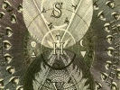

  
[Intangible Textual Heritage](../../index)  [Sub Rosa](../index.md) 
[Index](index)  [Previous](mhj301)  [Next](mhj303.md) 

------------------------------------------------------------------------

[Buy this Book at
Amazon.com](https://www.amazon.com/exec/obidos/ASIN/B0021YV3F4/internetsacredte.md)

------------------------------------------------------------------------

  
*Code of the Illuminati: Part III of Memoirs Illustrating the History of
Jacobinism*, by A Barruel, tr. Robert Edward Clifford \[1798\], at
Intangible Textual Heritage

------------------------------------------------------------------------

p. 400

### CHAP. I.

#### Spartacus-Weishaupt, Founder of the Illuminees.

There sometimes appear men formed with
such unhappy dispositions, that we are led to consider them in no other
view than as emanations from the evil genius, bereft by the avenging God
of the power of doing good. Imbecil in the sphere of wisdom, such men
are only efficient in the arts of vice and destruction; they are
ingenious in those conceptions, skilful in that cunning, and fruitful in
those resources which enable them despotically to reign in the schools
of falsehood, depravity, and wickedness. In competition with the
Sophisters, these men will surpass them in the arts of exhibiting error
in false and delusive colours; of disguising the vicious passions under
the mask of virtue; and of clothing impiety in the garb of Philosophy.
In the den of conspirators they are pre-eminent by the atrocity of their
deeds; they excel in the arts of preparing revolutions, and of combining
the downfal of the Altar with that of Empires. If their career be ever
impeded, it is only when they approach the paths of virtue and of real
science. When Heaven in its wrath permits a being of this species to
appear on the earth, it has only to put nations within the sphere of his
activity, and it will be awfully avenged.

With such qualities, and under such auspices, was born in Bavaria, about
the year 1748, Adam Weishaupt, better
known in the annals of the sect by the name of Spartacus. To the eternal shame of his Serene
protector, this impious man, heretofore Professor of Law at the
University of Ingolstadt, but now banished from his country as a traitor
to his Prince and to the whole universe, peacefully at the court of
Ernest Lewis, Duke of Saxe Gotha, enjoys an asylum, receives a pension
from the public treasury, and is dignified with the title of Honorary
Counsellor to that Prince.

An odious phenomenon in nature, an Atheist void of remorse, a profound
hypocrite, destitute of those superior talents which lead to the
vindication of truth, he is possessed of all that energy and ardour in
vice which generates conspirators for impiety and anarchy. Shunning,
like the ill-boding owl, the genial rays of the sun, he wraps around him
the mantle of darkness; and history shall record of him, as of the evil
spirit, only the black deeds which he planned or executed. Of mean
birth, his youth was passed in obscurity, and but a single trait of his
private life has pierced the cloud in

p. 401

which he had enveloped himself—but it is one of hateful depravity and of
the most consummate villany.—Incestuous Sophister! it was the widow of
his brother whom he seduced.—Atrocious father! it was for the murder of
his offspring that he solicited poison and the dagger.—Execrable
hypocrite! he implored, he conjured both art and friendship to destroy
the innocent victim, the child whose birth must betray the morals of his
father. The scandal from which he shrinks is not that of his crime; it
is (he says and writes it himself) the scandal which, publishing of the
depravity of his heart, would deprive him of that authority by which,
under the cloak of virtue, he plunged youth into vice and
error.—Monstrous Sophister! he accuses the devils of not having skreened
him from this scandal by those abominations which called the vengeance
of the God of Nature on the son of Judah.—Then, impudently daring, he
perjures himself; he calls every thing that is sacred to witness, that
neither he nor his friends ever knew of the existence of those poisons
or secret means of skreening him from infamy, much less that they had
ever proposed, sought, or employed them. He challenges, and at length
forces, the magistrates to prove the accusation; they produce the
letters of the perjured Sophister, and therein we behold him entreating
a first, a second, and even a third confidant, to seek, or cause to be
sought, and to communicate to him, these horrid arts. We see him
recalling promises of three years standing with respect to these means.
He complains of the little success of his attempts, he accuses the
agents of timidity or of ignorance; he entreats and conjures them to
renew their attempts, telling them, that it was not yet too late, but
that expedition was necessary. Who can paint the depravity of this
single trait. How monstrous the being who could have combined such
depravity! That the God who humiliates the Sophister should have
permitted this single trait to have been brought to light, will suffice
to show how far wickedness may be carried by the man who, with virtue on
his tongue, and under the shade of that sacred name, was forming and
fanaticising the blood-thirsty legions of a Robespierre.

After so shocking an accusation the reader will naturally expect us to
produce incontrovertible proofs. We will, therefore, first lay before
him the letter of *Weishaupt* to his adept *Hertel*; it is the Third
Letter in the Second Volume of the *Original Writings* of the
*Illuminees* in Bavaria.

"Now," says Weishaupt to this adept, "let me, under the most profound
secrecy, lay open the situation of my heart. It destroys my rest, it
render me incapable of every thing. I am almost desperate. My honour is
in danger, and I am on the eve of losing *that reputation which gave me
so great an authority over our people. My sister-in-law is with child*.
I have sent her to Athens (Munich) to *Euriphon*, to solicit a marriage
licence from Rome. You see how necessary it is that she should succeed,
and that without loss of time; every moment is precious. But should she
fail, what shall I do?—How shall I restore the honour of a person who is
the victim of a crime that is wholly mine? *We have already made several
attempts to destroy the child*; she was determined to undergo all; but
*Euriphon* is too timid. Yet I scarcely see any other expedient. Could I
depend on *Celse's* secrecy (the professor Bader at Munich), he could be
of great service

p. 402

to me; *he had promised me his aid three years ago*. Mention it to him
if you think proper. See what can be done. I should be sorry that Cato
knew any thing of it, lest he should tell all his friends. If you could
extricate me from this unfortunate step, you would restore me to life,
to honour, to rest, and to authority (that is over his people). If you
cannot, I forewarn you of it, I will hazard a desperate blow, for I
neither can nor will lose my honour. I know not what devil". . . .
\[Here decency obliges us to be silent; but he continues\] "As yet
nobody knows any thing of it but *Euriphon*; it is not too late to make
an attempt, for she is only in her fourth month, and the worst of it is,
that it is a criminal case, and that alone makes the greatest efforts
and the most extreme (or boldest) resolution necesssary. Be well and
live happier than I do, and do think of some means which can extricate
me from this affair. I am yours, &c. Spartacus."

Notwithstanding his repugnance to let Cato into the secret, Weishaupt is
at length obliged to write to him on the subject, and, after repeating
that which through decency we have omitted above, this monster of
hypocrisy says, "what vexes me the most in all this, is *that my
authority over our people will be greatly diminished*—that I have
exposed a weak side, of which they will not fail to advantage themselves
whenever I may preach morality, and exhort them to virtue and
modesty." [1](#fn_10.md)

Now let us observe the same Weishaupt barefacedly saying in his apology,
"I think and declare before God (and I wish this writing to be looked
upon as a most solemn declaration), that in all my life I have never
heard of those secret means (of abortion) nor of those poisons; that I
have never seen nor had knowledge of any occasion when I or my friends
could even have thought of advising, administering, or making any use
whatever of them. *And this I say in testimony and affirmation of the
truth*." [2](#fn_11.md) It is thus that by the most
abominable hypocrisy he sustains a barefaced and detestable perjury.

So much for the moral virtue of this man; but our chief object is, to
consider him in his character of a Conspirator. Let us then descend into
that baleful abyss, and observe him in the schools of impiety,
rebellion, and anarchy. Here again he appears to have been ignorant of
the gradations of crime, of the space that lies between the slightest
deviation from rectitude and the most profound wickedness. Here,
scarcely have the magistrates cast their eyes upon him when they find
him at the head of a conspiracy which, when compared with those of the
clubs of Voltaire and D’Alembert, or with the secret committees of
D’Orleans, make these latter appear like the faint imitations of
puerility, and show the Sophister and the Brigand as mere novices in the
arts of revolution. It is not known, and it would be difficult to
discover, whether *Weishaupt* ever had a master, or whether he is
himself the great original of those monstrous doctrines on which he
founded his school. There exists, however, a tradition which on the
authority of some of his adepts we shall lay before the reader.

According to this tradition, a Jutland merchant, who had lived some time
in Egypt, began in the year 1771 to overrun Europe, pretending to
initiate

p. 403

adepts in the antient mysteries of Memphis. But from more exact
information I have learned that he stopped for some time at Malta, where
the only mysteries which he taught were the disorganizing tenets of the
antient Illuminees, of the *adopted slave*; and these he sedulously
infused into the minds of the people. These principles began to expand,
and the island was already threatened with revolutionary confusion, when
the Knights very wisely obliged our modern Illuminee to seek his safety
in flight. The famous Count (or rather mountebank) Cagliostro is said to
have been a disciple of his, as well as some other adepts famous for
their Illuminism in the county of Avignon and at Lyons. In his
peregrinations, it is said, he met with Weishaupt, and initiated him in
his mysteries. If impiety and secrecy could entitle a person to such an
initiation, never had any man better claims than Weishaupt. More artful
and wicked than Cagliostro, he knew how to direct them among his
disciples to very different ends.

Whatever may have been the fact with respect to this first master, it is
very certain that Weishaupt needed none. In an age when every kind of
error had taken root, he did what is naturally to be expected from men
who, guided by their unhappy bias, both in religious and political
opinions, always select the most abominable. He must have had some
notion of the ancient Illuminées, for he adopted their name, and the
disorganizing principles of their horrid system. These notions were then
[strengthened](errata.htm#2.md), without doubt, by his favorite application
to the disorganizing mysteries of Manichæism, since we may observe him
recommending the study of them to his disciples as a preparatory step
for, and as having a close connection with, those for which he was
preparing them. [3](#fn_12.md) But perfect Atheist
as he was, and scorning every idea of a God, he soon despised the
twofold God of Antient Illuminism, and adopted the doctrines of Manes
only in as much as they threatened every government, and led to
universal anarchy. He was acquainted with the systems of the modern
Sophisters; but, notwithstanding all their democracy, he did not think
they had given sufficient latitude to their systems of Liberty and
Equality. He only adopted their hatred for God, or pure Atheism. One
class led to the destruction of all civil and political laws, the other
to the overthrow of all religion; he combined them both, and formed a
monstrous digest, whose object was the most absolute, the most ardent,
the most frantic vow to overthrow, without exception, every religion,
every government, and *all property whatsoever*. He pleased himself with
the idea of a distant possibility that he might infuse the same wish
throughout the world; he even assured himself of success.

With the talents of a vulgar Sophister such a hope would have been the
summit of folly; but with a genius like that of Weishaupt, formed for
great crimes, it was the confidence of unlimited wickedness. The
Bavarian Sophister knew his powers; he believed no crime impossible; he
only sought to combine them all to reduce his systems to practice. The
mediocrity of his fortune had obliged him to consecrate the latter years
of his education to the study of the laws. Whether by dissimulation he
concealed the plans fostered in his breast,

p. 404

or whether he had not as yet digested them all, he however found means
of getting himself named to the chair of Laws in the University of
Ingolstadt, before he had attained his twenty-eighth year. On the 10th
of March, 1778, he writes to *Zwack* that he was not yet thirty years of
age; and in the same letter he informs him, under secrecy, of his future
projects on Illuminism, which he had founded two years before.

He must have known himself possessed of profound dissimulation; he must
have been master of strange resources, to ground his plans for the
subversion of all laws throughout all empires, on the very function of
public interpreter of the law. It was nevertheless at the college of
Ingolstadt that Weishaupt, affecting the greatest zeal for his duty,
conceived himself to be admirably [situated](errata.htm#3.md) for forming
and conducting by invisible means the great revolution which he had
planned. He justly estimated the influence which his office of teacher
gave him over his scholars, and he had the courage to supply in private
the *deficiency* of those lessons which he was obliged to give to them
in public.

But it would have been too poor a conquest for Anarchy or Impiety to
have gained only those who were under the eye of the founder. Weishaupt
beheld mankind subject to religious and political laws from pole to
pole, and his jealous zeal weighed the means which the saints had
employed to extend the faith of Christ. There still existed the
scattered remnants of an Order which the imprudent policy of Kings had
obliged the Sovereign Pontiff to sacrifice to the machinations of a
Philosophism, the professed enemy of both Kings and Pontiffs. Weishaupt
knew how to appreciate the support which the laws had acquired from men
who were heretofore spread throughout all Catholic countries, and who,
in the towns and villages, publicly taught youth, thundered from the
pulpit against vice, directed Christians toward the path of virtue, and
went to preach the faith of Christ to idolatrous and barbarous nations.
He well knew how much empires were indebted to religious Orders, that in
preaching the duty which each man owed to his God, strengthened the ties
that bound him to his neighbour and to his Prince. Though he in his
heart detested the children of Benedict, Francis, or Ignatius, he
admired the institutions of these holy founders, and was particularly
charmed with those of Ignatius, whose laws directed so many zealous men
dispersed throughout the world toward the same object and under one
head: he conceived that the same forms might be adopted, *though to
operate in a sense diametrically opposite*. [4](#fn_13.md) "What these men have done for the Altar
and the Throne (said he to himself) why would not I do in opposition to
the Altar and the Throne? With legions of adepts subject to my laws, and
by the lure of mysteries, why may not I destroy under the cover of
darkness, what they edified in broad day? What Christ even did for God
and for Cæsar, why shall not I do against God and Cæsar, by means of
adepts now become my apostles?"

In attributing such a wicked emulation to Weishaupt, I will not leave
the historian to fruitless conjectures. No, these very wishes in plain
language are contained in his confidential letters to his disciples; and
he even reproaches

p. 405

them with not imitating the submission of the followers of those holy
founders. [5](#fn_14.md) His most celebrated adepts
have declared, that they had observed him copying them throughout his
code; [6](#fn_15.md) they must also have remarked,
that Weishaupt, in planning his systems according to the forms adopted
by those religious founders, had reserved it to himself to add all the
artifices which the most infernal policy could suggest. At the actual
period when this conspirator formed his plans, he was ignorant of the
object of Freemasonry: [7](#fn_16.md) He only knew
that the fraternity held secret meetings: he observed that they were
bound by mysterious ties, and recognized each other for brethren by
certain signs and words, whatever might be their country or religion. In
his mind, therefore, he combined the plan of a society, which was at
once to partake as much as convenient of the government of the Jesuits,
and of the mysterious silence and secret conduct of Masonry. Its object
was, the propagation of the most Antisocial Systems of ancient
Illuminism, and of the most Antireligious Systems of modern
Philosophism.

Brooding over this disastrous project, Weishaupt cast his eyes on the
young pupils whom government had entrusted to his care to form them for
magistrates of their country, and defenders of the laws, and he resolved
to begin his warfare against both by the perversion of these youths. He
beheld in distant succession his first disciples seducing others, those
again, subject to his laws, forming further adepts; and thus by degrees
he came complacently to view his legions multiplying and spreading from
the towns to the country, and resident even in the courts of Princes. He
already heard those oaths which, under the secrecy of the Lodges, were
to bind the minds and hearts of those new legions who, replete with his
disorganizing spirit, were silently to undermine the Altar and the
Throne. He calculated the time necesssary, and smiled to think that he
would one day have only to give the signal for the general explosion.

Scarcely had this modern Eratostratus attained his eight-and-twentieth
year, ere he had laid the foundations of those laws which he meant to
give to his disorganizing Sect. Though he had not actually written his
code, he had arranged it in his mind, and he made his first essay on two
of his pupils, one named *Massenhausen* (whom he surnamed *Ajax*), about
twenty years of age, and afterwards a Counsellor at Burkhausen; the
other called *Merz* (whom he surnamed *Tiberius*) [8](#fn_17.md) nearly of the same age, but whose morals
and character proved so abominable, that they made even his vile seducer
blush. These two disciples soon vying with their master in impiety, he
judged them worthy of being admitted to his mysteries, and conferred on
them the highest degree that he had as yet invented. He called them
*Areopagites*, installed himself their chief, and called this monstrous
association The Order of
Illuminees. [9](#fn_18.md)

It was on the first of May, 1776, that the inauguration was celebrated.
Let the reader well observe this epoch. It indicates a feeble beginning;
it preceded the French Revolution but by a few years; that however was
the time when that abominable Sect first started into existence, which
was to combine all the errors, all the conspiracies, and all the crimes
of the adepts of Impiety,

p. 406

\[paragraph continues\] Rebellion, or
Anarchy, and which, under the name of Jacobin, was to consummate the
dreadful Revolution. Such was the origin of that Sect which I had in
view when I proclaimed to all nations, and unfortunately with too much
truth, "That whatever their government or religion might be, to whatever
rank they might belong in civil society, if Jacobinism triumphed all
would be overthrown; that should the plans and wishes of the Jacobins be
accomplished, their religion with its Pontiffs, their government with
its laws, their magistrates *and their property*, all would be swept
away in the common mass of ruin! Their riches and their fields, their
houses and their cottages, their very wives and children would be torn
from them. You have looked upon Jacobinical faction as exhausting itself
in France, when it was only making a sportive essay of its
strength." [10](#fn_19.md)

According to the wishes and intentions of this terrible and formidable
Sect, nations, astonished, have yet only seen the first part of the
plans formed for that general Revolution which is to beat down every
Throne overturn every Altar—*destroy all property*—blot out every law
and conclude by the total dissolution of all society!

The omen is fatal; but (more fatal still!) I have numberless proofs to
demonstrate the truth of this assertion. With respect to the
Conspiracies of Illuminism, I shall draw my proofs from their own code
and their archives. I will begin with their code; it will lay open the
object, the extent, the manner, the means and inconceivable depth of the
Conspiracies of the Sect. This First Part will comprehend the plan of
their conspiracies, the extract and analysis of the code of laws which
they had constructed for attaining their ends. The Second Part will show
their progress and their successes from their first origin, till that
period when, powerful in Revolutionary Legions, without leaving their
secret dens, they unite and confound themselves with the Jacobins, and
in unison with them prosecute that war of desolation which menaces with
total ruin the Altar of every God—the Throne of every Monarch—The Law of
every Society—and the Property of every Citizen. O! that I could in
delineating what the Sect has done, what it is doing, and what it still
meditates to do that I could but teach nations and the chiefs of nations
what they themselves ought to do, to avert the impending danger; those,
I say, who have mistaken these disasters for a sudden explosion, while
they are in fact but an essay of the strength of the Sect, and the
commencement of their general plan.

p. 407

------------------------------------------------------------------------

### Footnotes

[406:1](mhj302.htm#fr_10.md) Original Writings,
Vol. I. Let. 61, to Cato.

[406:2](mhj302.htm#fr_11.md) Introduction to his
Apology, p. 6.

[406:3](mhj302.htm#fr_12.md) See the degree of
*Directing Illumine*, oder Scottischer Ritter (Scotch Knight) page 72.

[406:4](mhj302.htm#fr_13.md) Mirabeau de la
Monarchie Prussienne, vol. V. P. 97.

[406:5](mhj302.htm#fr_14.md) Vid. Original
Writings, Vol. I. let 27, to Cato.

[406:6](mhj302.htm#fr_15.md) See the Original
Writings, Vol. I *Instructio pro recipientibus*, art. B—Let. 2, to
Ajax.—Divers letters to Cato.—Last Observation of Philo.

[406:7](mhj302.htm#fr_16.md) See hereafter the
chapter on *Masonry illuminized*, Vol. IV.

[407:8](mhj302.htm#fr_17.md) p.
407 Weishaupt, in a letter to Zwack, says, "My three first
colleagues were *Ajax, you, and Merz*." (Let. 15, Feb. 1778). This
clearly states, that *Merz* was the *Tiberius* who was illuminated with
*Ajax*; for it is clear that *Zwack* was only initiated ten months after
the two adepts *Ajax* and *Tiberius*. (See *Orig. Writ. Vol. I. Sect.
IV*.)

[407:9](mhj302.htm#fr_18.md) Orig. Writ. Vol. I.
Sect. IV.—Let. 2, to Philip Strozzi.

[407:10](mhj302.htm#fr_19.md) Vol. I, page 23.

------------------------------------------------------------------------

[Next: Chapter II. Code of the Illuminees](mhj303.md)
