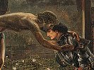

  
[Intangible Textual Heritage](../../index)  [Sub Rosa](../index) 
[Index](index)  [Previous](mmm00)  [Next](mmm02) 

------------------------------------------------------------------------

[Buy this Book on
Kindle](https://www.amazon.com/exec/obidos/ASIN/B002RHOOXI/internetsacredte)

------------------------------------------------------------------------

  
*Traces of a Hidden Tradition in Masonry and Medieval Mysticism*, by
Isabel Cooper-Oakley, \[1900\], at Intangible Textual Heritage

------------------------------------------------------------------------

### CONTENTS.

|       |                                                           |                                 |
|-------|-----------------------------------------------------------|---------------------------------|
|       |                                                           | PAGE |
| I.    | INTRODUCTION                                              | [5](mmm02.htm#page_5)           |
| II\.  | TOWARDS THE HIDDEN SOURCES OF MASONRY                     | [31](mmm03.htm#page_31)         |
| III\. | THE TRADITIONS OF THE KNIGHTS TEMPLARS REVIVED IN MASONRY | [76](mmm04.htm#page_76)         |
| IV\.  | THE TROUBADOURS                                           | [103](mmm05.htm#page_103)       |
| V.    | THE HEAVENLY KINGDOM OF THE HOLY GRAIL                    | [137](mmm06.htm#page_137)       |

------------------------------------------------------------------------

[Next: Introduction](mmm02)

