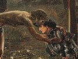

  
[Intangible Textual Heritage](../../index)  [Sub Rosa](../index) 
[Index](index)  [Previous](mmm02)  [Next](mmm04) 

------------------------------------------------------------------------

[Buy this Book on
Kindle](https://www.amazon.com/exec/obidos/ASIN/B002RHOOXI/internetsacredte)

------------------------------------------------------------------------

  
*Traces of a Hidden Tradition in Masonry and Medieval Mysticism*, by
Isabel Cooper-Oakley, \[1900\], at Intangible Textual Heritage

------------------------------------------------------------------------

p. 31

### TOWARDS THE HIDDEN SOURCES OF MASONRY.

As researches into its history are pursued, it appears more and more
probable that the Masonic movement, to state it generally, was a sort of
broad, semi-mystic and largely moral movement, worked from certain
unknown centres, and deriving its origin from some ancient and not
generally known basis. That is to say, its basis was, and is, unknown to
all of those who do not recognise a definitely spiritual guidance in the
practical, mental, and moral developments which from time to time change
the surface of society by the introduction of new factors into the
evolving processes of which life consists. Researches into Masonic
literature must be made in many languages and countries before this view
can be firmly established for the general world, but to the student of
Theosophy who is also a student of Masonry it

p. 32

becomes more and more apparent that the movement which is generally
termed Masonic had its roots in that true mysticism which originated, as
an ideal effort, from the spiritual Hierarchy which guides the evolution
of the world; and that, however much the branches may be separated from
the root-idea, there is nevertheless a mystic teaching in Masonry for
those who will seek below the surface.

One such searcher into the origin of Masonry gives the following
interesting and suggestive passage in his study on the discoveries
respecting the obelisk made by Commander Gorringe, which tend to "prove
that an institution similar to Freemasonry existed in Egypt," and the
writer proceeds:

According to our reading of history, the
*priesthoods* of Belus, or Baal in Assyria, of Osiris in Egypt, of
Jehova in Palestine, of Jupiter in Greece and Rome, of Ahura-Mazda in
Persia, of Brahma in India, and of Teutates in Britain, were *primitive
secret societies*, who instructed and governed the primitive families
and races. It little matters whether we call the members of those
priesthoods *Belites*, *Pastophori*, *Levites*, *Curetes*, *Magi*,
*Brahmins*, or *Druids;* they were connected by secret ties, and
intercommunicated from the Indus to the Tiber, from the Nile to the
Thames. Hence there ever has been, is, and ever will be Freemasonry on
our planet. Masonry was ever more or less connected with priesthoods
till about the thirteenth century of our era, when Masons declared
themselves *Freimaurer* (Freemasons). Since about that period
priesthoods have ever denounced and persecuted Freemasonry. [\*](#fn_22)

p. 33

The evidences of the basic mystic teaching can be largely traced by
watching the eddies and undercurrents which constantly break the smooth
stream of ordinary Masonry. Frequently do we find other and smaller
bodies, whose mystic aim was more marked and whose occult tendencies
were more decidedly definite, springing up within the larger
organization. Some few members with deeper insight gather round
themselves others with the same tendencies, and thus we find formations
of smaller societies constantly taking place. It is the main features of
some of these that we are now going to outline, and after we have
briefly reviewed the sources from which some of the leading Masons draw
their historical Masonic tradition, we can pass from the general outline
to the smaller societies, and it will be seen that the same traditions
reappear in them.

And in corroboration of the hypothesis just enunciated, the words of a
well-known Mason may be quoted, who in summing up an admirable lecture
which had just been delivered by a Brother Mason spoke as follows:

A thoughtful consideration of our principal ceremony irresistibly leads
us to the doctrine that was typified by the *pastos* in the King's
Chamber of the great Pyramid, and connects with the main characteristic
of all the mysteries, which embodied the highest truths then known to
the illuminated ones.

. . . The twelfth century witnessed an outbreak of mystic symbolism,
perhaps unparalleled in our era, and gave us the religious legends of
the Holy Grail, which point to

p. 34

an eastern origin; this period coincides with the greatest popularity of
the Templars, whose fall is contemporaneous with the decadence noticed
by the lecturer.

Without pressing the argument, I may suggest that some portion, at
least, of our symbolism may have come through a Templar source, Romanist
yet deeply tinged with Gnosticism; while at a later date the Lollards
(supposed to be inheritors of Manichæism) and who were but one of the
many religio-political societies with which Europe was honeycombed,
possibly introduced or revived some of these teachings. . . . One thing
is certain, that satisfactory renderings of our symbols can only be
obtained by a study of eastern mysticism: Kabalistic, Hermetic,
Pythagorean and Gnostic.

Down the centuries we find enrolled the names of philosophic teachers
who veiled their doctrines in figures similar to those in vogue among
the Rosicrucians and still more recent students, and often identical
with the signs we blazon on the walls of our Lodges and Chapters. [\*](#fn_23)

Many Theosophical students will find such utterances of immense value,
as showing the view held by a Masonic authority of such well-known
repute as Mr. E. Macbean, I.G., with regard to some, at any rate, of the
Eastern links with modern Masonry. [†](#fn_24)
Mr. Gould, the lecturer, also made the following suggestive remarks:

p. 35

With regard to the derivations of Masonry, there are, briefly, three
possibilities.

It may have come down to us

|                                 |                                                                                                                                                       |
|---------------------------------|-------------------------------------------------------------------------------------------------------------------------------------------------------|
| I.   | Through a strictly Masonic channel.                                                                                        |
| II.  | Through the Rosicrucians.                                                                                                  |
| III. | Through a variety of defunct societies, whose usages and customs have been appropriated, not inherited, by the Freemasons. |

The views thus put forward by these two authorities coincide perfectly
with those of many German and Italian mystic writers of the last century
and those preceding it. We will, therefore, investigate the early
traditions in order to trace the links which bind them together, and
join the chain to the yet more remote spiritual centre hidden, though
not lost, in the clouds of time, and in piecing together

p. 36

the fragments of these esoteric links it is better to begin with the
views of a well-known Italian Mason, for it is to the "Sons of the
Widow" we must look for help in revivifying the ancient spiritual truths
of a once esoteric Masonry. The writer from whom we quote believed
profoundly in Masonry and writes of it as one who knows that it was a
vehicle for conveying spiritual mysteries to the people: Thus he
writes [\*](#fn_25) of the early history of
Masonry:

Three centuries had passed since the origin of Christianity when at this
epoch of barbarism there arose in the same Persia whence so many
teachings had gone forth, a philosopher who wished to lead back the
confused spirit of men to the cult of the only true God. He was called
Manes. Some of the uninstructed have regarded him as the first
originator of our Order, and the creator of our doctrines.

Manes lived under the Persian King Sopares. He endeavoured to recall to
life in their entire purity the mysteries and the religion of Zoroaster,
uniting them with the pure compassionate teachings of Jesus Christ. The
teachings of Manes were liberal, whereas superstition and

p. 37

despotism governed Europe. It is easy to believe that those who
professed demagogic principles and a religion free from all that was
chimerical would be persecuted. Thus the Manichæans from about the
fourth century were persecuted to the fullest by all the despots and by
the Romish Priests. . . . The Holy Augustine, brought up in the
mysteries of Zoroaster adapted to the holy teaching of Jesus, became his
bitterest persecutor and the greatest enemy to the teaching of Manes
which was known under the name of the religion of the Child of the
Widow.

This hatred shown towards Manes by St. Augustine, and his zeal for the
Christian Trinity doctrine, may have originated in the vexation which
Augustine experienced at having been only admitted into the first degree
of the mysteries of Manes. The Magi, who had recognized in him an
ambitious and restless spirit, were thereby induced to refuse to him all
advancement, and this in spite of his nine years study, which he made in
order to be raised to the higher degree. This fact is sufficiently
confirmed by Fleury, Baronius, and by Augustine himself in his
confessions. After the death of Manes, twelve of his pupils went forth
into all the parts of the earth and imparted his teachings and his
mysteries to all people. They illumined as with a lightning-flash Asia,
Africa, and Europe, as may be seen from Baronius, Fleury, Bayle, and
others. . . . . . We have already said that still in the lifetime of
Manes, his pupil Herman had spread his teaching in Egypt, where the
Coptic priests and other Christians mingled it with the mysteries
adopted from the Jews. . . . . It was through these same Coptic priests
and the Eastern Christians that both the mysteries of the Children of
the Widow, and the cult of the great Architect came to us in consequence
of apparently unforeseen events, and it will be seen that it was
principally by means of the Crusades that they obtained a secure footing
in the West. The mysteries maintained their existence under the name of
the cult of

p. 38

the Great Architect of the Universe, a name that has
its origin in the allegory of Hiram, which represented, in the
mysteries, "the unknown God," the Eternal, and sole creator of all
things and the Regenerator of all beings.

Thus does Reghellini da Schio write, as he traces the Masonic ancestry
back to the pre-Christian period, and he continues:

Bossuet in his *Histoire des Variations*, IV., says
that in the middle ages the Christian sects, and especially the
Manichæans and Gnostics, had concealed themselves as much as possible in
the Orthodox Church itself: the remainder of the Manichæans who had
maintained themselves only too well in the east, crowded into the Latin
Church. Montfaucon, VII., p. 271, says when he speaks of the religion of
the Egyptians, that the heresy of the good and evil principles which had
been upheld by Manichæans, had at various times brought forth in the
Church great disorder, and he asserts that in the East . . . . . . these
doctrines existed at the time of the Crusades, . . . . the long time
that elapsed during the wars of the Crusaders gave them the opportunity
of being admitted into all the mysteries of the Children of the Widow,
the teachings of the Great Architect of the world, and of both
principles . . . . the Crusaders who had been admitted to the mysteries
of the Children of the Widow and initiated therein, imparted them, on
their return home, to their pupils in Europe . . . . during the sojourn
of the Crusaders with the Mussulmans, all kinds of theological
investigations were instituted. These led the Crusaders deeper into the
faith in the Great Architect of the world. . . .

And again in another passage (p. 46) he adds:

In spite of the religious and political changes that
followed upon the conquests of the Saracens in Asia, Africa, and Europe;
in spite of the persecutions introduced by

p. 39

them, the doctrines as to the unity of God was able
to maintain itself by means of the Mysteries in Palestine, Syria, and
Egypt, more especially, however, in the neighbourhood of Thebes; for
here the Christians and Coptic priests preserved, in the lap of their
solitude, the teachings communicated to them by Hesman, the pupil of
Manes, a teaching which later passed over into Europe. [\*](#fn_26)

Passing on from these important and interesting indications to the more
detailed aspect of our subject we find that at a later period many of
the semi-Masonic bodies had "Unknown Heads," and more especially those
whose aims were avowedly occult, this being the term which was applied
in Germany, Austria and Hungary to those organizations that did not make
public the sources from which their teachings were derived, nor say from
whom their inspiration came. To find the origin of such secrecy we must
turn back to the early history of the Masonic tradition and sketch
briefly what is told us by a Mason of the early part of this century,
when dealing with this historic secrecy. He tells us:

We find among all the priests of ancient peoples,
and in order that none but really capable and worthy men should be
associated with their offices and studies, they instituted forms of
probation and examination upon which followed some kind of initiation.
Now as the oldest writers ascribed such mysteries and initiations to the
Egyptian Priests, it is very probable that they already 'existed before
the downfall of that people, for we find traces of them in equally
ancient

p. 40

nations and perceive from the likeness of their fundamental principles
and of the teaching and customs of their priests, that they must have
had a common origin. Among the Chaldeans the Magi dwelt on the summits
of the mountains, and among the Celtic races the Druids lived in the
quiet solitude of the forests. Among the Indians and Ethiopians the
Brahmins and Gymnosophists had localities specially dedicated to them,
and among the Egyptians the Priests had intricate dwelling-places far
beneath the surface of the earth. All had their symbols and distinctive
signs, and owed their fame only to the secrecy of their initiation.

The secrets of Antiquity had a twofold aim. In the first case religion
was chosen as the object of care; the greater the mysteries the more
eternally secret were they to be kept from the people. The aim in the
second case was to guard the Wisdom of all things. He who would be
initiated must be a man of upright character and true mental power. The
sacred mysteries fell into decay with the Roman Empire, the flourishing
and spread of the Christian religion being the chief cause of this
decadence. The initiation into the mysteries of the Wisdom was however
of much longer duration. They changed only from time to time either the
name, the inner constitution, the degrees and various kinds of knowledge
bound up in these, or even the nature of the union itself. The men, who
were known under the name of Magi, or the White Masters, made one of
their most important aims the true knowledge of the human heart, which
lay always open before their eyes. To them alone was entrusted the
bringing up of Kings and the great of the earth, for they alone could
understand science as well as art, and careless of all prejudice taught
a simple and natural theology, which based itself upon the worship of a
Supreme Being.

Because, however, their method of teaching was symbolical, many errors
of which they were entirely incapable were ascribed to them on account
of their numerous

p. 41

hieroglyphics. The Magi of Memphis and Heliopolis
were held in such esteem, and their renown was so widespread that the
greatest heroes of war, philosophers, and strangers of the highest rank
journeyed to Egypt and sought to be initiated by the Priests in order to
learn the secrets of the Priesthood. From among these priests Lycurgus
and Solon drew a part of their system of philosophy; and Orpheus was
also initiated by them, and by this means enabled to introduce into his
own land, festivals from which the Greek mythology afterwards arose.
Thales also was instructed by them, Pythagoras received from the same
source his doctrine of Metempsychosis, Herodotus obtained much
information, and Democritus his secrets. Moses also, who was brought up
by the Magi, used his knowledge of the mysteries to free the Israelites
from Egyptian bondage and lead them to the service of the true God. It
is well known that Moses prescribed certain probation for his Levites,
and that the secrets of the Priesthood were inaccessible to the rest of
the Israelites, and this principle ruled till the time of Solomon. [\*](#fn_27)

And this policy of silence was a wise one, for the bitter vituperations
which were showered on the heads of the few who were the exoteric
leaders in such organizations, demonstrated the wisdom which guarded the
personalities of the real leaders. Such

p. 42

work was better done by small groups, and this appears to have been the
view held by those leaders with whom the student does come into contact.
Some few of these groups in the last century have already been
cited, [\*](#fn_28) but it will be as well to
repeat their titles, which run as follows:

The Canons of the Holy Sepulchre.

The Canons of the Holy Temple of Jerusalem.

The Beneficent Knights of the Holy City (The Strict Observance).

The Clergy of Nicosia in the Island of Cyprus.

The Clergy of Auvergne.

The Knights of Providence (The Order of the Knights of St. Joachim).

The African Brothers.

The Knights of Light (The Order of Fratres Lucis).

The Asiatic Brothers (The Order of the Knights of St. John of Asia).

These Societies do not belong to any one country in particular, for we
find ramifications of them appearing, disappearing and re-appearing,
like beacon lights, in Austria, Hungary, Italy, France, Sweden, and
Russia. England was the least prolific soil in the early centuries for
the implanting of this mystic seed. In Scotland and Ireland, however,
that light shone more clearly than in England. But in Austria and the
Danubian Provinces mysticism grew apace for a short and happy while, and
so a few words about Austria in particular may be said before passing
on.

p. 43

Says *Ludwig Abafi, in his Introduction to Pre-Historic Freemasonry in
Austria and Hungary*: [\*](#fn_29)

It is proved that the Emperor Rudolph I., even in
the year 1275, authorized an Order of Masons, whilst Pope Nicholas III.,
in the year 1278, granted to the Brotherhood of Stonemasons at
Strassburg, a letter of Indulgence which was renewed by all his
successors down to Benedict XII. in 1340. The oldest order of German
Masons arises in the year 1397; next follow the so-called Vienna
Witnesses of 1412, 1430, and 1435; then the Strassburg Order of Lodges
of 1495; that of Torgau of 1462, and finally sixteen different Orders on
to 1500, and to the following centuries for Spires, Regensburg,
Saxon-Altenburg, Strassburg, Vienna, and the Tyrol.

At this period the Roman Church appears to have made various futile
efforts to retain a hold upon these Masons, but without tangible result.
For the forces at the back of these movements prevented the destruction
of a new free spiritual growth by the Roman power. At this period also
came those great souls, burning for freedom, who worked the
Reformation, [†](#fn_30) and although that work
and those reforms were

p. 44

dwarfed of their full growth by the natural crudity and narrowness of
the human mind, nevertheless the dogmatic and mind-killing power of Rome
was materially thwarted, and the spirit in the teaching of the Master
Christ set free from those trammels. At all events, Abafi proceeds:

Equally important in the formation of Freemasonry .
. . . were certain religious communities and brotherhoods of the Middle
Ages, which for the most part aimed at a return to the pure teaching of
Christ, and at making its ethical form familiar to their adherents. One
of these brotherhoods was that of the Waldenses, established by Peter
Waldo in the year 1170 at Lyons. Their aim was the restitution of the
original purity of the Church through the adoption of voluntary poverty,
and other ascetic practices. But because of the doctrine of
Transubstantiation they soon came into conflict with the Catholic
Church, and as early as 1134 Pope Lucius III. excommunicated them, and
Sextus IV. in 1477 proclaimed a Crusade against them. In spite of these
attacks they have kept alive up to the present day, and have spread into
several countries, namely into Italy, France and Bohemia, and in this
latter country we shall meet them again under the name "Bohemian
Brothers."

A few words may be summarised from the same writer about some of the
other mystic bodies in Bohemia and Hungary, lands full of occult
tendencies. Among them are the following: "Die Brüder von Reif and
Hammer," or the "Brothers of the Circle and Hammer," "Die
Hackebrüdershaft," "The Brotherhood of the Hatchet," "Die Freunde vom
Kreuz," or the "Friends of the Cross." This last

p. 45

society spread into the Netherlands, and had its greatest success in the
latter part of the 17th Century. The "Brothers of the Cross" [\*](#fn_31) were still holding their meetings in
1785: they had many members in Wallachia, and still more in
Transylvania. [†](#fn_32) Brabbée in his Masonic
studies says: It consisted principally of

Older men and those who were generally reputed wise,
and therefore of the prominent leaders of the Brotherhood, who here, in
the Metropolis of the Kingdom, formed a kind of stronghold of the "inner
East."

The last expression is worthy of our notice, for it shows how the minds
of men were turning, even in Masonic circles, to the Eastern teachings.
Abafi also says that a great and moulding force was exercised at this
period on the form of Freemasonry by Jan Amos Komensky (latinized
Comenius) who was born at Brünn, in Bohemia, in 1592, and who became a
chaplain of the Bohemian Brothers in 1618. When the civil wars began
Komensky lost wife, child, and property, and was exiled from Austria
like all other non-Catholics. He escaped to Poland, turned his thoughts
to educational matters, and became famous in Sweden, Hungary, and
England.

Komensky was actively interested in the Rosicrucian movement, and joined
John Valentinus Andreas in his work in that body. In 1650 Komensky was

p. 46

invited to Hungary and Transylvania by the Prince Ragozcy, where he
stayed four years. It is doubtless partly owing to his influence that
the Rosicrucian movement spread so widely in these countries. His
philosophical and metaphysical views were so widely spread, that when
Anderson [\*](#fn_33) wrote his book on
Freemasonry, he, according to Abafi, incorporated in his work a
compilation of the most essential portions of the plans of Komensky. As
Abafi phrases it:

It was reserved for an Austrian, a Moravian
schoolmaster, the Chaplain of the Bohemian Brothers, to bestow ethical
treasures upon a brotherhood in proud Albion, the home of the boldest
intellects; to formulate the ideas, and to point out the way for a
league which—after its transformation—was destined to embrace the
noblest of all nations, and being brought to perfection by them,
ordained to influence the whole of humanity.

The spread of mysticism in Austria and Hungary during the last century
was astoundingly rapid; according to one authority [†](#fn_34) about five per cent. of the entire
population belonged to the Freemasons, Rosicrucians, and other allied
societies.

The vast majority of these Lodges must, he thinks, have been secret, for
at the death of the

p. 47

\[paragraph continues\] Empress [\*](#fn_35) only three legitimate and perfect Lodges
existed. That is to say, only three Lodges in which Freemasonry as such
existed without any more extended search into occultism. Another
authority, Dr. Otto Henne-am-Rhyn, [†](#fn_36)
promptly doubles this number, saying that there were 20,000 mystic
students in Vienna. As this writer was an avowed enemy of mysticism, his
views may be taken as not likely to exaggerate the numerical value of
occult students.

In Austria mysticism had been aided by the kindly interest taken in such
subjects by the Emperor Francis I. He had protected and favoured a very
remarkable man called Seefels—or Sehfeld—a Rosicrucian and Mason, who
had an alchemical laboratory at Rodaun, a small village about a mile
from Vienna. This man was loved and respected by the whole neighbourhood
for his kindliness, as well as feared for his powers, which were most
remarkable. Seefels is mentioned by Schmieder in his valuable History of
Alchemy, [‡](#fn_37) as one of the "Seven true
Adepts" who should appear in Europe in the course of the century.
Schmieder also gives some very interesting proofs of his powers. But in
spite of the Emperor's protection he was seized by

p. 48

the police and placed in the fortress at Temeswar in Hungary. A careful
study of Schmieder's work would more than repay any student who desires
to have evidences for occult powers made certain by history.

The following interesting notes [\*](#fn_38) are
quoted as showing the connecting link between the Continental mystic
Masonry and England, of which but little has been heard in the outer
world.

In a German tract, printed about 1803, and bound up with another tract
of Fessler's, called *Geschichte der Freimaurerei*, occur the following
startling statements, which I give to Masonic students for what they are
worth.

1\. The Templars worked with the so-called "Magical Brethren" at an
early period of their existence.

2\. A Rosicrucian MS. states that at Cologne, with the motto, "*non
omnis moriar*," this Magical Union was created there in 1115.

3\. A MS. of Michael Mayer's still exists in the University Library at
Leyden, which sets forth that in 1570 the Society of the old Magical
Brethren, or "Wise Men" was revived under the name of Brethren of the
Golden Rosy Cross.

4\. It is asserted that in 1563 the statutes of the Brotherhood were, on
the 22nd of September, at Basle, at a meeting of seventy-two Masters of
Lodges, revised, set forth, and printed; that the Lodges of Swabia,
Hesse, Bavaria, Franconia, Saxony, Thuringia, and those on the Moselle
acknowledged the headship of the Grand Lodge of Strassburg. That in the
eighteenth century the Lodges of Dresden and Nuremberg were fined by the
Grand-Master of Strassburg, and that the Grand Lodge of Vienna, of
Hungary,

p. 49

and Stirrmark, the Grand Lodge of Zürich, which
ruled the Swiss Lodges, referred to the Mother Lodge of Strassburg in
all difficult and doubtful matters.

To these notes by a "Masonic Student" the following editorial note is
appended:

There can be no doubt that the Theosophical and
Magical Union above mentioned did exist as an organized Secret Society.
The correspondence of Cornelius Agrippa von Nettesheim shows that he was
a member of such a secret society, and it is further asserted that when
he was in London he established a branch of it in that city. Fludd, as
showing that secret societies existed in the Universities, has the
passage "notwithstanding any allegiance which I may have vowed by a
ceremonial Rite to Aristotle [\*](#fn_39) in my
youth." These societies used the double Triangles, or Seal of Solomon,
and in the ruins of one of the old Temple Preceptories in France was
found a copper medallion with the Lamb surmounted by this Cabalistic
symbol.

Two points in this interesting note can be corroborated by further
evidence. The Rosicrucian MS. mentioned in para. 2, is also mentioned on
page 56 of a most valuable German book (to which reference has already
been made) by Friedrich Gottlieb Ephraim Weisse, or Magister Pianco; it
is called *Der Rosenkreutzer in seiner Blösse* (Amsterdam; 1781). Some
extracts from it will not be without interest, for it refers to the
older body of "Wise-Men," who were known as the "Unknown Heads" of many
of the

p. 50

small societies. The conditions of entrance are briefly given as
follows:

3\. Whosoever wished to be admitted to the secrets, and afterwards to be
initiated, must be a man of honour and of true spiritual power; and he
must be already of considerable learning; for only those were accepted,
of whom it could be hoped that they would be of great service to the
Sacred Alliance. . .

10\. The Initiates wore a triangle, symbolical of the three qualities of
the Demiurgos—Power, Wisdom and Love. . . .

The Masters of the second secret were Masters in the knowledge of all
nature, and her forces, and divisions.

11\. They were called Philosophers or the World-Wise. Their science was
called the World-Wisdom. . . .

12\. These World-Wise occupied themselves in secret. No one knew where
they met, or what they did.

14\. But they had also secret sciences known only to the highest among
them—called Magos, Mage, or the Wise Master, who taught the people of
Divine things. He could do things which appeared quite
supernatural. [\*](#fn_40)

The author, speaking of the relation of Masonry to this older and more
secret body, says:

Those Brother Masons (of the highest degrees) knew
that they owed their brotherhood to the Initiations of the old Wise-Men;
that the great part of their (the Masons') knowledge came from Them, and
that without Their help they could do nothing. [†](#fn_41)

In another passage he says:

Long before the year 111S, there was a society which
in the mysteries of the ancients took the place of the last and

p. 51

youngest grade, and which had the same position with the Tempelherren,
who had adopted it with the other teachings of the Wise Ones.—They were
the novices from all time. As in the time of the Inquisition against the
Templars no one knew anything about the lower and last grades, and those
who belonged to them had no public connection with them and thus lived
without attracting any attention, they were overlooked in the cruelties
of the time. One did not think of them. As the members of the Templars
who escaped were few in number and died one after the other, the
remaining members drew together to form a bond of friendship, to which
end they drew up certain rules. This new society appeared in different
forms and under different names, Cross Society or Brothers of the Cross,
Noaites, and in later days adopted the name of Freemasons.

Length of time and the involved issues consequent thereon made those
initiated into the Mysteries at length perceive that they must introduce
an entirely different organization into the community, in order to bring
it into line with Christianity.

Those associates who still remained over from the collapse [\*](#fn_42) of the community of Initiates, and who
were scattered about the world, began to make fresh projects for a
general union. They took the laws of their community and the laws of the
Christians, which are known under the name of the Bible, into a real
assimilation. They began to institute a parallel between the books of
Moses and the memorials of the Magi, and from all this they evolved a
kind of association, provided with certain laws, which could fit in with
the Christian.

The association was, as is always the custom with innovations, in the
beginning somewhat dark and involved; it was saddled with various
meanings and names, which it

p. 52

would be quite unnecessary to repeat here, but which
were all of short duration, so that the first ones called it the
association of Magi and its members the Magi Brotherhood and associates.
And this first association was formed in the year 1115 and lasted till
the year 1117, though it underwent changes from time to time. The
Crusaders had given rise to many societies and orders amongst the
profane, and associations had sprung up which had quite differing
objects. Amid innumerable ones there arose in the year 418 the Knights,
with whom the Magi Brotherhood united and shared their principles and
secrets with them.

The writer speaks "as one having authority'' and knowledge also.

Turning to the particular date mentioned in the notes from *The Kneph*,
we find that about this period, or a few years earlier, the first
documentary evidence of the appearance of the Asiatische Brüder is
mentioned by the Baron Hans Ecker von Eckhoffen in his treatise,
*Authentischen Nachrichten von den Ritter-und Braider-Eingeweihten aus
Asien* (Hamburg; 1788). These writings, he says, date from 1510; showing
that a body of mystics was known at that period; these Knights of Asia
also called themselves the Knights of St. John, and it is a curious fact
to notice that one of the Masonic records which has caused an infinity
of discussion, and also of dissension, amongst Masons, is the celebrated
"Cologne Record" which is dated 1535, and in which an Order of St. John
is noticed. This charter has been a veritable bone of contention between
materialistic and mystic Masons, and much polemical literature

p. 53

has been published on the subject. The mystics hold it to be true on
external and internal evidences; while the materialists reject it, as
they reject all such evidence.

In the record there is the name of Philip Melancthon—the friend and
co-worker of Martin Luther—who appears as a Brother in the Order of the
Freemasons. This document bears witness also that a secret society was
known in various parts of the world, which existed before 1440 under the
name of the "Brotherhood of St. John," and since then, and up to 1535,
under the title, the "St. John's Order of Freemasonry" or "Masonic
Brotherhood."

This Society [\*](#fn_43) was reformed and
re-arranged in the year 1717, the generally accepted modern date of the
materialistic and non-mystic Masons. It became more atheistic in its
views, and more democratic in its tendencies. Amongst other deeply
interesting matter, the "Charter of Cologne" contains the following
passage:

The Brotherhood, or the order of Freemason Brothers,
bound together according to St. John's holy rules, traces its origin
neither from the Templars nor from any other spiritual or temporal
Knightly Order, but it is older than all similar Orders, and has existed
in Palestine and Greece, as well as in various parts of the Roman
Empire. Before the Crusades our Brotherhood arose; at a time when in
consequence of the strife between the sects teaching Christian morals, a
small number of the initiated—entrusted with the true

p. 54

teaching of virtue, and the sensible exposition of the secret
teaching—separated themselves from the mass. [\*](#fn_44)

According to the record, the following reason was given for the adoption
of the name: The Masters of this confederation were called the St.
John's Brethren, as they had chosen John the Baptist, the forerunner of
the Light of the World . . . as their original and example. [†](#fn_45)

There is a curious similarity between this document in its phrasing and
style, and the remarks made in the book by Weisse, in his *Der
Rosenkreutzer in seiner Blösse*, some passages of which have already
been summarised.

Yet another well-known Masonic authority bears witness to the value of
the Cologne Record. Thus Mackenzie writes:

The documents are still preserved in one of the
Lodges at Namur. They have been very hotly debated. On the one hand,
Oliver, Reghellini, and some others treat them as authentic, and the
antiquaries of the University of Leyden certify that the paper on which
the register of the Lodge at the Hague is written is of the same kind as
that used in Holland in the beginning of the seventeenth century. Now
this register refers to the Charter of Cologne as being in existence, so
that the fraud, if a fraud, is two centuries old. [‡](#fn_46)

Our chief interest in all this detailed evidence lies in the
ever-recurring testimony that it bears to that older Fraternity, which
was the inspiring body at the

p. 55

back. But we must now turn to some of the societies which had " Unknown
Heads," as given in our list.

J. M. Ragon, in his *Orthodoxie Maçonnique*, gives the following
interesting account of one of these bodies, more information on which
will be added from other sources.

*Order of the Architects of Africa, or the African Brothers  
(1767)*.

This Order was composed of educated and well-principled brothers. Their
lodges, in Europe, were all closed, excepting perhaps that of
Constantinople (at Berlin).

Only one of their Grand-Masters was known; this was the councillor of
war, Köppen.

Their first degree offered a more extensive and complete instruction
than all the degrees of the Scotch systems together. They said that the
Lodges of St. John neglected the great end, and that instruction was
hardly to be had there, and that the Strict Observance did not know the
grounds of the continuation of the Masonic Order. They occupied
themselves with hieroglyphics, especially with those relating to
Freemasonry, which they sought to know well. They made a mystery of
their goal up to the seventh degree, which could only be gained by zeal,
perseverance and discretion. Their secondary occupations were the
sciences, especially history and antiquities, the study of which they
considered indispensable for the true Freemason.

Their first degree was symbolically called the Architect or Apprentice
of Egyptian secrets.

They called themselves the Africans, [\*](#fn_47) because their

p. 56

studies began with the history of the Egyptians, in whose mysteries they
found indications of Freemasonry, although they placed its origin much
later, as to which the Crusades gave them no light.

Their customs were simple and noble. They never laid any stress on
decorations, aprons, ribbons, jewels, etc., but they liked a certain
luxury, and sententious inscriptions with a sublime but hidden meaning.
In their assemblies they read treatises and communicated to each other
the result of their researches.

Their banquets were simple, decorum prevailed, and instructive and
scientific discourses were given at them.

Admissions were given without any fees. Earnest brothers who fell into
distress received much assistance.

They have published many important documents in Germany on Freemasonry.

This Order was established in Prussia, in 1767, with the assent of
Frederick II., called the Great.

Its degrees, to the number of eleven, were divided into two temples,
*viz*.:

First Temple.

1\. Apprentice.*  
*2. Companion.*  
*3. Master.

Second Temple.

4\. Architect, or Apprentice of the Egyptian secrets (Manes Musæ).*  
*5. Initiate in the Egyptian secrets.*  
*6. Cosmopolitan Brother.*  
*7. Christian Philosopher (Bossinius).*  
*8. Master of the Egyptian secrets, Aléthophilote . (Friend of Truth).

p. 57

Higher Degrees.

9\. Armiger.  
10. Miles.  
11. Eques.

The Grand Chapter gave each year, during the life of Frederick II., a
gold medal of so ducats as a prize for the best treatise or discourse.

In 1806 only one Chapter of this system remained, that of Berlin
('Constantinople').

On the supposed origin of the Order, Ragon writes as follows:

When Frederick II. came to the throne, seeing that Freemasonry was no
longer what it had been, and appreciating what it might be, he conceived
the plan of an Inner Order which might at the same time take the place
of a Masonic Academy. He made choice of a certain number of Masons
capable of comprehending his ideas, and charged them with the
organization of this body. Among these were to be noticed the brothers
Stahl, de Gone, Meyerotto and du Bosc. They instituted the Order under
the name of an extinct society, The Architects of Africa, and
established statutes in accordance with the views of the King, who on
his side granted privileges, and in 1768 had erected in Silesia, by his
architect Meil, a building specially designed for the Grand Chapter, and
endowed it with an ample fund, with a choice library and rich furniture,
the whole being of an elegance worthy of the Order and of the King.

This Order, without pretending to dominion, teaching tolerance,
professing the primitive principles of Freemasonry, and making a special
study of its history, prospered in silence and in complete freedom. Its
chief statutes were to fear God only, to honour the King and to be
discreet, to exercise universal tolerance towards all Masonic sects
without ever affiliating itself to any. It was

p. 58

for this reason that they never submitted to the act of obedience of the
Baron de Hund, notwithstanding all the entreaties that were made to them
to do so. In the admission of candidates they observed the strictest
caution. It is said that Duke Ferdinand of Brunswick was refused because
he meddled with sectarian affairs. They devoted themselves to active
researches into the history of the mysteries, of secret societies and
their various branches, and cultivated the sciences, chiefly
mathematics. In their works, carried on often in Latin, reigned
morality, a high tone, a solid and unostentatious teaching.

Their library and their archives obtained through the protection of the
King and of persons of distinction, among others the Prince von
Lichtenstein at Vienna, some real treasures of manuscripts and
documents, which no Masonic branch can boast. (*Découverte sur le
Systéme de l’Ordre des Architectes Africains, Constantinople*. Berlin;
in 8vo, 51 pp., 1806.) This article is taken from the Masonic library of
the very kind brother, Th. Juge. [\*](#fn_48)

Few monarchs have more thoroughly protected the Mystic Schools within
the Masonic body than Frederick II., King of Prussia, well named "The
Great." Not only did he protect them, but he also actively sympathised
with them. While still Crown Prince, he was initiated as a Mason at
Brunswick in August, 1738, and was from that period the staunch
protector of the Masonic Fraternity; nor did he omit to penetrate very
deeply into the early traditions of Masonry, far more so, indeed, than
many who have fewer duties to engage their time.

Frederick the Great was, however, by no means the

p. 59

vague and dreamy mystic of popular representation; his academy and
schools were the centres of the

most brilliant intellects of the period, while the choice of his
friends, literary, philosophical, and mystic, testifies to the breadth
of his knowledge, and it also illustrates the manifold sympathies of his
nature, both as soldier and mystic, philosopher and scholar; though not
saintly, by any means, he was thoroughly appreciative of ideals that
were beyond him.

His sympathy with mystics is evidenced by his selection of a librarian,
for he gave that post at the Royal Public Library in Berlin, with the
title of Academician, to Dom Antoine Joseph Pernetty (or Pernety), a man
who had been a Benedictine monk, [\*](#fn_49)
but having become—like many others—dissatisfied with the Order, he
applied to the Pope for a dispensation from his vows. This was no
obstacle in the eyes of the King, deeply interested as he was in the
researches of this well-known Hermetist and Alchemist.

That the opinions of Dom Pernety were publicly known is demonstrated by
a writer of the period, who says:

A remarkable trait in the character of this
Academician was, that he believed in the philosopher's stone,

p. 60

the mysteries of the Cabala, apparitions,
patagonians, witcheries, enchantments, the race of giants, etc. But,
notwithstanding this inconceivable and ridiculous weakness, he was
beloved by everyone, and the more as, to his other excellent qualities,
he joined that of the most perfect discretion in regard to such affairs
as were at any time confided to his secrecy; never did a word from his
lips give room for the smallest explanation or disagreement. [\*](#fn_50)

Such is the comment on this mystic's character by one who, while adverse
to his opinions, nevertheless renders justice to a personality which
some traduced.

Dom Pernety was for some time in personal relationship with M. de St.
Germain; and later on, he founded the Académie des Illuminés d’Avignon,
which was essentially Hermetic in its aims, and had also a close
connection with the Swedish system. This was a secret body, but it was
also under the general Masonic regulations. It was also in close union
with the followers of Martinez Pasquales, and that bond has been kept
up, for some of the treatises written by Dom Pernety are now being
published by the Martinists in America. To pursue this interesting topic
would, however, lead us too far from our "Afrikanische Bauherren" and
their protector, the King of Prussia, with whom our attention is at
present engaged.

The most succinct account of the opinions held by

p. 61

the leading Freemasons in Germany at this juncture is given by Findel,
who, although a pronounced antagonist, shows very lucidly the underlying
mystic basis on which the outward Masonic forms were supported, and it
is of value to these researches to quote his testimony in full,
illustrating, as it unwittingly does, the hypothesis put forward,
namely, that all the societies similar to the African Brothers, the
Fratres Lucis and others of like calibre, were but the outward
manifestations of hidden forces which were attempting to indoctrinate
the whole Masonic body with true spiritual, mental and moral mystic
knowledge. Says Findel:

The Grand Lodge of Germany [\*](#fn_51) further assumes, [†](#fn_52) that in the Building Fraternities [‡](#fn_53) of the Middle Ages, besides

p. 62

their art, a secret science was carried on; the substratum of which was
a real Christian mystery, serving as a preparatory or elementary school
and stepping-stone to that and the St. John's Masonry, which latter was
not a mere system of moral philosophy, but closely allied and connected
with this mystery. It was conceded that the Freemasonry of our days (St.
John's Freemasonry) sprang from the Building Fraternities of the Middle
Ages, but at the same time asserted that in the early ages there existed
a secret society which strove to compass the perfecting of the human
race, precisely in the same manner, and employing similar means, as did
the Swedish system, which in fact only followed in the wake of its
predecessor, being concealed in the Building Fraternities, so that our
society did not rise from them, but made itself a way through them. The
secret science, the mystery, was very ancient indeed. This mystery
formed the secret of the Higher Degrees of the Rite, which were not
merely kept hidden from the rest of the confederation, but also from the
members of the inferior degrees of the system itself. This mystery was
fully confirmed by documents, which the Grand Lodge of Germany had in
its keeping. . . . . This secret legend is the same as that of the
Carpocratians, which is that Jesus chose some of the Apostles and
confided to them a secret science, which was transmitted afterwards to
the priests of the Order of the Knights-Templars, and through them to
the Building Fraternities, down to the present Freemasons of the Swedish
Rite. . . . The Swedish system teaches that there have been men of all
nations who have worshipped God in spirit and in truth, and surrounded
by idolatry and superstition have yet preserved their purer faith.
Separate from the world, and unknown to it, this Wisdom has been
preserved by them and handed down as a mystery.

In the time of the Jews they had made use of the Essenes, in which sect
Jesus was brought up, and had spent the greater part of his life. Having
been instructed by

p. 63

him in a more perfect knowledge of holy things, they had amidst
persecution taught in silence that which had been committed to their
keeping. [\*](#fn_54) At the period of the
Saracens and the Crusades they were so greatly oppressed that they must
ultimately have sought for protection from without. As fate, however,
would have it, seven of them, Syriac Christians, pursued by unbelievers
near Bastrum, were rescued by the Knights-Templars, and afterwards
taken. under their protection. When they had lived there for a certain
time they begged for permission to dwell with the Canons or Prebendaries
of Jerusalem, as the life there led agreed better with their own
inclinations and habits. This was accorded them, and Andreas
Montebarrensis effected a union of these Syrians with the Canons, to
whom, out of gratitude, they imparted all their science, and so
completely did they make the priests of the order the depositories of
their secrets that they kept them and handed them over to others under
certain conditions.

Thus, this secret knowledge, which was continually being added to, lived
on in the very heart of the Order of Knights-Templars till its
abolition. The clergy were dispersed with the persecution that ensued,
but as the secular arm did not touch them as it did the Knights, they
managed to rescue many of their secret writings, and when the Knights
sought refuge in Scotland, they founded a chapter at Aberdeen, the first
Prior of which was Petrus de Bononia. The science was disseminated from
this place, but very cautiously, first to Italy, then to the extreme
North (Sweden and Russia) and France. In Italy Abbot Severin had been
the guardian of the True Science. [†](#fn_55)

p. 64

Findel quotes all this history in a purely sceptical way, with adverse
remarks of his own of doubt and derision. Nevertheless the history of
this ancient secret teaching is true, and it coincides in its details
with accounts which come to us from other sources. In order that the
"hidden sources" may thus be more clearly kept in view, we will quote
the words of a well-known Masonic writer, Mr. Lawrie:

Although it will be acknowledged by every unbiased reader, that
Freemasonry has a wonderful resemblance to the Eleusinian and Dionysian
mysteries, the fraternity of Ionian architects and the Essenian and
Pythagorean associations, yet some may be disposed to question the
identity of these institutions, because they had different names, and
because some usages were observed by one which were neglected by
another. But these circumstances of dissimilarity arise from those
necessary changes which are superinduced upon every institution, by a
spirit of innovation, by the caprice of individuals, and by the various
revolutions in civilized society. Every alteration or improvement in
philosophical systems, or ceremonial institutions, generally produces a
corresponding variation in their name, deduced from the nature of the
improvement, or from the name of the innovator.

The different associations, for example, whose nature and tendency we
have been considering, received their names from circumstances merely
casual, and often of trifling consideration; though all of them were
established for the same purpose, and derived from the same source. When
the mysteries of the Essenes were imported by Pythagoras into Italy,
without undergoing much variation, they were there denominated the
mysteries of Pythagoras; and, in our own day, they are called the
secrets of Freemasonry, because many of their symbols .are derived from

p. 65

the art of building, and because they are believed to have been invented
by an association of architects, who were anxious to preserve, among
themselves, the knowledge which they had acquired. [\*](#fn_56)

The Dionysia, or Mysteries of Bacchus, were intimately connected with
those of Ceres and perhaps still more with Freemasonry, says Mr. Lawrie;
the rites came from Egypt, and there according to Plutarch Ceres was the
Egyptian Isis, and Bacchus was Osiris.

The Dionysian artificers or architects were an association of scientific
men, who were incorporated by command of the Kings of Pergamus into a
corporate body, some three hundred years B.C. They had the city of Teos
given to them. The members of this association which was intimately
connected with the Dionysian mysteries, were distinguished from the
uninitiated inhabitants of Teos, by their science, and by words and
signs by which they could recognize their Brethren of the Order. Like
Freemasons they were divided into Lodges which were characterised by
different names.

From some circumstances which are stated in these inscriptions, but
particularly from the name of one of the Lodges, it is highly probable
that Attalus, King of Pergamus, was a member of the Dionysian
Fraternity.

Such is the nature of that association of architects, who erected those
splendid edifices in Ionia, whose ruins even afford us instruction,
while they excite our surprise. If it be possible to prove the identity
of any two societies, from the coincidence of their external forms, we
are authorized to conclude that the Fraternity of the Ionian architects
and the Fraternity of Freemasons, are exactly the same; and as the
former practised the mysteries of Bacchus and Ceres,

p. 66

several of which we have shown to be similar to the mysteries of
Masonry, we may safely affirm, that, in their internal as well as
external procedure, the Society of Freemasons resembles the Dionysiacs
of Asia Minor.

The opinion, therefore, of Freemasons, that their Order existed, and
flourished at the building of Solomon's Temple, is by no means so
pregnant with absurdity, as some men would wish us to believe.

We have already shown, from authentic sources of information, that the
mysteries of Ceres and Bacchus were instituted about four hundred years
before the reign of Solomon; [\*](#fn_57) and
there are strong reasons for believing that even the association of the
Dionysian architects existed before the building of the Temple.

It was not, indeed, till about three hundred years before the birth of
Christ, that they were incorporated at Teos, under the Kings of
Pergamus; but it is universally allowed, that they arose long before
their settlement in Ionia, and, what is more to our present purpose,
that they existed in the very land of Judea.

The difference in the ceremonial observances of these institutions, may
be accounted for nearly upon the same principles. From the ignorance, or
superior, sagacity of those who presided over the ancient fraternities,
some ceremonies would be insisted upon more than others, some of less
moment would be exalted into consequence, while; others of greater
importance would be depressed into obscurity. In process of time,
therefore, some trifling; changes would be effected upon these
ceremonies, some rites abolished, and some introduced. The chief
difference, however, between the ancient and modern mysteries, is in

p. 67

those points which concern religion. But this arises
from the great changes which have been produced in religious knowledge.
It cannot be supposed that the rites of the Egyptian, Jewish, and
Grecian religions should be observed by those who profess only the
religion of Christ; or that we should pour out libations to Ceres and
Bacchus, who acknowledge no heavenly superior, but the true and the
living God. [\*](#fn_58)

The connection [†](#fn_59) of the Afrikanische
Bauherren with the Templars and their secret traditions is common to all
those mystic associations [‡](#fn_60) who

p. 68

claimed, like them, to have deeper truths and more spiritual knowledge
in charge for the human race.

Seeing, then, that the African Brothers have this link with other mystic
bodies, we can investigate the details of their system with interest,
and we find that the members of this school were almost without
exception learned men and persons of position and rank, often selected
by the King as suitable members. Devoted to mystic research, in general
they paid the closest attention to symbolism and hieroglyphs.

The description given of them by Ragon differs somewhat in detail to
that given by Lenning, which runs as follows:

The double character of the Order confirms what we know about the
tendency and ritual of the first four grades. They are as follows:

Grade I. Pupil of the Egyptian secrets (Menes Musæ). [\*](#fn_61) Here the doctrines of the true Religion,
as concealed under the hieroglyphs which were already in the Egyptian
Mysteries, were brought forward for the pupil. The first degree shows
already that Moses was held as an important teacher of these doctrines
even to the Egyptians.

Grade 2. The Initiates of the Ægæic secrets. Here Moses was presented as
one of the greatest of the Wise Men of the world, who instructed the
Jews in the

p. 69

doctrines of religion from his knowledge of nature and the world.

Grade 3. The Cosmopolitans (or citizens of the world) had for its object
the necessity for self-knowledge, because most ethical teachers failed
in teaching this, for they depicted all human nature as being utterly
corrupt, while instead of this, human nature was capable through
self-knowledge of, and self-respect for, its destiny, of becoming a
great instrument for the work of God.

Grade 4. The Christian world-wise men (or Bossonians)—was the expounding
of the intimate connection between man and the world, so that to call
each of them the Temple,' and to call Christ the Foundation Stone was
the True Religion.

Grade 5. Was practically that of the Alethophiles, or Friends of Truth,
which was identical with the society of that name, and whose tendency is
expressed in the name.

After these five, or lower student-grades, there follow three higher, or
inner grades, of which, however, only the names are known in the outer
world. According to what is told, they were the same as the Freimaurerei
Ritterwesen. . . . The names are variously given and are of but little
consequence, this Order was never a very large one, for the
qualifications as to learning and education were somewhat restrictive at
that period. It appears to have had its Lodges in Berlin, and also in
Oberlavsitz; there were some of the same Lodges in Cologne, Worms, and
also in Paris under the guidance of a certain Kühn. He came into contact
with Baron von Hund and his system of 'The Strict Observance' of which
Von Köppen was a devoted member. [\*](#fn_62)

The brief mention of the highest grade, the Knights of Silence, or
Everlasting Silence, is

p. 70

interesting, for it has reference to an edict which was published from
the "Unknown Heads" suspending all studies and all work for a time—the
limit of time was not specified. There will be more, however, to be said
on this point at a later date. The Minister of War, Herr von Köppen, was
aided in his work of organisation in the African Brothers by Herr von
Hymmen, a Councillor of Justice in Berlin; both men were Rosicrucians,
and von Hymmen was an adherent of the Baron von Gugomas, another
celebrated mystic in the last century.

Von Köppen and von Hymmen published the well-known work, *Crata Repoa,
or Initiation in the Ancient Secret Society of the Egyptian
Priests*. [\*](#fn_63)

Another leader of this confraternity was Karl du Bosc, one of the
chamberlains at the Prussian Court. He was also connected with the
Rosicrucians and some of the other mystic sects. It confirms the
accuracy of our hypothesis when we find all these public officers
working harmoniously in different organizations, aiding all for the
general weal, knowing well that each Society represented, as it were,
one facet of the precious stone of truth which lay hidden securely
beneath the surface.

Turning now to the links which connect the African Brothers with other
mystic fraternities we shall find the Deutsche Ritter, or Kreuz-Herren,
akin to them; the origin of the last-mentioned association

p. 71

can be traced back to the year 1190, where their history is closely
allied with another interesting body, *viz*., the Maltheser-Ritter, or
Knights of Malta; coalescing again with these we find the well-known
Johanniter-Ritter, or Knights of St. John, whose history is so
intimately interwoven with the Johannite Masonry, dedicated as it was to
the two St. John's, the Baptist and the Evangelist.

Further, we find a curious secret sect existing in Africa of which
Mollien gives a most interesting sketch. He calls this sect "Les
Almousseri," and connects their community with the Freemasons as
follows:

In Foutatoro, and among the Moors, there exists a
sort of freemasonry, the secret of which has never been revealed; the
adept is shut up for eight days in a hut, he is allowed to eat but once
a day, he sees no person excepting the slave appointed to carry him his
food; at the end of that period a number of men in masks present
themselves, and employ all possible means to put his courage to the
proof; if he acquits himself with honour he is admitted. The initiated
pretend that at this moment they are enabled to behold all the kingdoms
of the earth, that the future is unveiled to them, and that
thenceforward heaven grants all their prayers. In the villages where
persons of this fraternity reside, they perform the functions of
conjurors, and are called Almousseri. One day Boukari told me, after
attesting the truth of what he was about to say by the most solemn
oaths, that being in a canoe with one of these men, there fell such a
heavy shower of rain that he would not depart; yielding, however, to the
wishes of the Almousseri, he set sail; "torrents of rain fell on all
sides," added Boukari, "but our bark remained perfectly dry, and a
favourable

p. 72

wind swelled our sails. I asked this Almousseri to
explain his secret, but he answered that if he revealed it his brethren
would infallibly destroy him." [\*](#fn_64)

From many sources it is evident that scattered communities [†](#fn_65) with mystic knowledge, existed in various
parts of Northern Africa. Such communities having nothing to do, of
course, with the fetish-worship of the negro tribes, but adhere to the
Egyptian tradition of mystic teaching, for they are off-shoots of the
Manichæan and Coptic teachers who spread the secret doctrines of Manes
in Northern Africa; his disciples carried on this line of work
immediately after his death. They kept up also a communication with the
mystics in Europe, for M. de St. Germain at one period of his travels
was in Northern Africa.

Some reference has been made to the fifth grade of the African Bauherren
system, namely the "Master of the Egyptian Secrets"; "Alethophilote" or
"Friend of Truth." This grade is given as the eighth by Ragon, [‡](#fn_66) and Lenning in his encyclopædia says:

There appears to have been some connection between
this grade and the little known society of the "Alethophilotes" in
Berlin. This is probably the earlier sect which

p. 73

is alluded to sometimes, and it was founded, so far as is known, by the
Graf von Manteuffel in 1736. [\*](#fn_67)

The details of this system will be of interest to students, as it throws
some light upon the older association, of which very little is told;
they are given by Kundmann as follows:

I. Let Truth be the sole aim of your understanding and of your will.

II\. Consider nothing true, consider nothing false, if you are not
convinced about it by adequate reasons.

III\. Be satisfied with this, that you know and love the Truth; seek to
impart it, that is to make it known and agreeable to your
fellow-citizens. He who buries his experience, buries a thing which has
been committed to his care for the furtherance of the glory of the
Highest; and he thus diverts its use from humanity, which might have
profited therefrom.

IV\. Do not deny your love and help to those who know the Truth and are
seeking it themselves, or who are honestly trying to defend it. It would
be too disgraceful and contrary to the actual vocation of an
Alethophilote (Friend of Truth) if you were to deny protection and
defence to those whose object is one with yours.

V. Never contradict a truth when you see that you are being overborne by
others whose insight is more keen than yours. An Alethophilote would be
unworthy of his name if he undertook to combat the Truth out of pride or
conceit, or from any other unreasonable cause.

VI\. Be pitiful with those who either are ignorant of the Truth, or who
have incorrect perceptions of it; instruct

p. 74

them without bitterness, and seek to bring them into
the right way solely by the strength of your arguments and by no other
way. You would disgrace the Truth and make it appear suspicious if you
were to fight for it and defend it with any other weapons but those
which Reason gives into your hand. [\*](#fn_68)

It is an interesting, but somewhat difficult, matter to understand the
reason why such bitter war was carried on against bodies of men with
tenets so high and aims so pure. As each of these semi-Masonic sects is
investigated the astonishment of the student increases at the groundless
accusations with which the ordinary historian is content.

In the passage quoted from Findel, he gives the traditions and Masonic
tenets held by the Grand Lodge of Germany, and also by the Afrikanische
Bauherren, these bodies being practically identical, the latter being
but a more advanced and occult section of the Mother-Lodge. In the
passage just referred to the Carpocratians are particularly alluded to;
this Gnostic sect is of especial interest to students of Theosophy,
seeing that metempsychosis—or re-incarnation—was one of their tenets;
and if we summarise a well-known authority on the subject we get an
identity of view which is remarkable.

These sectarians called themselves Gnostics. In most
respects the teaching of their Founder coincides with that of Basilides.
He held there was one principal virtue from

p. 75

whom proceeded all other virtues and angels who
founded this world; that Jesus Christ was not born of a virgin, but a
man truly born of the seed of Joseph, though better than other men in
integrity of Life. . . Virtue was given Him by the Great First Cause
whereby He retained the recollection of things seen in a former state of
existence. . . . Metempsychosis and the pre-existence of the soul was an
integral part of the system. [\*](#fn_69)

There is much more of interest in the summary given for the student of
Modern Gnosticism or Theosophia, and it can also be readily seen that if
the tenets of the Carpocratians were held by the African Brothers, the
Templars and other mystic sects, then there was indeed a vital necessity
for secrecy and silence, since these heretical views brought about the
destruction of the Templars in the Middle Ages, and would have called
forth the direst wrath not only of the Catholic, but also the Protestant
authorities.

------------------------------------------------------------------------

### Footnotes

[32:\*](mmm03.htm#fr_22) Weisse, M.D. (John A.),
*Obelisk and Freemasonry*, p.p. 94, 95. New York; 1880.

[34:\*](mmm03.htm#fr_23) *Ars Quatuor
Coronatorum*. Transactions of the Lodge Quatuor Coronati, No. 2076.
III., Part i., p. 31. London; 1890.

[34:†](mmm03.htm#fr_24) Another Masonic
authority says:—"A little later, or about the year 200 A.D., the most
noteworthy Gnostic sect was a Persian branch, the Manichees; it was
divided into three classes—Auditors, Elect, and Perfect, and the sect
was ruled by twelve Apostles, with a thirteenth as President. Manicheism
was always a source of trouble to the Church, and St. Augustine between
the years 374 and 383 A. D., was an "Auditor," but for some reason p. 35 could not obtain advancement, and so abandoned
the system. The Rite had a Theosophical Gospel which taught that the
basis of all religion was one. In 657 they had changed their name to
Paulicians, and later Cathari (purified), Euchites, Bogomiles, and in
more recent times still, Lollards. We could quote numberless authors of
the early period of the Church to prove the origin of these sects from
the Eastern Magi, but it is unnecessary and space forbids. In a few
words, they were a secret speculative society with degrees,
distinguished by signs, tokens and words like Freemasonry, and the
Church of Rome from the 4th to the 19th century has hated them with the
hatred of death, butchering and burning them by tens of thousands; for
Christianity has shed more blood than any other faith. Yet the fathers
often admit their great purity of life, but that was their sin against a
corrupt priesthood and unpardonable. The Templars were Gnostics, on the
evidence of the Papal trials in 1313, and Hugh, G.M. 1118, is said to
have received initiation from Theocletus, Patriarch of St. John the
Baptist and the Codex Nazareus." *The Kneph*, Vol. V., No. 4, 1885.
"Records and Documents relating to Freemasonry as a speculative
society," by John Yarker, P.M., P.M.M.K., P.Z., P.E.C., P.R.G.C., &c.
Chapter IV.—"Secret Theosophical Societies." (Continued from Page 41.)

[36:\*](mmm03.htm#fr_25) The quotations are
taken from the German edition of the work of Reghellini da Schio, *La
Maçonnerie considérée comme le Résultat des Religions Égyptienne, Juive
et Chrétienne*. Paris, 1883.

See also Eckert (Edward Emil), *Die Mysterien der Heidenkirche erhallen
and fortgebildet im Bunde der alten and der neuen Kinder der Wittwe*.
Schaffhausen, 1860. Chap. vi., p. 77. "Die Manichäer oder die Kinder der
Wittwe in Abendlande als Johannes-Brüder-und Schwesternschaft."

In this chapter Eckert traces the connection of the Manichæans or the
"Children of the Widow" to the Johannes-Brüder of the West, and links
them also to the German Building Corporations and Societies.

Chap. vii., 307. In this chapter he links them by their signs and
symbols to the Cologne Masonic body of 1535.

[39:\*](mmm03.htm#fr_26) "Acerrellos" Rössler
(Karl) *Die Freimaurerei in ihrem Zusammenhange mit den Religionen der
alter Aegypter, der Juden, and der Christen:* II., p. H. Leipzig, 1836.

[41:\*](mmm03.htm#fr_27) *Sarsena, oder der
Volkommene Baumeister, enthaltend die Geschichte and Entstehung des
Frei-Maurerordens*. Bamberg, 1816. The author of this work is not
definitely known, but another Mason, Herr Z. Funck, wrote, in 1838, the
*Kurze Geschichte des Buchs Sarsena*, Bamberg, and said of the above
work: "There are few books which on their publication caused so great a
sensation as did this one. . . . the author of this work was an old
experienced Freemason." The publisher says that 1500 copies were sold in
the first month, and it went through five editions; it caused, moreover,
a miniature Masonic warfare. Written by one who knew what Freemasonry
should be, it naturally raised the violent opposition of those who
wished to drag it away from its mystical standpoint.

[42:\*](mmm03.htm#fr_28) *The Theosophical
Review*, xxii. 311.

[43:\*](mmm03.htm#fr_29) *Geschichte der
Freimaurerei in Oesterreich tend Ungarn*. Buda-Pest, 1890-1891. Pt. I.,
p. S.

[43:†](mmm03.htm#fr_30) Such, for instance, as
John Tauler, the famous Dominican (born 1290, died 1361), who formed a
mystical fraternity, the members of which recognized each other by
secret signs. Then we have Nicholas of Basle, with his four disciples,
the beginning of the "Friends of God." These men kept a watch on all
that was going on in the world, and they had special messengers who had
certain secret signs, by which they recognized each other; Nicholas was
burned as a heretic. Much information concerning this sect is given in a
MS. called *The Book of the Five Men*. (1377). See for details, Jundt
(A.), *Les Amis de Dieu au XIVme Siécle*. Paris 1879.

[45:\*](mmm03.htm#fr_31) Sometimes called
Fratres de Cruce.

[45:†](mmm03.htm#fr_32) Brabbée (Gustav),
*Sub-Rosa Vertrauliche Mittheilungen aus dem Maurerischen Leben unserer
Grossväter,* p. 25. Wien, 1879.

[46:\*](mmm03.htm#fr_33) James Anderson, D.D„
whose work was published in 1723, under the title *The Constitutions of
the Freemasons; containing the History, Charges, Regulations, etc., of
that Most Ancient and Right Worshipful Fraternity, for the use of the
Lodges*. A second edition, revised, was published in 1738.

[46:†](mmm03.htm#fr_34) *Freimaurer;* Heft. I.,
p. Jo, ed. by von Andrée. Gotha, 1789.

[47:\*](mmm03.htm#fr_35) Maria Theresa, wife of
Franz I., and the mother of Joseph II. of Austria.

[47:†](mmm03.htm#fr_36) Henne-am-Rhyn (Otto),
*Kulturgeschichte des Zeitalters der Aufklärung*, v., p. 244. Leipzig,
1878.

[47:‡](mmm03.htm#fr_37) Schmieder (C. C.),
*Geschichte der Alchemie*, pp. 527-542, 1832.

[48:\*](mmm03.htm#fr_38) See *The Kneph*, vol.
iv., 3. August, 1884. "Masonic Notes."

[49:\*](mmm03.htm#fr_39) Says Accelleros (Dr.
Karl Rössler): ''The Gnostic principles were spread under the form of
Aristotelean Philosophy at Paris and elsewhere."—*Die Freimaurerei in
ihrem Zusammenhange mit den Religionen der alten Aegypter, der Juden and
der Christen*, II., p. 63. Leipzig, 1836.

[50:\*](mmm03.htm#fr_40) *Op. cit.*, pp. 28,
30-32.

[50:†](mmm03.htm#fr_41) *Op. cit.*, p. 54.

[51:\*](mmm03.htm#fr_42) The writer is referring
to the persecutions of the "Magian Brothers," who followed Manes the
reformer.

[53:\*](mmm03.htm#fr_43) The present Freemason
body.

[54:\*](mmm03.htm#fr_44) *Freimaurer Lexicon*,
Gädicke (J. C.). Berlin; 1818.

[54:†](mmm03.htm#fr_45) J. G. Findel's *History
of Freemasonry*, p. 721. Translated from 2nd German ed. with preface by
G. von Dalen. London; 1866.

[54:‡](mmm03.htm#fr_46) *The Royal Masonic
Cyclopædia*, p. 126. London; 1877.

[55:\*](mmm03.htm#fr_47) This tradition came
from Egypt and passing along North Africa, swept over into Spain, and
was at the foundation of the great Arabic mystic development which has
made Spain immortal. The true name p. 56 of
this African tradition is Manichaeism, and in the Church of North Africa
the Gnostic teaching lived for many a century: and among the Copts the
tradition yet endures.

[58:\*](mmm03.htm#fr_48) Ragon, *op. cit.*, pp.
239, *et seq*.

[59:\*](mmm03.htm#fr_49) Benedictine Monk of the
Congregation of Saint-Maur, Abbot of Burgel in Thuringia, Librarian of
the King of Prussia: author of *Les Fables égyptiennes et grēcques
devoileés et réduites au même Principe, Le Dictionnaire
Mytho-Hermétique*, and other treatises on Alchemy.

[60:\*](mmm03.htm#fr_50) *Original Anecdotes of
Frederic II., King of Prussia*, translated from the French of Dieudonné
Thiébault, Professor of Belles-Lettres in the Royal Academy of Berlin,
II., p. 383. London, 1805.

[61:\*](mmm03.htm#fr_51) This Lodge "Zu den drei
Weltkugeln" (The Three Globes) was established by Frederick II., who was
its first Grand Master. It became the Grand Mother Lodge of Germany in
1744. It was also the protectress of the mystic element in Masonry for
many years.

[61:†](mmm03.htm#fr_52) Findel had been
disputing the point held by the "Grand Lodge," *viz*., that the links of
true Masonry are to be found not in England, but in Scotland.

[61:‡](mmm03.htm#fr_53) "It has been argued with
much force and apparent truth, that the building art was, in times of
remotest antiquity, regarded as sacred, and existed under special
concession and care of the native priesthood where it was practised, but
this allegation cannot be accepted without qualification." Fort (George
F.), *The Early History and Antiquities of Freemasonry*. Philadelphia,
U.S.A., 1875, p. 363. And again, Mr. Fort tells us (p. 374) that in the
years 643 and 729, "the inhabitants of Como had already attained to so
high a degree of skill as to be designated *Magistri Comacini*, or
Masters of Como." He further points out that their knowledge was
obtained from the East, and directly from Byzantium, and then goes on to
say " the secret arts thus obtained by the Teutonic races were
perpetuated in fraternities or Guilds, whose existence ascends to the
oldest forms of Germanic government."

[63:\*](mmm03.htm#fr_54) Compare with this
statement, that a comparatively small body of men had received the inner
teaching, and had a mission to hand it on, what was quoted about the
"World-Wise Men" in the *Theosophical Review*, xxiii. 354.

[63:†](mmm03.htm#fr_55) Findel (J. G.), *History
of Freemasonry*, translated from the second German edition, by C. von
Dalen, pp. 316-318. London, 1866.

[65:\*](mmm03.htm#fr_56) Symbols derived from
the art of building, were also employed by the Pythagoreans, for
conveying instruction to those who were initiated into their fraternity.
See Proclus in Eucl. lib. XI. def. 2, etc.

[66:\*](mmm03.htm#fr_57) According to Playfair's
Chronology, the Temple of Solomon was begun in 1016 and finished in
1008, B.C. The Eleusinian mysteries were introduced into Athens in 1356,
B.C., a considerable time after their institution.

[67:\*](mmm03.htm#fr_58) Lawrie, (Alexander),
*The History of Freemasonry, drawn from authentic sources of
information, with an account of the Grand Lodge of Scotland*, p. 28 *et
seq*. Edinburgh, 1804.

[67:†](mmm03.htm#fr_59) They have both a common
bond in Manichæism, the Templars were "Sons of the Widow" in the earlier
times, as well as the African Brothers. Both bodies again hold the
Egyptian line of tradition, and were versed in its grand symbology and
hieroglyph.—Lenning (C.). *Allgemeines Handbuch der Freimaurerei*, I.,
p. 7. Leipzig, 1863.

[67:‡](mmm03.htm#fr_60) "There is no portion of
our annals so worthy of investigation as that which is embraced by the
middle ages of Christendom when the whole of Europe was perambulated by
our Brethren, in associations of travelling artizans, under the name of
'Free and Accepted Masons,' for the purpose of erecting religious
edifices. There is not a country of Europe, which does not at this day
contain honourable evidences of the skill and industry of our Masonic
ancestors. I therefore propose, in the present article, to give a brief
sketch of the origin, the progress, and the character of these
travelling architects. Clavel, in his *Histoire Pittoresque de la
Franc-Maçonnerie*, has traced the organization of these associations to
the *collegia artificum*, or colleges of artisans, which were instituted
at Rome by Numa, in the year B.C. 714, and whose members were originally
Greeks, imported by this law-giver for the purpose of embellishing the
city over which he reigned. These associations existed in Rome in the
time of the Emperors. They were endowed with certain privileges peculiar
to themselves, such as a government by their own statutes, the power of
making contracts as a corporation, and an immunity from taxation. Their
meetings were held in private, like the esoteric schools of the
philosophers. Their presiding officers were called p.
68"magistri." They were divided into three classes, corresponding
with the three degrees of Freemasonry, and they admitted into their
ranks as honorary members persons who were not by profession operative
Masons. Finally, they used a symbolic language drawn from the implements
of masonry, and they were in possession of a secret mode of
recognition."—Mackey's *Lexicon of Freemasonry*. Charleston, 1845, p.
316.

[68:\*](mmm03.htm#fr_61) Ragon gives "Manes"
where Lenning uses "Menes."

[69:\*](mmm03.htm#fr_62) Lenning (C.),
*Allgemeines Handbuch der Freimaurerei*, pp. 7-8. Leipzig, 1863.

[70:\*](mmm03.htm#fr_63) *Crata Repoa, oder
Einweihungen in der alten geheimen Gesellschaft der Aegyptien Priester*.
Berlin, 1770.

[72:\*](mmm03.htm#fr_64) Mollien (G.), *Travels
in the Interior of Africa*, translated from the French, edited by T. E.
Bowdich, p. 161. London, 1820.

[72:†](mmm03.htm#fr_65) These communities were
chiefly Moors and Arabians, and we touch the Sufite mystic tradition
along this line.

[72:‡](mmm03.htm#fr_66) See *The Theosophical
Review*, xxiii., 358.

[73:\*](mmm03.htm#fr_67) Lenning (C.),
*Allgemeines Handbuch der Freimaurerei*, i., 15. Leipzig, 1863.

[74:\*](mmm03.htm#fr_68) Kundmann, *Die höhen
and niedern Schulen Deutschlands*, p. 769. Breslau, 1741.

[75:\*](mmm03.htm#fr_69) Blunt (John Henry,
D.D.), *Dictionary of Sects and Heresies*, p. 102. London, 1891. See
also Mead (G. R. S.), "Among the Gnostics of the First Two Centuries,"
*Lucifer*, xx. 207.

------------------------------------------------------------------------

[Next: The Traditions of the Templars Revived in Masonry](mmm04)

