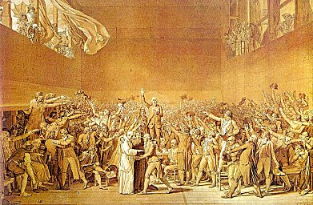

  
[Intangible Textual Heritage](../../index)  [Sub Rosa](../index.md) 

------------------------------------------------------------------------

[Buy this Book at
Amazon.com](https://www.amazon.com/exec/obidos/ASIN/B0021YV3J0/internetsacredte.md)

------------------------------------------------------------------------

[Get PDF](pc.pdf.md)

------------------------------------------------------------------------

<table width="75%">
<colgroup>
<col style="width: 50%" />
<col style="width: 50%" />
</colgroup>
<tbody>
<tr class="odd">
<td width="50%" data-valign="TOP"> 
The Tennis Court Oath, by Jacques Louis David [1791] (Public Domain Image).</td>
<td width="50%" data-valign="CENTER"><h1 id="proofs-of-a-conspiracy" data-align="CENTER">Proofs of a Conspiracy</h1>
<h2 id="by-john-robison" data-align="CENTER">by John Robison</h2>
<h4 id="section" data-align="CENTER">[1798]</h4></td>
</tr>
</tbody>
</table>

------------------------------------------------------------------------

[Contents](#contents)    [Start Reading](pc00.md)    [Page
Index](pageidx)    [Text \[Zipped\]](pc.txt.gz.md)

------------------------------------------------------------------------

|                                                                                                                           |
|---------------------------------------------------------------------------------------------------------------------------|
|  |

John Robison (1739-1805) was a Scottish scientist, who late in life
wrote the one of the definitive studies of the Bavarian Illuminati. He
was a contemporary and collaborator with James Watt, with whom he worked
on an early steam car, contributor to the 1797 Encylopedia Britannica,
professor of philosophy at the University of Edinburgh, and inventor of
the siren.

Although Robison was very much an advocate of science and rationalism,
in later life, disillusioned by the French Revolution, he became an
ardent monarchist. In this work, Proofs of a Conspiracy, Robison laid
the groundwork for modern conspiracy theorists by implicating the
Bavarian Illuminati as responsible for the excesses of the French
Revolution. The Bavarian Illuminati, a rationalist secret society, was
founded by Adam Weishaupt in 1776 in what is today Germany. They had an
inner core of true believers, who secretly held radical atheist,
anti-monarchist and possibly proto-feminist views, at that time
considered beyond the pale. They recruited by infiltrating the numerous
(and otherwise benign) Freemasonic groups which were active at the time
on the continent. Necessarily they had a clandestine, compartmentalized,
hierarchical organizational form, which has led some modern conspiracy
theorists to identify them as the original Marxist-Leninist group.
However, this is most likely simply a case of parallel evolution.

Since we don't have convenient access to the source documents of the
Bavarian Illuminati we have to rely on Robison and the Abbé Barruel's
[Memoirs Illustrating the History of Jacobinism](../mhj/index.md), both in
the 'opposing views' category, for information on this group. The
Illuminati have today become a byword for a secret society which
hoodwinks its junior members and puppet-masters society at large. This
reputation is in no little part due to Robison's book. However, reading
between the lines, it becomes obvious that the Bavarian Illuminati were
what the American Old Left called a 'talk shop,' barely able to organize
a picnic, let alone the Terror. Instead, it seems, they were only
expressing views widespread in intellectual circles of the day. They
were not, as Robison claims, the fuse that lit the downfall of the
French Monarchy. Nonetheless, this book make fascinating reading, and in
conjunction with other historical accounts of the French Revolution,
helps dimensionalize the period for students of history.

*Production Notes*: This text was scanned from the retypeset 1967
Americanist Classics reprint, and the page numbering is from that
edition. The 1967 edition modernized the typography systematically,
except on the dedication page (particularly, substituting 's' for ƒ) but
left the original spelling intact. Note that the 1967 edition makes no
additional copyright claim on Robison's text (only on their modern
introduction, which I have omitted). US copyright law requires extensive
creative changes to a public domain text to allow a new claim of
copyright. I have corrected [in the usual way](errata.md) a few obvious
typos (which may have been introduced in the 1967 edition), but all of
the non-conforming spelling has been tacitly preserved. I have also
added a (public domain) translation of the Latin epigram on the
dedication page.

*--John Bruno Hare, November 18th 2006*

------------------------------------------------------------------------

 [Title Page](pc00.md)  
[Dedications](pc01.md)  
[Contents](pc02.md)  
[Introduction](pc03.md)  
[Chapter I. Schisms in Free Masonry](pc04.md)  
[Chapter II. The Illuminati](pc05.md)  
[Chapter III. The German Union](pc06.md)  
[Chapter IV. The French Revolution](pc07.md)  
[Postscript](pc08.md)  
