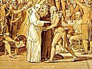

  
[Intangible Textual Heritage](../../index)  [Sub Rosa](../index) 
[Index](index)  [Previous](pc00)  [Next](pc02) 

------------------------------------------------------------------------

[Buy this Book at
Amazon.com](https://www.amazon.com/exec/obidos/ASIN/B0021YV3J0/internetsacredte)

------------------------------------------------------------------------

[Get PDF](pc.pdf)

------------------------------------------------------------------------

  
*Proofs of a Conspiracy*, by John Robison, \[1798\], at Intangible
Textual Heritage

------------------------------------------------------------------------

  [  
Click to enlarge](img/dedic.jpg)  
Dedication and Epigram  

I have preserved the original typography in the dedication and epigram,
but the typography has been modernized in the rest of the text.--JBH

TO THE RIGHT HONORABLE

WILLIAM WYNDHAM

SECRETARY AT WAR. &c. as &e. SIR,

It was with great ƒatisfaction that I learned from a Friend that you
coincided with me in the opinion, that the information contained in this
performance would make a uƒeful impreƒƒion on the minds of my
Countrymen.

I have preƒumed to inƒcribe it with your Name, that I may publicly
espreƒs the pleaƒure which I felt, when I found that neither a
ƒeparation for thirty years, nor the preƒƒure of the moƒt important
buƒineƒs, had effaced your kind remembrance of a College Acquaintance,
or abated that obliging and polite attention with which you favored au
in thoƒe early days of life.

The friendƒhip of the accompliƒhed and the worthy is the higheƒt honor;
and to him who is cut off, by want of health, from almoƒt every other
enjoyment, it is an ineƒtimable bleƒƒing. Accept, therefore, I pray, of
my grateful acknowledgements, and of my earneƒt wiƒhes for your Health,
Proƒperity, and increaƒing Honor.

With ƒentiments of the greateƒt Eƒteem and Reƒpect,  
         I am,  
                 SIR,  
                    Your moƒt obedient,  
                       and moƒt humble Servant,  
                            JOHN ROBISON.

EDINBURGH  
September 5, 1797.

  QUOD ƒi quis verâ vitam ratione gubernet,  
Divitiæ grandes homini ƒunt, vivere parcè  
Æquo anima: neque enim eƒt unquam penuria parvi,  
At claros ƒe homines voluêrunt atque potentes,  
Ut fundamento: ƒtabili fortuna maneres,  
Et placidam poƒƒent opulenti degere vitam:  
Nequicquam.--quoniam ad ƒummum ƒuccedere honorem  
Certantes, iter infeƒtum fecêre viaï,  
Et tamen a ƒummo quaƒi fulmen dejicit ictos  
Invidia interdum contemptim in Tartara tetra.

Ergo, Regibus occiƒis, ƒubverƒa jacebat  
Priƒtina majeƒtas ƒoliorum, et ƒceptra ƒuperba;  
Et capitis ƒummi præclarum inƒigne, cruentum,  
Sub pedibus volgi magnum lugebat honorem:  
Nam cupidè conculcatur nimis ante metutum.  
Res itaqe ad ƒummam fæcem, turbaƒque redibat,  
Imperium ƒibi cum ac ƒummatum quiƒque petebat.

                      LUCRETIUS, V. 1153.

Note: The following Latin and English texts of the above passage were
not in the original book, they are supplied for reference.--JBH

...quod siquis vera vitam ratione gubernet,  
divitiae grandes homini sunt vivere parce  
aequo animo; neque enim est umquam penuria parvi.  
at claros homines voluerunt se atque potentes,  
ut fundamento stabili fortuna maneret  
et placidam possent opulenti degere vitam,  
ne quiquam, quoniam ad summum succedere honorem  
certantes iter infestum fecere viai,  
et tamen e summo, quasi fulmen, deicit ictos  
invidia inter dum contemptim in Tartara taetra;...

Ergo regibus occisis subversa iacebat  
pristina maiestas soliorum et sceptra superba,  
et capitis summi praeclarum insigne cruentum  
sub pedibus vulgi magnum lugebat honorem;  
nam cupide conculcatur nimis ante metutum.  
res itaque ad summam faecem turbasque redibat,  
imperium sibi cum ac summatum quisque petebat.

But men wished glory for themselves and power  
Even that their fortunes on foundations firm  
Might rest forever, and that they themselves,  
The opulent, might pass a quiet life-  
In vain, in vain; since, in the strife to climb  
On to the heights of honour, men do make  
Their pathway terrible; and even when once  
They reach them, envy like the thunderbolt  
At times will smite, O hurling headlong down  
To murkiest Tartarus, in scorn;

And therefore kings were slain,  
And pristine majesty of golden thrones  
And haughty sceptres lay o’erturned in dust;  
And crowns, so splendid on the sovereign heads,  
Soon bloody under the proletarian feet,  
Groaned for their glories gone-for erst o’er-much  
Dreaded, thereafter with more greedy zest  
Trampled beneath the rabble heel. Thus things  
Down to the vilest lees of brawling mobs  
Succumbed, whilst each man sought unto himself  
Dominion and supremacy.

(Lucretius, De Rerum Naturum, Book 5, William Ellery Leonard
translation)

------------------------------------------------------------------------

[Next: Contents](pc02)

