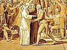

  
[Intangible Textual Heritage](../../index)  [Sub Rosa](../index.md) 
[Index](index)  [Previous](pc01)  [Next](pc03.md) 

------------------------------------------------------------------------

[Buy this Book at
Amazon.com](https://www.amazon.com/exec/obidos/ASIN/B0021YV3J0/internetsacredte.md)

------------------------------------------------------------------------

[Get PDF](pc.pdf.md)

------------------------------------------------------------------------

  
*Proofs of a Conspiracy*, by John Robison, \[1798\], at Intangible
Textual Heritage

------------------------------------------------------------------------

### Contents

|                                     |                          |
|-------------------------------------|--------------------------|
| Introduction                        | [1](pc03.htm#page_1.md)     |
| Chapter I. Schisms in Free Masonry. | [11](pc04.htm#page_11.md)   |
| Chapter II. The Illuminati.         | [57](pc05.htm#page_57.md)   |
| Chapter III. The German Union.      | [157](pc06.htm#page_157.md) |
| Chapter IV. The French Revolution.  | [207](pc07.htm#page_207.md) |
| Postscript                          | [286](pc08.htm#page_286.md) |

------------------------------------------------------------------------

[Next: Introduction](pc03.md)

