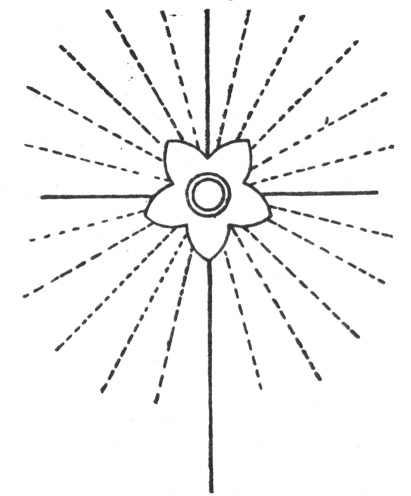

  
[Intangible Textual Heritage](../../index)  [Sub Rosa](../index.md) 
[Rosicrucians](../../eso/ros/index)  [Index](index)  [Previous](ptw08.md) 
[Next](ptw10.md) 

------------------------------------------------------------------------

[Buy this Book at
Amazon.com](https://www.amazon.com/exec/obidos/ASIN/1419140671/internetsacredte.md)

------------------------------------------------------------------------

*In the Pronaos of the Temple of Wisdom*, by Franz Hartmann, \[1890\],
at Intangible Textual Heritage

------------------------------------------------------------------------

p. 70

#### APPENDIX.

#### THE PRINCIPLES

#### OF THE

#### YOGA-PHILOSOPHY

#### OF THE

#### ROSICRUCIANS AND ALCHEMISTS.

The following pages were originally intended to form the basis of a
separate work, entitled "*A Key to the Secret Symbols of the
Rosicrucians*." As the idea of bringing out such a book has been
abandoned for the present, they have been added as a suitable appendix
to the foregoing historical notes.

It will be found that the doctrines presented herein contain the most
profound secrets, especially in regard to the "resurrection of the
flesh." They go to show that the physical body is neither a useless nor
a despicable thing, and that Matter is as necessary to Spirit, as Spirit
to Matter. Without the presence of a living body no resurrection could
take place; neither could the Spirit have any relative existence without
the presence of a material form. The state of Nirvana is not to be
attained by merely dreaming about it, and before Man can rise superior
to anything he must have attained that to which he desires to become
superior. Only from the soul resurrected within the body of flesh arises
the glorified spirit.

p. 71

PRAESENTIA MUNIAMUR EJUS IN ORBITU NOSTRO

 

Ex Deo nascimur. In Jesu morimur. Reviviscimus per Spiritum Sanctum.

### Chapter Seven

#### IN THE PRONAOS OF THE TEMPLE OF THE TRUE ROSY CROSS.

Our salvation is the life of Christ in us.

THE place or state wherein the true Rosicrucian lives is far too exalted
and glorious to be described in words. When we enter the vestibule of
the temple of the true Rosy Cross, we enter into a region of unalloyed
bliss and happiness. There is an effulgence of super-terrestrial light,
where all [laborious](errata.htm#17.md) thinking and exercise of the
imagination for the purpose of drawing logical inferences about the
unknown, ceases, for in that light is the realm of pure knowledge; to
live there is to perceive, and to perceive is to know. Into .that
paradise of celestial consciousness nothing impure can enter. No room is
there for terrestrial flesh and blood; but the spiritual beings which
inhabit that realm are made of the flesh and body of "Christ," in other
words, of the substance of the spiritual soul.

H. P. Blavatsky, in her "Key to Theosophy," says that there are beings
having attained a state of spiritual consciousness which would entitle
them to enter the state of Nirvana; nevertheless, out of compassion for
mankind, they still remain residents of this earth, inhabiting invisibly
for mortal eyes the astral plane of our planet. In that, she describes
the true order of the *Golden and Rosy Cross* as a spiritual

p. 72

\[paragraph continues\] Brotherhood, and
if one of these superior beings, for some purpose or other, reincarnates
in a human body upon this planet, then will there be a real Rosicrucian
in a visible form upon this earth.

The "history" of that "brotherhood" is the history of the evolution of
the world, and that of the spiritual regeneration of the soul and the
body of man; for although each of these individual beings had its own
[terrestrial](errata.htm#18.md) history and experiences in passing through
many incarnations upon this planet, nevertheless, in its essential
points the history of all is alike, and consisted in the conquering of
the low and the unfoldment of the high. They all had to bear the Cross
of suffering before they could become crowned with victory; they all had
to crucify their selfish and personal will, and die in regard to all
that attracts the soul to the sphere of earthly desires and illusions
before they could have the spiritual faculties of their souls unfolded
like the Rose whose leaves are unfolded by the rays of the rising sun.

\_\_\_\_\_\_\_\_\_\_\_\_\_\_\_\_

#### ROSICRUCIAN RULES.

1\. *Love God above all*.

To "love God" means to love wisdom and truth. We can love God in no
other way than in being obedient to Divine law; and to enable us to
exercise that obedience conscientiously requires knowledge of the law,
which can only be gained by practice.

2\. *Devote your time to your spiritual advancement*.

As the sun without leaving his place in the sky sends his rays upon the
earth to shine upon the pure and the impure, and to illuminate even the
most minute material objects with his light; likewise the spirit of man
may send his mental rays into matter to obtain knowledge of all
terrestrial things; but there is no need that the spirit should thereby
lose its own divine self-consciousness, and be itself absorbed by the
objects of its perception.

3\. *Be entirely unselfish*.

Spiritual knowledge begins only where all sense of self ceases. Where
the delusion which causes man to imagine himself to be a being separated
and isolated from others ends, there he begins to realize his true state
as an all-embracing universal and divine self-conscious power.

4\. *Be* [*temperate*](errata.htm#19.md), *modest, energetic, and silent*.

The door to the inner temple is called "Contentment"; but no animal can
enter therein, only he who walks uprightly, being conscious of his true
dignity as a human being. Without energy, nothing can be accomplished;
and only in the silence, when all thoughts and desires are at rest, can
the Divine harmonies penetrate to the internal ear.

5\. *Learn to know the origin of the* METALS *contained within thyself*.

Ignorance is the cause of suffering. That which is material must be
crucified and die, so that that which is spiritual may be resurrected
and live.

p. 73

6\. *Beware of quacks and pretenders*.

He who claims to be in possession of knowledge knows nothing; only he
through whom the Word of wisdom speaks is wise.

7\. *Live in constant adoration of the highest good*.

The worm seeks for pleasure among abomination and filth; but the free
eagle spreads his wings and rises up towards the sun.

8\. *Learn the theory before you attempt the practice*.

He who travels with a trustworthy guide will be safer than he who
refuses to profit by the experience of another.

9\. *Exercise charity towards all beings*.

All beings are one in the spirit; divided from each other merely by the
illusion of form. He who is charitable towards another form in which the
universal One Life is manifest, saves suffering to his own self.

10\. *Read the ancient books of wisdom*.

Books are to the unripe mind that which the mother's milk is to the
nursling. We must receive drink from others until we have gained
sufficient strength and experience to descend to the living fountain
within ourselves, and to draw from there the water of truth.

11\. *Try to understand their secret meaning*.

That which is external may be seen with the external eye; but that which
is spiritual can only be seen with the eye of the spirit.

These are the eleven rules which ought to be followed by those who
desire to enter the temple of the Rosy Cross; but the Rosicrucians have
a twelfth rule, an *Arcanum*, in which great powers reside, but of which
it is not lawful to speak. This Arcanum will be given to those who
deserve it, and by its aid they will find light in the darkness, and a
guiding hand through the labyrinth. This Arcanum is inexpressible in the
language of mortals, and it can, therefore, only be communicated from
*heart to heart*. There is no torture strong enough to extract it from
the true Rosicrucian; for even if he were willing to reveal it, those
who are unworthy of it are not capable of receiving it.

\_\_\_\_\_\_\_\_\_\_\_\_\_\_\_\_

#### THE DUTIES OF A ROSICRUCIAN.

Those who are dead in the flesh will read the following with the
external understanding; those who live in the spirit will see its
internal meaning, and act accordingly.

The duties of a true Rosicrucian are:—

1\. *To alleviate suffering and to cure the sick without accepting any
remuneration*.

The medicine which they give is more valuable than gold; it is of an
invisible kind, and can be had for nothing everywhere.

2\. *To adopt the style of their clothing to the costumes of the country
wherein they reside for the time being*.

The clothing of the spirit is the form which he inhabits, and must be
adapted to the conditions of the planet whereon he resides.

p. 74

3\. *To meet once a year in a certain place*.

Those who do not meet at that place, when their terrestrial career is
over will have their names taken out of the book of life.

4\. *Each member has to select a proper person to be his successor*.

Each man is himself the creator of that being whose personality he
adopts on the next step on the ladder of evolution.

5\. *The letters R.C. are the emblem of the order*.

Those who have truly entered the order will bear the marks upon their
body, which cannot be mistaken by him who is capable of recognising
them.

6\. *The existence of the Brotherhood is to be kept secret for one
hundred years, beginning from the time when it was first established*.

Nor will the "hundred years" be over until man has awakened to the
consciousness of his own divine nature.

\_\_\_\_\_\_\_\_\_\_\_\_\_\_\_\_

#### THE SECRET SIGNS OF THE ROSICRUCIANS.

There are sixteen signs by which a member of the order of the
Rosicrucians may be known. He who possesses only a few of those signs is
not a member of a very high degree, for the true Rosicrucian possesses
them all.

1\. *The Rosicrucian is Patient*.

His first and most important victory is the conquest of his own self. It
is the victory over the LION, who has bitterly injured some of the best
followers of the Holy Cross. He is not to be vanquished by a fierce and
inconsiderate attack made upon him; but he must be made to surrender to
patience and fortitude. The true Rosicrucian tries to overcome his
enemies by kindness, and those who hate him by gifts. He heaps not
curses, but the burning fire of love upon their heads. He does not
persecute his enemies with the sword, or with faggots, but he suffers
the weeds to grow with the wheat until they are both matured, when they
will be separated by Nature.

2\. *The Rosicrucian is Kind*.

He never appears gloomy or melancholy, or with a scowl or sneer upon his
face. He acts kindly and politely towards everybody, and is always ready
to render assistance to others. Although he is different from the
majority of other people, still he tries to accommodate himself to their
ways, habits and manners, as much as his dignity will permit. He is,
therefore, an agreeable companion, and knows how to converse with the
rich as well as with the poor, and to move among all classes of society
so as to command their respect; for he has conquered the bear of
vulgarity.

3\. *The Rosicrucian knows no Envy*.

Before he is accepted into the order he must go through the terrible
ordeal of cutting off the head of the snake of envy; which is a very
difficult labour, because the snake is sly, and easily hides itself in
some corner. The true Rosicrucian is always content with his lot,
knowing that it is such as he deserves it to be. He never worries about

p. 75

the advantages or riches which others possess, but wishes always the
best to everybody. He knows that he will obtain all he deserves, and he
cares not if any other person possesses more than he. He expects no
favours, but he distributes his favours without any partiality.

4\. *The Rosicrucian does not Boast*.

He knows that man is nothing but an instrument in the hands of GOD, and
that he can accomplish nothing useful by his own will; the latter being
nothing but the will of GOD perverted in man. To GOD he gives all the
praise, and to that which is mortal he gives all the blame. He is in no
inordinate haste to accomplish a thing, but he waits until he receives
his orders from the Master who resides above and within. He is careful
what he speaks about, and uses no unhallowed language.

5\. *The Rosicrucian is not Vain*.

He proves thereby that there is something real in him, and that he is
not like a blown-up bag filled with air. Applause or blame leaves him
unaffected, nor does he feel aggrieved if he is contradicted or
encounters contempt. He lives within himself, and enjoys the beauties of
his own inner world, but he never desires to show off his possessions,
nor to pride himself on any spiritual gifts which he may have attained.
The greater his gifts, the greater will be his modesty, and the more
will he be willing to be obedient to the law.

6\. *The Rosicrucian is not Disorderly*.

He always strives to do his duty, and to act according to the order
established by the law. He cares nothing for externalities, nor for
ceremonies. The law is written within his heart, and therefore all his
thoughts and acts are ruled by it. His respectability is not centred in
his external appearance, but in his real being, which may be compared to
a root from which all his actions spring. The interior beauty of his
soul is reflected upon his exterior, and stamps all his acts with its
seal; the light existing in his heart may be perceived in his eye by an
expert; it is the mirror of the Divine image within.

7\. *The Rosicrucian is not Ambitious*.

There is nothing more injurious to spiritual development and expansion
of the soul than a narrow mind and a selfish character. The true
Rosicrucian always cares much more for the welfare of others than for
his own. He has no private or personal interest to defend or foster. He
always seeks to do good, and he never avoids any opportunity which may
present itself for that purpose.

8\. *The Rosicrucian is not Irritable*.

It is evident that a person who works for the benefit of the whole will
be hated by those whose personal advantages are not benefited thereby;
because selfishness is opposed to magnanimity, and the claims of the few
are not always compatible with the interests of the community. The
Rosicrucian will therefore be often resisted by narrow-minded and
short-sighted people; he will be slandered by calumniators, his motives
will be misrepresented, he will be misjudged by the ignorant,

p. 76

ridiculed by the would-be wise, and taunted by the fool. All such
proceedings, however, cannot excite or irritate the mind of the true
Rosicrucian, nor disturb the divine harmony of his soul; for his faith
rests in the perception and knowledge of the truth within himself. The
opposition of a thousand ignorant people will not induce him to desist
from doing that which he knows to be noble and good, and he will do it
even if it should involve the loss of his fortune or of his life. Being
able and accustomed to direct his spiritual sight towards the divine, he
cannot be deluded by the illusions of matter, but clings to the eternal
reality. Being surrounded by angelic influences, and listening to their
voices, he is not affected by the noise made by the animals. He lives in
the company of those noble beings, who were once men like others, but
who have become transfigured, and who are now beyond the reach of the
vulgar and low.

9\. *The Rosicrucian does not think evil of others*.

Those who think evil of others see merely the evil which exists within
themselves reflected and mirrored forth in others. The Rosicrucian is
always willing to recognise in everything that which is good. Tolerance
is a virtue by which the Rosicrucian is eminently distinguished from
others; and by which he may be known. If a thing appears to be
ambiguous, he suspends his judgment about it until he has investigated
its nature; but as long as his judgment is not perfect, he is more
inclined to form a good opinion than an evil one about everything.

10\. *The Rosicrucian loves justice*.

He, however, never sets himself up as a judge over the faults of others,
nor does he wish to appear to be wise by censuring the mistakes of
others. He does not enjoy gossip, and cares no more about the
foolishness committed by others, than he would about the buzzing of a
fly or the capers of a monkey. He finds no pleasure in listening to
political or personal quarrels, disputations, or mutual recriminations.
He cares nothing for the cunningness of a fox, the dissimulation of a
crocodile, or the rapacity of a wolf, and is not amused by the stirring
up of mud. His nobility of character lifts him up into a sphere far
beyond all such trifles and absurdities, and being above the sensual
plane, wherein ordinary mortals find their happiness and enjoyment, he
lives with those who do not think evil of each other, who do not rejoice
about an injustice done to their brother, or make merry about his
ignorance, and enjoy his misfortunes. He enjoys the company of those who
love the truth, and who are surrounded by the peace and harmony of the
spirit.

11\. *The Rosicrucian loves the truth*.

There is no devil worse than falsehood and calumny. Ignorance is a
nonentity, but falsehood is the substance of evil. The calumniator
rejoices whenever he has found something upon which to base his lies and
to make them grow like mountains. Opposed to it is the truth, it being a
ray of light from the eternal fountain of GOOD, which has

p. 77

the power to transform man into a divine being. The ROSICRUCIAN seeks,
therefore, no other light but the light of truth, and this light he does
not enjoy alone, but in company of all who are good and filled with its
divine majesty, whether they live on this earth or in the spiritual
state; and he enjoys it above all with those who are persecuted,
oppressed, and innocent, but who will be saved by the truth.

12\. *The Rosicrucian knows how to be silent*.

Those who are false do not love the truth. Those who are foolish do not
love wisdom. The true Rosicrucian prefers to enjoy the company of those
who can appreciate truth to that of those who would trample it with
their feet. He will keep that which he knows locked up within his heart,
for in silence is power. As a minister of state does not go about
telling to everybody the secrets of the king; so the Rosicrucian does
not parade before the public the revelations made to him by the king
within, who is nobler and wiser than all the earthly kings and princes;
for they only rule by the authority and power derived from Him. His
secrecy ceases only when the king commands him to speak, for it is then
not he who speaks, but the truth that is speaking through him.

13\. *The Rosicrucian believes that which he knows*.

He believes in the immutability of eternal law, and that every cause has
a certain effect. He knows that the truth cannot lie, and that the
promises made to him by the king will be fulfilled, if he does not
himself hinder their fulfilment. He is, therefore, inaccessible to doubt
or fear, and puts implicit confidence in the divine principle of truth,
which has become alive and conscious within his heart.

14\. *The Rosicrucian's hope is firm*.

Spiritual hope is the certain conviction resulting from a knowledge of
the law, that the truths recognised by faith will grow and be fulfilled;
it is the knowledge of the heart, and very different from the
intellectual speculation of the reasoning brain. His faith rests upon
the rock of direct perception and cannot be overthrown. He knows that in
everything, however evil it may appear to he, there is a germ of good,
and he hopes that in the course of evolution that germ will become
developed, and thus evil be transformed into good.

15\. *The Rosicrucian cannot be vanquished by suffering*.

He knows that there is no light without shadow, no evil without some
good, and that strength only grows by resistance. Having once recognised
the existence of the Divine principle within everything, external
changes are to him of little importance, and do not deserve great
attention. His main object is to hold on to his spiritual possessions,
and not to lose the crown which he has gained in the battle of life.

16\. *The Rosicrucian will* [*always*](errata.htm#20.md) *remain a member
of his society*.

Names are of little importance. The principle which presides over the
Rosicrucian Society is the truth; and he who knows the truth, and
follows it in practice, is a member of the society over which the truth

p. 78

practises. If all names were changed and all languages altered, the
truth would remain the same; and he who lives in the truth will live
even if all nations should pass away.

These are the sixteen signs of the true Rosicrucians, which have been
revealed to a pilgrim by an angel who took away the heart of the
pilgrim, leaving in its place a fiery coal, which is now incessantly
burning and glowing with love of the universal brotherhood of humanity.

\_\_\_\_\_\_\_\_\_\_\_\_\_\_\_\_

#### ROSICRUCIAN JEWELS.

The most valuable jewel of the Rosicrucians is WISDOM, which is
represented by a pure DIAMOND in the centre of the ROSE, but the CROSS
is adorned with twelve jewels of priceless value, in all of which the
power that resides in the truth is manifested. These jewels are:

1\. *Jasper* (dark green). The power of active light, multiplying itself
to a sevenfold degree, and evolving seven states of the one light, by
which the seven states of darkness may be consumed.

2\. *Hyacinth* (yellow). LOVE, born from the matrix of Light,
manifesting itself as it grows, and emitting red rays. Its power
overcomes the spirit of anger and violence.

3\. *Chrysolite* (white). Princely wisdom. It confounds that which is
foolish and vain, subdues it, and comes out of the battle victorious.

4\. *Sapphire* (blue). Truth; originating and growing out of its own
essence. It overcomes doubt and vacillation.

5\. *Smaragd* (green). The blooming spring in its eternal justice,
destroying the unjust attributes of a perverted and degenerate nature,
and opening the fountain of infinite treasures.

6\. *Topaz* (golden). The symbol of peace, mild and pleasant. It suffers
no impurity or division to exist, neither does it admit that which
causes separation and quarrels. It heals ruptures and cures wounds.

7\. *Amethyst* (violet). Impartiality, equilibrium of justice and
judgment. It cannot be falsified, bent, or counterfeited. It weighs all
things in the scales of justice, and is opposed to fraud, cruelty, or
tyranny.

8\. *Beryl* (diverse colours). Meekness, humility; the equal temperature
of the spirit, being kind and good, and overcoming wrath, stubbornness,
and bitterness.

9\. *Sardis* (light red). The high magical FAITH, growing into power,
and destroying fear, scepticism, and superstition,

10\. *Chrysoprase* (light green). Invisible power and strength,
overcoming all opposition, allowing nothing to remain which could
possibly resist the law.

11\. *Sardonyx* (striped). Triumphant JOY and gladness, flowing from the
eternal fountain of happiness, destroying all sorrow and sadness. (May
it bless you!).

p. 79

12\. *Chalcedony* (striped). The crown of Victory, dominion, glory. The
keystone and the greatest of all miracles, turning everything to the
glorification of GOD.

\_\_\_\_\_\_\_\_\_\_\_\_\_\_\_\_

#### ROSICRUCIAN SYMBOLS

#### SIGNS FROM THE HEART OF THE CELESTIAL MOTHER.

(From the work of Antonio Ginther. August Vindelicorum. 1741.)

*Prænesis*. A ship in the open sea, with a floating anchor, and a star
shining overhead, with the inscription: Hac monstrante viam.

*Emblema* 1. An open book with the name MARIA, and a heart transfixed by
a sword, with the inscription: *Omnibus in omnibus*.

2\. A seven-headed monster threatened with a club. Inscription: *In
virtute tua*.

3\. A closed and sealed door with an angel attempting to open it.
Inscription: *Signatur ne perdatur*.

4\. A landscape representing an island. The sun rises and the stars
shine. Inscription: *Aurora ab lacrymis*.

5\. An orange tree bearing fruits, of which the inner part is sweet,
while the rind is bitter. Inscription: *Dulce amarum*.

6\. An altar with a fire upon it, in which a heart is burning, sending
out a sweet odour. Inscription: *In odorem suavitatis*.

7\. A pure white lily in a flower-pot, standing in a garden.
Inscription: *Virginei laus prima pudoris*.

8\. An angel separating wheat from chaff by means of a sieve.
Inscription: *Dimittit inanes*.

9\. A ring with a jewel exhibited upon a table. Inscription: *Honori
invincem*.

10\. A globe illuminated by the full moon. Inscription: *Plena sibi et
aliis*.

11\. Jacob's ladder with seven steps, reaching from the earth up to
heaven. Inscription: *Descendendo ascendendo*.

12\. A sun-dial attached to the wall of a tower. Inscription:
*Altissimus obnumbrat*.

13\. The signs of the Zodiac, with the sun passing through the sign of
the Virgin. Inscription: *Jam mitius ardet*.

14\. A hen brooding in a stable, brooding over eggs. Inscription: *Parit
in alieno*.

15\. Two palm-trees, inclined towards each other. Inscription: *Blando
se pace salutant*.

16\. A grape-vine, cut from the trunk, is weeping. Inscription: *Ut
gaudeas mero*.

17\. A plant, representing a myrrh. Inscription: *Amara sed salubris*.

18\. A painter's easel, with a cloth ready for painting. Inscription:
*Qua forma placebit*.

p. 80

19\. A heart transfixed by a sword. Inscription: *Usque ad divisionem
animæ*.

20\. Two doves pecking at each other. Inscription: *Amat et castigat*.

21\. A passion flower. Inscription: *Delectat et cruciat*.

22\. Wolves and sheep, eagles and bats, basking together in the
sunshine. Inscription: *Non possentibus offert*.

23\. A bird, sitting between thorns and thistles. Inscription: *His ego
sustentor*.

24\. Ivy winding around a dead tree. Inscription: *Nec mors separavit*.

25\. Two hearts in a winepress. Inscription: *Cogit in unum*.

26\. A crocodile shedding tears while eating a man. Inscription: *Plorat
et devorat*.

27\. Wolf devouring a sheep. Inscription: *Non est qui redimat*.

28\. Tulips inclining toward the rising sun. Inscription: *Languexit in
umbra*.

29\. Two stringed musical instruments; a hand plays upon one.
Inscription: *Unam tetigis se sat est*.

30\. A white lily growing between thorns. Inscription: *Transfixum
suavius*.

31\. The prophet Jonah thrown into the raging sea. Inscription: *Merger
ne mergantur*.

32\. The setting sun and the evening star. Inscription: *Sequitur
deserta cadentem*.

33\. A cross with a snake wound around it. Inscription: *Pharmacumnon
venenum*.

34\. Eagle, rising towards the sun. Inscription: *Ad te levavi oculos*.

35\. A squirrel standing upon a log, floating in the water and rowing.
Inscription: *Ne merger*.

36\. Light tower, illuminating the ocean. Inscription: *Erantibus una
micat*.

37\. Rock standing in a stormy sea. Inscription: *Non commovebitur*.

38\. A diamond exposed upon a table. Inscription: *In puritate pretium*.

39\. Grafting a tree. Inscription: *Accipit in sua*.

40\. A man hanging upon a tree. Inscription: *Non est hac tutior umbra*.

41\. A flock of sheep, each one bearing the letter T upon the forehead.
Inscription: *Non habet redargutionem*.

42\. Chandelier with seven lights. Inscription: *Non extinguetur*.

43\. A solar eclipse. Inscription: *Morientis sideris umbra*.

44\. The setting sun and a rainbow shedding tears. Inscription: *Desinit
in lacrymas*.

45\. Cypress blown at by winds coming from the four quarters of the
world. Inscription: *Concussio firmat*.

46\. Two hearts surrounded by thorns, with nails and a dagger.
Inscription: *Vulneratum vulnerat*.

p. 81

47\. A heart transfixed by a sword and instruments of torture.
Inscription: *Superminet omnes*.

48\. Beehive, and bees flying around flowers. Inscription: *Currit in
odorem*.

49\. A chemical furnace with retorts, from which drops are falling.
Inscription: *Color elicit imbres*.

50\. A man sowing grain into furrows. Inscription: *Ut surgat in ortum*.

51\. A cloth spread upon a field and sprinkled with water. Inscription:
*A lacrymis candor*.

52\. Ocean waves and a bird flying through the furrows of water.
Inscription: *Mersa non mergitur*.

53\. Noah's dove with an olive branch. Inscription: *Emergere nuntiat
orbem*.

54\. Flying eagle carrying a lamb. Inscription: *Tulit prædeam tartari*.

55\. Rain descending upon flowers. Inscription: *Dulce refrigerium*.

56\. Plumb-line and level. Inscription: *Recta a recto*.

57\. A hot iron upon an anvil. Inscription: *Dum calet*.

58\. Solitary bird sitting in a cave. Inscription: *Gemit dilectum
suum*.

59\. Elephant drinking blood flowing from a grape. Inscription: *Acuitur
in prælium*.

60\. Bird escaping from a nest. Inscription: *Ad sidera sursum*.

61\. Sunrise rays shining into a heart of adamant. Inscription: *Intima
lustrat*.

62\. A flying bird attached to a string. Inscription: *Cupio dissolvi*.

63\. Two birds of Paradise flying upwards. Inscription: *Innixo
ascendit*.

64\. A triple crown made of silver, iron, and gold. Inscription: *Curso
completo*.

65\. The statue of Dagon thrown down and broken to pieces. A corpse.
Inscription: *Cui honorem honorem*.

66\. The Red Sea dividing for the passage of the Israelites.
Inscription: *Illue iter quo ostendum*.

67\. Labyrinth with a human figure therein. A hand extended from heaven
holds a thread reaching down to the figure. Inscription: *Hac duce tuta
via est*.

68\. A camp. Among the tents is a standard bearing the image of a man.
Inscription: *Præsidium et decus*.

69\. A clock, whose finger points to the second hour. Inscription:
*Ultima secundo*.

70\. Ship at sea carrying a light. Fishes and birds are attracted by the
glow. Inscription: *Veniunt ad lucem*.

*Epilogus*.—Noah's ark in tranquil water. Inscription: *Non mergitur,
sed extollitur*.

p. 82

#### SIGNS REFERRING TO THE DIVINE CHILD.

(From the above-mentioned work.)

*Prænesis*.—A hen with chickens under her wings. A hawk preying in the
air above. Inscription: *Sub umbra alarum tuarum*.

*Emblema*. 1. A figure kneeling and holding a book wherein is
represented a fiery heart. Inscription: *Tolle lege*.

2\. Altar upon which a fire is lighted by a sunray. Inscription:
*Extinctos suscitat ignes*.

3\. Sunray falling through a lens and setting a ship on fire.
Inscription: *Ignis ab Primo*.

4\. Sun shining upon a lambskin extended upon the earth. Inscription:
*Descendit de cæ is*.

5\. A chrysalis upon a leaf. Inscription: *Ecce venio*.

7\. The sea and the rising sun. Inscription: *Renovabit faciem terræ*.

8\. A rising sun eclipsed by the moon. Inscription: *Condor ut exorior*.

9\. A chicken and an eagle in the air. The former is protected against
the latter by a shield. Inscription: *A facie persequentis*.

10\. A rose in the midst of a garden. Inscription: *Hæc mihi sola
placet*.

11\. A lamb burning upon an altar. Inscription: *Deus non despicies*.

12\. Dogs hunting. Inscription: *Fuga salutem*.

13\. A lamb dying at the foot of a cross. Inscription: *Obediens usque
ad mortem*.

14\. The ark of the covenant. Rays of lightning. Inscription: *Procul
este profani*.

15\. Sun in the midst of clouds. Inscription: *Fulgura in pluvium fuit*.

16\. Sun shining upon sheep and wolves. Inscription: *Super robos et
malos*.

17\. A well and a pitcher. Inscription: *Hauriar, non exhauriar*.

18\. Animals entering the ark. Inscription: *Una salutem*.

19\. Shepherd carrying a lamb. Inscription: *Onus meum leve*.

20\. Sheep drinking at a well. The water is stirred by a pole.
Inscription: *Similem dant vulnera formam*.

21\. A dove sitting upon a globe. Inscription: *Non sufficit una*.

22\. Light penetrating the clouds. Inscription: *Umbram fugat veritas*.

23\. A vineyard and the rising sun. Inscription: *Pertransiit
beneficiendo*.

24\. Three hearts with a sieve floating above them. Inscription: *Cælo
contrito resurgent*.

25\. Swan cleaning his feathers before proceeding to eat. Inscription:
*Antequam comedum*.

26\. A hungry dog howling at the moon. Inscription: *Inanis impetus*.

27\. Ark of the covenant drawn by two oxen. Inscription: *Sancta
sancte*.

28\. A winepress. Inscription: *Premitur ut experimat*.

29\. An opening bud. Inscription: *Vulneribus profundit opes*.

p. 83

30\. Amor shooting arrows at a heart. Inscription: *Donec attingam*.

31\. Cross and paraphernalia for crucification. Inscription: *Præbet non
prohibet*.

32\. A sunflower looking towards the rising sun. Inscription: *Usque ad
occasum*.

33\. Drops of sweat falling down in a garden. Inscription: *Tandem
resoluta venit*.

34\. Sword protruding from the clouds. Inscription: *Cædo noncedo*.

35\. Hammer and anvil, a forge and a fire. Inscription: *Ferendo, non
feriendo*.

36\. A ram crowned with thorns upon an altar. Inscription: *Victima
coronata*.

37\. A sheep carrying animals. Inscription: *Quam grave portat onus*.

38\. A crucified person and a snake upon a tree. Inscription: *Unde mors
unde vita*.

39\. A tree shedding tears into three dishes. Inscription: *Et læsa
medelam*.

40\. A spring fountain. Inscription: *Rigat ut erigat*.

41\. A heart offered to an eagle. Inscription: *Redibit ad Dominum*.

42\. A heart upon a cross surrounded by thorns, crowned with a laurel.
Inscription: *Pignus amabile pacis*.

43\. Bird persecuted by a hawk seeks refuge in the cleft of a rock.
Inscription: *Hoc tuta sua sub antro*.

44\. Target with a burning heart in the centre; Amor shooting arrows at
it. Inscription: *Trahe mi post te*.

45\. Pelican feeding her young ones with her own blood. Inscription: *Ut
vitam habeant*.

47\. Phoenix sinking into the flames. Inscription: *Hic mihi dulce
mori*.

48\. Blood from a lamb flowing into a cup. Inscription: *Purgantes
temperat ignis*.

49\. Clouds from which proceed rays of lightning. Inscription: *Lux
recto fatumque noscenti*.

50\. Eagle flying towards the sun. Inscription: *Tunc facie ad faciem*.

Epilogus.—A hedgehog, having rolled in fruits, is covered with them.
Inscription: *Venturi providus ævi*.

*He who can see the meaning of all these allegories has his eyes open*.

p. 84

#### TABULA SMARAGDINA.

 

#### ERBA SECRETORUM HERMETIS.

It is, beyond any doubt, most certain and true, that the Below is like
the Above, and thereby can be accomplished the miracle of one only
thing. As all things are derived from only one thing, by the will and
the word of the One who created it in his mind; likewise all things
result from this unity by the order of nature. Its father is the sun,
its mother the moon; the air carries it in its womb; its nurse is the
earth. This thing is the origin of all perfections that exist throughout
the world. Its power is most perfect when it has again been reduced to
earth.

Separate the earth from the fire, and the subtle from that which is
gross; act with prudence, understanding, and modesty. It rises up from
the earth to the heavens, and returns again to the earth, taking unto
itself the power of the Above and the Below. Thus you will obtain the
glory of the whole world. Therefore discard all ignorance and impotency.
This is the strongest of all powers, for it overcomes all subtle things,
and can penetrate through all that is gross. Thus was the world created,
and from this originate rare combinations, and are wrought miracles of
various kinds. Therefore have I been called Hermes Trismegistus, having
obtained [three-parts](errata.htm#21.md) of the wisdom of the whole world.
This is what is to be said about the masterwork of the alchymical art.

------------------------------------------------------------------------

[Next: Chapter Eight. Alchemy](ptw10.md)
