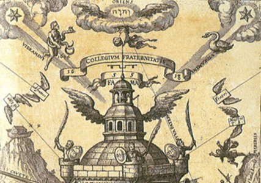

  
[Intangible Textual Heritage](../../index)  [Sub Rosa](../index) 

------------------------------------------------------------------------

[Buy this Book at
Amazon.com](https://www.amazon.com/exec/obidos/ASIN/B0026L7FOU/internetsacredte)

------------------------------------------------------------------------

<table width="75%">
<colgroup>
<col style="width: 50%" />
<col style="width: 50%" />
</colgroup>
<tbody>
<tr class="odd">
<td width="50%" data-valign="TOP"> 
Collegium Fraternitatis, from T. Schweighart, Speculum sophicum Rhodo-stauroticum [1604] (Public Domain Image)</td>
<td width="50%" data-valign="CENTER"><h1 id="the-real-history-of-the-rosicrucians" data-align="CENTER">The Real History of the Rosicrucians</h1>
<h2 id="by-arthur-edward-waite" data-align="CENTER">by Arthur Edward Waite</h2>
<h4 id="section" data-align="CENTER">[1887]</h4></td>
</tr>
</tbody>
</table>

------------------------------------------------------------------------

[Contents](#contents)    [Start Reading](rhr00)    [Page
Index](pageidx)    [Text \[Zipped\]](rhr.txt.gz)

------------------------------------------------------------------------

|                                                                                                                           |
|---------------------------------------------------------------------------------------------------------------------------|
|  |

This is Arthur Edward Waite's study of the elusive Rosicrucians, a
secret society of which the first public notice was in early 17th
century Germany. Was this an actual organization, or just a fantasy? No
actual Rosicrucians ever surfaced, but there was plenty of documentation
about them. The problem is that these documents are, for the most part,
obviously fictional. In time, a mythology grew up around the
Rosicrucians. Today there are groups which claim the name. These date at
the most to the late 19th century, although they usually claim *pro
forma* to go back as far as Egypt or Atlantis. The Rosicrucians have
also been woven by conspiracy theorists into their web alongside the
Freemasons, Illuminati, Templars, and so on, even though there is not a
shred of evidence for this.

Waite presents complete translations of all of the texts which defined
the Rosicrucians, including the [Fama Fraternitatis](rhr06), the
[Confessio Fraternitatis](rhr07), and the [Chemical Wedding of Christian
Rosencreutz](rhr08). The longest text, the [Chemical Wedding](rhr08) is
a fever-dream which is a thinly veiled alchemical allegory. The
authorship of these documents is disputed, but it may have been written
by Johann Valentin Andreas, a German theologian and writer. Waite also
surveys Rosicrucian literature from successive centuries, including
extensive quotes from authors who wrote about the Rosicrucians such as
Michael Maier, Robert Fludd, Thomas Vaughan and John Heydon. Heydon
wrote [Voyage to the Land of the Rosicrucians](rhr28), reminiscent of
Thomas More's [Utopia](../../utopia/more/index), about a voyage to an
obscure continent inhabited by Rosicrucians, included here in its
entirety. Waite concludes with a look at a 19th century 'Rosicrucian'
organization: Hargrave Jennings was, notably, a member of this group.
Speaking of whom. . .

The Real History stands in stark contrast to Hargrave Jennings' [The
Rosicrucians, their Rites and Mysteries](../rrm/index), which Waite
(justifiably) criticizes throughout. The very title of this book might
be considered a *riposte* to Jennings. The Rosicrucians are described as
celibate, which contradicts Jennings' focus on the role of *phallicism*
in the Rosicrucian mysteries. Waite also debunks two 'historical'
anecdotes which Jennings cites, specifically the subterranean sepulchre,
and the immortal Venetian. These two incidents were cited subsequently
by other authors as fact, using Jennings as the source. *Caveat Lector*.

All in all, this serves both as a survey of the literature about
Rosicrucians and an invaluable anthology of that literature. Waite,
although he had a solid background in the occult, is in a firmly
rationalist mode in this book. The Real History will be of use to both
academic and general readers.

------------------------------------------------------------------------

 [Title Page](rhr00)  
[Analysis of Contents](rhr01)  
[Preface](rhr02)  
[Introduction](rhr03)  
[Chapter I. On The State of Mystical Philosophy in Germany at the Close
of the Sixteenth Century](rhr04)  
[Chapter II. The Prophecy of Paracelsus, and The Universal Reformation
of the Whole Wide World](rhr05)  
[Chapter III: The Fama Fraternitatis](rhr06)  
[Chapter IV. The Confessio Fraternitatis](rhr07)  

### Chapter V. The Chymical Marriage of Christian Rosencreutz

[Introduction](rhr08)  
[The First Day](rhr09)  
[The Second Day](rhr10)  
[The Third Day](rhr11)  
[The Fourth Day](rhr12)  
[The Fifth Day](rhr13)  
[The Sixth Day](rhr14)  
[The Seventh Day](rhr15)  

 

[Chapter VI. On The Connection of the Rosicrucian Claims With Those of
Alchemy and Magic](rhr16)  
[Chapter VII. Antiquity of the Rosicrucian Fraternity](rhr17)  
[Chapter VIII. The Case of Johann Valentin Andreas](rhr18)  
[Chapter IX. Progress of Rosicrucianism in Germany](rhr19)  
[Chapter X. Rosicrucian Apologists: Michael Maier](rhr20)  
[Chapter XI. Rosicrucian Apologists: Robert Fludd](rhr21)  
[Chapter XII. Rosicrucian Apologists: Thomas Vaughan](rhr22)  

### Chapter XIII. Rosicrucian Apologists: John Heydon

[Introduction](rhr23)  
[Apologue for an Epilogue](rhr24)  
[The Rosicrucians in England](rhr25)  
[A Very True Narrative...](rhr26)  
[The Spirit Euterpe](rhr27)  
[Voyage to the Land of the Rosicrucians](rhr28)  

 

[Chapter XIV. Rosicrucianism in France](rhr29)  
[Chapter XV. Connection Between the Rosicrucians and
Freemasons](rhr30)  
[Chapter XVI. Modern Rosicrucian Societies](rhr31)  
[Conclusion](rhr32)  
[Additional Notes](rhr33)  
[Appendix of Additional Documents](rhr34)  
