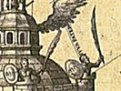

  
[Intangible Textual Heritage](../../index)  [Sub Rosa](../index) 
[Index](index)  [Next](rhr01) 

------------------------------------------------------------------------

[Buy this Book at
Amazon.com](https://www.amazon.com/exec/obidos/ASIN/B0026L7FOU/internetsacredte)

------------------------------------------------------------------------

  
*The Real History of the Rosicrucians*, by Arthur Edward Waite,
\[1887\], at Intangible Textual Heritage

------------------------------------------------------------------------

###### THE

# REAL HISTORY

###### OF THE

# ROSICRUCIANS

##### FOUNDED ON THEIR OWN MANIFESTOES,

##### AND ON FACTS AND DOCUMENTS COLLECTED FROM THE

##### WRITINGS OF INITIATED BRETHREN.

###### BY

### ARTHUR EDWARD WAITE,

AUTHOR OF "THE MYSTERIES OF MAGIC: A DIGEST OF THE WRITINGS OF ELIPHAS
LEVI," ETC.

##### WITH ILLUSTRATIONS.

#### LONDON:

#### GEORGE REDWAY, YORK STREET, COVENT GARDEN.

#### \[1887\]

  [  
Click to enlarge](img/title.jpg)  
Title Page  

Scanned, proofed and formatted at Intangible Textual Heritage, May 2006
by John Bruno Hare. This text is in the public domain in the United
States because it was published prior to 1923.

 

------------------------------------------------------------------------

[Next: Analysis of Contents](rhr01)
