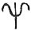
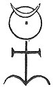
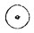

  
[Intangible Textual Heritage](../../index)  [Sub Rosa](../index) 
[Index](index)  [Previous](rhr08)  [Next](rhr10) 

------------------------------------------------------------------------

[Buy this Book at
Amazon.com](https://www.amazon.com/exec/obidos/ASIN/B0026L7FOU/internetsacredte)

------------------------------------------------------------------------

  
*The Real History of the Rosicrucians*, by Arthur Edward Waite,
\[1887\], at Intangible Textual Heritage

------------------------------------------------------------------------

p. 100

*The Chymical Marriage of Christian Rosencreutz*. *Anno* 1459.

*Arcana publicata vilescunt, et gratiam prophanata amittunt*.  
*Ergo: ne Margaritas objice porcis, seu Asino substernere rosas*.

### THE FIRST BOOK.

*The First Day*.

On an evening before Easter-day, I sate at a table, and having in my
humble prayer conversed with my Creator and Meditatio.considered many great mysteries
(whereof the Father of Lights had shewn me not a few), and being now
ready to prepare in my heart, together with my dear Paschal Lamb, a
small, unleavened, undefiled cake, all on a sudden ariseth so horrible a
tempest, that I imagined no other but that, through its mighty force,
the bill whereon my little house was founded would fly all in pieces.
But inasmuch as this, and the like, from the devil (who had done me many
a spight) was no new thing to me, I took courage, and persisted in my
meditation till somebody touched me on the back, whereupon I was so
hugely terrified that I durst hardly look about me, yet I shewed myself
as cheerful as humane frailty would permit. Now the same thing still
twitching me several times by the coat, I glanced back and behold it was
Praeconissaa fair and glorious lady, whose
garments were all skye-colour, and curiously bespangled with golden
stars. In her right hand she bare a trumpet of beaten gold, whereon a
Name was ingraven which I could well read but am forbidden as yet to
reveal. In her left hand she had a great bundle of letters in all
languages, which she (as I afterwards understood) was to carry into all
countries. She had also large and beautiful wings, full of eyes
throughout, wherewith she

p. 101

could mount aloft, and flye swifter than any eagle. As soon as I turned
about, she looked through her letters, and at length drew out a small
one, which, with great reverence, she laid upon the table, and, without
one word, departed from me. But in her mounting upward, she gave so
mighty a blast on her gallant trumpet that the whole hill echoed
thereof, and for a full quarter of an hour afterward I could hardly hear
my own words.

In so unlooked for an adventure I was at a, loss how to advise myself,
and, therefore, fell upon my knees, and besought my Creator to permit
nothing contrary to my eternal happiness to befall me, whereupon, with
fear and trembling, I went to the letter, which was now so heavy as
almost to Epistola. outweigh gold. As I
was diligently viewing it, I found a little Seal, whereupon was ingraven
a curious Cross, with Sigillum this
inscription IN HOC SIGNO  
VINCES.

As soon as I espied this sign I was comforted, not being ignorant that
it was little acceptable, and much less useful, to the devil. Whereupon
I tenderly opened the letter, and within it, in an azure field, in
golden letters, found the following verses written:--

|                    |
|--------------------|
|  |

    "This day, this day, this, this  
    The Royal Wedding is.  
Art thou thereto by birth inclined,  
And unto joy of God design’d?  
Then may’st thou to the mountain tend  
Whereon three stately Temples stand,  
And there see all from end to end.  
    Keep watch and ward,  
    Thyself regard;  
Unless with diligence thou bathe,  
The Wedding can't thee harmless save:  
He'll damage have that here delays;  
Let him beware too light that weighs."

p. 102

Underneath stood *Sponsus* and *Sponsa*.

De Nuptiis.As soon as I read this letter,
I was like to have fainted away, all my hair stood on end, and cold
sweat trickled down my whole body. For although I well perceived that
this was the appointed wedding whereof seven years before I was
acquainted in a bodily vision, and which I had with great earnestness
attended, and which, lastly, by the account and calculation of the
plannets, I found so to be, yet could Requisita in hospitibus. Secundum, 7. Pondera.I
never fore-see that it must happen under so grievous and perilous
conditions. For whereas I before imagined that to be a well-come guest,
I needed onely to appear at the wedding, I was now directed to Divine
Providence, of which until this time I was never certain. I also found,
the more I examined myself, that in my head there was 1. Electio incerta.onely gross misunderstanding,
and blindness in mysterious things, so that I was not able to comprehend
even those 2. Inscitia Ignorantia cæcitas
mentis.things which lay under my feet, and which I daily
conversed with, much less that I should be born to the searching out and
understanding of the secrets of Nature, since, in my opinion, 3, 4. Natura secreta.  
5, 6.Nature might everywhere find a more vertuous disciple, to
whom to intrust her precious, though temporary and changeable treasures.
I found also that my Mundana
affectio.bodily behaviour, outward conversation, and brotherly
love toward my neighbour was not duly purged and cleansed. Moreover, the
tickling of the flesh manifested itself, whose affection was bent only
to pomp, bravery, and worldly pride, not to the good of mankind; and I
was always contriving how by this art I might in a short time abundantly
increase my advantage, rear stately palaces, make myself an everlasting
name, and other the like carnal designs. But the obscure words
concerning the three Temples did particularly afflict me, which I was
not able to make out by

p. 103

any after-speculation. Thus sticking between hope and fear, examining
myself again and again, and finding only my own frailty and impotency,
and exceedingly amazed at the fore-mentioned threatening, at length I
betook myself to my usual course. After I had finished my most fervent
prayer, I laid me down in my bed, that so perchance myPreces. good angel by the Divine permission
might appear, and (as it had formerly happened) instruct me in this
affair, which, to the praise of God, did now likewise fall out. For I
was yet scarce asleep when me-thought I, together with a numberlessVisio per somnium multitude of men, lay
fettered with great chains in a dark dungeon, wherein we swarmed like
bees one overTurris Cæcitas. another, and
thus rendered each other's affliction more grievous. But although
neither I, nor any of the rest, could see one jot, yet I continually
heard one heaving himself above the other, when his chains or fetters
were become ever so little lighter. Now as I with the rest had continued
a good while in this affliction, and each was still reproaching the
other with his blindness and captivity, at length we heard many trumpets
sounding together, and kettle-drums beating so artificially thereto,
that it rejoyced us even in our calamity.

During this noise the cover of the dungeon was lifted up, and a little
light let down unto us. Then first might trulyIllustratio. have been discerned the bustle we
kept, for all went pesle-mesle, and he who perchance had too much heaved
up himself was forced down. again under the others' feet. In brief, each
one strove to be uppermost, neither did I linger, but, with my weighty
fetters, slipt from under the rest, and then heaved myself upon a Stone;
howbeit, I was several times caught at by others, from whom, as well as
I might, I guarded myself with hands and feet. We imagined that

p. 104

we should all be set at liberty, which yet fell out quite otherwise, for
after the nobles who looked upon us through the hole had recreated
themselves with our struggling, a Magister
carceris.certain hoary-headed man called to us to be quiet, and,
having obtained it, began thus to say on:

If wretched mortals would forbear  
  Themselves to so uphold,  
Then sure on them much good confer  
  My righteous Mother would:  
But since the same will not insue,  
  They must in care and sorrow rue,  
And still in prison lie. Vide S. Bernard,
Serm. 3, de 7 Fragmentis  
  Howbeit, my dear Mother will  
Their follies over-see,  
  Her choicest goods permitting still  
Too much in Light to be.  
  Wherefore, in honour of the feast  
We this day solemnize,  
  That so her grace may be increast,  
A good deed she'll devise;  
  For now a cord shall be let down,  
And whosoe’er can hang thereon  
  Shall freely be releast.

He had scarce done speaking when an Antient Matron commanded her
servants to let down the cord seven times into the dungeon, and draw up
whomsoever could hang upon it. Good God! that I could sufficiently
describe the hurry that arose amongst us; every one strove to reach the
cord, and only hindred each other. After seven minutes a little bell
rang, whereupon at the first pull the servants drew up Prima vectura.four. At that time I could not
come near the cord, having to my huge misfortune betaken myself to the
stone at the wall, whereas the cord descended in the middle. The cord
Seconda.was let down the second time, but
divers, because their chains were too heavy, and their hands too tender,
could not keep hold on it, and brought down others who else might have

p. 105

held on fast enough. Nay, many were forcibly pulled off by those who
could not themselves get at it, so envious were we even in this misery.
But they of all most moved my compassion whose weight was so heavy that
they tore their hands from their bodies and yet could not get up. Thus
it came to pass that at these five times very few were drawn up, for, as
soon as the sign was given, the servants were so nimble at the draught
that the most part tumbled one upon another. Whereupon, the greatest
part, and even myself, despaired of redemption, and called upon God to
have pitty on us, and deliver us out of this obscurity, who also heard
some of us, for when the cord came down the sixth time, Sexta. some hung themselves fast upon it, and
whilst it swung from one side to the other, it came to me, which I
suddenly catching, got uppermost, and so beyond all hope calve out;
whereat I exceedingly rejoyced, perceiving not the wound which in the
drawing up I received on my head by a sharpVulnus exturro cæcitatis. stone, till I, with
the rest of the released (as was always before done) was fain to help at
the seventh and last pull, atSeptima.
which, through straining, the blood ran down my cloathes. This,
nevertheless, through joy I regarded not.

When the last draught, whereon the most of all hung, was finished, the
Matron caused the cord to be laid away, and willed her aged son to
declare her resolution to the restMagistræ
filius. of the prisoners, who thus spoke unto them.

         Ye children dear  
         All present here,  
What is but now compleat and done  
Was long before resolved on;  
Whate’er my mother of great grace  
To each on both sides here hath shown;  
May never discontent misplace!  
The joyful time is drawing on p. 106  
When every one shall equal be--  
None wealthy, none in penury.  
Whoe’er received great commands  
Hath work enough to fill his hands  
Whoe’er with much hath trusted been,  
’Tis well if he may save his skin;  
Wherefore, your lamentations cease,  
What is’t to waite for some few dayes?

The cover was now again put to and locked, the trumpets and kettle-drums
began afresh, yet the bitter lamentation of the prisoners was heard
above all, and soon caused my eyes to run over. Presently the Antient
Matron, together with her son, sate down, and commanded the Redeemed
Magistra recens et evectos.should be told.
As soon as she had written down their number in a gold-yellow tablet,
she demanded everyone's Secretarusname;
this was also written down by a little page. Having viewed us all, she
sighed, and said to her son--"Ah, how hardly am I grieved for the poor
men in the dungeon! I would to God I durst release them all." Whereunto
her Cur non omnes evecti.son
replied--"Mother, it is thus ordained by God, against Whom we may not
contend. In case we all of us were lords, and were seated at table, who
would there be to bring up the service!" At this his mother held her
peace, but soon after she said--"Well, let these be freed from their
fetters," which was presently done, and I, though among the last, Gratitudo auctoris evecti.could not refrain,
hut bowed myself before the Antient Matron, thanking God that through
her had graciously vouchsafed to bring me out of darkness into light.
The rest did likewise to the satisfaction of the matron. Lastly, Nummus aureus.to every one was given a piece of
gold for a remembrance, and to spend by the way. On the one side thereof
was 

|                    |
|--------------------|
|  |

stamped the rising sun; on the other these three letters Deus Lux solis, vel Deo laus semper.D L S;
therewith all had license to depart to his own business, with this
intimation, *that we to the glory of God* 

p. 107

*should benefit our neighbours, and reserve in silence what we had been
intrusted with*, which we promised to do, and departed oneMandatum Taciturnitatis. from another. Because
of the wounds the fetters had caused me, I could not well go forward,
which the matron presently espying, calling me again to her side, said
to me--"My son, Discessus autoris.let not
this defect afflict thee, but call to mind thy infirmities, and thank
God who hath permitted thee, even in this world, to come into so high a
light. Keep these wounds for my sake." Vulnus ex
compedibus.

Whereupon the trumpets began again to sound, which so affrighted me that
I awoke, and perceived that it was onelyExperget
actio. a dream, which yet was so impressed on my imagination that
I was perpetually troubled about it, and methought I was still sensible
of the wounds on my feet. By all these things I well understood that God
had vouchsafed me to beSolatium. present
at this mysterious and hidden Wedding, wherefore with childlike
confidence I returned thanks to His Divine Majesty, and besought Him
that He would preserve me inPrecatio. His
fear, daily fill my heart with wisdom and understanding, and graciously
conduct me to the desired end. Thereupon I prepared myself for the way,
put on my whitePræparatio ad iter. linnen
coat, girded my loyns, with a blood-red ribbon bound cross-ways over my
shoulder. In my hat I stuck four red roses, that I might the sooner by
this token be taken notice of amongst the throng. For food I took bread,
salt, and water, which by the counsel of an understanding person I had
at certain times used, not without profit, in the like occurrences.
Before I parted from my cottage, I first, in this my wedding garment,
fell down upon my knees, and besought God to vouchsafe me a good issue.
I made a vow that if anything should by His Grace be Votum.revealed to me, I would imploy it neither
to my own honour

p. 108

nor authority in the world, but to the spreading of His name, and the
service of my neighbour. With this vow I departed out of my cell with
joy.

------------------------------------------------------------------------

[Next: The Second Day](rhr10)
