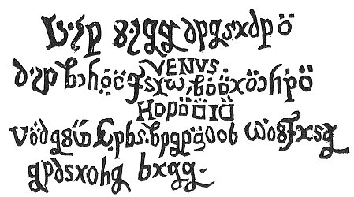
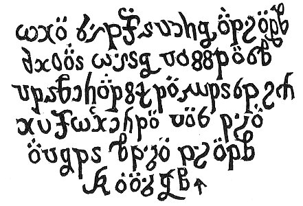
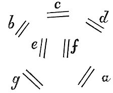

  
[Intangible Textual Heritage](../../index)  [Sub Rosa](../index) 
[Index](index)  [Previous](rhr12)  [Next](rhr14) 

------------------------------------------------------------------------

[Buy this Book at
Amazon.com](https://www.amazon.com/exec/obidos/ASIN/B0026L7FOU/internetsacredte)

------------------------------------------------------------------------

  
*The Real History of the Rosicrucians*, by Arthur Edward Waite,
\[1887\], at Intangible Textual Heritage

------------------------------------------------------------------------

*The Fifth Day*.

The night was over, and the dear wished-for day broken, Obambulatio antelucana. when hastily I got me
out of bed, more desirous to learn what might insue than that I had
sufficiently slept. After I had put on my cloathes, and according to my
custom was gone down stairs, it was still too early, and I found nobody
else in the hall, wherefore I entreated my Page to lead me a little
about the castle, and shew me somewhat that was rare, who now (as
always) willing, presently lead me down certain steps underground to a
great iron door, on which the following words were fixed in large copper
letters:--

 

p. 162

\[paragraph continues\] Thalamus veneris sepultæ.These I copied and set
down in my table-book. After this door was opened, the Page lead me by
the hand through a very dark passage till we came to a little door now
only put too, for, as the Page informed me, it was first opened
yesterday when the coffins were taken out, and had not since been shut.
As soon as we stepped in I espied the most pretious thing that Nature
ever created, for this vault had no other light but from certain huge
carbuncles. Thesaurus Regis.This was the
King's Treasury, but the most glorious and principal thing was a
sepulchre in the middle, so rich that I wondered it was no better
guarded, whereunto the Page answered me, that I had good reason to be
thankful to my planet, by whose influence I had now seen certain pieces
which no humane eye (except those of the King's family) Descriptio sepulchri.had ever viewed. This
sepulcher was triangular, and had in the middle of it a kettle of
polished copper, the rest was of pure gold and pretious stones. In the
kettle stood an angel, who held in his arms an unknown tree, whose fruit
continually falling into the kettle, turned into water therein, and ran
out into three small golden kettles standing by. This little altar was
supported by an eagle, an ox, and a lion, which stood on an exceeding
costly base. I asked my Page what this might signifie. "Here," said he,
"lies buried Lady Venus, that beauty which hath undone many a great man,
both in fourtune, honour, blessing, and prosperity"; after which he
showed me a copper door in Aliud
triclinium.the pavement, saying, "Here, if you please, we may go
further down." We descended the steps, where it was exceeding dark, but
the Page immediately opened a little chest in which stood a small
ever-burning taper, wherefrom he kindled one of the many torches that
lay by. I was mightily terrified and asked how he durst do this. He

p. 163

gave me for answer, "as long as the Royal Persons are still at rest I
have nothing to fear." Herewith I espied a rich bed ready made, hung
about with curious curtains, one of which he drew, and I saw the Lady
Venus stark nakedDescriptio corporis veneris
dormientis. (for he heaved up the coverlets too), lying there in
such beauty, and a fashion so surprising, that I was almost besides
myself, neither do I yet know whether it was a piece thus carved, or an
humane corps that lay dead there, for she was altogether immoveable, and
yet I durst not touch her. So she was again covered, yet she was still,
as it were, in my eye. But I soon espyed behind the bed a tablet on
which it was thus written.

 

I asked my Page concerning this writing, but he laughed, with promise
that I should know it too, and, he putting out the torch, we again
ascended. Then I better viewed all the little doors, and found that on
every corner there burned a small taper of pyrites of which I had before
taken no notice, for the fire was so clear that it looked much liker a
stone than a taper. From this heat the tree wasArboris calor ex facibus. forced continually to
melt, yet it still produced new fruit. "Now, behold," said the Page,
"when the tree shall be

p. 164

quite melted down, then shall Lady Venus awake and be the mother of a
King." Whilst he was thus speaking, in flew the little Cupid, who at
first was somewhat abashed at our presence, but seeing us both look more
like the dead Mulcta facta hujus
obambulationis.then the living, he could not refrain from
laughing, and demanded what spirit had brought me thither, whom I with
trembling answered, that I had lost my way in the castle, and was by
chance come hither, that the Page had likewise been looking up and down
for me, and at last lited upon me here, and that I hoped he would not
take it amiss. "Nay, then, ’tis well enough yet," said Cupid, "my old
busie gransir, but you might lightly have served me a scurvy trick, had
you been aware of this door. I must look better to it," and so he put a
strong lock on the copper door where we before descended. I thanked God
that he lited upon us no sooner; my Page, too, was the more jocond
because I had so well helped him at this pinch. "Yet can I not," said
Cupid, "let it pass unrevenged that you were so near stumbling upon my
dear mother." With that he put the point of his dart into one of the
little tapers, and heating it somewhat, pricked me with it on the hand,
which at that time I little regarded, but was glad that it went so well
with us. Meantime my companions were gotten out of bed and were come
into the hall, to whom I joyned myself, making as if I were then first
risen. After Cupid had carefully made all fast again, he came likewise
to us, and would needs have me shew him my hand, where he still Cupido illudit autori.found a little drop of
blood, at which he heartily laughed, and had the rest have a care of me,
as I would shortly end Mira Cupidinus
lætitia.my days. We all wondered how he could be so merry and
have no sence of yesterday's sad passages. Our President had meantime
made herself ready for a journey, coming in

p. 165

all in black velvet, yet she and her Virgins still bare theirPræsidissæ vestitus lugubris. branches of
lawrel. All things being in readiness, she bid us first drink somewhat,
and then presently prepare for the procession, wherefore we made no long
tarrying, but followed her out of the hall into the court, where stood
six coffins, and my companions thought no other but that the six Royal
Persons lay in them, but I well observed the device, though I knew not
what was to be done with these other. By each coffin were eight muffled
men. As soon as the musick went, it was so doleful a tune that I was
astonished at it, they took up the coffins, and we followed them into
the Garden, in the midst of which was erected a wooden edifice, have
round about the roof a glorious crown, and standing upon seven columns.
Within it were formed six sepulchers; by each of them was a stone, but
in the middle it had a round hollow rising stone. In these graves the
coffins were quietly, and with many ceremonies, laid; the stones were
shoved over them, and they shut fast, but the little chest was to lie in
the middle. Herewith were my companions deceived, for they imagined that
the dead corps were there. On the top of all was a great flag, having a
Phœnix painted on it, perhaps the more to delude us. After the funerals
were done, the Virgin, having placed herself upon the midmost stone,
made a short oration, Hospites vocantur ad
labores pro vita Regum. exhorting us to be constant to our
ingagements, not to repine at the pains we must undergo, but be helpful
in restoring the buried Royal Persons to life, and therefore, without
delay, to rise and make a journey with her to the Tower of Olympus, to
fetch thence the medicines necessary for this purpose.

This we soon agreed to, and followed her through another little door to
the shore, where the seven ships stood empty,

p. 166

and on them all the Virgins stuck up their Laurel branches, and, having
distributed us in the six ships, they caused us in God's name to begin
our voyage, and looked upon us as long as we were in sight, after which
they, with all the Virgines remanent in
arce.watchmen, returned into the Castle. Our ships had each of
them a peculiar device; five of them, indeed, had the five regular
bodies, each a several one, but mine, in which the Virgin too sate,
carried a globe. Thus we sailed on in a singular order, and each had
only two mariners. Foremost went the      a  
     ¦¦  
b ¦¦ c ¦¦ d ¦¦  
   e ¦¦ f ¦¦  
     g ¦¦ship *a* in which, as I conceive, the Moor lay. In this
were twelve musitians who played excellently well, and its device was a
pyramid. Next followed three abreast, *b*, *c*, and *d*, in which we
were disposed; I sate in *c*. Behind these came the two fairest and
stateliest ships, *e* and *f*, stuck about with many branches of lawrel,
and having no passengers in them; their flags were the sun and moon. But
in the rear 40 Virgines comites.was only
one ship, *g*, and in this were forty Virgins. Having passed over this
lake, we came through a narrow arm into the right sea, where all the
sirens, nymphs, and sea-goddesses attended us, and immediately
dispatched a Excipiuntur à
nymphis.sea-nymph unto us to deliver their present of honour to
the Wedding. It was a costly, great, set, round, and orient pearl, the
like to which hath not at any time been seen, 

|                    |
|--------------------|
|  |

either in ours or in the new world, The Virgins having friendly received
it, the nymph intreated that audience might be given to their
divertisements, which the Virgin was content to give, and commanded the
two great ships to stand into the middle, and to the rest to incompass
them in pentagon, after which the nymphs fell into a ring about them,
and with a most delicate sweet voice began thus to sing

p. 167

I.

There's nothing better here below  
Than beauteous, noble Love,  
Whereby we like to God do grow,  
And none to grief do move;  
Wherefore let's chant it to the King,  
That all the sea therewith may ring.  
We question, answer you!

II\.

What was it that at first us made?  
            ’Twas Love.  
And what hath grace afresh conveigh’d?  
            ’Twas Love.  
And whence (pray tell us!) were we born?  
            Of Love.  
How came we then again forlorn?  
            Sans Love.

III\.

Who was it, say, that us conceived?  
            ’Twas Love.  
Who suckled, nursed, and relieved?  
            ’Twas Love.  
What do we to our parents owe?  
            ’Tis Love.  
Why do they us such kindness show?  
            Of Love.

IV\.

Who gets herein the victory?  
            ’Tis Love.  
Can Love by search obtained be?  
            By Love.  
How may a man good works perform?  
            Through Love.  
Who into one can two transform?  
            ’Tis Love.

p. 168

V.

            Then let our song sound,  
            Till its eccho rebound,  
            To Love's honour and praise;  
May it ever increase  
With our noble Princes, the King and the Queen,  
The soul is departed, their body's within.

VI\.

     And as long as we live  
     God graciously give,  
     That as great love and amity  
     They bear each other mightily,  
     So we, likewise, by love's own flame  
     May reconjoyn them once again.

VII\.

     Then this annoy Into great joy  
     (If many thousand younglings deign)  
     Shall change, and ever so remain.

Autori perplacent nymphæ and cantus.These
having, with most admirable concent and melody, finished this song, I no
more wondred at Ulisses for stopping the ears of his companions; I
seemed to myself the most unhappy man alive that Nature had not made me
too so trim a creature. But the Virgin soon dispatched The nymphs rewarded.them, and commanded to set
sail; wherefore the nymphs, having been presented with a long red scarf
for a gratuity, dispersed themselves in the sea. I was at this time
sensible that Cupid began to work with me too, which tended little Autori desunt adhunc duo.to my credit; but as my
giddiness is likely to be nothing beneficial to the reader, I am
resolved to let it rest. This was the wound that in the first book I
received on my head in a dream. Let every one take warning by me of
loitering about Venus’ bed, for Cupid can by no means brook it. Turris Olympi.After some hours, we came within
ken of the Tower of

p. 169

\[paragraph continues\] Olympus; wherefore
the Virgin commanded by the discharge of some pieces to give signal of
our approach, and immediately we espyed a great white flag thrust out,
and a small gilded pinnace sent forth to meet us, wherein was a very
antient man, the Warder of the Tower, with certainCustos guards in white, by whom we were friendly
received, and conducted to the Tower, which was situated upon an island
exactly square, [1](#fn_52) and invironed with a
wall so firm andStructura thick that I
counted two hundred and sixty paces over. Dies. On the other side was a fine meadow with
certain little gardens, in which grew strange, and to me unknown fruits.
There was an inner wall about the Tower which itself was as if seven
round towers had been built one by another, yet the middlemost was
somewhat higher, and within they all entered one into another. Being
come to the gates of the Tower, we were led a little aside on the wall,
that so the coffins might be brought in without our notice, but of this
the rest knew nothing. We were conducted into the1. Conclave. Tower at the very bottom, which
was an excellently painted laboratory, where we were fain to beat and
washLabores hospitum. plants, precious
stones, and all sorts of things, extract their juice and essence, put up
the same in glasses, and deliver them to be laid up. Our Virgin was so
busie with us, and so full of directions, that she knew not how to give
us employment enough, so that in this island we were meer drudges till
we had atchieved all that was necessary for restoring the beheaded
bodies. Meantime, as I afterwards learned, three Virgins were in the
first apartmentVirginum. washing the
corps with diligence. Having at length almost done our preparation, some
broath, with a little

p. 170

Cibus. Potus.draught of wine, was brought
us, whereby I observed that we were not here for pleasure. When we had
finished our Lectus tenuis.day's work,
everyone had a mattress laid on the ground for him, wherewith we were to
content ourselves. For my part I was not much troubled with sleep, and
walking out into the garden, at length came as far as the wall, where,
the heaven being very clear, I could well give away the Autor speculator cœlum prosomno.time in
contemplating the stars. By chance I came to a great pair of stone
stairs leading to the top of the wall, and because the moon shone very
bright, I was so much the more confident, and, going up, looked too a
little upon the sea, which was exceeding calm. Thus having good
opportunity to consider better of astronomy, I found that this night
there would happen such a conjunction of the planets, the like to which
was not otherwise suddenly to be observed. Having looked a good while
into the sea, and it being just about midnight, I beheld from far the
seven Flames passing over sea hitherward, and betakeing themselves to
the top of the spire of the tower. This made me somewhat affraid; for as
soon as the Flames had settled themselves, the winds rose, and made the
sea very tempestuous. The noon also was covered with clouds, and my joy
ended with such fear that I had scarce time enough to hit upon the
stairs again, and betake myself to the Tower, where I laid me down upon
my mattress, and there being in the laboratory a pleasant and gently
purling fountain, I fell asleep so much the sooner. And thus this fifth
day too was concluded with wonders.

------------------------------------------------------------------------

### Footnotes

[169:1](rhr13.htm#fr_52) See [additional note,
No. 4](rhr33.htm#an_n04).

------------------------------------------------------------------------

[Next: The Sixth Day](rhr14)
