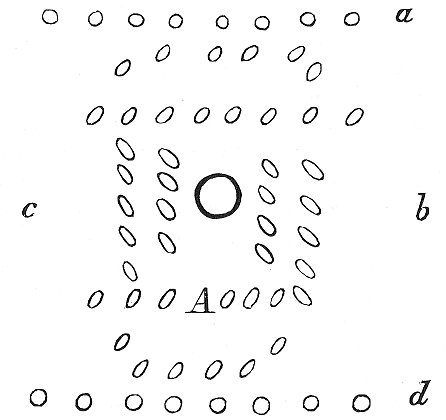
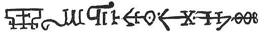

  
[Intangible Textual Heritage](../../index)  [Sub Rosa](../index.md) 
[Index](index)  [Previous](rhr13)  [Next](rhr15.md) 

------------------------------------------------------------------------

[Buy this Book at
Amazon.com](https://www.amazon.com/exec/obidos/ASIN/B0026L7FOU/internetsacredte.md)

------------------------------------------------------------------------

  
*The Real History of the Rosicrucians*, by Arthur Edward Waite,
\[1887\], at Intangible Textual Heritage

------------------------------------------------------------------------

p. 171

*The Sixth Day*.

Next morning, after we had awaked another, we sateDefine ortæ dubiæ opiniones. together to
discourse what might be the wont of things. Some were of opinion that
the corps should all be inlivened again together. Others contradicted
this, because the decease of the ancients was not only to restore life
but increase too to the young ones. Some imagined that they were not put
to death, but that others were beheaded in their stead. Having talked a
pretty while, in comes theCustos. old
man, and first saluting us, looks about to see if all things were ready.
We had herein so behaved ourselvesPyrotechnia
hospitum laudatur. that he had no fault to find with our
diligence, whereupon he placed all the glasses together, and put them
into a case. Presently come certain youths, bringing ladders, Pueri armiferi. roapes, and large wings, which
they laid before us and departed. Then the old man began thus:--"My dear
Sons, one of these three things must each of you this day constantly
bear about with him. It is free for you to make choice of one of them,
or to cast lots." We replied that we would choose. "Nay," said he, "let
it rather go by lot. Hereupon he made three little schedules,
writingSors. on one Ladder, on the second
Rope, on the third Wings. These he laid in an hat; each man must draw,
and whatever he happened on was to be his. Those who got ropes imagined
themselves in the best case; but I chanced on a ladder, which hugely
afflicted me, for it was twelve-foot long, pretty weighty, and I must be
forced to carry it, whereas the others could handsomely coyle their
ropes about them, and as for the wings, the old man joyned them so
neatly on to the third sort as if they had grown upon them. Hereupon he
turned the cock, and the

p. 172

fountain ran no longer, and we were fain to remove it out of the way.
After all things were carried off, he, taking with him the casket and
glasses, took leave, and locked the door after him, so we imagined that
we had been Ascensus in 2
conclave.imprisoned in this Tower; but it was hardly a quarter of
an hour before a round hole above was uncovered, where we saw our
Virgin, who bad us good morrow, desiring us to come up. They with the
wings were instantly through the hole; only they with the ropes were in
an evil plight, for as soon as ever one of us was up, he was commanded
to Restis difficultas.draw up the ladder
to him. At last each man's rope was hanged on an iron hook, and he
climbed up as well as he could, which indeed was not compassed without
blisters. When we were all well up, the hole was again covered, and we
were friendly received by the Virgin. This room was the whole breadth of
the Tower itself, having six very stately vestries a little raised and
reached by three steps. Descriptio 2
conclavIn these we were distributed to pray for the life of the
King and Queen. Meanwhile the Virgin went in and out at the little door
*a* till we had done. As soon as our process was absolved, there was
brought in through the little door by twelve persons, which were
formerly our musitians, a wonderful thing of longish shape, which my
companions took to be a fountain, and which was placed in the middle. I
well observed that the corps lay in it, for the inner chest was of an
oval figure, so large that six persons might well lie therein one by
another. After this they again went forth, fetched their instruments,
and conducted in our Virgin, with her she-attendants, to a most The little casket.delicate voice of musick. The
Virgin carried a little casket, the rest only branches, and small lamps
or lighted

p. 173

torches, which last were immediately given into our hands, and we stood
about the fountain in this order.

 

First stood the Virgin A, with her attendants in a ringOrdo chori round about, with the lamps and
branches *c*. Next stood we with our torches *b*, then the musitians in
a long rank; last of all, the rest of the Virgins *d*, in another long
rank. Whence the Virgins came, whether they dwelt in theVirgines unde. Castle, or were brought in by
night, I know not, for their faces were covered with delicate white
linnen. TheQuid in arcula. Virgin opened
the casket, in which was a round thing wrapped in a piece of green
double taffata. This she laid in the uppermost kettle, and covered it
with the lid, which was full of holes, and had besides a rim, on which
she poured in some of the water which we had the day before prepared;
the fountain began immediately began to run, and through four small
pipes to drive into the little kettle. Beneath the undermost kettle were
many sharp

p. 174

points, on which the Virgins stuck their lamps, that the heat might come
to the kettle and make the water seeth, which, when it began to simper,
by many little holes at a, fell in upon the bodies, and was so hot that
it dissolved them all, and turned them into liquor. What the above-said
round wrapt-up thing was, my companions knew not, but I understood that
it was the Moor's head, from which the water conceived so great heat. At
*b*, round about the Rami laures.great
kettle, there were again many holes, in which they stuck their branches,
but whether this was done of necessity or for ceremony I know not.
However, these branches were continually sprinkled by the fountain,
whence it afterwards dropt somewhat of a deeper yellow into the kettle.
This lasted for near two hours, the fountain still running, but more
faintly. Meantime the musitians went their way, and we walked up and
down in the room, which Deliciæ in
conclavi.truly was so made that we had opportunity enough to pass
away our time. There were images, paintings, clock-works, organs,
springing fountains, and the like. When it was near the time that the
fountain ceased, the Virgin commanded a golden globe to be brought. At
the bottom of the fountain was a tap, by which she let out all the
matter dissolved by those hot drops (whereof certain quarts were then
very red) into the globe. The rest of the water above in the kettle was
poured out, and so this fountain was again carried forth. Whether it was
opened abroad, or whether anything of the bodies that was useful yet
remained, I dare not certainly say, but the water emptied Gravitas aquæ.into the globe was much heavier
than six or more of us were able to bear, albeit for its bulk it should
have seemed not too heavy for one man. This globe being with much ado
gotten out of doors, we again sate alone, but I, perceiving

p. 175

a trampling over head, had an eye to my ladder. After one quarter of an
hour, the cover above was lifted, and we commanded to come up, which we
did as before, with wings, ladders, and ropes, and it did not a little
vex me thatAscensus in 3 conclave. whereas
the Virgins could go up another way, we were fain to take so much toil;
yet I could judge there must be some special reason for it, and we must
leave somewhat for the old man to do too. The hole being again shut
fast, I saw the globe hanging by a strong chain in the middle of the
room, in which there was nothing but windows, with a door betweenDescriptio conclavis. every two, which was
covered with a great polished looking-glass. These windows and
looking-glasses were so optically opposed that although the sun, which
now shined exceeding bright, beat only upon one door, yet (after the
windowsArtif. optica. towards the sun were
opened, and the doors before the looking-glasses drawn aside) in all
quarters of the room there was nothing but suns, which by artificial
refractions beat upon the whole golden globe hanging in the midst,
which, being polished, gave such a lustre that none of us could open our
eyes, but were forced to look out at windows till the globe was well
heated, and brought to theMirac. spec.
desired effect. In these mirrors I saw the most wonderful spectacles
that ever nature brought to light, for there were suns in all places,
and the globe in the middle shined brighter yet. At length the virgin
commanded to shut up the looking-glasses and make fast the windows to
let the globe cool a little, wherefore we thought good, since we might
now have leisure, to refresh ourselves with a breakfast. This treatment
was again right philosophical, andPrandium
philosoph. we had no need to be afraid of intemperance, though we
had no want, while the hope of the future joy, with which the virgin
continually comforted us, made us so jocond that

p. 176

we regarded not any pains or inconvenience. I can truly say concerning
my companions of high quality that their minds never ran after their
kitchen or table, but their pleasure was only to attend on this
adventurous physic, and hence to contemplate the Creator's wisdom and
omnipotency. After our refection we settled ourselves to work, for the
globe was sufficiently cooled, which with toil and labour we were to
lift off the chain and set upon the floor. The dispute then was how we
were to get the globe in sunder, for we were commanded to divide it in
the midst. The conclusion was that a sharp-pointed diamond would be best
to do it, and when we had thus opened the globe, there was no redness to
be seen, but a lovely great snow-white egg, and it mightily rejoyced us
that this was so well brought to pass, for the virgin was in perpetual
care least the shell might still be too tender. We stood around about
this egg as jocond as if we ourselves had laid it, but the Virgin made
it presently be carried forth, and departed herself, locking the door
behind her. What she did abroad with the egg, or whether it were
privately handled, I know not, neither do I believe it. We were again to
pause for one quarter of an hour, till the third hole opened, and we, by
means of our instruments, came upon the fourth stone or floor. In this
room we found a great copper kettle filled with silver sand, which was
warmed with a gentle fire, and afterwards the egg was raked up in it,
that it might therein come to perfect maturity. This kettle was exactly
square. Upon one side stood these two verses writ in great letters--

O. BLI. TO. BIT. MI. LI.  
KANT. I. [1](#fn_53.md) VOLT. BIT. TO. GOLT.

p. 177

\[paragraph continues\] On the second side
were these three words--

SANITAS. NIX. HASTA.

\[paragraph continues\] The third had but
this one word--

F.I.A.T.

\[paragraph continues\] But on the
hindmost part stood an entire inscription, running thus--

QUOD  
Ignis: Aer: Aqua: Terra:  
SANCTIS REGUM ET REGINARUM NOSTR:  
Cineribus  
*Eripere non potuerunt*.  
Fidelis Chymicorum Turba  
IN HANC URNAM  
Contulit.  
Αὁ

 

Now, whether the sand or egg were hereby meant I leave the learned to
dispute. Our egg, being ready, was taken out, but it needed no cracking,
for the Bird soon freed himself, looking very jocond, though bloody and
unshapen. We first set him on the warm sand, the Virgin commandingPullus implumis. that before we gave him
anything to eat we should be sure to make him fast, otherwise he would
give us all work enough. This being done, food was brought him,
whichVincitur. surely was nothing but the
blood of the beheaded delutedPascitur sanguine
decallatorum with prepared water, by which the Bird grew so fast
under our eye that we well saw why the Virgin gave such warning of him.
He bit and scratched so devilishly that, could he have had his will upon
any of us, he would soon

p. 178

have dispatched him. Now he was wholly black and wild, Sanguine alius Regis pascitur.wherefore other
meat was brought him, perhaps the blood of another of the Royal Persons,
whereupon all his black feathers moulted and were replaced by snow-white
ones. He was somewhat tamer too, and more tractable, though we did not
yet trust him. At the third feeding his feathers began to be so
curiously coloured that I never saw the like Iridescit.for beauty. He was also exceedingly
tame, and behaved himself so friendly with us that, the Virgin
consenting, we Liberatur vinculis.released
him from captivity. "’Tis now reason," she began, "since by your
diligence, and our old man's consent, the Bird has attained with his
life and the highest perfection, that he be also joyfully consecrated by
us." Herewith she commanded to bring in dinner, since the most
troublesome part of our work was now over, and it was fit we should
begin to enjoy our passed labours. We began to make merry together.
Howbeit, we had still our mourning cloaths on, which seemed somewhat
reproachful to our mirth. The Virgin was perpetually inquisitive,
perhaps to Primus usus ejus.find to which
of us her future purpose might prove serviceable, but her discourse was,
for the most part, about Melting, and it pleased her well when any one
seemed Μεθοδία.expert in such compendious
manuals as do peculiarly commend an artist. This dinner lasted not above
three-quarters of an hour, which we yet, for the most part, spent with
our Bird, whom we were fain constantly to feed with his meat, though he
continued much at the same growth. After Dinner we were not long
suffered to digest our food, for the Virgin, together with the Bird,
departed from us, 5. Conclave.and the
fifth room was opened, which we reached after the former manner, and
tendred our service. In this Avis
balneum.room a bath was prepared for our Bird, which was so

p. 179

coloured with a fine white powder that it had the appearance of milk. It
was cool when the Bird was set into it, and he was mighty well pleased
with it, drinking of it, and pleasantly sporting in it. But after it
began to heat, by reason of the lamps placed under it, we had enough to
do to keep him in the bath. We, therefore, clapt a cover on the kettle,
and suffered him to thrust out his head through a hole, till he had lost
all his feathers in this bath, and was as smooth as a new-born babe, yet
the heat did him no further harm. In this bath the feathers were quite
consumed, and the bath was thereby turned into blew. At length we gave
the Bird air, who of himself sprung out of the kettle, and was so
glitteringly smooth that it was a pleasure to behold him. But because he
was still somewhat wild, we were fain to put a collar, with a chain,
about his neck, and so led him up and downVincitur. the room. Meantime a strong fire was
made under the kettle, and the bath sodden away till it all came to a
blew stone, which we took out, and, having pounded it, weBalneum coquitur in lapidem. ground it on a
stone, and finally with this colour painted the Bird's whole skin over,
who then looked much more strangely, for he was all blew except the
head, which remained white. Herewith our work in this story was
performed, and we, after the Virgin with her blew Bird was departed from
us, were called up a hole to the sixth6.
Conclave. story, where we were mightily troubled, for in the
midst a little altar, every way like that in the King's hall, was
placed. Upon it stood the six forementioned particulars, and he himself
(the Bird) made the seventh. First of all the little fountain was set
before him, out of which Ile drunk a good draught; afterwards he pecked
upon the white serpent till she bled mightily. This blood we received

p. 180

in a golden cup, and poured down the Bird's throat, who was mighty
averse from it; then we dipt the serpent's head in the fountain, upon
which she again revived, and crept into her death's head, so that I saw
her no more for a long time. Meanwhile the sphere turned constantly on
until it made the desired conjunction. Immediately the watch struck one,
upon which there was going another conjunction. Then the watch struck
two. Finally, whilst we were observing the third conjunction, and the
same was indicated by the watch, the poor Bird of himself submissively
laid down his neck upon the book, and willingly Avis decollutur.suffered his head to be smitten
off by one of us, thereto chosen by lot. Howbeit he yielded not one drop
of blood till he was opened on the breast, and then the blood spun out
so fresh and clear as if it had been a fountain of rubies. His death
went to the heart of us, yet we might well judge Avis combursitur.that a naked bird would stand
us in little stead. We removed the little altar, and assisted the Virgin
to burn the body, together with the little tablet hanging by, to ashes,
with fire kindled at the little taper, afterwards to cleanse the same
several times, and to lay them in a box of cypress wood. Here I cannot
conceal what a trick I, with Jocus.three
more, was served. After we had diligently taken up the ashes, the Virgin
began to speak thus:--"My Lords, we are here in the sixth room, and have
only one more before us, in which our trouble will be at an end, and we
shall return home to our castle to awaken our most gratious Lords and
Ladies. Now albeit I could heartily wish that all of you had behaved
yourselves in such sort that I might have given your commendations to
our most renowned King and Queen, and you have obtained a suitable
reward, yet because, contrary to my desire, I have found amongst you

p. 181

these four"--pointing at me and three others--"lazy and sluggish
labourators, and yet according to my good-will to all, I am not willing
to deliver them to condign punishment. However, that such negligence may
not remain wholly unpunished, I purpose that they shall be excluded from
the future seventh and most glorious action of all the rest, and so they
shall incur no further blame from their Royal Majesties."

In what a case we now were I leave others to consider, for the Virgin so
well knew how to keep her countenance that the water soon ran over our
baskets, and we esteemed ourselves the most unhappy of all men. The
Virgin by one of her maids, whereof there were many always at hand,
caused the musitians to be fetcht, who were with cornets to blow us out
of doors with such scorn and derision that they themselves could hardly
sound for laughing. But it did particularly afflict us that the Virgin
vehemently laughed at our weeping, and that there might be some amongst
our companions who were glad of our misfortune. But it proved otherwise,
for as soon as we were come out at theCommodum
ejoco. door the musitians bid us be of good cheere, and follow
them up the winding staires to the eighth floor under the8. Conclave. roof, where we found the old man
standing upon a little round furnace. He received us friendly, and
heartily congratulated us that we were hereto chosen by the Virgin; but
after he had understood the fright we had conceived, his belly was ready
to burst with laughing that we had taken such good fortune so hainously.
"Hence," said he, "my dear sons, learn that man never knoweth how well
God intendeth him." The Virgin also came running in, who, after she had
sufficiently laughed at us, emptied her ashes into another vessel,
filling hers again with other

p. 182

Virgo. lucif. ludit cœteros.matter,
saying, she must now cast a mist before the other artist's eyes, that we
in the mean time should obey the old lord, and not remit our former
diligence. Herewith she 7.
Conclave.departed from us into the seventh room, whither she
called our companions. What she first did with them I cannot tell, for
they were not only most earnestly forbidden to speak of it, but we, by
reason of our business, durst not Verus labor sub
tecto.peep on them through the cieling. Our work was to moisten
the ashes with our fore-prepared water till they became like a very thin
dough, after which we set the matter over the fire till it was well
heated; then we cast it into two little forms or moulds, and so let it
cool a little, when we had leisure to look on our companions through
Labor spurius in 7 conclavi.certain
crevises in the floor. They were busie at a furnace, and each was
himself fain to blow up the fire with a pipe, till he was ready to lose
his breath. They imagined they were herein wonderfully preferred before
us. This blowing lasted till our old man rouzed us to work again. We
opened our little forms, and there appeared two bright and Homunculi duo.almost transparent little images,
a male and a female, the like to which man's eye never saw, each being
but four inches long, and that which most mightily surprised me was that
they were not hard, but limber and fleshy as other human bodies; yet had
they no life, so that I assuredly believe that Lady Venus’ image was
made after some such way. These angelically fair babes we laid upon two
little sattin cushonets, and beheld them till we were almost besotted
upon so exquisite an object. The old lord warned us to forbear, and
continually to instil the blood of the Pascuntur
sanguine avis.bird, which had been received in a little golden
cup, drop after drop into the mouths of the little images, from whence
they apparently encreased, becoming according to proportion

p. 183

much more beautiful. They grew so big that we lifted them from the
little cushonets, and were fain to lay them upon a long table covered
with white velvet. The old man commanded us to cover them up to the
breast with a piece of fine white double taffata, which, because ofPulcherrimus. their unspeakable beauty, almost
went against us. Before we had in this manner quite spent the blood,
they were in their perfect full growth, having gold-yellow curled hair,
and the figure of Venus was nothing to them. But there was not yet any
natural warmth or sensibility in them; they were dead figures, yet of a
lively and natural colour; and since care was to be taken that they grew
not too great, the old man would not permit anything more to be given
them, but covered their faces too with the silk, and caused the table to
be stuck round about with torches. Let the reader imagine not these
lights to have been of necessity, for the old man's intent was that we
should not observe when the Soul entred into them, as indeed we should
not have taken notice of it, in case I had not twice before seen the
flames. However, I permitted the other three to remain in their belief,
neither did the old man know that I had seen anything more. Hereupon he
bid us sit down on a bench over against the table. The Virgin came in
with the musick and all furniture, and carried two curious white
garments, the like to which I had never seen in the Castle. I thought
noVestiuntur. other but that they were
meer christal, but they were gentle and not transparent. These she laid
upon a table, and after she had disposed her Virgins upon a bench round
about, she and the old man began many *leger-de-main* tricks about the
table, which were done only to blind. All thisSpectatores luduntur. was managed under the
roof, which was wonderfully

p. 184

Descriptio tecti.formed, for on the inside
it was arched into seven hemispheres, of which the middlemost was
somewhat the highest, and had at top a little round hole, which was shut
and was observed by none but myself. After many ceremonies stept in six
Virgins, each of which bare a large trumpet, rouled about with a green,
glittering, and burning material like a wreath, one of which the old man
took, and after he had removed some of the lights at top, and uncovered
their faces, he placed one of the trumpets upon the mouth of one of the
bodies in such manner that the upper and wider part Usus tubarum.of it was directed towards the
fore-mentioned hole. Here my companions always looked upon the images,
but as soon as the foliage or wreath about the shank of the trumpet
Forti ex cœlo venions.was kindled, I saw
the hole at top open and a bright stream of fire shoot down the tube and
pass into the body, whereupon the hole was again covered, and the
trumpet removed. With this device my companions were deluded into
imagining that life came to the image by the fire of the foliage, for as
soon as he received his Soul he twinckled his eyes Homunculi animati alio transferuntur.though
scarcely stirring. The second time he placed another tube upon its
mouth, kindled it again, and the Soul was let down through the tube.
This was repeated upon each of them three times, after which all the
lights were extinguished and carried away. The velvet carpets of the
table were cast together over them, and immediately a travelling bed was
unlocked and made ready, into which, thus wrapped up, they were born,
and, after the carpets were taken off them, neatly laid by each other,
where, with the curtains drawn before them, they slept a good while.
De. 7 concl.It was now time for the Virgin
to see how the other artists behaved themselves; they were well pleased
because they were to work in gold, which is indeed a piece of this art,

p. 185

but not the most principal, necessary, and best. They had too a part of
these ashes, so that they imagined that the whole Bird was provided for
the sake of gold, and that life must thereby be restored to the
deceased. Mean time we sate very still, attending when our married
couple would awake, and thus about half an hour was spent. Then the
wanton Cupid presented himself, and, after he had salutedHomunculi excitantur a cupidine. us all, flew to
them behind the curtain, tormenting them till they waked. This happened
to them with very great amazement, for they imagined that they had slept
from the hour in which they were beheaded. Cupid, after he hadFuerunt illi qui decollabantur. awaked them,
and renewed their acquaintance one with another, stepped aside and
permitted them to recruit their strength, mean time playing his tricks
with us, and at length he would needs have the musick fetcht to be
somewhat the merrier. Not long after the Virgin herself comes, and
having most humbly saluted the young King and Queen, who found
themselves somewhat faint, and havingConjuges
induunt vestimenta ut se conspiciendos præbeant. kissed their
hands, she brought them the two fore-mentioned curious garments, which
they put on, and so stepped forth. There were already prepared two very
curious chaires, wherein they placed themselves, and were by us with
most profound reverence congratulated, for which the King in his own
person most gratiously returned his thanks, and again re-assured us of
all grace. It was already about five of clock, wherefore they could make
no longer stay; but as soon as ever the chiefest of their furniture
could be laden, we were to attend the young Royal Persons down the
stairs, through all doors and watches unto the ship, in which they
inbarqued, Conjuges vehuntur trans mare.
together with certain Virgins and Cupid, and sailed so swiftly that we
soon lost sight of them, yet they were met, as I was informed, by
certain stately ships, and in four

p. 186

hours time had made many leagues out at sea. After fiveMusick. of clock the musitians were charged to
carry all things back to the ships, and to make themselves ready for the
voyage, but because this was somewhat long a doing, theCustos senex old lord commanded forth a party
of his concealed soldiers, who had hitherto been planted in the wall so
that we hadTurris custodita a militibus.
taken no notice of any of them, whereby I observed that this tower was
well guarded against opposition. These soldiers made quick work of our
stuff, so that no more remained to be done but to go to supper. The
table being compleatly furnished, the Virgin brings us again to our
companions, where we were to carry ourselves as if we had truly been in
a lamentable condition, while they were always smiling one upon another,
though some of them too simpathized Custos est
inspector. with us. At this supper the old lord was with us, who
was a most sharp inspector over us, for none could propound anything so
discreetly but that he knew how to confute or amend it, or at least to
give some good document upon it. Laus hujus
senis. I learned most by this lord, and it were good that each
would apply himself to him, and take notice of his procedure, for then
things would not so often and untowardly miscarry. After we had taken
our nocturnal refection, the The old man's
closets. old lord led us into his closets of rarities, dispersed
among the bulworks, where we saw such wonderful productions of nature,
and other things which man's wit in imitation of nature had invented,
that we needed a year sufficiently to survey them. Thus we spent a good
part of the night by candle-light. At last, because we were more
inclined to sleep then see many rarities, we were lodged in rooms in the
wall, where we had not only costly good beds but extraordinary handsome
chambers, which made us the more wonder why we were forced the day
before to undergo

p. 187

so many hardships. In this chamber I had good rest, and, being for the
most part without care, and weary with continual labour, the gentle
rushing of the sea helped me to a sound and sweet sleep, for I continued
in one dream from eleven of clock till eight in the morning. Somnium prolixum.

------------------------------------------------------------------------

### Footnotes

[176:1](rhr14.htm#fr_53.md) This letter is omitted
in one of the German editions.

------------------------------------------------------------------------

[Next: The Seventh Day](rhr15.md)
