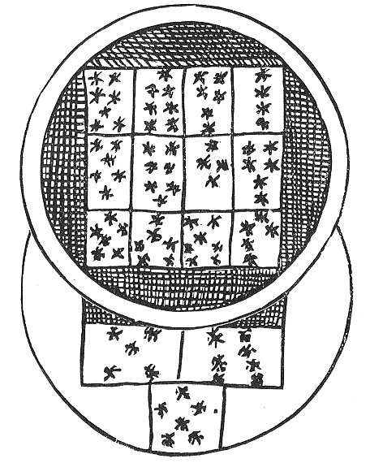

  
[Intangible Textual Heritage](../../index)  [Sub Rosa](../index.md) 
[Index](index)  [Previous](rhr22)  [Next](rhr24.md) 

------------------------------------------------------------------------

[Buy this Book at
Amazon.com](https://www.amazon.com/exec/obidos/ASIN/B0026L7FOU/internetsacredte.md)

------------------------------------------------------------------------

  
*The Real History of the Rosicrucians*, by Arthur Edward Waite,
\[1887\], at Intangible Textual Heritage

------------------------------------------------------------------------

p. 315

### CHAPTER XIII.

#### ROSICRUCIAN APOLOGISTS: JOHN HEYDON.

THE last of the line of apologists who has any claim on our notice is
the extraordinary Royalist mystic and geomancer, John Heydon, who, in
the preface to "The Holy Guide," has left us the following interesting
and curious fragment of autobiography:--

"I was descended from a noble family of London in

 

\[paragraph continues\] England, being
born of a complete tall stature, small limbs, but in every part
proportionable, of a dark flaxen haire, it curling as you see in the
Effigies, [1](#fn_99.md) and the above figures of

p. 316

\[paragraph continues\] Astrologie at the
time I was born: this is also the Character of my Genius Malhitriel, and
Spirit Taphza Benezelthar Thascraphimarah. I had the small pox and
rickets very

 

young--Ascendent to Conjunction, Mars, and Sol to the quartile of
Saturn. I was at Tardebich in Warwickshire, neer Hewel, where my mother
was borne, and there I learned, and so carefull were they to keep me to
the book and from danger, that I had one purposely to attend me at
school and at home. For, indeed, my parents were both of them honourably
descended. They put me to learn the Latine tongue to one Mr George
Linacre, the minister of the Gospel at Golton; of him I learned the
Latine and Greek perfectly, and then was fitted for Oxford. But the
Warrs began, and the Sun came to the body of Saturn and frustrated that
design; and whereas you are pleased to stile me a noble-natured, sweet
gentleman, [1](#fn_100.md) you see my
nativity:--Mercury, Venus, and Saturn are strong, and by them the
Dragon's head and Mars, I judge my behaviour full of rigour, and
acknowledge my conversation austere. In my devotion I love to use the
civility of my knee, my hat, and hand, with all those outward and
sensible motions which may express or promote invisible devotion. I
followed the army of the King to Edgehill, and commanded a troop of
horse, but never violated any man, &c., nor defaced the

p. 317

memory of saint or martyr. I never killed any man wilfully, but took him
prisoner and disarmed him; I did never divide myself from any man upon
the difference of opinion, or was angry with his judgment for not
agreeing with me in that from which, perhaps, within a few dayes, I
should dissent myself. I never regarded what religion any man was of
that did not question mine. And yet there is no Church in the world
whose every part so squares unto my conscience, whose articles,
constitutions, and customs seem so consonant unto reason, and, as it
were, framed to my particular devotion as this whereof I hold my belief,
the Church of England, to whose faith I am a sworn subject, and
therefore in a double obligation subscribe unto her articles, and
endeavour to observe her constitutions. Whatsoever is beyond, as points
indifferent, I observe according to the rules of my private reason, or
the humour and fashion of my devotion, neither believing this because
Luther affirmed it, or disproving that because Calvin hath disfavoured
it. Now as all that dye in the war are not termed souldiers, neither can
I properly term all those that suffer in matters of religion martyrs.
And I say, there are not many extant that in a noble way fear the face
of death lesse than myselfe; yet from the moral duty I owe to the
commandement of God, and the natural respects that I tender unto the
conversation of my essoine and being, I would not perish upon a
ceremony, politique points, or indifferency; nor is my belief of that
untractable temper, as not to bow at their obstacles or connive at
matters wherein there are not manifest impieties. The leaves, therefore,
and ferment of all, not only civil, but religious actions, is wisdome,
without which to commit ourselves to the flames is homicide, and, I
fear, but to passe through one fire into another. I behold, as a
champion,

p. 318

with pride and spirites, and trophies of my victories over my enemies,
and can with patience embrace this life, yet in my best meditations do
often defie death; I honour any man that contemns it, nor can I love any
that is afraid of it--this makes me naturally love a souldier that will
follow his captain. In my figure you may see that I am naturally
bashful. Yet you may read my qualities on my countenance. About the time
I travelled into Spain, Italy, Turkey, and Arabia, the Ascendent was
then directed to the Trine of the Moon, Sextile of Mercury and Quartile
of Venus. I studied philosophy and writ this treatise, [1](#fn_101.md) and the 'Temple of Wisdome,' &c.
Conversation, age, or travell hath not been able to affront or enrage
me, yet I have one part of the modesty which I have seldom discovered in
another, that is (to speak truly), I am not so much afraid of Death as
ashamed thereof. It is the very disgrace and ignominy of our natures,
that in a moment can so disfigure us that our beloved friends stand
afraid and start at us; the birds and beasts of the field that before in
a naturall feare obeyed us, forgetting all allegiance, begin to prey
upon us. This very thought in a storm at sea hath disposed and left me
willing to be swallowed up in the abyss of waters, wherein I had
perished unseen, unpitied, without wondering eyes, tears of pity,
lectures of morality, and none had said;--*Quantum mutatus ab illo*. Not
that I am ashamed of the anatomy of my parts, or can accuse Nature of
playing the pupil in any part of me, or my own vitious life for
contracting any shameful disease upon me, whereby I might not call
myself a compleat bodyed man, free from all diseases, sound, and, I
thank God, in perfect health.

"I writ my 'Harmony of the World,' when they were all at discord, and
saw many revolutions of kingdomes,

p. 319

emperours, grand signiours, and popes; I was twenty when this book was
finished, but me thinks I have outlived myself, and begin to be weary of
the Sun, although the Sun now applies to a Trine of Mars. I have shaken
hands with delight and know all is vanity, and I think no man can live
well once but he that could live twice, yet for my part I would not live
over my howres past, or begin again the minutes of my dayes, not because
I have lived them well, but for fear I should live them worse. At my
death I mean to take a total adieu of the world, not caring for the
burthen of a tombstone and epitaph, nor so much as the bare memory of my
name to be found anywhere, but in the Universal Register of God. I thank
God that with joy I mention it, I was never afraid of Hell, nor never
grew pale at the mention of Sheol, or Tophet, &c., because I understand
the policy of a pulpit, and fix my contemplations on Heaven.

"I writ the 'Rosie Crucian Infallible Axiomata,' in foure books, and
study not for my own sake only but for theirs that study not for
themselves. In the Law I began to be a perfect clerk; I writ the 'Idea
of the Law,' &c., for the benefit of my friends and practice in the
King's Bench. I envy no man that knows more than myself, but pitty them
that know lesse. For Ignorance is rude, uncivill, and will abuse any
man, as we see in bayliffs, who are often killed for their impudent
attempts; they'll forge a warrant and fright a fellow to fling away his
money, that they may take it up; the devill, that did but buffet St.
Paul, playes me thinks at Sharpe with me. To do no injury nor take none,
was a principle which to my former years and impatient affection seemed
to contain enough of morality, but my more settled years and Christian
constitution have fallen upon severer resolutions. I hold there is no
such thing as injury, and if there be, there is no such injury as
revenge, and no such

p. 320

revenge as the contempt of an injury. There be those that will venture
to write against my doctrine, when I am dead, that never durst answer me
when alive. I see Cicero is abused by Cardan, who is angry at Tully for
praising his own daughter; and Origanus is so impudent, that he
adventures to forge a position of the heavens and calls it Cornelius
Agrippa's nativity, and they say that Cornelius was borne to believe
lyes and to broach them. Is not this unworthiness to write such lyes,
and shew such reasons for them? His nativity I could never finde, I
believe no man knows it, but by a false figure thus they scandalize him.
And so they may use me, but behold the scheam of my nativity in
Geomancy,

 

p. 321

and the character of my spirit Taphzabnezeltharthaseraphimarah,

 

projected by a learned lord for the honour (? hour) of birth. Now let
any astrologer, geomancer, philosopher, &c., judge my geniture; the
figures are right according to the exact time of my birth, rectified by
accidents and verified by the effects of directions. Now in the midst of
all my endeavours, there is but one thought that dejects me--that my
acquired parts mast perish with myself, nor can be legacyed amongst my
dearly beloved and honoured friends. I do not fall out or contemn a man
for an errour, or conceive why a difference in opinion should divide an
affection; for a modest reproof or dispute, if it meet with discreet and
peaceable natures, doth not infringe the laws of charity in all
arguments.

"When the mid heaven was directed to the Trine of the Moon, I writ
another book, and entituled it, 'The Fundamental Elements of Philosophy,
Policy, Government and the Laws,' &c. After this time I had many
misfortunes, and yet I think there is no man that apprehends his own
miseries less than myself, and no man that so nearly apprehends
another's. I could lose an arm without a tear, and with few groans,
methinks, be quartered into pieces, yet can I weep seriously, with a
true passion, to see the merciless Rebels in England forge a debt
against the King's most loyall subjects,

p. 322

purposely to put them in the Marshalsey, or other Houses of Hell to be
destroyed in prison, or starved, or killed by the keepers, and then two
or three poore old women for as many shillings shall perswade the
Crowner and the people to believe the men dyed of consumptions. It is a
barbarous part in humanity to add unto any afflicted parties’ misery, or
endeavour to multiply in any man a passion whose single nature is
already above his patience.

"The Ascendent to the Quartile of Saturn, and part of Fortune to the
Sextile of the Moon came next; and it is true I had loved a lady in
Devonshire, but when I seriously perused my nativity, I found the
seventh House afflicted, and therefore never resolve to marry; for,
behold, I am a man, and I know not how: I was so proportioned 1 and have
something in me that can be without me, and will be after me, and here
is the misery of a man's life; he eats, drinks, and sleeps to-day that
he may do so tomorrow, and this breeds diseases, which bring death, 'for
all flesh is grass.' And all these creatures we behold are but the herbs
of the field digested into flesh in them, or more remotely carnified in
ourselves; we are devourers not onely of men but of ourselves, and that
not in an allegory but a positive truth, for all this masse of flesh
which we behold came in at our mouths; this frame we look upon hath been
upon our trenchers, and we have devoured ourselves, and what are we? I
could be content that we might raise each other from death to life as
Rosie Crucians doe without conjunction, or that there were any way to
perpetuate the world without this trivial and vain way of coition as Dr
Brown calls it. It is the foolishest act a wise man commits all his
life, nor is there anything that will more deject his cold imagination
than to consider what an odd

p. 323

errour he hath committed. [1](#fn_102.md) Had the
stars favoured me, I might have been happy in that sweet sex.

"I remember also that this Quartile of Saturn imprisoned me at a
messenger's house for contending with Cromwell, who maliciously
commanded I should be kept close in Lambeth House, as indeed I was two
years. My person he feared, and my tongue and pen offended him, because,
amongst many things, I said particularly, such a day he would die, and
he dyed. It is very true Oliver opposed me all his life, and made my
father pay seventeen-hundred pounds for his liberty; besides, they
stole, under pretence of sequestering him, two thousand pounds in
jewels, plate, &c., and yet the King's noblest servants suffer upon
suspition of death.

"When the moon was directed to the Quartile of Sol, and the M. C. to the
opposition of Sol, I was by the phanatick Committee of Safety committed
to prison, and my books burnt, yet I would not entertain a base design,
or an action that should call me villain, for all the riches in England;
and for this only do I love and honour my own soul, and have, methinks,
two arms too few to embrace myself. My conversation is like the Sun with
all men, and with a friendly aspect to good and bad. Methinks there is
no man bad, and the worst best, that is, while they are kept within the
circle of those qualities wherein there is good. The method I should use
in distributive justice I

p. 324

often observe in commutation, and keep a geometrical proportion in both,
whereby becomming equal to others, I become unjust to myself, and
suberogate in that common principle, 'Doe unto others as thou wouldst be
done unto thy self'; yet I give no alms to satisfie the hunger of my
brother, but to fulfil and accomplish the will and command of God. This
general and indifferent temper of mine doth nearly dispose me to this
noble virtue amongst those million of vices I do inherit and hold from
Adam. I have escaped one and that a mortal enemy to charity, the first
and father sin, not onely of man, but of the devil, Pride--a vice whose
name is comprehended in a monosyllable, but in its nature not
circumscribed with a world. I have escaped it in a condition that can
hardly avoid it; these petty acquisitions and reputed perfections that
advance and elevate the conceits of other men add no feather unto mine.
And this is the observation of my life--I can love and forgive even my
enemies."

The materials supplied in this singular fragment of an autobiography are
supplemented by a "Life of John Heydon," from the pen of Frederick
Talbot, Esq., which was prefixed to "The Wise Man's Crown," and which I
shall present to my readers in a compressed form, to avoid the prolixity
and irrelevance of much of the original.

John Heydon, the son of Francis and Mary Heydon, now of Sidmouth in
Devonshire, is not basely but nobly descended. Antiquaries derive them
from Julius Heydon, King of Hungary and Westphalia, that were descended
from the noble family of Cæsar Heydon in Rome, and since this royal race
the line runs down to the Hon. Sir Christopher Heydon of Heydon, near
Northwick; Sir John Heydon, late lord-lieutenant of the king's Tower of
London,

p. 325

and the noble Chandlers in Worcestershire of the mother's side, which
line spread by marriage into Devonshire, among the Collins, Ducks,
Drues, and Bears. He had one sister, named Anne Heydon, who dyed two
years since, his father and mother being yet living. He was born at his
father's house in Green-Arbour, London, and baptized at S. Sepulchre's,
and so was his sister, both in the fifth and seventh years of the reign
of King Charles I. He was educated in Warwickshire, among his mother's
friends, and so careful were they to keep him and his sister from
danger, and to their books, that they had one continually to wait upon
them, both to the school and at home.

He was commended by Mr John Dennis, his tutor in Tardebick, to Mr George
Linacre, priest of Cougheton, where he learned the Latine and Greek
tongues. The war at this time began to molest the universities of this
nation. He was then articled to Mr Michael Petty, an attorney at
Clifford's Inn, with eighty pound, that at five years’ end he should be
sworn before Chief Justice Roll. Being very young, he applyed his minde
to learning, and by his happy wit obtained great knowledge in all arts
and sciences. Afterwards he followed the armies of the King, and for his
valour commanded in the troops. When he was by these means famous for
learning and arms, he travelled into Spain, Italy, Arabia, Ægypt, and
Persia, gave his minde to writing, and composed, about twenty years
since, "The Harmony of the World," and other books, preserved by the
good hand of God in the custody of Mr Thomas Heydon, Sir John Hanmer,
Sir Ralph Freeman, and Sir Richard Temple. During the tyrant's time
first one had these books, then another, and at last, at the command of
these honourable, learned, and valiant knights, they were printed.

p. 326

He wrote many excellent things, and performed many rare experiments in
the arts of astromancy, geomancy, &c., but especially eighty-one--the
first upon the King's death, predicted in Arabia by him to his friends;
the second upon the losses of the King at Worcester, predicted at
Thauris, in Persia; the third predicted the death of Oliver Cromwell in
Lambeth House, to many persons of honour, mentioned in his books; the
fourth he wrote of the overthrow of Lambert, and of the Duke of
Albymarle his bringing again of the King to his happy countries, and
gave it to Major Christopher Berkenhead, a goldsmith at the Anchor, by
Fettes Lane End in Holborn; the fifth precaution or prediction he gave
to his Highness the Duke of Buckingham, two months before the evil was
practised, and his enemy, Abraham Goodman, lies now in the Tower for
attempting the death of that noble prince; the sixth, for Count
Grammont, when he was banished into England by the King of France; and
he predicted, by the art of astromancy and geomancy, the King's
receiving of him again into favor, and his marriage to the Lady
Hamelton; the seventh, for Duke Minulaus, a peer of Germany, that, the
Emperour sent to him when the Turk had an army against him, and of the
death of the pope. The rest are in his books. By these monuments the
name of Heydon, for the variety of his learning, was famous not onely in
England, but also in many other nations into which his books are
translated. He hath taught the way to happiness, the way to long life,
the way to health, the way to wax young, being old; the way to resolve
all manner of questions, present and to come, by the rules of astromancy
and geomancy, and how to raise the dead.

He is a man of middle stature, tending to tallness, a

p. 327

handsome straight body; an ovall, ruddy face, mixed with a clear white,
his hair of a dark flaxen-brown colour, soft, and curling in rings
gently at the ends of the locks; his hands and fingers long and slender,
his legs and feet well proportioned, so that to look upon he is a very
compleat gentleman. But he never yet cast affection on a woman, nor do I
find him inclined to marry. He is very often in great ladies’ chambers,
and, I believe, his modest behaviour makes them the more delighted in
his company. The princes and peers, not only of England but of Spain,
Italy, France, and Germany, send to him dayly, and upon every occasion
he sheweth strong parts and a vigorous brain. His wishes and aimes speak
him owner of a noble and generous heart; his excellent books are admired
by the world of lettered men as prodigies of these later times; indeed
(if I am able to judge anything), they are full of the profoundest
learning I ever met withal'. if any man should question my judgement,
they may read the comendations of both universities, besides the learned
Thomas White and Thomas Revell, Esquires, both famous in Rome and other
parts beyond sea, that have highly honoured this gentleman in their
books. Yet he hath suffered many misfortunes. His father was
sequestered, imprisoned, and lost two thousand pounds by Cromwell; this
Oliver imprisoned this son also two years and a half, or thereabout, in
Lambeth House, for he and his father's family were always for the king,
and endeavoured to the utmost his restoration; and indeed the tyrant was
cruel, but John Thurloe, his secretary, was kind to him, and pittied his
curious youth. Joshua Leadbeater, the messenger, kept him (at his
request and Mr John Bradley's) at his own house, and gave him often
leave to go abroad, but being yet

p. 328

zealous and active for the king, he was again taken and clapt up in
Lambeth House. In these misfortunes it cost him £1000 and upwards. After
this, some envious villains forged actions of debt against him, and put
him in prison. It seems at the beginning of these misfortunes a certain
harlot would have him marry her, but denying her suit, or that he ever
promised any such thing, and that he ever spake to her in his life good
or evil, she devised, with her confederates, abundance of mischief
against him. Many courted him to marry, but he denyed. Now there was
left amongst a few old almanacks and scraps of other men's wits,
collected and bequeathed unto the world by Nicholas Culpeper, his
widdow, Alice Culpeper; she hearing of this gentleman that he was an
heir to a great fortune, courts him by letters of love to no purpose.
The next saint in order was she that calls herself the German princess;
but he flies high and scorns such fowl, great beasts. The first of these
two blessed birds caused Heath to arrest him, and another after him laid
actions against him that he never knew or heard of.

In this perplexity was he imprisoned two years, for they did desire
nothing but to get money or destroy him, for fear, if ever he got his
liberty, he might punish them; but he, being of a noble nature, forgave
them all their malice, and scorns to revenge himself upon such pittiful
things. God indeed hath done him justice, for this Heath consumes to
worse then nothing; and, indeed, if I can judge or predict anything, his
baudy-houses will be pawned, and he will die a miserable, diseased
beggar. Heydon's mistris, when he was very young, and a clerk, desired
him to lye with her; but he, like Joseph, refusing, she hated him all
her life. God preserved him, although one of these three lewd women
swore this gentleman practised the art magick.

p. 329

\[paragraph continues\] She told Oliver
Cromwell she saw familiar spirits come and go to him in the shape of
conies, and her maid swore she had often seen them in his chamber when
he was abroad, and sometimes walking upon the house top in a moonshine
night, and sometimes vanishing away into a wall or aire; yet she never
saw him in her life, nor could she tell what manner of man he was. These
stories were not credited, and for all these, and many more, afflictions
and false accusations, I never saw him angry, nor did he ever arrest or
imprison any man or woman in all his life, yet no client of his was ever
damnyfied in his suit.

He was falsly accused but lately of writing a seditious book, and
imprisoned in a messenger's custody; but his noble friend, the duke of
Buckingham, finding him innocent and alwaies for the king, he was
discharged, and indeed this glorious duke is a very good and just judge;
although some speak slightly of him, he studies the way to preserve his
king and country in peace, plenty, and prosperity. It is pitty the king
hath no more such brave men as he; a thousand such wise dukes as this,

"Like marshall’d thunder, back’d with flames of
fire,"

would make all the enemies of the King and Christendome quake, and the
Turk fly before such great generals. In all submission we humbly pray
for this great prince, and leave him to his pleasure, and return to our
subject.

John Heydon hath purposely forsaken Spittle-Fields, and his lodgings
there, to live a private life, free from the concourse of multitudes of
people that daily followed him; but if any desire to be advised, let
them by way of letter leave their business at his booksellers, and they
shall have answer and counsel without reward, for he is neither envious
nor enemie to any man; what I write is upon my own knowledge.

p. 330

He writes now from Hermeupolis, a place I was never at. It seems, by the
word, to be the City of Mercury, and truly he hath been in many strange
places, among the Rosie Crucians, and at their castles, holy houses,
temples, sepulchres, sacrifices; all the world knows this gentleman
studies honourable things, and faithfully communicates them to others;
yet, if any traduce him hereafter, they must not expect his vindication.
He hath referred his quarrel to the God of Nature; it is involved in the
concernments of his truths, and he is satisfied with the peace of a good
conscience. He hath been misinterpreted in his writing; with studied
calumnies, they disparage his person whom they never saw, nor perhaps
will see. He is resolved for the future to suffer, for he says, "God
condemns no man for his patience." His enemies are forced to praise his
vertue, and his friends are sorry he hath not ten thousand pounds a
year. He doth not resent the common spleen; and when the world shall
submit to the general tribunal, he will find his advocate where they
shall find their judge. When I writ this gentleman's life, God can bear
me witness, it was unknown to him, and for no private ends. I was forced
to it by a strong admiration of the mistery and majesty of Nature
written by this servant of God and secretary of Nature. I began his life
some years since, and do set it down as I do finde it. If any man oppose
this I shall answer; if you are for peace, peace be with you; if you are
for war, I have been so too (Mr Heydon doth resolve never to draw sword
again in England, except the King command him). Now, let not him that
puts on the armour boast like him that puts it off. *Gaudet patientia
duris* is his motto, and thus I present myself a friend to all artists,
and enemy to no man.

p. 331

The list of Heydon's published works is as follows:--

Eugenius Theodidactus, The Prophetical Trumpeter . . . illustrating the
Fate of Great Britain. (A celestial vision in heroic verse) . . . By the
Muses' most unworthy John Heydon. London, 1655.

A New Method of Rosie Crucian Physick; wherein is shewed the cause and .
. . cure of all diseases. London, 1658. 4to.

Advice to a Daughter in opposition to advice to a Son, or directions for
your better conduct through the various and most important events of
this life. London, 1658. 12mo.

The Idea of the Law charactered from Moses to King Charles. London,
1660. 8vo.

The Rosie Crucian Infallible Axiomata; or, generall rules to know all
things past, present, and to come. London, 1660. 12mo.

The Holy Guide, Leading the Way to the Wonder of the World: A Compleat
Phisitian, teaching the knowledge of all things, past, present, and to
come. London, 1662. 8vo.

Theomagia; or, The Temple of Wisdome. In three parts spirituall,
celestiall, and elementall. London, 1662-3-4. 8vo.

The Harmony of the World, being a discourse of God, Heaven, Angels,
Stars, Planets, Earth, &c., whereunto is added the State of the New
Jerusalem. . . . London, 1662. 8vo.

Psonthonpanchia; Being a Word in Season to the Enemies of Christians,
and an appeal to the natural faculties of the mind of man, whether there
be not a God. London, 1664. 8vo.

The Wise Man's Crown; or, The Glory of the Rosie-Cross . . . with the
full discovery of the true *Cœlum Terræ*, or first matter of the
Philosophers. . . . With the *Regio* 

p. 332

\[paragraph continues\] *Lucis*, and Holy
Household of Rosie Crucian Philosophers. London, 1664. 8vo.

El Havarevna; or, the English Physitian's Tutor in the Astrobolismes of
Mettals Rosie Crucian. London, 1665. 8vo.

The philosophical principles of John Heydon need hardly detain us long.
That Typhon is the adversary of Beata Pulchra, that Hyle is the spirit
of the cold and dry earth, that Beata Pulchra is the vivifying spirit of
Nature, that the bodies of the dead rebellious angels became a fruitless
and unprofitable chaos, are matters which will scarcely interest the
serious student. His alchemical theories and experiments belong to the
lowest dregs of this much degraded science, except in those parts which
are bodily stolen from Eugenius Philalethes; [1](#fn_103.md) and all that is of value in his
numerical mysticism, geomantic revelations, astromancy, and
investigations of spiritual mysteries, is derived from anterior writers.
His medical treatises are disfigured by his gross superstition and
credulity; but the unheard of experiments and recipes which they
occasionally provide make them extremely curious reading. *Très rares,
très curieux, et récherchés des amateurs*, his books, one and all,
command large prices in the market, and the republication of his
marvellous Rosicrucian reveries and romances, is a venture that deserves
well at the hands of all students of the byways of occultism.

In John Heydon we find the names Rosicrucian, Rosicrucianism, &c., used
in a general sense, and as terms to conjure with. The supposed brethren
are confounded with the elder alchemists, theosophists, etc., and an
irrational

p. 333

antiquity is gratuitously bestowed on them. The author denies that he is
a member of the Fraternity, but he interprets all its secrets, and
expounds all its doctrines, in an authoritative manner, and he claims
personal acquaintance with various members of the Society, as will
appear from the following

------------------------------------------------------------------------

### Footnotes

[315:1](rhr23.htm#fr_99.md) The portraits prefixed
to several of John Heydon's works represent him as a young, beardless
man, of an amiable but melancholy countenance.

[316:1](rhr23.htm#fr_100.md) This account is
addressed to the high priest or grand master of the Rosicrucians, in
whose presence he represents himself to be standing.

[318:1](rhr23.htm#fr_101.md) "The Holy Guide."

[323:1](rhr23.htm#fr_102.md) "I could be content
that we might procreate like trees, without conjunction, or that there
were any way to perpetuate the world without this trivial and vulgar way
of coition: it is the foolishest act a wise man commits in all his life,
nor is there anything that will more deject his cooled imagination, when
he shall consider what an odd and unworthy piece of folly he hath
committed. I speak not in prejudice, nor am averse from that sweet sex,
but naturally amorous of all that is beautiful."--*Religio Medici*, pt.
ii. sec. 9.

[332:1](rhr23.htm#fr_103.md) Compare the "Temple
of Wisdome," vol. i., last pages, with the Preface to Vaughan's
"Euphrates," and also with the "Occult Philosophy" of Agrippa, book iv.

------------------------------------------------------------------------

[Next: Apologue for an Epilogue](rhr24.md)
