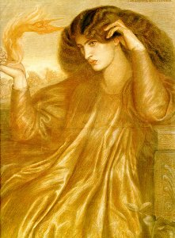

  
[Intangible Textual Heritage](../../index)  [Sub Rosa](../index.md) 

------------------------------------------------------------------------

[Buy this Book at
Amazon.com](https://www.amazon.com/exec/obidos/ASIN/1564591182/internetsacredte.md)

------------------------------------------------------------------------

<table width="75%">
<colgroup>
<col style="width: 50%" />
<col style="width: 50%" />
</colgroup>
<tbody>
<tr class="odd">
<td width="50%" data-valign="TOP"> 
</td>
<td width="50%" data-valign="TOP"><h1 id="the-rosicrucians" data-align="CENTER">The Rosicrucians</h1>
<h5 id="their-rites-and-mysteries" data-align="CENTER">Their Rites and Mysteries</h5>
<h2 id="by-hargrave-jennings" data-align="CENTER">by Hargrave Jennings</h2>
<h4 id="th-ed.-1907" data-align="CENTER">[4th ed., 1907]</h4>
<h5 id="first-published-1870" data-align="CENTER">[first published 1870]</h5></td>
</tr>
</tbody>
</table>

------------------------------------------------------------------------

[Contents](#contents)    [Start Reading](rrm00.md)  

------------------------------------------------------------------------

|                                                                                                                           |
|---------------------------------------------------------------------------------------------------------------------------|
|  |

Hargrave Jennings was a nineteenth century English writer and occultist.
His vision of the inner knowledge of the Rosicrucians in this book is,
at its core, very similar to that of the left-hand [Tantric
path](../../tantra/index.md). In some ways he was very reactionary; for
instance, he rejects the decipherment of Egyptian hieroglyphs and the
atomic theory of the elements. In other ways, he was far in advance of
his time in his concepts of the roles of gender and sexuality in the
quest for spiritual perfection.

You won't find much in the way of historical description of the
Rosicrucians here. Key Rosicrucian documents such as the Fama
Fraternatis, Chemical Wedding of Christian Rosenkrueutz and Confessio
Fraternatis (see Waite's [The Real History of the
Rosicrucians](../rhr/index).md) are not even mentioned. Nor will you find
any disclosure of inner secrets. Jennings constantly drops hints that he
knows more than he is letting on, but states up-front that he is not an
initiate. Jennings believed that the doctrines of the Rosicrucians were
derived from ancient phallic worship, and to a lesser extent fire and
serpent worship. In this book, Jennings constructs elaborate and
constantly shifting sets of correspondences. He tries to interrelate
huge sets of symbols and objects in his search for the elusive
Rosicrucians. This is not a mainstream concept of the Rosicrucian
doctrine, and contemporaries such as A.E. Waite summarily dismissed
Jennings' theories.

The book makes frustrating reading at times. Like his friend
Bulwer-Lytton, Jennings piles clause upon clause. Often he seems on the
verge of stream-of-consciousness automatic writing, walking the thin
boundaries between illumination, synesthesia and psychosis. Because of
Victorian sensibilities, he is unable to discuss aspects of sacred
sexuality without elaborate circumlocutions, resorting to French and
Latin when he needs to spell things out. Uncharacteristically for a book
of this vintage, there are almost no footnotes, and very little other
scholarly apparatus (although he occasionally gives elaborate
bibliographic citations in the body of the text).

He goes on about hats, flags, and heraldry, with digressions and
out-of-context asides. For instance, in [Part I, Chapter 18](rrm22.md), he
starts out with the color spectrum and its correspondence to the vowels,
suddenly veers into the question of evil, and ties the chapter up with a
note on the *Filioque*. He proposes bizarre etymologies, e.g. *Iona* ==
*Yoni*, that even in the 19th century would have been dismissed as bunk
(perhaps he is actually using esoteric phonetic resonances). And he is
definitely obsessed with spotting phallic symbols, both male and female,
*everywhere*.

This book dovetails with Hall's [Secret Teachings of All
Ages](../../eso/sta/index.md), although Hall is a lot more coherent and
organized. The two books cover a lot of the same ground such as eternal
flames, Alchemy, the Kabbalah, and so on. Jennings also wrote a number
of other books, primarily on phallic worship, including [The Masculine
Cross and Ancient Sex Worship](../../sex/asw/index.md), (also at online
sacred-texts), under odd pseudonyms such as 'Sha Rocco' and Abisha S.
Hudson.

Production Notes: Due to the huge number of small illustrations, where
multiple figures occurred on a page, I merged them into one image file.
This text uses Unicode for Greek, Hebrew and astrological signs; if you
have trouble viewing them you should refer to sacred-texts [Unicode
walkthrough](../../unicode.md).

--*John Bruno Hare, May 1st, 2006*

------------------------------------------------------------------------

 [Title Page](rrm00.md)  
[Preface to Third Edition](rrm01.md)  
[Preface to the Second Edition](rrm02.md)  
[Preface to the First Edition](rrm03.md)  
[Contents](rrm04.md)  

### Part I

[Chapter I. Critics of the Rosicrucians Criticized](rrm05.md)  
[Chapter II. Singular Adventure in Staffordshire](rrm06.md)  
[Chapter III. Ever-Burning Lamps](rrm07.md)  
[Chapter IV: Insufficiency of Worldly Objects](rrm08.md)  
[Chapter V: The Hermetic Philosophers](rrm09.md)  
[Chapter VI. An Historical Adventure](rrm10.md)  
[Chapter VII: The Hermetic Brethren](rrm11.md)  
[Chapter VIII: Mythic History of the Fleur-de-Lis](rrm12.md)  
[Chapter IX: Sacred Fire](rrm13.md)  
[Chapter X. Fire-Theosophy of the Persians](rrm14.md)  
[Chapter XI. Ideas of the Rosicrucians as to the Character of
Fire](rrm15.md)  
[Chapter XII. Monuments Raised to Fire-Worship in All
Countries](rrm16.md)  
[Chapter XIII: Druidical Stones and their Worship](rrm17.md)  
[Chapter XIV: Inquiry as to the Possibility of Miracle](rrm18.md)  
[Chapter XV: Can Evidence be Depended Upon? Examination of Hume’s
Reasoning](rrm19.md)  
[Chapter XVI: Footsteps of the Rosicrucians Amidst Architectural
Objects](rrm20.md)  
[Chapter XVII: The Round Towers of Ireland](rrm21.md)  
[Chapter XVIII: Prismatic Investiture of the Microcosm](rrm22.md)  
[Chapter XIX: Cabalistic Interpretations by the Gnostics](rrm23.md)  
[Chapter XX: Mystic Christian Figures and Talismans](rrm24.md)  
[Charts 1-3](rrm25.md)  
[Chapter XXI: The Rosy Cross in Indian, Egyptian, Greek, Roman, and
Mediæval Monuments](rrm26.md)  
[Chapter XXII: Myth of the Scorpion, or the Snake, in its Many
Disguises](rrm27.md)  
[Chapter XXIII: Ominous Character of the Colour 'White' to English
Royalty](rrm28.md)  
[Chapter XXIV: The Beliefs of the Rosicrucians--Meaning of Lights and of
Commemorative Flambeaux in All Worship](rrm29.md)  
[Chapter XXV: The Great Pyramid](rrm30.md)  

### Part II

[Chapter I. History of the Tower or Steeple](rrm31.md)  
[Chapter II. Presence of the Rosicrucians in Heathen and Christian
Architecture](rrm32.md)  
[Chapter III. The Rosicrucians Amidst Ancient Mysteries. Their Traces
Discoverable in the Orders of Knighthood](rrm33.md)  
[Chapter IV: Rosicrucianism in Strange Symbols](rrm34.md)  
[Chapter V: Connexion Between the Templars and Gnosticism](rrm35.md)  
[Chapter VI. Strange Speculations of the Transcendentalists](rrm36.md)  
[Chapter VII: Rosicrucian Origin of the Order of the Garter](rrm37.md)  
[Chapter VIII: Rosicrucian Supposed Means of Magic Through Signs,
Sigils, and Figures](rrm38.md)  
[Chapter IX: Astro-Theosophical (Extra-Natural) System of the
Rosicrucians--The Alchemic Magisterium or 'Stone'](rrm39.md)  
[Chapter X. Rosicrucian 'Celestial' and 'Terrestrial' (Means of
Intercommunication)](rrm40.md)  
[Chapter XI. The Pre-Adamites. Profound Cabalistic or Rosicrucian
Speculations](rrm41.md)  
[Chapter XII: The Adapted Rosicrucian Contemplation. Intrusion Of Sin.
Ruins Of The Old Worlds](rrm42.md)  
[Chapter XIII: Indian Mysterious Adoration of Forms. The Unity of the
Mythologies Found in the Bhuddistic and Mohammedan Temples](rrm43.md)  
[Chapter XIV: Doctrine and Rationale. The Embodied 'Children of the
Elements', Both of Heathen and of Christian Periods](rrm44.md)  
[Chapter XV: Robert Flood (Robertus de Fluctibus), The English
Rosicrucian](rrm45.md)  
[Chapter XVI. Notices of Ancient Authorities](rrm46.md)  
[Chapter XVII. Mysteries of the Ancients. The Ark of Noah](rrm47.md)  
[Chapter XVIII: Cabalistic Illustrations. The San-Grëale, Greal, or Holy
Grëale](rrm48.md)  
[Chapter XIX: The Round Table is the Rationale or Apotheosis of the Most
Noble The Order of the Garter](rrm49.md)  
[Chapter XX: Remarks Upon Two Curious Books](rrm50.md)  
[Chapter XXI: Remarks Relating to the Great Mystic, Robert 'de
Fluctibus'](rrm51.md)  
[Chapter XXII: Alchemy. The Power of Producing Gold and Silver, Through
Artificial Means. Doctrine of the Rosicrucians](rrm52.md)  
[Chapter XXIII: The Outline of the Cabala, or Kabbalah...](rrm53.md)  
[Chapter XXIV: And Last; Cabalistic Profundities](rrm54.md)  

### Plates

[Plate 1. Ever-Burning Rosicrucian Lamps](rrm55.md)  
[Plate 2. Sacerdote di Cerere](rrm56.md)  
[Plate 3. Gnostic Gems](rrm57.md)  
[Plate 4. The Round Table of King Arthur](rrm58.md)  
[Plate 5. Plan of the Basilica, St Peter’s in the
''Vaticano.''](rrm59.md)  
[Plate 6. Temple of Keylas, or Paradise (Ellora, in the East
Indies)](rrm60.md)  
[Plate 7. Mysterium \[Noah's Ark\]](rrm61.md)  
[No. 8. Astronomical and Astrological ''Rosicrucian'' Plan](rrm62.md)  
[No. 9. Mythological Interchange of ''Macrocosm'' and
''Microcosm.''](rrm63.md)  
[No. 10. Chart A. Cabalistic--Astrological and Astronomical. Chaldaic
Mysteries](rrm64.md)  
[No. 11. Chart B. Cabalistic (Rosicrucian). Mystery of the Interchange
of Light and Dark](rrm65.md)  
[No. 12. Chart C. Cabalistic (Rosicrucian). Production of the Visible
Worlds; Generation of the Microcosmos](rrm66.md)  
