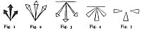
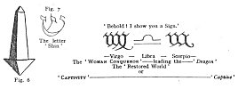
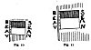
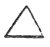
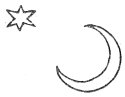

  
[Intangible Textual Heritage](../../index)  [Sub Rosa](../index) 
[Index](index)  [Previous](rrm11)  [Next](rrm13) 

------------------------------------------------------------------------

[Buy this Book at
Amazon.com](https://www.amazon.com/exec/obidos/ASIN/1564591182/internetsacredte)

------------------------------------------------------------------------

p. 45

### CHAPTER THE EIGHTH

#### MYTHIC HISTORY OF THE FLEUR-DE-LIS

THE maypole is a *phallos*. The ribbons depending from the discus, or
ring, through which the maypole pierces, should be of the seven
prismatic colours--those of the rainbow (or *Règne-beau*). According to
the *Gnostics and their Remains, Ancient and Modern*, a work by the Rev.
C. W. King, M.A., published in 1864, Horapollo has preserved a talisman,
or Gnostic gem, in yellow jasper, which presents the engraved figure of
a 'Cynocephalus, crowned, with *bâton* erect, adoring the first
appearance of the new moon'.

The phallic worship prevailed, at one time, all over India. It
constitutes, as Mr. Sellon asserts, to this day one of the chief, if not
the leading, dogma of the Hindoo religion. Incontestable evidence could
be adduced to prove this--however strange and impossible it seems--the
key of all worship the world over; and highest in esteem in the most
highly civilized nations. Though it has degenerated into gross and
sensual superstition, it was originally intended as the worship of the
creative principle in Nature. Innumerable curious particulars lie
scattered up and down, in all countries of the world, relating to this
worship; mad as it seems--bad as, in its grossness, it is. It is only in
modern times that sensuality, and not sublimity, has been actively
associated with this worship, however. There was a time when the rites
connected with it were grand and solemn enough. The general diffusion of
these notions regarding the

p. 46

\[paragraph continues\] *Phalli* and the
*Ioni*, and of the sacred mystic suggestions implied in both, as well as
the inflections in design of these unlikely, repulsive figures for
serious worship, prove that there was something very extraordinary, and
quite beyond belief to the moderns in the origin of them. The religion
of the *Phallos* (and of its twin emblem) is to be traced all over the
East. It appears to be the earliest worship practised by man. It
prevailed not only amongst the Hindoos, Assyrians, Babylonians,
Mexicans, Etruscans, Greeks, and Romans in ancient times, but it still
forms an integral part of the worship of India, Thibet, China, Siam,
Japan, and Africa. We cannot, therefore, afford, to ignore this grand
scheme of ritual, when we discover it to be a religion so widely spread,
and reappearing so unexpectedly, not only in the countries with which we
are contemporaneously acquainted, but also in those old countries of
which we in reality know very little, or nothing at all; for all history
reads doubtfully, being written for popular purposes.

In the *Temple-Herren* of Nicolai there is an account of a Gnostic gem,
or talisman, which represents a 'Cynocephalus', with a lunar disc on his
head, standing in the act of adoration, with *sceptrum* displayed,
before a column engraved with letters, and supporting a triangle. This
latter architectural figure is, in fact, an obelisk. All the Egyptian
obelisks were *Phalli*. The triangle symbolizes one of the Pillars of
Hermes (Hercules). The Cynocephalus was sacred to him. The Pillars of
Hermes have been Judaised into Solomon's 'Jachin and Boaz'. So says
Herz, in regard to 'Masonic Insignia'. We will explain fully, later in
our book, of these interesting sexual images, set up for adoration so
strangely and from the meaning of which we foolishly but determinedly
avert.

p. 47

We now propose to deduce a very original and a very elaborate genealogy,
or descent, of the famous arms of France, the *Fleurs-de-Lis*,
'*Lucifera*', *Lisses*, Luces, 'Lucies', Bees, Scarabs, Scara-bees, or
Imperial 'Bees' of Charlemagne, and of Napoleon the First and Napoleon
the Third, from a very extraordinary and (we will, in the fullest
assurance, add) the most unexpected point of view. The real beginning of
these inexpressibly sublime arms (or this 'badge'), although in itself,
and apart from its purpose, it is the most refined, but mysteriously
grand, in the world, contradictory as it may seem, is also the most
ignoble. It has been the *crux* of the antiquaries and of the heralds
for centuries! We would rather be excused the mentioning of the peculiar
item which has thus been held up to the highest honour (heraldically)
throughout the world. It will be sufficient to say that mystically, in
its theological Gnostic allusion, it is the grandest device and most
stupendous hint that armory ever saw; and those who are qualified to
apprehend our hidden meaning will perhaps read correctly and perceive
our end by the time that they have terminated this strange section of
our history of Rosicrucianism--for to it it refers particularly.

Scarabæi, Lucifera ('Light-bringers'), Luce, Fleur-de-Lis, Lily, Lucia,
Lucy, Lux, Lu( + )x.

The Luce is the old-fashioned name for the 'pike' or jack--a fish famous
for the profuse generation of a certain insect, as some fishermen know
full well. This once (incredible as it may seem) formed an object of
worship, for the sake of the inexpressibly sublime things which it
symbolized. Although so mean in itself, and although so far off, this
implied the beginning of all sublunary things.

The bees of Charlemagne, the bees of the Empire

p. 48

in France, are 'scarabs', or figures of the same affinity as the Bourbon
'lilies'. They deduce from a common ancestor. Now, the colour heraldic
on which they are always emblazoned is *azure*, or blue--which is the
colour of the sea, which is salt. In an anagram it may be expressed as
'C'. Following on this allusion, we may say that 'Ventre-saint-gris!' is
a very ancient French barbarous expletive, or oath. Literally (which, in
the occult sense, is always obscurely), it is the 'Sacred blue (or grey)
womb'--which is absurd. Now, the reference and the meaning of this we
will confidently commit to the penetration of those among our readers
who can felicitously privately surmise it; and also the apparently
circuitous deductions, which are yet to come, to be made by us.

Blue is the colour of the 'Virgin Maria'. Maria, Mary, *mare*, *mar*,
*mara*, means the 'bitterness' or the 'saltness' of the sea. Blue is
expressive of the Hellenic, Isidian, Ionian, *Y*onian (*Y*oni-Indian)
Watery, Female, and Moonlike Principle in the universal theogony. It
runs through all the mythologies.

The 'Lady-Bird' or 'Lady-Cow' (there is no resemblance between a *bird*
and a *cow*, it may be remarked, *en passant*, except in this strangely
occult, almost ridiculous, affinity), and the rustic rhyme among the
children concerning it, may be here remembered:

Lady-Bird, Lady-Bird, fly away home!  
Your House is on fire--your children at home!

\[paragraph continues\] Such may be heard
in all parts of England when a lady-bird is seen by the children. Myths
are inextricably embodied--like specks and straws and flies in
amber--amidst the sayings and rhymes of the common people in all
countries; and they are there preserved for very many generations,
reappearing

p. 49

to recognition after the lapse sometimes of centuries. Now, how do we
explain and re-render the above rude couplet? The 'Lady-Bird' is the
'Virgin Maria', Isis, the 'Mother and Producer of Nature'; the 'House'
is the 'Ecliptic'--it is figuratively 'on fire', or 'of fire', in the
path of the sun; and the 'children at home' are the 'months' produced in
the house of the sun, or the solar year, or the 'signs of the
Zodiac'--which were originally 'ten', and not twelve' [1](#fn_1), each sign answering to one of the letters
of the primeval alphabet, which were in number 'ten'. Thus, re-read, the
lines run:

Lady-Bird, Lady-Bird (*Columba*, or Dove), fly away home!  
Your House is of *Fire*--your children are *Ten!*

\[paragraph continues\] The name of the
flying insect called in England 'Lady-Bird' is *Bête-à-Dieu* in French,
which means 'God-creature' or 'God’s creature'. The Napoleonic green is
the mythic, magic green of Venus. The Emerald is the *Smaragdus*, or
Smaragd. The name of the insect Barnabee, Barnbee, 'Burning Fire-Fly',
whose house is of fire, whose children are ten, is *Red Chafer*,
*Rother-Kaefer*, *Sonnen-Kaefer*, *Unser-Frauen Kohlein*, in German; it
is 'Sun-Chafer', 'Our Lady's Little Cow', Isis, or Io, or C--ow, in
English. The children *Tenne* (*Tin*, or *Tien*, is fire in some
languages) are the earliest 'Ten Signs' in the Zodiacal Heavens

p. 50

\[paragraph continues\] --each 'Sign' with
its Ten Decans, or Decumens, or 'Leaders of Hosts'. They are also
astronomically called 'Stalls', or 'Stables'. We may here refer to
Porphyry, Horapollo, and Chifflet's Gnostic Gems. The Speckled Beetle
was flung into hot water to avert storms (Pliny, *Nat. Hist.*, lib.
xxxvii, ch. x). The antiquary Pignorius has a beetle 'crowned with the
sun and encircled with the serpent'. Amongst the Gnostic illustrations
published by Abraham Gorlæus is that of a talisman of the more abstruse
Gnostics--an onyx carved with a 'beetle which threatens to gnaw at a
thunderbolt'. See *Notes and Queries*: 'Bee Mythology'.

The 'Lilies' are said not to have appeared in the French arms until the
time of Philip Augustus. See Montfauçon's *Monumens de la Monarchie
Française*, Paris, 1729. Also Jean-Jacques Chifflet, *Anastasis de
Childeric*, 1655. See also *Notes and Queries*, 1856, London, 2d Series,
for some learned papers on the 'Fleur-de-lis'. In the early armorial
bearings of the Frankish kings, the 'lilies' are represented as
'insects', *seméed* (seeded), or spotted, on the blue field. These are,
in their origin, the *scarabæi* of the Orientals; they were dignified by
the Egyptians as the emblems of the 'Enlightened'. If the reader
examines carefully the sculpture in the British Museum representing the
Mithraic Sacrifice of the Bull, with its mystic accompaniments (No. 14,
Grand Central Saloon), he will perceive the *scarabæus*, or crab,
playing a peculiar part in the particulars of the grand rite so
strangely typified, and also so remotely. The motto placed under the
'lilies', which are the arms of France, runs as follows: 'Lilia non
laborant, neque nent'. This is also (as all know) the legend, or motto,
accompanying the royal order of knighthood denominated that of the
'Saint-Esprit' in France. We are immediately

p. 51

now recalled to those exceedingly obscure, but very significant, words
of our Saviour, which have always seemed very erroneously interpreted,
on account of their obvious contradictions: 'Consider the lilies of the
field, how they grow; they toil not, neither do they spin' [1](#fn_2). Now, in regard to this part of the text,
what does the judicious speculator think of the following Rosicrucian
gloss, or explanation? *Lilia non laborant* (like bees); *neque nent*,
'neither do they spin' (like spiders). Now of the 'lisses', as we shall
elect to call, them. They *toil not* like 'bees' (*scarabæi*); neither
do they *spin* like 'spiders' (*arachnidæ*).

*To be wise* is to be enlightened. *Lux* is the *Logos* by whom all
things were made; and the *Logos* is *Rasit*--R.s.t.: ′ρ.′σ.′τ = 600;
and *Lux* makes *Lucis;* then LX, ξ′ς = 666. Again, L = 50, ‏ו‎ *v* = 6,
‏ש‎ *s* = 300, ‏י‎ *i* = 10, ‏ש‎ *s* = 300 = 666.

The Fleur-de-lis is the Lotus (water-rose), the flower sacred to the
*Lux*, or the *Sul*, or the Sun. The 'Auriflamme' (the flame of fire, or
fire of gold) was the earliest standard of France. It was afterwards
called *Oriflamme*. It was the sacred flag of France, and its colour was
red--the heraldic, or 'Rosicrucian red, signifying gold. The three
'Lotuses', or 'Lisses', were the coat of arms--emblems of the Trimurti,
the three persons of the triple generative power, or of the Sun, or
'Lux'. ‏שלה‎, *sle*, 'Shilo', is probably ‏שיל‎, *sil* =360, or χ = 600,
λ = 50 = 10, ‏ו‎ = 6 = 666. This is Silo, or Selo. 'I have no doubt it
was the invocation in the Psalms called "Selah", ‏שלה‎(‏ס‎)'.

p. 52

\[paragraph continues\] Thus asserts the
learned and judicious Godfrey Higgins.

'The Holie Church of Rome herself doth compare the incomprehensible
generation of the Sonne of God from His Father, together with His birth
out of the pure and undefiled Virgine Marie, unto the Bees--which were
in verie deede a great blasphemie, if the bees were not of so great
valour and virtue' (value and dignity).--'Beehive of the Romish Church':
Hone's *Ancient Mysteries Described*, p. 283.

In the second edition of *Nineveh and its Palaces*, by Bonomi (London,
Ingram, 1853), p. 138, the headdress of the divinity Ilus is an
egg-shaped cap terminating at the top in a *fleur-de-lis*; at p. 149,
the Dagon of Scripture has the same; at p. 201, fig. 98, the same
ornament appears; at p. 202, fig. 99, a bearded figure has the usual
'*fleur-de-lis*'. In the same page, the tiaras of two bearded figures
are surmounted with *fleurs-de-lis*. At p. 322, fig. 211, the Assyrian
helmet is surmounted with a *fleur-de-lis;* at p. 334, fig. 217, the
head-dress of the figure in the Assyrian standard has a *fleur-de-lis*;
at p. 340, fig. 245, the bronze resembles a *fleur-de-lis*; at p. 350,
fig. 254, an Egyptian example of the god Nilus, as on the thrones of
Pharaoh-Necho, exhibits the *fleur-de-lis*.

*Vert*, or green, and *azure*, or blue (feminine tinctures), are the
colours on which respectively the golden 'bees', or the silver 'lisses',
are emblazoned. The Egyptian *Scarabæi* are frequently cut in stone,
generally in *green-coloured* basalt, or *verdantique*. Some have
hieroglyphics on them, which are more rare; others are quite plain. In
the tombs of Thebes, Belzoni found *scarabæi with human heads*. There is
hardly any symbolical figure which recurs so often in Egyptian sculpture
or painting as the *scarabæus*, or beetle, and perhaps scarcely any one
which it is so

p. 53

difficult to explain. He is often represented with a ball between his
forelegs, which some take for a symbol of the world, or the sun. He may
be an emblem of fertility. The 'crab' on the Denderah Zodiac is by some
supposed to be a 'beetle' (*Egyptian Antiquities*). It is for some of
the preceding reasons that one of the mystic names of Lucifer, or the
Devil, is the 'Lord of Flies', for which strange appellation all
antiquaries, and other learned decipherers, have found it impossible to
account.

Of the figure of the Fleur-de-Luce, Fleur-de-Lis, or Flower-de-*Luce*
(*Lus*, *Luz*, Loose), the following may be remarked. On its sublime,
abstract side, it is the symbol of the mighty self-producing,
self-begetting Generative Power deified in many myths. We may make a
question, in the lower sense, in this regard, of the word 'loose',
namely, wanton, and the word 'Lech', or 'leche', and 'lecher', etc.
Consider, also, in the solemn and terrible sense, the name Crom-Lech, or
'crown', or 'arched entry', or 'gate', of death. The Druidical stones
were generally called *cromlechs* when placed in groups of two [1](#fn_3), with a *coping* or *capstone* over,
similarly to the form of the Greek letter *pi* (Π, π), which was
imitated from that temple of stones which we call a cromlech:

Cromlechs were the altars of the Druids, and were so called from a
Hebrew word signifying 'to bow'. There is a Druidic temple at Toulouse,
in France, exhibiting many of these curious Druidical stones. There is a
large, flat stone, ten feet long, six feet wide, one foot thick, at St.
David’s, Pembrokeshire. It is called in Cymric '*Lêch* *Lagar*, the
speaking stone'. We may speculate upon the word 'Lich, Lych, Lech'

p. 54

in this connexion, and the terms 'Lich-gate', or 'Lech-gate', as also
the name of 'Lich-field'. There is a porch or gateway, mostly at the
entrance of old-fashioned churchyards, which is called the 'Lyke-Porch',
or 'Litch-Porch'. *Lüg*, or *Lük*, is a word in the Danish signifying
the same as *Lyk* in the Dutch, and *Leiche*, in the German. Thus comes
the word 'Lich-gate'. *Lich* in the Anglo-Saxon means a 'dead body'. See
*Notes and Queries*, vol. ii. p. 4. The 'Lich-gates' were as a sort of
triumphal arches (*Propylæa*) placed before the church, as the outwork
called the 'Propylon', or 'Propylæum', was advanced before the Egyptian
and the Grecian temples. They are found, in the form of separate arches,
before the gates even of *Chinese* cities, and they are there generally
called 'triumphal arches'.

*Propylæa* is a name of Hecate, Dis, Chronos, or the Π, to which
sinister deity the *Propylon* or *Propylæum* (as also, properly, the
Lych-gate) is dedicated. Hence its ominous import, *Pro*, or 'before',
the *Pylon* or passage. Every Egyptian temple has its Propylon. The
Pyramid also in Nubia has one. We refer to the ground plans of the
Temples of Denderah, Upper Egypt; the Temple of Luxor, Thebes; the
Temple of Edfou, Upper Egypt; the Temple of Carnac (or Karnak), Thebes.

Colonel (afterwards General) Vallancey, in the fourth volume, p. 80, of
his *General Works*, cited in the *Celtic Druids*, p. 223 (a valuable
book by Godfrey Higgins), says: 'In Cornwall they call it' (i.e. the
rocking-stone) 'the Logan-Stone.' Borlase, in his *History of Cornish
Antiquities*, declares that he does not understand the meaning of this
term Logan, as applied to the Druidical stones. 'Had Dr. Borlase been
acquainted with the Irish MSS', significantly, adds Colonel Vallancey,
'he would have found that

p. 55

the Druidical oracular stone called *Loghan*, which yet retains its name
in Cornwall, is the Irish *Logh-oun*, or stone into which the Druids
pretended that the *Logh*, or divine essence, descended when they
consulted it as an oracle.' *Logh* in Celtic is the same as *Logos* in
the Greek'; both terms mean the *Logos* ('Word') or the Holy Ghost.

Sanchoniathon, the Phœnician, says that Ouranus contrived, in Bœtulia,
'stones that moved as having life'. Stukeley's *Abury*, p. 97, may be
here referred to for further proofs of the mystic origin of these
stones, and also the *Celtic Druids* of Godfrey Higgins, in
contradiction to those who would infer that these 'poised stones' simply
mark *burial-places*, or foolish conclusions of shallow and incompetent
antiquaries.

The Basilidans were called by the orthodox *Docetæ*, or Illusionists.
The Deity of the Gnostics was called 'Abraxas' in Latin, and 'Abrasax'
in Greek. Their last state, or condition for rescued sensitive entities,
as they termed souls, was the 'Pleroma', or 'Fullness of Light'. This
agrees precisely with the doctrines of the Buddhists or Bhuddists. The
regulating, presiding genius was the *Pantheus*. The Pythagorean record
quoted by Porphyry (*Vit. Pythag.*) states that the 'numerals of
Pythagoras were hieroglyphical symbols by means whereof he explained
ideas concerning the nature of things'. That these symbols were ten in
number, the *ten original signs of the zodiac, and the ten letters of
the primeval, alphabet*, appears from Aristotle (*Met*. vii. 7). 'Some
philosophers hold', he says, 'that ideas and numbers are of the same
nature, and amount to *ten* in all.' See *The Gnostics and their
Remains*, p. 229.

But to return to the arms of France, which are the 'Fleurs-de-lis', and
to the small representative creature (sublime enough, as the
farthest-off symbol which

p. 56

they are imagined in their greatness to indicate). A Bible presented to
Charles the Second, A.D. 869, has a miniature of this monarch and his
court. His throne is terminated with three flowers of the form of
'fleurs-de-lis sans pied'. On his head is a crown 'fermée à fleurons
d’or, relevez et recourbez d’une manière singulière'. Another miniature
in the Book of Prayers shows him on a throne surmounted by a sort of
'fleurs-de-lis sans pied'. His crown is of 'fleurs comme de lis', *and
the robe is fastened with a rose*, 'd’où sortent trois pistils en forme
de fleurs-de-lis'. His sceptre terminates in a fleur-de-lis.--*Notes and
Queries*.

Sylvanus Morgan, an old-fashioned herald abounding in suggestive
disclosures, has the following: 'Sir William Wise having lent to the
king, Henry VIII, his signet to seal a letter, who having powdered'
(*seméed*, or spotted) 'eremites' (they were emmets--ants) 'engray’d in
the seale, the king paused and lookit thereat, considering'. We may here
query whether the field of the coat of arms of Sir William Wise was not
'ermine'; for several of the families of Wise bear this fur, and it is
not unlikely that he did so also.

'"Why, how now, Wise!" quoth the king. "What! hast thou lice here?"
"An’, if it like your majestie", quoth Sir William, "a louse is a rich
coat;" for by giving the louse I part arms with the French king, in that
he giveth the *flour-de-lice*." Whereat the king heartily laugh’d, to
hear how prettily so byting a taunt (namely, proceeding froth a prince)
was so suddenly turned to so pleasaunte a conceit.'--Stanihurst's
*History of Ireland*, in Holinshed's *Chron*. Nares thinks that
Shakespeare, who is known to have been a reader of Holinshed, took his
conceit of the 'white lowses which do become an old coat well', in

p. 57

\[paragraph continues\] *The Merry Wives
of Windsor*, from this anecdote. See *Heraldic Anomalies*, vol. i. p.
204; also Lower's *Curiosities of Heraldry*, p. 82 (1845). It may here
be mentioned, that the mark signifying the royal property (as it is used
in France), similarly to the token, or symbol, or 'brand', denoting the
royal domain, the property, or the sign upon royal chattels (the 'broad
arrow'), as used in England, is the 'Lis', or the 'Fleur-de-Lis'. The
mark by which criminals are 'branded' in France is called the
'Lis--Fleur-de-lis'.

The English 'broad-arrow', the mark or sign of the royal property, is
variously depicted, similarly to the following marks:

[  
Click to enlarge](img/05700.jpg)  
Figures 1-5  

\[paragraph continues\] These are the
Three Nails of the Passion. In figs. 1 and 2 they are unmistakably so,
with the points downwards. Figs. 3 and 4 have the significant horizontal
mark which, in the first centuries of Christianity, stood for the Second
(with feminine meanings) Person of the Trinity; but the points of the
spikes (*spicæ*, or thorns) are gathered upwards in the centre. In fig.
5 there are still the three nails; but a suggestive similarity to be
'remarked in this figure is a disposition resembling the
*crux-ansata*--an incessant symbol, always reappearing in Egyptian
sculptures and hieroglyphics. There is also a likeness to the mysterious
letter '*Tau*'. The whole first chapter of Genesis is' said to be
contained in this latter-emblem--this magnificent, all-including
'*Tau*'.

Three bent spikes, or nails, are unmistakably the

p. 58

[  
Click to enlarge](img/05800.jpg)  
Figures 6, 7  

same symbol that Belus often holds in his extended hand on the
Babylonian cylinders, afterwards discovered by the Jewish cabalists in
the points of the letter 'Shin', and by the mediæval mystics in the
'Three Nails of the Cross'.--*The Gnostics and their Remains, Ancient
and Mediæval*, p. 208.

This figure, which is clearly a nail, has also characteristics, which
will use remarked in its upper portion, which suggest a likeness to the
obelisk, pin, spike, upright or phallus.

The Hebrew letter '*Shin*', or '*Sin*', counts for 300 in the Hebraic
numeration. Each *spica*, or spike, may be taken to signify 100, or ten
tens. We have strong hints here of the origin of the decimal system,
which reigns through the universal laws of computation as a natural
substratum, basis, or principle. This powerful symbol, also, is full of
secret important meanings. It will be remarked as the symbol or figure
assigned in the formal zodiacs of all countries, whether original
zodiacs, or whether produced in figure-imitations by recognizing
tradition. The marks or symbols of the zodiacal signs, 'Virgo-Scorpio',
are closely similar to each other, with certain differences, which we
recommend to the judicious consideration of close and experienced
observers.

Fig. 8 is the symbol, or hook, of Saturn, the colour

p. 59

[  
Click to enlarge](img/05900.jpg)  
Fig. 8, 9  
The Templar Banner: the famous 'Beauséant'  

of whom, in the heraldic configuration, is *sab*., *sable*, or black,
divided, *party per pale*, with the opening light of the first crescent
moon of the post-diluvian world [1](#fn_4). Fig.
9 is the same grandly mystic banner, denominated Beauséant
('Beau-Séant'), revealing a whole occult theosophy to the initiate,
which the leaders of the Templars undoubtedly were. The difference
[between](errata.htm#1) these two figures, fig. 8 and fig. 9, is, that
the 'fly' of the ensign marked fig. 9 is bifurcated (or cloven) in the
'lighted' part.

We subjoin the representation of the wondrous banner of the 'Poor
soldiers of the Temple as depicted abundantly 'on the spandrels of the
arches of the  Temple Church, London.

p. 60

Von Hammer's *Mystery of Baphomet Revealed* contains much suggestive
matter relative to these mysterious

[  
Click to enlarge](img/06000.jpg)  
Figs. 10 and 11  

supposed dreadful Templars. The Parisian '*Templiers*' assert that there
is a connexion between the recent Niskhi letter and the 'Cufic'
characters, and that the origin of the secrets of the order of the
Temple is contemporary with the prevalence of the latter alphabet. We
here refer to the work entitled *Mysterium Baphometis Revelatum; seu,
Fratres Militiæ Templi, qua Gnostici et quidem Ophiani, apostasiæ,
idololatriæ, et quidem impuritatis convicti per ipsa eorum monumenta*,
published in the *Mines’ de l’Orient*, vol. vi. This treatise is
illustrated with numerous admirably executed copper-plates of magical
statuettes, architectural ornaments, mystical inscriptions, vases, and
coins. Amidst these there is a bearded, yet female, figure, '*Mete*'
(*magna*, or *maxima*), whom Von Hammer, following Theodosius and
others, makes the same as the 'Sophia' of the Ophites. Some particulars
to these subjects are contained in *The Gnostics and their Remains,
Ancient and Mediæval;* although there is an evident betraying of total
ignorance on the part of the author, throughout his book, as to the
purpose, meaning, and reality of the, whole of these remote and
mysterious subjects to which he is, however, blindly constantly
referring, without the merit of even feeling his way. It is well

p. 61

known that the preservation of Gnostic symbols by Freemasons was, and
remains so to this day, exceedingly sedulous.

We will terminate this part of our long dissertation, which commenced
with the explanation of the descent, or the genealogy, or the generation
of the famous 'fleurs-de-lis' of France--the noblest and sublimest
symbol, in its occult or mysterious meaning, which the 'monarch sun'
ever saw displayed to it, inexpressibly mean and repellant as the 'Lis'
seems: we will finish, we say, thus far, by commenting in a very
original and unexpected, but strictly corroborative, manner upon some
words of Shakespeare which have hitherto been passed wholly without
remark or explanation.

We may premise by recalling that the *luce* is a pike (*pic*), or Jack:
Jac, Iacc (*B* and *I* are complementary in this mythic sense), Bacc,
Bacche, Bacchus. Shakespeare's well-known lampoon, or satirical ballad,
upon the name of 'Lucy' may be cited as illustrative proof on this side
of the subject:

Lucy is lowsie, *as some volke miscalle it*.

\[paragraph continues\] The Zodiacal sign
for February is the 'fishes'. Now, the observances of St. Valentine's
Day, which point to courtship and to sexual love, or to loving
invitation, bear direct reference to the 'fishes', in a certain sense.
The arms of the Lucys--as they are at present to be seen, and where we
not long since saw them, beautifully restored upon the great
entrance-gates of Charlecote Hall, or Place, near
Stratford-upon-Avon--are 'three luces or pikes, *hauriant, argent*'.

'The dozen white luces' are observed upon with intense family pride by
Shallow (Lucy), in *The Merry Wives of Windsor*:

p. 62

‘*Shallow*. It is an old coat.

‘*Evans*. The dozen white *louses* do become an old coat well’. The
significant part of the passage follows to this effect, though deeply
hidden in the sly art of our knowing, but reticent, Shakespeare: 'I
agrees well *passant*' (we would here read *passim*, 'everywhere', which
makes clear sense). 'It is a familiar beast to Man, and signifies--love'
(the generative act).--*Merry Wives of Windsor*, act i. sc. 1.

We commend the above history of the 'Fleur-de-Lis' to the thoughtful
attention of our reader, because he will find under it the whole
explanation of the arms of France. And yet, although the above is
all-essentially 'feminine', this is the country that imported amidst its
Frankish or Saxon progenitors (Clodio, the 'long-haired', to the
example, who first passed the Rhine and brought his female 'ultramarine'
to supersede and replace, in blazon, the martial, manly 'carmine' or
'gules' of the Gauls)--this is the country that adopted and maintains
'*la Loi Salique*'.

 

 

------------------------------------------------------------------------

### Footnotes

[49:1](rrm12.htm#fr_1)

Lady-Cow, Lady-Cow,  
  Fly away home!  
Thy house is on fire,  
  Thy Children are flown.

All but a Little One  
  Under a 'Stone':  
Fly thee home, Lady-Cow,  
  Ere it be gone.

The 'Lady-Bird', or 'Cow', is the Virgin Mary, the 'Little One' under
the 'Stone', or the 'Mystic Human Possibility', is the 'Infant Saviour'
born in the mysterious 'Month of the Propitiation', or the mystical
Astrological and Astronomical 'Escaped Month' of the Zodiac; and the
'Stone' is the 'Philosopher's Stone'.

[51:1](rrm12.htm#fr_2) The full quotation is the
following: 'Consider the lilies of the field, how they grow; they toil
not, neither do they spin: and yet I say unto you, That even Solomon'
(here steps in some of the lore of the Masonic order) 'in all his glory
was not arrayed' (or *exalted*, or *dignified*, as it is more correctly
rendered out of the original) 'like one of these' (*St. Matt*. vi. 28).

[53:1](rrm12.htm#fr_3) The whole forming a
'capital', 'chapter', 'chapitre', 'chapel', cancel', or 'chancel'--hence
our word, and the sublime judicial office of 'Chancellor', and
'Chancery'.

[59:1](rrm12.htm#fr_4) The Shining Star as the
Harbinger in the Moon's Embrace. Meaning the Divine Post-diluvian
Remission and Reconciliation. Thus the sublime Mahometan mythic device
or cognisance--the Crescent of the New Moon (lying on her back), and the
Shining Star in this display:

 

------------------------------------------------------------------------

[Next: Chapter IX: Sacred Fire](rrm13)
