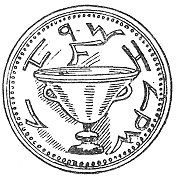

  
[Intangible Textual Heritage](../../index)  [Sub Rosa](../index.md) 
[Index](index)  [Previous](rrm19)  [Next](rrm21.md) 

------------------------------------------------------------------------

[Buy this Book at
Amazon.com](https://www.amazon.com/exec/obidos/ASIN/1564591182/internetsacredte.md)

------------------------------------------------------------------------

p. 148

### CHAPTER THE SIXTEENTH.

#### FOOTSTEPS OF THE ROSICRUCIANS AMIDST ARCHITECTURAL OBJECTS

THOMAS VAUGHAN, of Oxford, a famous Rosicrucian, whom we have before
mentioned, and who in the year 1650 published a book upon some of the
mysteries of the Rosicrucians, has the following passage. His work is
entitled *Anthroposophia Theomagica*; it has a supplemental treatise,
called *Anima Magica Abscondita*; we quote from pages 26 and 27 of the
united volume:

'In regard of the *Ashes of Vegetables*', says Vaughan, 'although their
*weaker exterior Elements* expire by violence of the *fire*, yet their
*Earth* cannot be *destroyed*, but is *Vitrified*. The *Fusion* and
*Transparency* of this substance is occasioned by the *Radicall
moysture* or *Seminal water* of the *Compound*. This water resists the
fury of the Fire, and cannot possibly be vanquished. "*In hac Aqua*
(saith the learned Severine), *Rosa latet in Hieme*." These two
principles are never separated; for *Nature* proceeds not so *far* in
her Dissolutions. When Death hath done her worst, there is an *Vnion*
between *these two*, and out of them shall God *raise* us at the last
day, and restore us to a *spiritual constitution*. I do not conceive
there shall be a Resurrection of every *Species*, but rather their
*Terrestrial* parts, together with the element of Water (*for there
shall be* "*no more sea*"; *Revelation*), shall be united in one mixture
with the Earth, and fixed to a pure *Diaphanous substance*. This is St.
John's

p. 149

\[paragraph continues\] Crystall gold, a
*fundamentall* of the New Jerusalem--so called, not in respect of
Colour, but constitution. Their *Spirits*, I suppose, shall be reduced
to their first *Limbus*, a *sphere* of pure, ethereall *fire*, like rich
Eternal Tapestry spread under the Throne of God.'

Coleridge has the following, which bespeaks (and precedes), be it
remarked, Professor Huxley's late supposed original speculations. The
assertion is that the matrix or formative substance is, at the base, in
all productions, 'from mineral to man', the same.

'The germinal powers of the plant transmute the fixed air and the
elementary base of water into grass or leaves; and on these the
organific principle in the ox or the elephant exercises an alchemy still
more stupendous. As the unseen agency weaves its magic eddies, the
foliage becomes indifferently the bone and its marrow, the pulpy brain
or the solid ivory; and so on through all the departments of
nature.'--Coleridge's *Aids to Reflection*, 6th edn., vol. i. p. 328.
See also Herder's *Ideen*, book v. cap. iii.

We think that we have here shown the origin of all Professor Huxley's
speculations on this head appearing in his *Lectures*, and embodied in
articles by him and others in scientific journals and elsewhere.

In a lecture delivered at the Royal Institution, Mr. W. S., Savory made
the following remarks: 'There is close relationship between the animal
and the vegetable kingdoms. The organic kingdom is connected with both
by the process of crystallization, which closely resembles some of the
processes of vegetation and of the growth of the lower orders of animal
creation.'

The 'Philosopher's Stone', in one of its many senses, may be taken to
mean the magic mirror, or translucent 'spirit-seeing crystal', in which
things impossible to ordinary ideas are disclosed. 'Know',

p. 150

says Synesius, 'that the *Quintessence*' (five-essence) 'and hidden
thing of our "stone" is nothing less than our celestial and glorious
soul, drawn by our magistery out of its mine, which engenders itself and
brings itself forth.' The term for 'Chrystal', or 'Crystal' in Greek, is
the following; which may be divided into twin or half-words in the way
subjoined:

ΧΡΥΣΤ \| --- \| ΑΛΛΟΣ

Crystal is a hard, transparent, colourless 'stone' composed of simple
plates, giving fire with steel, not fermenting with acid *menstrua*,
calcining in a strong fire, of a regular angular figure, supposed by
some to be '*formed of dew* coagulated with nitre'.

Amber is a solidified resinous gum, and is commonly full of electricity.
It was supposed, in the hands of those gifted correspondingly, to abound
with the means of magic. In this respect it resembles the *thyrsus* or
pinecone, which was always carried in processions--Bacchanalian or
otherwise--in connexion with the mysteries. We can consider the name of
the palace, or fortress or 'royal' house in Grenada, in Spain, in this
respect following. The word 'Alhambra' or 'Al-Hambra', means the 'Red'.
In Arabia this means the place of eminence, the 'place of places', or
the 'Red', in the same acceptation that the sea between Arabia and.
Egypt is called the 'Red Sea'. All spirits generally (in connexion with
those things supposed to be evil or indifferent especially) are 'laid'
in the 'Red Sea', when disposed of by exorcism, or in forceful
conjuration. We think that this 'Ham-bra', 'ambra', or 'ambre', is
connected with the substance amber, which is sometimes very red, and
which amber has always been associated with magical influence, magical
formularies, and with spirits. We

p. 151

have seen an ancient crucifix, carved in amber, which was almost of the
*redness* of coral. Amber has always been a substance (or gem, or gum)
closely mingling with superstitions, from the most ancient times. For
further connected ideas of the word 'amber,' and the substance 'amber'
in relation to magic and sorcery, and for the recurrence of the word
'amber' and its varieties in matters referring to the mysteries and the
mythology generally of ancient times, the reader will please to refer to
other parts of this volume.

While excavations were in progress at a mound in Orkney, described by
Mr. John Stuart, Secretary of the Society of Antiquaries of Scotland, on
July 18th, 1861, numerous lines of 'runes' of various sizes were found
on the walls and on the roof of a large vaulted chamber in the earth.
When the discoveries were completed, the series of runes exceeded 700 in
number; figures of '*dragons and a cross*' were also cut on some of the
slabs. There are many mounds of various forms and sizes in this part of
Orkney, and there is a celebrated circle of Druidical Stones on the
narrow peninsula which divides the two lochs of Stennis.

Pliny says that the word 'boa', for a snake, comes from 'bovine',
because '*young snakes are fed with cow’s milk*'. Here we have the
unexpected and unexplained connexion of the ideas of 'snake' and 'cow'.
The whole subject is replete with mystery, as well as the interchange of
the references to the 'Cross' and the 'Dragon' found in the *insignia*
of all faiths, and lurking amongst all religious buildings.

On a Phœnician coin, found at Citium or Cyprus, and engraved in
Higgins's *Celtic Druids*, p. 117, may be seen a cross and an animal
resembling a *hippocampus*, both of which, or objects closely similar,
appear on ancient sculptured stones in Scotland. The same two things, a
cross and a strange-looking animal,

p. 152

half mammal, half fish or reptile, but called by Mr. Hodgson, of
Newcastle-upon-Tyne, a Basilisk; appear together on a Mithraic
sculptured slab of the Roman period, found in the North of England. What
is more remarkable still, the 'star' and 'crescent', or 'sun' and
'moon', also appear, the whole being enclosed in what has been called
the 'Fire-Triangle', or 'Triangle with its Face Upwards'.

*The Builder*, of June 6th, 1863, has some valuable observations on
'Geometrical and other Symbols'.

The title 'Fig. 22' appears at this point, but there is no accompanying
illustration.--JBH.

In regard to the word 'Alhambra', we may associate another word
appropriated to Druidical Stones in England, *Men-Amber*. A famous
Logan-Stone, commonly called 'Men-Amber', is in the parish of Sethney,
near Pendennis, Cornwall. It is 11 feet long, 4 feet deep, and 6 feet
wide. From this the following derivatives may be safely made: Men-Amber,
Mon-Amber, Mon-Ambra, Mon-Amrha, Mon-Amra (M’Om-Ra, Om-Ra), 'Red Stone',
or Magic, or Angelic, or Sacred Stone. This red colour is male--it
signifies the Salvator.

The following is the recognitory mark or talisman of the Ophidiæ: Φ. The
Scarabæus, Bee, Ass, Typhon, Basilisk, Saint-Basil, the town of Basle
(Basil, or Bâle), in Switzerland (of this place it may be remarked, that
the appropriate cognisance is a 'basilisk' or a 'snake'), the mythic
horse, or *hippocampus*, of Neptune, the lion, winged (or natural), the
Pegasus or winged horse, the Python, the Hydra, the Bull (Osiris), the
Cow (or Io), are mythological ideas which have each a family connexion.
All the above signify an identical myth. This we shall presently show
conclusively, and connect them all with the worship of fire.

Our readers have no doubt often wondered to see

p. 153

on the table-monuments in Christian cathedrals a creature resembling a
dog, or generally like some four-footed animal, trampled by the feet of
the recumbent effigy. It is generally a male which is represented as
performing this significant efforcement, trampling or piercing with the
point of his sword, or the butt of the crosier (in his *left hand*, be
it remembered). This crosier is the ancient *pedum*, or *lituus*. At
Brent-Pelham, in Hertfordshire, there is a tomb, bearing the name of a
knight, Pierce Shonke, *built in the wall*. He is said to have died A.D.
1086. Under the feet of the figure there is a *cross-flourie*, and under
the cross a serpent (Weever, p. 549). There is an inscription which,
translated, means:

Nothing of Cadmus nor Saint George, those names of great renown,
survives them but their names;

But Shonke *one serpent kills, t’other defies*,  
And in this wall, *as in a fortress*, lies.

\[paragraph continues\] See Weever's
*Ancient Funeral Monuments*. He calls the place '*Burnt* Pelham', and he
says: 'In the wall of this Church lieth a most ancient Monument: A Stone
wherein is figured a man, and about him an Eagle, a Lion, and a Bull,
having all wings, and a fourth of the shape of an Angell, as if they
should represent the four Evangelists: under the feet of the man is a
crosse Flourie.'

'The being represented cross-legged is not always a proof of the
deceased having had the merit either of having been a *crusader*, or
having made a pilgrimage to the Holy Sepulchre. I have seen at Milton,
in Yorkshire, two figures of the *Sherbornes* thus represented, who, I
verily believe, could never have had more than a wish to enter the Holy
Land.' Pennant writes thus of the Temple, London.

p. 154

Weever points out, in relation to the monument of Sir Pierce or Piers
Shonke described above: 'Under the Cross is a Serpent. Sir Piers Shonke
is thought to havve been sometime the Lord of an ancient decaied House,
well moated, not farre from this place, called "O Piers Shonkes". He
flourished *Ann. a conquestu, vicesimo primo*.'--Weever, p. 549.

'The personation of a *dog*--their invariable accompaniment, as it is
also found amongst the sculptures of Persepolis, and in other places in
the East--*would*

[  
Click to enlarge](img/15400.jpg.md)  
Fig. 23  

*in itself be sufficient to fix the heathen appropriation of these
crosses*' (the ancient Irish crosses), 'as that animal can have no
possible relation to Christianity; whereas, by the Tuath-de-danaans, it
was accounted *sacred*, and its maintenance enjoined by the ordinances
of the state, as it is still in the Zend books, which remain after
Zoroaster.'--O’Brien’s *Round Towers of Ireland*, 1834, p. 359.

'I apprehend the word "Sin" came to mean Lion when the Lion was the
emblem of the Sun at his summer solstice, when he was in his glory, and
the Bull and the "Man" were the signs of the Sun at the

p. 155

\[paragraph continues\] Equinoxes, and the
Eagle at the winter solstice.'--*Anacalypsis*, vol. ii. p. 292.

Figure 23 is an Egyptian bas-relief, of which the explanation is the
following: A is the Egyptian Eve trampling the Dragon (the goddess
Neith, or Minerva); B, a Crocodile; C, Gorgon's head; D, Hawk (wisdom);
E, feathers (soul).

'The first and strongest conviction which will flash on the mind of
every ripe antiquary, whilst surveying the long series of Mexican and
Toltecan monuments preserved in these various works, is the similarity
which the ancient monuments of New Spain bear to the monumental records
of Ancient Egypt. Whilst surveying them, the glance falls with familiar
recognition on similar graduated pyramids, on similar marks of the same
primeval *Ophite worship*, on vestiges of the same Triune and Solar
Deity, on planispheres and temples, on idols and sculptures, some of
rude and some of finished workmanship, often presenting the most
striking affinities with the Egyptian.'--Stephens and Catherwood's
*Incidents of Travel, in Central America.*

 

 

------------------------------------------------------------------------

[Next: Chapter XVII: The Round Towers of Ireland](rrm21.md)
