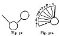
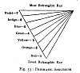
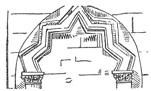

  
[Intangible Textual Heritage](../../index)  [Sub Rosa](../index) 
[Index](index)  [Previous](rrm21)  [Next](rrm23) 

------------------------------------------------------------------------

[Buy this Book at
Amazon.com](https://www.amazon.com/exec/obidos/ASIN/1564591182/internetsacredte)

------------------------------------------------------------------------

p. 162

### CHAPTER THE EIGHTEENTH

#### PRISMATIC INVESTITURE OF THE MICROCOSM

THE chemical dark rays are more bent than the luminous. The chemical
rays increase in power as you ascend the *spectrum*, from the red ray to
the violet. The chemical rays typified by the Egyptians under the name
of their divinity, Taut or Thoth, are most powerful in the morning; the
luminous rays are most active at noon (Isis, or abstractedly
'manifestation'); the heating rays (Osiris) are most operative in the
afternoon. The chemical rays are the most powerful in spring
(germination, 'producing', or 'making'), the most luminous in the summer
(ripening, or 'knowing'), the most heating in the autumn (perpetuating).
The chemical rays have more power in the Temperate Zone; the luminous
and heating, in the Tropical. There are more chemical rays given off
from the centre of the sun than from the parts near its circumference.

[  
Click to enlarge](img/16200.jpg)  
Fig. 32 and 32A  

Each prismatic atom, when a ray of light strikes upon it, opens out on a
vertical axis, as a *radius* or fan of seven different 'widths' of the
seven colours, from the *least* refrangible red up to the *most*
refrangible violet. (Refer to diagram above.)

'The Egyptian Priests chanted the seven vowels as a hymn addressed to
Serapis' (*Eusebe-Salverte*, Dionysius of Halicarnassus).

p. 163

'The vowels were retained to a comparatively late period in the mystic
allegories relative to the Solar System.' 'The seven vowels are
consecrated to the seven principal planets' (Belot, *Chiromancie*, 16th
cent.).

[  
Click to enlarge](img/16300.jpg)  
Fig. 33: PRISMATIC SPECTRUM  

The cause of the splendour and variety of colours lies deep in the
affinities of nature. There is a singular and mysterious alliance
between colour and sound. There are seven pure tones in the diatonic
scale, because the harmonic octave is on the margin, or border, or
rhythmic point, or the First and Seventh, like the chemical dark rays on
the margin of the solar *spectrum*. (See explanatory chart of the
Prismatic Colours above.)

Red is the *deep bass* vibration of ether. To produce the sensation of
red to the eye, the luminous line must vibrate 477 millions of millions
of times in a second. Blue, or rather purple, is the *high treble*
vibration, like the upper C in music. There must be a vibration of 699
millions of millions in a second to produce it; while the cord that
produces the high C must vibrate 516 times per second.

Heat, in its effect upon nature, produces colours and sounds. The
world’s temperature declines one degree

p. 164

at the height of 100 feet from the earth. There is a difference of one
degree in the temperature, corresponding to each 1,000 feet, at the
elevation of 30,000 feet. Colouration is effected, at the surface of the
earth, to the same amount in one minute that takes half an hour over
three miles high, in the full rays of the sun. The dissemination of
light in the atmosphere is wholly due to the aqueous vapour in it. The
*spectrum* is gained from the sun. In the air opposite to it, there is
no *spectrum*. These conclusions result from balloon observations made
in April 1863, and the philosophical deductions are a victory for
'aqueous vapour'.

It has been demonstrated that flames are both sensitive and sounding;
they have, therefore, special affinities.

'The author of *The Nature and Origin of Evil* is of opinion that there
is some inconceivable *benefit* in Pain, abstractly considered; that
Pain, however inflicted or wherever felt, communicates some good to the
General System of Being; and that every animal is some way or other the
better for the pain of every other animal. This opinion he carries so
far as to suppose that there passes some principle of union through all
animal life, as attraction is communicated to all corporeal nature; and
that the evils suffered on this globe may by some inconceivable means
contribute to the felicity of the inhabitants of the remotest
planet.'--Contemporary review of the *Nature and Origin of Evil*.

'Without subordination, no created System can exist: all subordination
implying Imperfection; all Imperfection, Evil; and all Evil, some kind
of Inconveniency or Suffering.'--Soame Jenyns, *Free Enquiry into the
Nature and Origin of Evil*.

'Whether Subordination implies Imperfection may

p. 165

be disputed. The means respecting themselves may be as perfect as the
end. The Weed as a Weed is no less perfect than the Oak as an Oak.
Imperfection may imply primitive Evil, or the Absence of some Good; but
this Privation produces no Suffering, but by the Help of Knowledge.'
'Here the point of view is erroneously taken for granted. The end of the
oak, in another comprehension, may be the weed, as well as the end of
the weed the oak. The contraries may be converse, *out of our*
appreciation.'--Review of the above work in *Miscellaneous and Fugitive
Pieces*. London: T. Davies, 1774.

'There is no evil but must inhere in a conscious being, or be referred
to it; that is, Evil must be *felt* before it is Evil.'--Review of *A
Free Enquiry into the Nature and Origin of Evil*, p. 5 of the same
*Miscellaneous and Fugitive Pieces*. London: T. Davies, Russell Street,
Covent Garden, Bookseller to the Royal Academy. 1774. Query, whether the
Review of this Book, though attributed to Dr. Johnson, be not by Soame
Jenyns himself, the author of the book?

'Thoughts, or ideas, or notions--call them what you will--differ from
each other, not in *kind*, but in *force*. The basis of all things
cannot be, as the popular philosophy alleges, mind. It is infinitely
improbable that the *cause* of *mind*--that is, of *existence*--is
similar to mind.'--Shelley's *Essays*. The foregoing is contained in
that on Life. He means Reason, in this objection to MIND. Shelley
further remarks: 'The words I, and YOU, and THEY, are grammatical
devices, invented simply for arrangement, and totally devoid of the
intense and exclusive sense usually attached to them.'

In the *Memoirs of the Life and Writings of Mr. William Whiston*, part
ii. (1749), there occur the following observations:

p. 166

'N.B.--I desire the reader to take notice that the very learned *Gerard
John Vossius*, in his three accurate dissertations, *De Tribus
Symbolis*, or *Of The Three Creeds*--that called *The Apostles’ Creed*,
that called *The Athanasian Creed*, and that called the *Nicene* or
*Constantinopolitan Creed*, with the *Filioque*, has proved them to be
all falsely so called: that the first was only the Creed of the *Roman*
Church about A.D. 400; that the second was a forgery about 400 years
after Athanasius had been dead, or about A.D. 767, and this in the West
and in the Latin Church only, and did not obtain in the *Greek* Church
till about 400 years afterwards, or about A.D. 1200; and that the third
had the term *Filioque* first inserted into it about the time when the
*Athanasian Creed* was produced, and not sooner, or about A.D. 767.'

 

 

------------------------------------------------------------------------

[Next: Chapter XIX: Cabalistic Interpretations by the Gnostics](rrm23)
