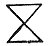
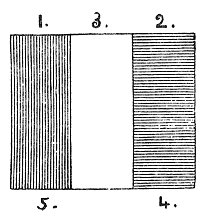

  
[Intangible Textual Heritage](../../index)  [Sub Rosa](../index.md) 
[Index](index)  [Previous](rrm22)  [Next](rrm24.md) 

------------------------------------------------------------------------

[Buy this Book at
Amazon.com](https://www.amazon.com/exec/obidos/ASIN/1564591182/internetsacredte.md)

------------------------------------------------------------------------

p. 167

### CHAPTER THE NINETEENTH

#### CABALISTIC INTERPRETATIONS BY THE GNOSTICS

To indicate God’s existence, the ancient sages of Asia, and many Greeks,
adopted the emblem of pure fire, or ether.

'Aerem amplectatur immensus æther, qui constat exaltissimis ignibus'
(Cicero, *De Natura Deorum*, lib. ii. c. 36.) 'Cœlum ipsum stellasque
colligens, omnisque siderum compago, æther vocatur, non ut quidem putant
quod ignitus sit et insensus, sed quod cursibus rapidis semper rotatur'
(Apuleius, *De Mundo*). Pythagoras and Empedocles entertained similar
theories (Brucker, I, c. i. p. 113). Parmenides also represented God as
a universal fire which surrounded the heavens with its circle of light
and fire (Cicero, *De Natura Deorum*, lib. iii. c. 2). Hippasus,
Heraclitus, and Hippocrates imagined God as a reasoning and immortal
fire which permeates all things (Cudworth, *Systema Intellectuale*, *p*.
104; and Gesnerus, *De Animis Hippocratis*). Plato and Aristotle
departed but little from this in their teachings; and Democritus called
God 'the reason or soul in a sphere of fire' (Stobæus, *Eclogæ Physicæ*,
lib. vii. c. 10.) Cleonethes considered the sin as the highest god
(Busching, *Grundriss einer Geschichte dir Philosophie*, 1 Th. p. 344)
We find, therefore, in the earliest ages, an æther (spiritual fire)
theory, by which many modern theorists endeavour to explain the
phenomena of magnetism. This is the 'Ætheræum' of Robert Flood, the
Rosicrucian.

p. 168

Fire, indeed, would appear to have been the chosen-element of God. In
the form of a flaming 'bush' He appeared to Moses on Mount Sinai. His
presence was denoted by torrents of flame, and in the form of fire He
preceded the band of Israelites by night through the dreary wilderness;
which is perhaps the origin of the present custom of the Arabians, 'who
always carry fire in front of their caravans' (Reade's *Veil of Isis*).
All the early fathers held God the Creator to consist of a 'subtile
fire'. When the Holy Spirit descended upon the Apostles on the Day of
Pentecost, it was in the form of a tongue of fire, accompanied by a
rushing wind. See *Anacalypsis*, vol. i. p. 627 (Parkhurst, *in voce*
‏ברנ‎ (Sic--JBH)).

The personality of Jehovah is, in Scripture, represented by the Material
Trinity of Nature; which also, like the divine antitype, is of one
substance. The primal, scriptural type of the *Father* is *Fire*; of the
*Word*, *Light*; and of the *Holy Ghost*, *Spirit*, or *Air in motion*.
This material Trinity, as a type, is similar to the material trinity of
Plato as, a type, it is used to conceal the 'Secret Trinity'. See
*Anacalypsis*, vol. i. p. 627. Holy fires, which were never suffered to
die, were maintained in all the temples: of these were the fires in the
Temple of the Gaditanean Hercules at Tyre, in the Temple of Vesta at
Rome, among the Brachmans of India, among the Jews, and principally
among the Persians. Now to prove that all 'appearances' are 'born of
Fire', so to speak, according to the ideas of the Rosicrucians.

Light is not radiated from any intensely heated *gas* or *fluid*. If
nitre is melted, it will not be visible but throw into it any *solid*
body, and as soon as that becomes heated it will radiate light; hence
the phenomenon, 'Nasmyth’s willow-leaves', in the sun, must be solid,
not gaseous; and through their medium

p. 169

the whole of our light from the sun is doubtless derived. See the
records of the British Association for the Advancement of Science
(Cambridge Meeting), October 1862. These physical facts were known to
the ancient Persians.

The ancient ideas upon these subjects have not come down to us at all
definitely. The destruction of ancient manuscripts was effected upon a
large. scale. Diocletian has the credit of having burned the books of
the Egyptians on the chemistry of gold and silver (alchemy). Cæsar is
said to have burned as many as 700,000 rolls at Alexandria; and Leo
Isaurus 300,000 at Constantinople in the eighth century, about the time
that the Arabians burned the famous Alexandrian Library. Thus our
knowledge of the real philosophy of the ancient world is exceedingly
limited; almost all the old records, or germinating means of knowledge,
being rooted out.

In regard to 'Boudhisme, ou système mystique' as he denominates it, a
learned author describes it as 'Métaphysique visionnaire, qui, prenant à
tâche de contrarier l’ordre naturel, voulut que le monde *palpable* et
*matériel* fût *une illusion* fantastique; que l’existence de l’homme
fût *un réve dont la mort la était le vrai rèveil:* que son corps fût
une *prison impure* dont il devait se hâter de sortir, ou une *enveloppe
grossière* que, pour la rendre perméable à la lumière interne, il devait
atténuer, diaphaniser par le jeûne les macérations, les contemplations,
et par une foule de pratiques anachorétiques si étranges que le vulgaire
étonné ne put s’expliquer le caractère de leurs auteurs qu’en les
considérant comme des êtres surnaturels, avec cette difficulté de savoir
s’ils furent *Dieu devenu homme*, ou *l’homme devenu Dieu*.'--Volney.
(C. F.), *Les Ruines*, p. 210.

'Mind cannot *create*, it can only *perceive*.' This

p. 170

hazardous statement, in its utmost extent, is used simply as an argument
against there being the *philosophical* possibility of religion as
derivable from *reason* only--which will be found to be the mere
operation of the forces of the 'world'. No religion is philosophically
capable of being defended on the grounds of *reason*; though one
religion may seem (but, in the inner light, it will *seem* only) to be
more reasonable (or probable) than another. Divine light, or faith, or
intuition--in other words, the enlightenment of the Holy Spirit (to be
recognized under its many names)--is that means alone which can carry
truth, through the exposure of the futility of all *knowable* (that is,
of all intellectual) truth. Such are the abstract notions of the
Gnostics, or 'Illuminati', concerning religion.

'The curtains of Yesterday drop down, the curtains of To-morrow roll up;
but Yesterday and To-morrow both *are*' (*Sartor Resartus*, edit. 1838,
Natural-Supernaturalism', p. 271). To the divine knowledge, the future
must be as much present as the present itself.

The explorations of the Rosicrucians may be said to be 'as keys to
masked doors in the ramparts of nature, which no mortal can pass through
without rousing dread sentries never seen upon this side' (*A Strange
Story*, Lord Lytton, vol. i. p. 265). 'Omnia ex Uno, Omnia in Uno, Omnia
ad Unum, Omnia per Medium, et Omnia in Omnibus' (*Hermetic axiom*).

In the speculations of the Gnostics, the astronomical points Cancer and
Capricorn are called the 'Gates of the Sun'. Cancer, moreover, is termed
the 'Gate of Man'; Capricorn, is the 'Gate of the Gods'. These are
Platonic views, as Macrobius declares. With the influences of the
planets, Saturn brings reason and intelligence; Jupiter, power of
action; Mars governs

p. 171

the irascible principle, the Sun produces sensation and speculation,
Venus inspires the appetites, Mercury bestows the power of declaring and
expressing, and the Moon confers the faculty of generating and
[augmenting](errata.htm#3.md) the body. The Egyptian 'winged disc' is a
symbol of 'Tat', Taut', or 'Thoth' (Plutarch, *De Iside et Osiride*).
The lions’ heads, so frequently observable, in the sculptures decorating
fountains, bespeak the astral influences under Leo, which produce the
rains in the ardent month of July; and in this view they are regarded as
the discharges of the 'sacred fountains'. Lions’ heads, with fountains,
are observable in architecture all the world over. All architecture is
primarily derivable from two mathematical lines (\| and --), which,
united (and intersecting), form the 'cross'. The first 'mark' is the
origin of the 'upright' tower, pyramid, or imitation ascending 'flame of
fire', which aspires *against the force of gravity*; also of the
steeple, or *phallus*, all over the world. The second, or horizontal,
'mark' is the symbol of the tabernacle, chest, or ark, or fluent or
base-line, which is the expression of all Egyptian, Grecian, and Jewish
templar architecture. The union of the two lines gives the Christian,
universal cross-form, in the blending of the 'two dispensations'--Old
and New, or 'Law' and 'Gospel'. Now, both of these lines, in the
Rosicrucian sense, have special magic 'powers', or gifts, according to
their several places, and according to the 'supernatural extra forces
brought' specially to bear on them through the operations of those who
know *how* (and *when*) to direct the occult power.

Those powers bestowed upon the original deserving 'Man', and not
extinguished in the existing 'Man', are his still--if he retain any
glimpse of his original spark of light.

Justinus Kerner, in his *Scherin von Prevorst*, most

p. 172

ingeniously anatomizes the inner man, and makes him consist of 'Seele',
'Nerven-geist', and' 'Geist'. The 'Nerven-geist', or nervous energy,
being of a grosser nature, continues united with the 'Seele' on its
separation from the body, rendering it visible *in the form of an
apparition*, and enabling it to effect material objects, make noises,
move articles, and suchlike things perceptible to the living sense--in
short, to 'spucken'. According to its nature, this composite being takes
a longer or shorter time to be dissolved; the 'Geist' alone being
immortal (*The Gnostics and their Remains*, note to p. 46).

An *Ancient Homily on Trinity Sunday* has the following: 'At the deth of
a manne, three bells should be ronge as his knyll in worship of the
Trinitie. And for a woman [1](#fn_7.md), *who was
the Second Person of the Trinitie*, two bells should be ronge.' Here we
have the source of the emblematic difficulty among the master-masons,
who constructed the earlier cathedrals, as to the addition and as to the
precise value of the second (or feminine) tower at the western end (or
Galilee) of a church.

Valentinus is called the 'profoundest doctor of the Gnosis'. According
to him, the 'Eons' (angels, or effusions) number fifteen pairs, which
represent the thirty degrees of each sign of the zodiac. The name of the
great Gnostic deity, Abraxas, is derived as follows: 'Ab' or 'Af' ('Let
it be'); 'Rax' or 'Rak' ('Adore'); 'Sas' or 'Sax' for 'Sadshi' ('Name').
'The entire Gnostic system was not derived either from the Kabala, or
from the Grecian philosophy; but from the East, as Mosheim long ago
maintained': so declares the author of *The Gnostics and their Remains*;
but it is a thorough mistake,

p. 173

both in his authority (Mosheim), and also in himself. We shall
successfully show this before we have done.

As soon as Jesus was born, according to the Gnostic speculative view of
Christianity, Christos, uniting himself with Sophia (Holy Wisdom),
descended through the seven planetary regions, assuming in each an
analogous form to the region, and concealing his true nature from its
genii, whilst he attracted into himself the sparks of Divine Light they
severally retained in their angelic essence. Thus Christos, having
passed through the seven *Angelic Regions* before the 'THRONE', entered
into the man Jesus, at the moment of his baptism in the Jordan. 'At the
moment of his baptism in the Jordan'--mark. Up to that point he was
natural--but not the 'Christ'. This will recall his exclamation of
world’s disclaimer to the Virgin:--'Woman, what have I to do with thee?'
From that time forth, being supernaturally gifted, Jesus began to work
miracles. Before that, he had been completely ignorant of his mission.
When on the cross, Christos and Sophia left his body, and returned to
their own sphere. Upon his death, the two took the man 'Jesus', and
abandoned his material body to the earth; for the Gnostics held that the
true Jesus did not (and could not) physically suffer on the cross and
die, but that Simon of Cyrene, who bore his cross, did in reality suffer
in his room: 'And they compel one Simon a Cyrenian, who passed by,
coming out of the country, the father of Alexander and Rufus, to bear
his cross' (*St. Mar*k xv. 21). The Gnostics contended that a portion of
the real history of the Crucifixion was never written.

Asserting that a miraculous substitution of persons took place in the
great final act of the 'Crucifixion', the Gnostics maintained that the
'Son of God' could not suffer physically upon the cross, the apparent

p. 174

sufferer being .human only--real body having no part with him.

At the point of the miraculous transference of persons, Christos and
Sophia (the Divine) left his body, and returned to their own heaven.
Upon his death on earth, the two withdrew the 'Being' Jesus
(spiritually), and gave him another body, made up of ether (Rosicrucian
*Ætheræum*). Thenceforward he consisted of the two first Rosicrucian
principles only, soul and spirit; which was the cause that the disciples
did not recognize him after the resurrection. During his sojourn upon
earth of eighteen months after he had risen, he received from Sophia
(*Soph*, *Suph*), or Holy Wisdom, that perfect knowledge or
illumination, that true 'Gnosis', which he communicated to the small
number of the Apostles who were capable of receiving the same:

The Gnostic authorities are St. Irenæus in the first place, Tertullian,
Clemens Alexandrinus, Origen, St. Epiphanius. The Gnostics are divided
into sects, bearing the names of Valentinians, Carpocratians,
Basilideans, and Manichæans. Γνωσις, Gnosis, Gnossos: thence 'Gnostics'.

As the Son of God remained unknown to the world, so must the disciple of
Basilides also remain unknown to the rest of mankind. As they know all
this, and yet must live amongst strangers, therefore must they conduct
themselves towards the rest of the world as invisible and unknown. Hence
their motto, 'Learn to know all, but keep thyself unknown' (Irenæus).

The speech of an angel or of a spirit with man is heard as sonorously as
the speech of one man with another, yet *it is not heard by others who
stand near*, but by the man himself alone. The reason is, that the
speech of an angel or of a spirit flows first into

p. 175

the man’s thought, and, by an internal way, into his organ of hearing,
and thus actuates it *from within*; whereas the speech of man flows
first into the air, and, by an external way, into his organ of hearing,
which it actuates *from without*. Hence it is evident that the speech of
an angel and of a spirit with man is *heard in man*, and, since it
equally affects the organs of hearing, that it is equally sonorous
(Swedenborg; also *Occult Sciences*, p. 93; London, 1855).

The Greek Bacchanals were well acquainted with the *mythos* of Eve,
since they constantly, invoked her, or a person under her name, in their
ceremonies.

Black is the Saturnian colour--also that of the Egyptian Isis. Under the
strange head of the embodiment of Deity under darkness, the following
remarkable facts may be considered: the Virgin and Child are depicted
*black* at the Cathedral at Moulins, at the famous Chapel of the Virgin
at Loretto, in the Church of the Annunciation at Rome, at the Church of
St. Lazaro and the Church of St. Stephen at Genoa, at that of St.
Francisco at Pisa, at the Church of Brixen in the Tyrol, at a church in
(and at the Cathedral of) Augsburgh, where the black figures are as
large as life, at the Borghese Chapel in Rome, at the Church of Santa
Maria Maggiore in the Pantheon, and in a small chapel at St. Peter’s, on
the right-hand side, on entering, near the door. The reader can make
references in his memory to these places, if he be a traveller.

The writer, who goes by the name of Dionysius Areopagita, teaches that
the highest spiritual truth is revealed only to those who have
transcended every ascent of every holy height, and have left behind all
divine lights and sounds and heavenly discoursing, and have passed into
that *Darkness* where HE really is (as saith the Scripture) who is ALL,
above all things

p. 176

\[paragraph continues\] (*De Mystica
Theologia*, cap. i. sec. 3; *Hours with the Mystics*, by R. A. Vaughan,
note to book i. chap. 2).

The words graven upon the zone and the feet of the Ephesian Diana, which
Hesychius has preserved, are the following:

|              |     |                |     |                   |
|--------------|-----|----------------|-----|-------------------|
| Aski-Kataski |     | interpreted as |     | 'Darkness--Light' |
| Haix-Tetrax  |     |                |     | 'Himself'         |
| Damnameneus  |     |                |     | 'The Sun'         |
| Aision       |     |                |     | 'Truth'           |

'These Ephesian words', says Plutarch (*Sympos*), 'the Magi used to
recite over those possessed with devils.' 'Damnameneus' is seen on a
Gnostic amulet in the De la Turba Collection (*The Gnostics*, p. 94).

The Argha had the form of a crescent. The *Argo*, *arc*, or *arche*, is
the *navis biprora*. It is clear that, as neither the full moon nor the
half-moon was ever the object of worship, it is the *crescent horns* of
the moon which imply the significance. These mean the woman-deity in
every religion.

The snake associated with the mysteries among the Hindoos is the
cobra-di-capella. It is said that the snake on the heads of all the
Idols in Egypt was a Cobra. The name of the monarch or Chief Priest in
Thibet is the Lama, or the Grand Lama. Prester-John is the great Priest,
or Prestre (*Prêtre*), Ian, Ion, Jehan, or John (the Sun). Lamia is the
'*snake*' among the Ophidians; Lama is the hand: *lamh*, hand, is a
divine name in the Scythian tongue. It also means the number 10, and the
Roman numeral X, which is a cross. Now, the double pyramid, or 

|                    |
|--------------------|
|  |

hand, (*a*) △, of the Egyptians comprises the mystic mark signifying the
two original principles water and fire, as above--(*b*)--the union of
which, as intersecting triangles, forms the famous

p. 177

\[paragraph continues\] Hexalpha, or
'Solomon's Seal', or 'Wizard's Foot', which, according to the Eastern
allegory, is placed (as that of St. Michael) upon the Rebellious Spirits
in their 'abyss', or 'prison'.

*Pyr* is the Greek name of fire (thence Pyramid), and mythologically of
the *sun*, who was the same as Hercules. And the great analyser of
mythology assures us that *Pur* was the ancient name of Latian
*Jupiter*, the father of Hercules; that he was the deity of fire; that
his name was particularly retained amongst the people of Præneste, who
had been addicted to the *rites* of *fire*. Fire, in short, in these
mythologies, as also in all the Christian churches, meets us at every
turn. But we must not mix up heathen ideas and Christian ideas in these
matters.

 

 

------------------------------------------------------------------------

### Footnotes

[172:1](rrm23.htm#fr_7.md) This is a curious direct
assertion that the Saviour of the World was feminine.

------------------------------------------------------------------------

[Next: Chapter XX: Mystic Christian Figures and Talismans](rrm24.md)
