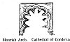
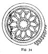

  
[Intangible Textual Heritage](../../index)  [Sub Rosa](../index.md) 
[Index](index)  [Previous](rrm23)  [Next](rrm25.md) 

------------------------------------------------------------------------

[Buy this Book at
Amazon.com](https://www.amazon.com/exec/obidos/ASIN/1564591182/internetsacredte.md)

------------------------------------------------------------------------

p. 178

[  
Click to enlarge](img/17800.jpg.md)  
Moorish Arch. Cathedral of Cordova  

### CHAPTER THE TWENTIETH

#### MYSTIC CHRISTIAN FIGURES AND TALISMANS

OUR engraving borrows from the West Front of Laon Cathedral, France, a
Catherine-Wheel (or 'Rose') Window. The twelve pillars, or *radii*, are
the signs of the Zodiac, and are *issuant* out of the glorified centre,
or opening 'rose'--the sun, or 'beginning of all things'. 'King Arthur’s
Round Table' displays the 'crucified' Rose in its centre.

[  
Click to enlarge](img/17801.jpg.md)  
Fig. 34  

In the 'tables' (*Tablier*, Fr. = Apron), alternating with tying-knots,
of the Order of the Garter--which 'Most Noble Order' was originally
dedicated, be it remembered, to the Blessed Lady, or to the Virgin
Mary--the microcosmical, miniature 'King Arthur’s Round Table' becomes
the individual female *discus*, or organ, waxing and waning, negative or
in flower, positive or natural, alternately red and white, as the Rose
of the World: *Rosamond*, *Rosa mundi*. And here we will adduce, as our
justification for this new reading of the origin of the Order of the
Garter, the very *motto* of the princely order itself:

p. 179

*Honi soit qui mal y pense!*

or,

'YONI' *soit qui mal y pense!*

\[paragraph continues\] What this 'Yoni'
is, and the changes meant and apotheosized through it, the discreet
reader will see on a little reflection.

All the world knows the chivalric origin of this Most Noble Order of the
Garter [1](#fn_8.md). It arose in a princely
act--rightly considered princely, when the real, delicate, inexpressibly
high-bred motive and its circumstances are understood, which motive is
systematically and properly concealed. Our great King Edward the Third
picked up, with the famous words of the motto of the Order of the
Garter, the 'garter'--or, as we interpret it, by adding a new
construction with hidden meanings, the 'Garder' (or special *cestus*,
shall we call it?)--of the beautiful and celebrated Countess of
Salisbury, with whom, it is supposed, King Edward was in love.

The following is from Elias Ashmole: 'The Order of the Garter by its
motto seems to challenge inquiry and defy reproach. Everybody must know
the story that refers the origin of the name to a piece of gallantry:
either the Queen or the Countess of Salisbury having been supposed to
have dropped one of those very useful pieces of female attire at a
dance; upon which old Camden says, with a great deal of propriety, and a
most just compliment to the ladies, "*Hæc vulgus perhibet, nec vilis
sane hæc videatur origo, cum* NOBILITAS *sub* AMORE *jacet*." The ensign
of the order, in jewellery or enamel, was worn originally on the *left
arm*. Being in the form of a *bracelet* to the arm, it might possibly
divert the attention of the

p. 180

men from the reputed original; it might be dropped and resumed without
confusion; and the only objection I can see to the use of such an
ornament is the hazard of mistake from the double meaning of the term
*periscelis*, which signifies not only a *garter*, but breeches, which
our English ladies never wear: "Quæ Græci περισχελῆ vocant, nostri
Braccas" (braces or breeches) "dicunt", says an ancient Father of the
Church.' The Garter, to judge thus from Camden, was not a garter at all
for the leg, but an occasional very important item of feminine
under-attire; and King Edward's knightly feeling, and the religious
devotion of the object, will be perceived upon close and delicately
respectful consideration.

There is great obscurity as to the character of Abraxas, the divinity of
the Gnostics. The Eons, or Degrees of Advance in the Zodiacal Circle,
are thirty in number to each of the Twelve Signs, and consequently there
are 360 to the entire Astronomical Circle, or 365, counting for each day
of the solar year. The inscription upon the Gnostic gems, CΕΟΥ, is
probably intended for ΘΕΟΥ; 'for the Arabs yet substitute the *s* for
the *th* in their pronunciation' (*Gnostics*, p. 233; Matter, *Histoire
Critique du Gnosticisme*). In this '*s*', and the '*th*' standing for
it, lie all the mysteries of Masonry.

+, Christos, was designed for the guide of all that proceeds from God.
Sophia-Achamoth is the guide, according to the Gnostics, for all
proceeding out of 'matter'. St. Irenæus, whose period is the end of the
second century, draws all these startling inferences from the Book of
Enoch, and names 'Sophia' as signifying the Divine Wisdom. The Ophite
scheme seems evidently the Bhuddistic Bythos, answering to the first
Buddha. Sige, Sophia, Christos, Achamoth, Ildabaoth, answer to the
successive five others (*Gnostics*,

p. 181

p\. 27; Bellermann’s *Drei Programmen über die Abraxasgemmen*, Berlin,
1820; Basilides; Tertullian; *De Præscript*.: 'Serpentem magnificant in
tantum, ut ilium etiam Christo præferant.' See Tertullian, Epiphanius,
and Theodoret.: *St. John* iii. 14, also). We now refer the reader to
some significant figures towards the end of our volume, which will be
found according to their numbers.

Figure 289: The Abraxas-god, invested with all the attributes of Phœbus.
Green jasper; a unique type. The Egyptians call the moon the mother of
the world, and say it is of both sexes (Plutarch; Spartian, *Life of
Caracalla*). The moon, in a mystic sense, is called by the Egyptians
male and female. The above is a gem in the Bosanquet Collection. In the
*exerque* is the address, CΑΒΑΩ, 'Glory unto Thee!' On the reverse, in a
*cartouche* formed by a coiled asp--precisely as the Hindoos write the
ineffable name 'Aum'--are the titles ΙΑΩ.ΑΒΡΑCΑΞ (*The Gnostics*, p.
86).

Figure 311 represents Venus standing under a canopy supported on twisted
columns, arranging her hair before a mirror held up by a Cupid; two
others hover above her head, bearing up a wreath. In the field, ΦΑΣΙΣ
ΑΡΙΩΡΙΦ--'The Manifestation of Arioriph'. Venus here stands for the
personification of the Gnostic *Sophia*, or Achamoth, and as such is the
undoubted source of our conventional representation of Truth
([Montfauçon](errata.htm#4), pl. clxi.md). *Reverse*, figure 312, which
represents Harpocrates seated upon the lotus, springing from a double
lamp, formed of two phalli united at the base. Above his head is his
title 'Abraxas', and over that is the name 'Iao'. In the field are the
seven planets. The sacred animals--the scarab, ibis, asp, goat,
crocodile, vulture, emblems of so many deities (viz. Phre, Thoth, Isis,
Merides,

p. 182

\[paragraph continues\] Bebys, Neith)--the
principal in the Egyptian mythology, arranged by *threes*, form a frame
to the design. Neatly engraved on a large, bright loadstone (*The
Gnostics*, p. 211).

ORIGIN OF THE TRICOLOR

'THEORY OF SACRAMENTAL MYSTICISM', ADAPTED FROM THE SPECULATIONS OF THE
SOPHISTS OR GNOSTICS

|                  |              |                                |
|------------------|--------------|--------------------------------|
| *Blue*           | *White*      | *Red*                          |
| (B.V.M.)         | (S.S.)       | (*Φ*, Fire)                    |
| Baptism by water | Air or Light |                                |
| Natural          | Intermediate | Supernatural                   |
|                  | *Nexus*      |                                |
| Bread ('Host')   | and          | Wine (cup denied to the Laity) |
| Body             |              | Spirit: symbolical 'Blood      |

*Sacramenta;* 'Baptism and the Supper of the Lord'

From the above cabalistic estimate of the virtues of colours, it happens
that the colour blue (sky-blue) is chosen as the colour for the
investiture of infants at baptism, and as the colour for children's
coffins. Blue or white (not white as meaning the 'S.S.' in the sacred
sense, but white as the *synthesis* of material elements, or of light,
or of 'sinlessness in irresponsibility') are children's colours at other
times. There were two great ordeals--by water, and by fire. The one is
the occult trial-baptism by water in the sinister or left-handed sense,
applied to those suspected of witchcraft. The other (more perfect and
more perfecting) baptism is by symbolical fire. Both rites were in use
among the Egyptians. (Refer to mystic heraldic *formulæ* elsewhere in
our book.) The three ordeals (or sacraments) of the Ancient Mysteries
were by 'Water, Air, and Fire'. Thus, also, the Egyptian

p. 183

\[paragraph continues\] Initiations:
'Cave, Cloud, Fire'. So, too, the Masonic Initiations. With these
meanings, royal coffins and investitures are always red (Mars), as
meaning 'royalty active'; or imperial purple (Jupiter, or perhaps
Mercurius--Thoth, Taut, Tat), as 'royalty passive', or implying the
'lord of regions'.

According to the cabalistic view, 'Jacob's 'Ladder', which was disclosed
to him in a vision, is a metaphorical representation of the powers of
alchemy, operating through visible nature. The 'Ladder' was a 'Rainbow',
or prismatic staircase, set up between earth and heaven. Jacob's Dream
implied a history of the whole hermetic creation. There are only two
original colours, red and blue, representing 'spirit' and 'matter'; for
orange is red mixing with the yellow light of the sun, yellow is the
radiance of the sun itself, green is blue and yellow; indigo is blue
tinctured with red, and violet is produced by the mingling of red and
blue. The sun is alchemic gold, and the moon is alchemic silver. In the
operation of these two potent spirits, or mystic rulers of the world, it
is supposed astrologically that all mundane things were produced.

The next following pages explain the mystic analogy between colours,
language; music, and the seven angelic adverse intelligences, supposed
by the Gnostics to be operative in the 'dissonance of creation'. These
represent the descending half of the 'Machataloth', as the cabalistic
Jews called the Zodiac united. The whole is made up from abstruse
sigmas, or the application of Rosicrucianism on its hieroglyphic and
representative side.

------------------------------------------------------------------------

### Footnotes

[179:1](rrm24.htm#fr_8.md) See post, and through a
subsequent Chapter, for particular facts--very important in the
authentic history of the 'Garter'.

------------------------------------------------------------------------

[Next: Charts 1-3](rrm25.md)
