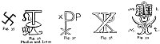
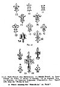

  
[Intangible Textual Heritage](../../index)  [Sub Rosa](../index.md) 
[Index](index)  [Previous](rrm25)  [Next](rrm27.md) 

------------------------------------------------------------------------

[Buy this Book at
Amazon.com](https://www.amazon.com/exec/obidos/ASIN/1564591182/internetsacredte.md)

------------------------------------------------------------------------

p. 187

### CHAPTER THE TWENTY-FIRST

#### THE ROSY CROSS IN INDIAN, EGYPTIAN, GREEK, ROMAN, AND MEDIÆVAL MONUMENTS

THOUGH fire is an element in which everything inheres, and of which it
is the life, still, according to the abstruse and unexplained ideas of
the Rosicrucians, it is itself another element, in a second
non-terrestrial element, or inner, non-physical; ethereal fire, in which
the first coarse fire, so to speak, flickers, waves, brandishes, and
spreads, floating (like a liquid) now here, now there. The first is the
natural, material, gross fire, with which we are familiar, contained in
a celestial, unparticled, and surrounding medium (or celestial fire),
which is its *matrix*, and of which, in this human body, we can know
nothing.

In 1867, in Paris, a suggestive philosophical book was published, under
the title of *Hébreu Primitif; Formation des Lettres, ou Chiffres,
Signes du Zodiaque et Racines Hébraiques, avec leurs Dérivés dans les
Langues de l’Orient et de l’Europe*, par Ad. Lethierry-Barrois.

Ptha is the emblem of the Eternal Spirit from which everything is
created. The Egyptians represented it as a pure ethereal fire which
burns for ever, whose radiance is raised far above the planets and
stars. In early ages the Egyptians worshipped this highest being under
the name of Athor. He was the lord of the universe. The Greeks
transformed Athor into Venus, who was looked upon by them in the same
light as Athor (Apuleius, Cicero, Ovid; Ptolemæus, *in tetrabibla*;
Proclus; Ennemoser, vol. i. p. 268, trans. by Howitt).

p. 188

\[paragraph continues\] Among the
Egyptians, Athor also signified the night (Hesiod; Orpheus). 'According
to the Egyptians', says Jablonski, 'matter has always been connected
with the mind. The Egyptian priests also maintained that the gods
appeared to man, and that spirits communicated with the human race.'
'The souls of men are, according to the oldest Egyptian doctrine, formed
of ether, and at death return again to it.'

The alchemists were a physical branch of the Rosicrucians. The more
celebrated authors (and authorities) upon the art and mystery of alchemy
are Hermes (whose seven chapters and 'smaragdine table', as it is
called, contain the whole alchemical system); Geber, the '*Turba*',
'Rosary', *Theatrum Chemicum*, *Bibliothèque Hermétique*, *Chymical
Cabinet*; Artephius, Arnoldus de Villa Nova, Raimondus Lullius,
Trevisan, Nicholas Flamel, Zachareus, Basilius Valentinus, Cosmopolita,
and Philalethes (Thomas Vaughan). Refer also to *The Hermetical Triumph,
or the Victorious Philosopher's Stone*: London, 1723; Lucas’s *Travels*,
p. 79; Count Bernard of Treviso. Two leading works, however, on the
hermetic subject are *La Chiave del Gabinetto* [1](#fn_10.md), Col. 1681, 12mo, by Joseph Francis Borri,
an Italian; and *Le Compte de Gabalis, ou Entretiens sur les Sciences
Secrètes*; imprimée à Paris, par Claude Barbin, 1671, 12mo, pp. 150.
This book is the work of the Abbé de Villars, or is supposed to be so.
J. V. Andrea, a writer upon hermetic subjects, was Almoner to the Duke
of Wurtemberg, and wrote early in the seventeenth century. The Emperor
Rudolphus the Second greatly encouraged learned men who had made
acquaintance with alchemical

p. 189

lore. At the supposed revival of Rosicrucianism -in Paris, in March
1623, the Brethren were said to number thirty-six; of whom there were
six in Paris, six in Italy, six in Spain, twelve in Germany, four in
Sweden, and two in Switzerland. In 1616, the famous English Rosicrucian,
Robertus de Fluctibus (Robert Fludd), published his defence of the
society, under the title *Apologia Compendiaria, Fraternitatem de
Rosea-Cruce, Suspicionis et Infamiæ maculis aspersam abluens*, published
in 1616 at Frankfort. Since this time, there has been no authentic
account of the Rosicrucians. We are now the first translators of Robert
Fludd.

'Amongst an innumerable multitude of images and symbolical figures, with
which the walls'--i.e. those of the caverns of initiation at
Salsette--'are covered, the Linga or Phallus was everywhere conspicuous,
often alone, sometimes united with the petal and calyx of the lotus, the
point within the circle, and the intersection of two equilateral
triangles' (Dr. Oliver, *History of Initiation*. See also Maurice on the
*Indian Initiations*).

The Linga, or pillar, or stone of memorial, in its material form, is the
perpetuation of the idea of the male generative principle, as the
physical means, in conjunction with the Yoni (Ioni), or *discus*, of the
production of all visible things. In this connexion, the addition to the
name of Simon Peter (Petra, or Pietra, Cephas, Jonas, Bar-Jonas, Ionas)
will be recalled as suggestive. There is a sacred stone in every Temple
in India. The Stone, or Pillar, or 'Pillow', of Jacob was sacred among
the Jews. It was anointed with oil. There was a sacred stone among the
Greeks at Delphi, which was also anointed with oil in the mystic
ceremonies. The stone of Caaba, or black stone at Mecca, is stated to
have been there long before

p. 190

the time of Mohammed. It was preserved by him when he destroyed the dove
and images. The obelisks at Rome were, and are, Lingas (or Linghas). In
the Temple of Jerusalem, and in the Cathedral of Chartres, they are in
vaults. They are the idea of the abstract *membrum*, or 'affluence', or
MEANS. To the initiated mind they imply glory, not grossness.

Figs. 25-26 are the *Crux Ansata* of the Egyptians. This emblem is also
found in India. According to Ruffinus and Sozomen, it imports the '*time
that is to come*'. It is a magical symbol. Fig. 27 is the imperial
mound, and cross-sigma surmounting it.

Figs. 28-29 are symbols of Venus (Aphrodite), the deity of the Syrians
and Phœnicians. They are phallic emblems.

Fig. 30 is the Phallus proper. It is the *sigma* of Zeus, Mithras,
'Baalim', Bacchus.

Figures numbered 31, 'Osiris': these various figures signify also
Jupiter-Ammon. The rectangular marks denote the Scandinavian Tuisco,
Thoth (Mercurius, or Hermes). Fig. 35 is the Indian form of the same
idea.

The figure marked 36 is to be found on the breast of one of the mummies
in the museum Fig. 35 of the London University.

[  
Click to enlarge](img/19000.jpg.md)  
Figs. 35-39  

Upon a monument discovered in Thebes, Anubis is represented as St.
Michael and St. George are in Christian paintings, armed in a cuirass,
and having in his hand a lance, with which he pierces a monster

p. 191

that has the head and tail of a serpent (A. Lenoir, *Du Dragon du Metz,
etc.: Mémoires de l’Académie Celtique*, tome ii. pp. 11, 12).

Figure 37 is the 'Labarum'. The celebrated sign which is said to have
appeared in the sky at noonday to the Emperor Constantine was in this
form.

Figure 38 is the monogram of the Saviour. To show the parallel in
symbolical forms, we will add some further authorities from the Temple
of Solomon at Jerusalem.

Figure 39, No. 1, is an evidently Corinthian foliation. It is from a
pillar in the vaults of the Temple of Solomon at Jerusalem. (Probably a
Lotus-Acanthus.) No. 2 is evidently the 'Crux Ansata', combining the
indications of 'Lotus' and 'Lily'. Here is a union of the classic, the
Judaic, and Gothic forms, all presenting the same idea at once. Buddha
was the sun in 'Taurus'; Cristna (Crishna, Krishna) was the sun in
'Aries'.

In regard to the origin of speech, of writing, and of letters, it may be
remarked that the Egyptians referred the employment of a written symbol
(to record and communicate the spoken word) to a Thoth; the Jews, to
Seth or his children (Josephus, *Ant*. 1, 2, 3); the Greeks, to Hermes.
But 'Thout' in Coptic (Pezron, *Lexicon Lingua Copticæ*, s.v. *Gen*.
xix. 26 in the Coptic version), also ‏שת‎ in Hebrew, and Ερμῆς (Hermes)
in Greek are all names for *a pillar or post*. This is the Homeric use
of ἕρμα and έρμις (*Il*. ά, 486; *Od*. ή, 278; Kenrick's *Essay on
Primeval History*, p. 119). Αρχα is the ship, *navis* (from thence come
'nave' and 'navel'), in which the germ of animated nature was saved.
Thebes, or Theba, means the 'ark'. Carnac, or Karnak, in Egypt, is
reckoned to be older than the days of Moses--at least dating from 1600
A.C.

p. 192

HERALDIC GENEALOGY OF THE 'FLEUR-DE-LIS', OR 'FLOWER-DE-LUCE'

[  
Click to enlarge](img/19200.jpg.md)  
APOTHEOSIS OF THE SYMBOL  
Fig. 40  
4. Bee 6. Bee 7. Imperial Bee 8. Fleuron 9. Charlemagne 10. A Babylonian
Gem  

The opinion of M. Dupuis was (see his learned memoir concerning the
origin of the constellations), that 'Libra' was formerly the sign of the
vernal equinox, and 'Aries' of the nocturnal, autumnal equinox; that is,
that since the origin of the actual astronomical system, the procession
(precession?) of the equinoxes had carried forward by seven signs the
primitive order of the Zodiac. Now, estimating the procession
(precession?) at about 70½ years to a degree, that is, 2115 years to
each sign, and observing that 'Aries' was in its fifteenth degree 1447
before Christ, it follows that the first degree of 'Libra' could not
have coincided with the vernal equinox more lately than 15,194 years
before Christ, to which, if you add 1790 years since Christ, it appears,
that 16,984 years have elapsed since the origin of the 'Zodiac' (Volney,
*Ruins of Empires*, 1st English edition, 1792, p. 360).

p. 193

All white things express the celestial and luminous gods; all circular
ones, the world, the moon, the sun, the destinies; all semicircular
ones, as arches and crescents, are descriptive of the moon, and of lunar
deities and meanings.

[  
Click to enlarge](img/19300.jpg.md)  
Fig 41  

<table data-border="0">
<colgroup>
<col style="width: 100%" />
</colgroup>
<tbody>
<tr class="odd">
<td data-valign="top" width="424">
11-12. Early French (also Babylonian) 13. Middle French 14. Later French 16. Valois 17. Henry of Navarre 18. In England, thus. 19. Bourbon 20. Egyptian Sculptures: Fleur-de-Lis; Asp: Speed calls them the 'Flower de Lize.'

21. Finial: meaning the 'Fleur-de-Lis' 22. Finial <a href="#fn_11">1</a>
</td>
</tr>
</tbody>
</table>

p. 194

'The Egyptians', says Porphyry, 'employ every year a talisman in
remembrance of the world. At the summer solstice, they mark their
houses, flocks, and trees with red, supposing that on that day the whole
world had been set on fire. It was also at the same period that they
celebrated the Pyrrhic or "Fire Dance".' (And this illustrates the
origin of the purifications by fire and water.)

There are seven planets in the solar system. These seven planets are
signified in the seven-branched candlestick of the Jewish ritual. The
number is a sacred number. These seven 'prophets', or angels, have each
twelve apostles, places, *stella*, 'stalls', or regions or dominions
(stalls as 'stables'), for the exercise of their powers. These are the
twelve divisions of the great Circle, or the twelve signs of the Zodiac.
All this is Cabalistic, Magical, Sabaistical, and Astrological. The name
Ashtaroth or Astarte has been derived from *Ashre*, *aster*, *ast*,
star, or 'starred'; in the same way as the word Sephi-roth comes from
the Hebrew root, 'roth'.

On the black sacred stone ('Kebla', or 'Cabar') at Mecca, 'there appears
the figure of a human head cut', 'which some take to be the head of a
Venus' (Enthumius Zyabenus, *Mod. Un. Hist*. i. 213; Sale's *Discourse*,
p. 16; *Bibliotheca Biblia*, i. 613, 614).

Man’s ideas, outwards from himself, must always become more dreamlike as
they recede from him, more real as they approach him.

------------------------------------------------------------------------

### Footnotes

[188:1](rrm26.htm#fr_10.md) Mark--the letters G and
C are convertible: Thus Gab or Cab ('Gab' ala or 'Cab' ala). The
'Compte' de 'Gabalis' is, properly the 'Compte' de 'Cabalis', or the
Count of the 'Cabala'.

[193:1](rrm26.htm#fr_11.md) See figs, 190, 191,
192, 195, *post*. See, also, pages preceding.

------------------------------------------------------------------------

[Next: Chapter XXII: Myth of the Scorpion, or the Snake, in its Many
Disguises](rrm27.md)
