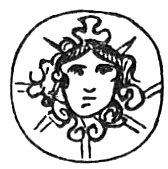
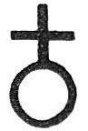

  
[Intangible Textual Heritage](../../index)  [Sub Rosa](../index) 
[Index](index)  [Previous](rrm35)  [Next](rrm37) 

------------------------------------------------------------------------

[Buy this Book at
Amazon.com](https://www.amazon.com/exec/obidos/ASIN/1564591182/internetsacredte)

------------------------------------------------------------------------

p. 309

 

### CHAPTER THE SIXTH

#### STRANGE SPECULATIONS OF THE TRANSCENDENTALISTS

'HAD Man preserved his original innocence and refused to taste of the
means of that bitter and condemned knowledge (or power of recognition)
of good and evil, as then there would have been none, of that physical
deficiency asserted to be debited to Women, would there likewise have
been no females engendered; no propagation of the human species? By some
the preference of the robust to the delicate sex is accounted beyond all
question as self-evident. A certain class of philosophers have made no
scruple to call a woman an imperfect and even monstrous animal. These
have affirmed that nature, in generation, always intends a male, and
that it is only from mistake or deficiency, either of the matter or the
faculty, that a woman is produced.' The oriental ethics have degraded
woman to the level of a chattel. It is Christianity alone, in the
discovery of the Divine Mary 'Virgin-Mother', 'Mother-Virgin'--that has
elevated 'Woman', and found for 'Her' a possible place (of course as a
Sexed-Sexless, Sexless-Sexed 'Idea') in Heaven--or in that state other
than this state; irradiated with the 'light', breathing with the
'breath' of Divinity.

Almaricus, a doctor at Paris in the twelfth century, advances an opinion
that, had the state of innocence continued, every individual of our
species would have

p. 310

come into existence a complete 'MAN', and that God would have created
them by Himself, as He created Adam. He theorizes that woman is. a
defective animal, and that the generation of her is purely fortuitous
and foreign from nature's intent. He therefore infers that there would
have been no women 'in a state of innocence'. On the other hand, there
exists a counterbalancing singular idea, combated by St. Austin in his
*City of God*, Book xxii. chap. xvii.; and of which its partisans take
upon themselves to say that at the universal resurrection this imperfect
work (woman) will be rendered perfect by a change of sex; all the women
becoming men--grace and finish being then to complete the work of the
human form, which nature (in Man) only, as it were, had left coarse,
unfinished, rough-hewn. These ideas resemble closely the conclusions of
the alchemists (or of the Rosicrucians when applying to practical art),
who declare that nature, in the production of metals, always *intends*
the generation of gold, and that it is only from accidental diversion or
interposing difficulty, or from the deficiency of the virtue or faculty,
that the working out of the aim falls short, and issues (bluntly and
disappointed) in another metal--the blanker, blacker, and coarser metals
being, in fact, only as the 'DISEASES' of matter, which aims at clear
perfect *health*--or *as gold*. Here the alchemists contend that their
superhuman (in apparent-sense) science, felicitously applied, 'completes
the operation', and transmutes or compels-on, 'into gold' what
weaker-handed nature was compelled to 'forego' as 'iron'. Thus nature
always intends the production of male (sun--gold--fire being the
workman, or 'agent'); but that, in the production of female (silver as
against gold--the moon--sublimated matter, or 'patient'), nature's
operation miscarries; the effort degenerates

p. 311

into struggle, and struggle submits in failure. Therefore; 'Female'. But
this shortcoming, when the Divine perfecting-means (in another state,
and through another nature or 'mode') is applied, will be rectified. And
in the universal resurrection, Women will transcend into the nobler
creature, and, changing sex or ceasing sex, will become--'Woman’d-Men':
Both sexes interchanging 'sex' to form the 'Angel', or rather blending
sex and uniting sex--bicorporate no longer, but becoming 'Ideal'--fit
spirit-populace, winnowed of materiality and of humanity.
'Unintelligible to the *intellect* as Music, but beautiful to the
*heart* as Music.'

Yet it must be understood that no man’s *dreams* (dreams, we have
elsewhere contended, quite contrary to the usual ideas, are *real
things*) are wholly and altogether evil and vain; for that cannot be
except men were utter (or outer) devils; which also cannot be so long as
we live in the human nature, for Man’s Fall was not like the Fall of the
Evil Angels; for these latter fell into the Dark Abyss, or Original.
Wrathful Principle (the Rosicrucian 'Refuse' or 'Lees' of Creation,
without, or beyond; nature and creature, and therefore there was for
them no help or recovery). But, on the contrary, Men fell and were saved
thereby (the Knowledge of Good and Evil), that is, *into* Nature and
Creature, which is Man’s inexpressible happiness, as not being left
destitute of Hope or the Regenerating Seed of the Woman. For there does
centrally dwell in the human nature that which the wise man galls the
Voice of Wisdom, or conscience-recall; which in the suggestion of the
Immortal Sorrow, planted deep in the soul of man for his 'Lost Paradise'
(of which the very air and hint and proof to him, is Music--Man’s
Music--with its *shadow* of discords). And this Immortal Sorrow
languishes

p. 312

to Redemption in repentance. Thus the pathetic languishment of the
Saviour (and Sufferer), Jesus Christ: 'My soul is sad, even unto death!'
Hence the 'Garden' of 'Agony'.

This is the *Genius Optimus*, the 'Soul of the Soul' and the 'Eye of the
Mind'--that part *incapable* of damnation even in the greatest sinner
(this was Cromwell's firm reliance and belief, and his last question to
his attendant chaplain bore reference to the assurance of it). This is
the last supernatural power which can and will defend man from all the
assaults of evil angels, and unto this holy principle and benevolent
upspring the dictates and the efforts of all Good Angels and Spirits do
tend, it being a great part of their work and business to assist man,
and to defend and preserve him from the inward incursions of the
multitude of the malignant Spirits in their various degrees.

Trithemius, a noted Rosicrucian, asserts that 'never any good Angel
appeared in the shape of a woman.' Van Helmont, in the ninety-third
chapter of one of his books, has these words: 'If an Angel appear
bearded, let him be accounted an evil one; for a Good Angel hath never
appeared with a beard. The truth is, a woman is the weaker vessel, and
was first in the Transgression. Therefore, that sex is an emblem of
weakness and a means of seduction. And therefore there is no reason why
the Good Angels, amongst whom there is no difference of sex, should
elect to appear as a female; but rather, being a species of creature
above humankind, they assume the shape of the most excellent of that
kind (only feminine in regard of grace and beauty); and for the same
reason they may appear without beards, both because ''hair is an
excrement", and verges greatly, in the more conspicuous instances, to
the brutish nature, as also more especially in their beardless,
beautiful, glorified

p. 313

aspects, and graceful delicacy and yet *power* of form, to express their
perpetual virgin-youth, unspoiled heavenly beauty, and immortal
star-born vigour. Hair being an abhorred, tentacled, reaching-out or
brute-like animal superflux--the stigma or disgrace of the glorious
spark of light or nearly suffocated human entity, condemned to its
earth-birthed investiture or body--it can have nothing about the parts
of the "Deified Idea of Man"--or the various classes of the Blessed
Angels.' The contrary of all this is to be assumed of the evil Genii or
the Recusant Genii (Luciferent and yet Lucifugent), except in regard to
their power or knowledge. For the 'Soul of the World' and 'Matter', and
to an important one-half, the 'Means of the World'--are 'Feminine'. For
Night (which is the other side of the curtain of Day) is Feminine. Thus
Bœhmen and Plato; as representing all the closest-of-thought of the
centuries.

All the above is the reproduction of the singular ideas of the
'Idealists' of the Middle Ages.

 

 

------------------------------------------------------------------------

[Next: Chapter VII: Rosicrucian Origin of the Order of the
Garter](rrm37)
