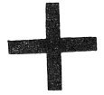

  
[Intangible Textual Heritage](../../index)  [Sub Rosa](../index.md) 
[Index](index)  [Previous](rrm48)  [Next](rrm50.md) 

------------------------------------------------------------------------

[Buy this Book at
Amazon.com](https://www.amazon.com/exec/obidos/ASIN/1564591182/internetsacredte.md)

------------------------------------------------------------------------

p. 424

Round Table  
(Mythical)

 

<table data-border="0">
<colgroup>
<col style="width: 100%" />
</colgroup>
<tbody>
<tr class="odd">
<td data-valign="top">
1. ROSE 'Crucified' 
2. ROSE 'restored to Life' 
3. 'CONSUMMATION'
</td>
</tr>
</tbody>
</table>

### CHAPTER THE NINETEENTH

#### THE ROUND TABLE IS THE RATIONALE OR APOTHEOSIS OF THE MOST NOBLE THE ORDER OF THE GARTER

HONI-SOIT QUI MAL-Y-PENSE

 

THE Round Table of King Arthur is a Grand Mythological Synthesis. It is
a whole Mythology in itself. It is perennial. It is Christian. By
tradition, the Round Table of King Arthur devolves from the very
earliest period. The illustration opposite a previous page was copied
from the original with great care and attention. King Arthur, in the
principal seat, is idealized in the person of King Henry the Eighth, in
whose time the Round Table is supposed to have been repaired and
refaced. In the Revolution, Cromwell's soldiery, after the capture of
Winchester, and in the fury at the imputed idea of *idolatry* (the Round
Table is the English 'Palladium'), made a target of it. The marks of
many balls are still conspicuous.

The five-leaved Roses (Red and White Roses; *Rhodion*, Rhodes--Knights
of Rhodes or of Malta, the

p. 425

successors of the Templars) typify the Ten Original Signs of the Zodiac.
Red-Rose, Five Signs (Aspiration or Ascension); White Rose, Five Signs
(or Leaves), Descension (or 'Con'-descension, or S.S., or Holy Ghost
(the key of the whole *apotheosis*; according to the mystical Jacob
Bœhmen).

The whole is radiant (notwithstanding that the rays are *green*;
otherwise expressive of the '*Linea Viridis*', *seu* '*Benedicta
Viriditas*'--Rosicrucian). (See former pages) out from the 'seed-spot',
or 'Golden Sun' (Grand Astronomical Central Flame), in the centre. This
double-rose, 'barbed' or 'thorned', Sol, is (in this form) the Tudor
Rose (the *Rose-en-Soleil*, be it remembered, was another of the Tudor
badges); denoting the union of the Houses of York and Lancaster in the
person of Harry the Eighth.

It will be observed that each Knight of the Round Table is seated as at
the base of an *obelisk*. The architectural 'obeliscar' form (rayed, or
spread, or bladed) is universal, all the world over, both in old times
and modern times. The Egyptian Obelisks are sacred to the Sun. The
Paladins of Charlemagne were Twelve in number. The Marshals of France
should be twelve in number. The Judges of England, according to old
constitutional *rationale*, should be twelve; as the number of a Jury
are twelve. All these are mythical of the Twelve Signs, or Divisions, of
the Zodiac, the Twelve Jewish Tribes, the twelve oracular stones in the
breastplate of the High Priest of the Jews, and, in the Christian aspect
of the mysticism, the Twelve Apostles; with the 'Reprobate Condemned
Central Sign' as Judas, the Traitor. The whole is Cabalistic in the
highest degree; *and therefore ordinarily unintelligible*. It signifies
the Second Dispensation, or the astrological reproduction and
rearrangement of the Zodiac, when the original Ten

p. 426

\[paragraph continues\] Signs of the
Ecliptic (mythically the *gladius* of the Archangel Michael) became
Twelve; and when the mystic system underwent the GREATEST
CHANGE--presenting a new traditionary and reproductive face. (Refer to
Chapter on the origin of the Order of the Garter, previous, and
thenceforward.)

510\. *Perceval Le Galloys; Tresplaisante et Recreative Hystoire du
Trespreulx et vaillant Chevallier Perceval le galloys jadis chevallier
de la Table ronde. Lequel acheva les adventures du sainct Graal. Avec
aulchuns Picts belliqueulx du noble chevallier Gauvaīn. Et aultres
Chevalliers estans au temps du noble Roy Arthus, non auparavant
Imprime*. On les vend au Pallais a Paris. En la boutique de Jehan logis.
Jehan sainct denis, et Galliot du pre. \[A la fin\] Et fut acheve de
Imprimer le premier jour de Septembre. Lan mil cinq cents trente
\[1530\]. Folio.  , fine woodcut border to title, woodcuts, old
french olive morocco extra, gilt edges, 1351. Aug. 1879. 29 New Bond
Street.

------------------------------------------------------------------------

[Next: Chapter XX: Remarks Upon Two Curious Books](rrm50.md)
