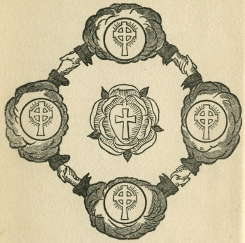

  
[Intangible Textual Heritage](../../index)  [Sub Rosa](../index) 

------------------------------------------------------------------------

[Buy this Book at
Amazon.com](https://www.amazon.com/exec/obidos/ASIN/0911662308/internetsacredte)

------------------------------------------------------------------------

<table width="75%">
<colgroup>
<col style="width: 50%" />
<col style="width: 50%" />
</colgroup>
<tbody>
<tr class="odd">
<td width="50%" data-valign="TOP"></td>
<td width="50%" data-valign="CENTER"><h1 id="the-secret-doctrine-of-the-rosicrucians" data-align="CENTER">The Secret Doctrine of the Rosicrucians</h1>
<h2 id="by-magus-incognito" data-align="CENTER">by Magus Incognito</h2>
<h4 id="section" data-align="CENTER">[1918]</h4></td>
</tr>
</tbody>
</table>

------------------------------------------------------------------------

[Contents](#contents)    [Start Reading](sdr00)    [Page
Index](pageidx)    [Text \[Zipped\]](sdrtxt.zip)

------------------------------------------------------------------------

|                                                                                                                           |
|---------------------------------------------------------------------------------------------------------------------------|
|  |

This is one of the numerous Yogi Publication Society (YPS) books which
have been attributed to William Walker Atkinson under pseudonym. It
bears strong similarities to [The Kybalion](../../eso/kyb/index), which
is also known to have been authored by Atkinson. The material was later
re-worked as one of the volumes in his series The Arcane Teachings.

This etext was scanned from an original 1918 printing of this work. The
pagination and emphasis differ slightly from modern YPS printings of
this book.

------------------------------------------------------------------------

 [Title Page](sdr00)  
[Table of Contents](sdr01)  
[Part I. The Rosicrucians And Their Secret Doctrine](sdr02)  
[Part II. The Eternal Parent](sdr03)  
[Part III. The Soul of the World](sdr04)  
[Part IV. The Universal Androgyne](sdr05)  
[Part V. The One And The Many](sdr06)  
[Part VI. The Universal Flame of Life](sdr07)  
[Part VII. The Planes of Consciousness](sdr08)  
[Part VIII. The Three Higher Planes of Consciousness](sdr09)  
[Part IX. The Sevenfold Soul of Man](sdr10)  
[Part X. Metempsychosis](sdr11)  
[Part XI. The Soul's Progress](sdr12)  
[Part XII. The Aura and Auric Colors](sdr13)  
[Part XIII. The Seven Cosmic Principles](sdr14)  
[Advertisements](sdr15)  
