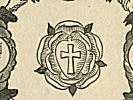
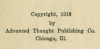

  
[Intangible Textual Heritage](../../index)  [Sub Rosa](../index) 
[Index](index)  [Next](sdr01) 

------------------------------------------------------------------------

[Buy this Book at
Amazon.com](https://www.amazon.com/exec/obidos/ASIN/0911662308/internetsacredte)

------------------------------------------------------------------------

  
*The Secret Doctrine of the Rosicrucians*, by Magus Incognito, \[1918\],
at Intangible Textual Heritage

------------------------------------------------------------------------

# The Secret Doctrine

###### of

# The Rosicrucians

###### Illustrated with

### The Secret Rosicrucian Symbols

## By MAGUS INCOGNITO

#### ADVANCED THOUGHT PUBLISHING CO.

##### 159 N. State St., Chicago, Ill.

##### L. N. FOWLER & CO.

###### 7 Imperial Arcade, Ludgate Circus, London, Eng.

#### \[1918\]

Scanned, proofed and formatted by John Bruno Hare, April 2008 at
Intangible Textual Heritage. This text is in the public domain in the US
because it was published prior to 1923.

  [  
Click to enlarge](img/fcov1918.jpg)  
Front Cover, 1918 edition  

  [  
Click to enlarge](img/fcovyps.jpg)  
Front Cover, modern YPS edition  

  [  
Click to enlarge](img/title.jpg)  
Title Page  

 
[  
Click to enlarge](img/verso.jpg)  
Verso  

------------------------------------------------------------------------

[Next: Table of Contents](sdr01)
