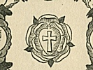

  
[Intangible Textual Heritage](../../index)  [Sub Rosa](../index) 
[Index](index)  [Previous](sdr05)  [Next](sdr07) 

------------------------------------------------------------------------

[Buy this Book at
Amazon.com](https://www.amazon.com/exec/obidos/ASIN/0911662308/internetsacredte)

------------------------------------------------------------------------

  
*The Secret Doctrine of the Rosicrucians*, by Magus Incognito, \[1918\],
at Intangible Textual Heritage

------------------------------------------------------------------------

p. 62

### PART V

### THE ONE AND THE MANY

In the Secret Doctrine of the Rosicrucians, we find the following Fourth
Aphorism:

#### The Fourth Aphorism

**IV. The One becomes Many. The Unity becomes Diversity. The Identical
becomes Variety. Yet the Many remains One; the Diversity remains Unity;
and the Variety remains Identical**.

In this Fourth Aphorism of Creation, the Rosicrucian is directed to
apply his attention to the concept of the World Soul—the First
Manifestation of the Eternal Parent—as a One Manifesting as Many; a
Unity manifesting as Diversity; an Identical manifesting as Variety:
yet, [notwithstanding](errata.htm#4) such manifestations, remaining ever
One, Unity, and Identical.

This concept of the World Soul, so manifesting itself in Manifoldness,
Diversity, and Variety, yet ever remaining One, Unity, and Identical, is
represented by the Rosicrucians by the symbol of a small circle within a
larger circle, the smaller circles being filled with tiny points or
centres of manifestation. The outer circle is, of course, the Infinite
Unmanifest; the smaller circle, of course, being the World Soul; and the
small dots, or points, being the individualized centres of life, being,
and activity manifested by the World Soul.

That all beings are, in truth, but expressions of

p. 63

the One Being—centres of consciousness, form, and activity within
itself,—is a fundamental tenet of all occult and esoteric teaching. That
all Being is One; all Life, One; all Form, One; all Consciousness, One,
is known to all true disciples of the occult and esoteric teachings of
the past and present, occidental and oriental, philosophical and
theological. Hidden

  [  
Click to enlarge](img/fig08.jpg)  
Figure 8. Symbol of the Many in the One  

behind and under the orthodox, exoteric teachings, there is always to be
found this insistence upon Essential Oneness on the part of the Inner
Teachings of all schools.

That there is but One Life, and not Many Lives, is a fundamental article
of all occult and esoteric faith. The One Life, moreover, is not to be
thought of as dividing and splitting itself up into bits, parts, and
particles, in order to accomplish the process of Creation, and the
Manifestation of the World. Instead,

p. 64

it is to be thought of as merely **reflecting** itself in the many
individual mirrors of expression, just as the sun reflects itself as One
in the millions of falling raindrops, or in a million tiny jars filled
with water. There are millions of reflections of the One, but only the
one One in reality. Or, using another figure of speech, the One may be
thought of as an Infinite Ocean of Being, in which there are millions of
tiny bubbles, each apparently apart and separate, but all of which are
in reality, but centres of activity and expression in the One Great
Ocean.

Separateness is, to quote a writer, "but the working fiction of
Creation." All the apparently separated Things are contained within the
circle of the World Soul—and the latter is contained within the circle
of the Infinite Unmanifest.

Not only is this esoteric conception of the Many in One, and the One in
Many, a fundamental conception of the ancient esoteric and occult
teachings, but the same truth in another form is presented by advanced
modern science in its conception of the Universal Substance. Science
postulates the existence of a Universal Substance, known under many
names, from which all Things proceed. It matters not whether this
Universal Substance be called "Primordial Substance," or "Infinite and
Eternal Energy," or "The Universal Ether," the fact remains that science
postulates its existence as a fundamental, substantial Something, of and
in which all forms and phases of phenomenal existence are but
manifestations. In the same way, those schools of transcendental
philosophy which postulate the existence of a Universal Mind teach that
all forms and phases of phenomenal existence are but Thought Forms in
the Universal Mind. And the old Brahmanical

p. 65

teachings likewise hold that the Many exist but as incidents of the
"dream" or "meditation" of the Lord High Brahma.

In all forms, phases, and schools of philosophy we find this insistence
upon the presence and existence of a One Something of which all else are
but manifestations. In fact, as the wisest philosophers have informed
us, the whole purpose of philosophy is to discover the One Unconditioned
Ground of all that exists Conditionally. All philosophy worthy of the
name is Monistic in essence. A leading authority on the history of
philosophy informs us the: "Monism is, in strictness, a name applicable
to any system of thought which sees in the universe the manifestation or
working of a single principle. Such a unity may be at once the tacit
presupposition and the goal of all philosophic effect, and in so far as
a philosophy fails to harmonize the apparently independent and even
conflicting facts of experience, as aspects or elements within a larger
whole, it must be held to fall short of the necessary ideal of thought.
Dualism, in an ultimate metaphysical reference, is a confession of the
failure of philosophy to achieve its proper task; and this is a
justification of those who consistently use the word as a term of
reproach."

And, now, let us take a brief passing glance at the Rosicrucian
teachings concerning the manner in which the One proceeded to become the
Many—the Unity to become Diversity—the Identical to become Variety—and
yet remain the One, Unity, Identity of the World Soul, unaffected and
unchanged by its plunge into Manifestation. Evolution we see on all
sides around us, but all Evolution must be preceded by Involution, as
all occultists and scientists know full well.

p. 66

Modern Science, in pursuing its discoveries along the lines of
Evolution, has almost entirely ignored the twin-activity of
Manifestation, which is known as Involution. Not so the ancient
[occultists](errata.htm#5), however, for they knew full well the truth
so forcibly expressed in the words of a modern "plain speaking"
philosopher who said: "You can never get out of a thing anything which
is not already involved in it." And to the ancient student of the
esoteric teachings any idea of Evolution which did not begin with the
teachings concerning Involution was like the play of Hamlet with Hamlet
left out. There is an ancient saying which runs: "That which is evolved
must previously have been involved;" and in this simple statement is
condensed a volume of important occult lore.

The term "Involve" means "to wrap up; to cover; to hide; etc." The term
"Evolve" means "to unwrap; to unfold; to un-roll; etc." With these
meanings in mind, the student sees at once that before a thing can be
"unwrapped, un-folded, un-rolled," it must have first been wrapped-up,
folded-up, rolled-up. We must not lose sight of the meaning attached to
the simple terms, no matter how many high-sounding terms are substituted
for these. The same thing remains the same thing, no matter how many new
names are attached to it.

The esoteric teachings, as has been said, clearly and positively state
that before there began the wonderful process of Evolution from simple
to more complex forms of manifestation—from lower to higher—there must
first have been an "involution" or in-folding of the World Soul into the
simple, gross, elemental forms of matter. The vibrations must have

p. 67

been first lowered, before they can have been increased.

Plunging at once, with terrific speed and force, into the abyss of
Manifestation, the World Soul created for itself material garments of
the densest and grossest elemental matter. This extreme form of
elemental matter is not known to us today, for it has been discarded in
the course of evolution on this particular planet. It, however, still
exists on other planets of our solar system. This form, or forms, of
elemental matter is below the scale of the minerals, and is as much
lower than the grossest mineral known to science as that mineral is
lower than the highest plant. In texture, structure, and density the
extreme form of elemental matter is as much grosser than the lowest form
of mineral known to us, as the latter is grosser than the highest form
of ethereal vapor or radiant matter known to modern science. It is
useless to try to describe this form of matter, for the ordinary mind
cannot grasp it in the absence of concrete illustration.

When the lowest point in the scale of Involution was reached, then the
Law of Rhythm asserted itself, and the upward climb began—the first
movement of Evolution began to manifest itself. And, at this precise
point, there was begun the manifestation of what may be termed
"individualization," or the forming of centres of activity and
consciousness. The World Soul descended into the depth of Involution [en
masse](errata.htm#6), and then began to emerge from those depths by an
apparent "splitting up" process, in which the active new-born centres of
activity began to assert themselves and to move upward toward
self-expression. The simpler centres which occultists know to be the
centers of activity in the electrons

p. 68

of matter began to form molecules. There was of course manifested the
presence of mind within this gross matter—but only the faint glimmerings
were manifested, for the gross enveloping sheaths of matter almost
smothered the mental principles involved within them.

The Process of Evolution once begun, it proceeded rapidly. Higher and
higher in the scale of manifestation rose the Things—in spiralic
process, each spiral rising above the one beneath it, and yet each
proceeding apparently in a circle, as do all proceeding things. In due
time the first signs of the mineral kingdom began to show themselves,
building upon the basis of the sub-mineral forms of matter. In the
mineral kingdom began to manifest higher forms of life and mind—for, as
the occultists know well, the minerals possess both life and mind in a
certain degree. And then later appeared the first signs of plant
life—forms but slightly above those of certain crystals.

When the temperature of the earth was at a point at which life is
commonly believed to be impossible, there were present certain strange
forms of life, which may be described as half mineral—half plant. These
crystals reproduced themselves by a splitting up process, and grew from
the inside as do plants. These life forms were composed of the same
materials as the crystals from which they evolved—but they possessed a
greater degree of life and mind, and while from one point of view they
may be said to have been minerals, yet from another they may truly be
said to have been plants. These strange creatures have disappeared as
have all other "intermediate forms" which have played the parts of
bridges in the evolutionary process. But they have left their

p. 69

traces in the material bodies of both plants and animals. For it must be
remembered that even the bodies of the highest forms of plant or animal
life are composed of certain chemical elements which were derived from
the mineral kingdom, as for instance, oxygen, hydrogen, carbon,
nitrogen, sulphur, phosphorus, etc.

The first forms of real plant life are described by the old teachers as
having been a now-extinct lowly form of plant-life scarcely more than a
crystal in appearance, and yet manifesting the characteristics of plant
life. Then appeared the ancestors of what are now known as the
"chlomacea" which are a strange group of lowly creatures, comprising the
characteristics of both plant and mineral life, and being found even
today in the deposits upon damp rocks, the bark of trees, etc. From this
and simpler creatures evolved the ancestors of what are now known as the
"angiospores," or lowest forms of plant-life; and later, the ancestors
of the "gymnospores," which are probably the lowest forms of animal-life
known to science today.

The Process of Evolution is caused by the constant striving of the Life
and Mind within the sheaths of matter—the striving to express more and
still more of themselves, and to mould and use the sheaths of matter in
the work of self-expression. Protoplasm, the physical basis of plant and
animal life, was evolved in this way. Then came the single-celled
creature which dwelt in the slime of the ancient ocean beds. Then forms
of life composed of colonies of cells appeared. Then more complex forms
of cell-combination, and so on, and on, until the highest forms of life
known to us today were evolved.

Finally, primitive man was evolved. Then man

p. 70

began to improve in mind and feeling. And he is still making progress
along these lines. But man (of today) is merely a high stage of the
evolutionary process, and he, in turn, will be succeeded by the
Super-Men of the future, and these in turn by the god-like angelic
creatures, the like of whom are in existence on other and high spheres
even this day.

But always remember that in all the millions of types of living forms,
and the millions upon millions upon millions of individuals ensouling
these forms, there is no real separateness. All life is One—and all Life
but the Life of the World Soul. Therefore, in the symbol of the
Rosicrucians—the countless points within the smaller circle, which in
turn is enclosed within the larger circle—we have the picture of the
Eternal Parent and its First Manifestation, the World Soul, the latter
manifesting in the countless life-forms of the World of Manifestation.
And, the work of Evolution is still underway, and higher and higher
forms of expression will proceed from within the Involved Being of the
World Soul which is ever striving and struggling to manifest itself in
self-expression.

------------------------------------------------------------------------

[Next: Part VI. The Universal Flame of Life](sdr07)
