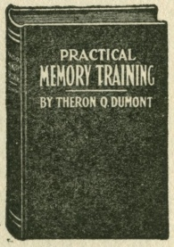
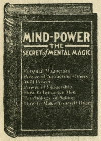
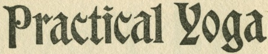

  
[Intangible Textual Heritage](../../index)  [Sub Rosa](../index.md) 
[Index](index)  [Previous](sdr14.md) 

------------------------------------------------------------------------

[Buy this Book at
Amazon.com](https://www.amazon.com/exec/obidos/ASIN/0911662308/internetsacredte.md)

------------------------------------------------------------------------

  
*The Secret Doctrine of the Rosicrucians*, by Magus Incognito, \[1918\],
at Intangible Textual Heritage

------------------------------------------------------------------------

The following advertisements appeared at the end of the 1918 edition.
They are included for completeness. *Of course*, the prices are also
from 1918.—JBH

<u>Memory the Key-Fore of Success and Fortune</u>

###### DEVELOP AND STRENGTHEN YOURSELF BY STUDYING

# PRACTICAL MEMORY TRAINING

###### Wonderful Course for Forgetful People

###### By Theron Q. Dumont

### Anyone Can Master It

<table data-border="0" width="75%">
<colgroup>
<col style="width: 33%" />
<col style="width: 33%" />
<col style="width: 33%" />
</colgroup>
<tbody>
<tr class="odd">
<td data-valign="top" width="218">
Have you ever said: Mr. Ah, Ah, Ah, Ah, Ah,—I am sorry, but I have forgotten your name?

Have you ever gone to town for something and returned without it?
</td>
<td data-valign="top" width="218">
 
</td>
<td data-valign="top" width="218">
Have you ever forgotten an appointment?

Haven't you a thousand times wished you had a better memory?

You can have a better memory.
</td>
</tr>
</tbody>
</table>

Prof. Dumont has for more than twenty years made a study of how to
develop a natural memory. This course contains his latest discoveries,
The Science-Memorie, the NATURAL METHOD OF MEMORY TRAINING.

After studying a few of the lessons, you will notice a great improvement
in your ability to remember.

In a short time you will be able to remember names, faces and facts with
as great ease as you now forget them.

You will be able to think rapidly.

You will be able to put more vim into argument.

Your brain-power will be increased.

Brain-power brings success.

**315 LARGE PAGES**

**Bound in Leather, $2.00; Cloth, $1.50 postpaid**

 

 

 

 

 

**Discover this amazing power within you—a power so mighty, so
all-pervading, so irresistible, that it knows no obstacle. It is the
power to materialize your every wish—to bring wealth, dominance,
personal magnetism, happiness at your bidding. It is the power of
supreme achievement.**

The Dynamic Thought Course is the Supreme Science of Mind. It Will Put
You on the Right Road. After a Good Start the Rest is Easy. Dynamic
Thought reveals new and marvelous facts about the human system. You are
acquainted with the potentialities of Intuition, Sense, Nerve, and
Magnetism. An entirely new Light which more than enlightens, is shed
upon the Science of Humanity; it teaches you to develop your Intuition,
and the proper way to control the Senses.

Have you any idea of what you are trying to accomplish? Or are you just
drifting with the masses—wasting many good years which could be used to
your great advantage.

It is a scientific fact that there is very little difference between the
brain power of one person and another, and if you have met, as I have,
numbers of people who have made big names you may have asked the
question, "In what way are they superior to me?" and perhaps have not
found the answer. Men and women achieve success according to the
development of their own powers. You have as much power within you as
anyone, but it is lying dormant, and this development can be easily
attained.

There are certain definite principles that rule human beings in their
attitude toward each other. When once you understand these principles
you can easily convert enemies into friends and easily cause anyone and
everyone to be most friendly. You will be amazed the way everyone will
desire to please you and as you want them.

**316 PAGES, HANDSOMELY BOUND**

**Containing complete course of lessons. Price $3.00**

 

 

 

 

### Develop Your Will Power

===================================================

##### BY STUDYING THE SERIES OF LESSONS ENTITLED

# Mind Power

**===================================================**

<table data-border="0" width="75%">
<colgroup>
<col style="width: 50%" />
<col style="width: 50%" />
</colgroup>
<tbody>
<tr class="odd">
<td data-valign="top" width="327">
 
</td>
<td data-valign="top" width="327"><h4 id="the-secret-of-mental-magic">THE SECRET of 
 
MENTAL MAGIC</h4>
<h6 id="by" data-align="center">BY</h6>
<h6 id="william-walker-atkinson." data-align="center">WILLIAM WALKER ATKINSON.</h6>

 
</td>
</tr>
</tbody>
</table>

**THIS book develops the Unusual Powers of the mind: It is a Real Book—a
Strong Book—a Big Book. It embodies the essence of years of thought,
study and experiment on the part of its author, whose original research,
discoveries and writing-along these lines have given him his world-wide
reputation as an authority.**

**29 Chapters**.                 443 Pages.

**Of Vital Facts** and Important Information.  
**Price $2.00**

 

 

 

 

<table data-border="1" width="75%">
<colgroup>
<col style="width: 100%" />
</colgroup>
<tbody>
<tr class="odd">
<td data-valign="top"><h4 id="a-course-of-lessons" data-align="center">A COURSE OF LESSONS</h4>
<h6 id="in" data-align="center">IN</h6>

 

<h2 id="by-swami-bhakta-vishita" data-align="center">By SWAMI BHAKTA VISHITA</h2>
<h6 id="author-of" data-align="center">Author of</h6>
<h5 id="seership-and-genuine-mediumship" data-align="center">"SEERSHIP," and "GENUINE MEDIUMSHIP"</h5>

<strong>A practical course giving the Philosophical System of the Hindu Sages and the Philosophy of Yoga teachings in general. The information concerning this wonderful philosophy is interesting and instructive</strong>.

<h3 id="immediate-benefits-of-yoga" data-align="center">Immediate Benefits of Yoga</h3>

The Yoga teaching indulges in no vague speculations concerning the Ultimate Mystery of Existence, or the Riddle of the Universe, but rather points out the way by means of which the individual may so develop and increase his mental and spiritual powers that he may perceive the Truth in actual consciousness. The practice of Yoga will greatly increase the physical and mental, as well as the spiritual powers of the individual, even before he attains the ultimate heights of Spiritual Consciousness. Yoga bestows rewards upon the faithful students of its principles and methods at every step on The Path, instead of depriving him of all reward during his journey and asking him to be satisfied with the prospect of the reward when he had attained the highest peaks of the Mountains of Truth.

<strong>280 PAGES, PRICE $2.00.</strong>

 
</td>
</tr>
</tbody>
</table>

 

 

 

 
