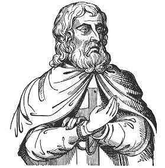

  
[Intangible Textual Heritage](../../index)  [Sub Rosa](../index) 

------------------------------------------------------------------------

[Buy this Book at
Amazon.com](https://www.amazon.com/exec/obidos/ASIN/B0022NGKTI/internetsacredte)

------------------------------------------------------------------------

<table width="75%">
<colgroup>
<col style="width: 50%" />
<col style="width: 50%" />
</colgroup>
<tbody>
<tr class="odd">
<td width="50%" data-valign="TOP"> 
De Molay, last Grand Master of the Knights-Templars (Public Domain Image) 
</td>
<td width="50%" data-valign="CENTER"><h1 id="secret-societies-of-the-middle-ages" data-align="CENTER">Secret Societies of the Middle Ages</h1>
<h2 id="by-thomas-keightley" data-align="CENTER">by Thomas Keightley</h2>
<h4 id="section" data-align="CENTER">[1837]</h4></td>
</tr>
</tbody>
</table>

------------------------------------------------------------------------

[Contents](#contents)    [Start Reading](sma00)    [Page
Index](pageidx)    [Text \[Zipped\]](sma.txt.gz)

------------------------------------------------------------------------

|                                                                                                                           |
|---------------------------------------------------------------------------------------------------------------------------|
|  |

This is Thomas Keightley's history of three secret societies of the
Middle Ages: the Assassins, the Templars and the Fehmgerichte.

The Assassins, a shadowy group based in a remote stateless area,
practicing a radical variant of Islam, and promising their followers a
reward in the hereafter if they died in battle, has obvious modern
parallels.

Of interest to contemporary readers will be Keightley's treatment of the
Templars, an organization of crusaders who at their height controlled
huge wealth and influence from the British Isles to the Holy Land.
Although some Masonic scholars consider the Templars to be the
forerunners of Freemasonry, they were a qualitatively different kind of
organization. The Templars had an internal class system, based on the
medieval social hierarchy. However a member's role in the organization
remained fixed, unlike the progressive grades of Freemasonry. There was
little of the symbolism and regalia of Masonry. Initiations served
primarily to indoctrinate the new Templar on the harsh realities of
membership: a life of obedience, chastity and poverty.

The history of the downfall of the Templars, involving a complicated
international plot to strip them of their wealth, a questionably elected
French Pope, confessions based on torture, and dark accusations of pagan
rites, is one of the most fascinating parts of the book.

The short section on the medieval German Fehmgerichte, although
consistent with the theme of the book, seems a bit tacked-on. This
organization of secret tribunals in a lawless time had a reputation for
hard and fast justice, much like the vigilantes of the American wild
west.

Keightley also wrote [The Fairy Mythology](../../neu/celt/tfm/index),
available at Intangible Textual Heritage.

------------------------------------------------------------------------

 [Title Page](sma00)  
[Contents](sma01)  
[Introduction](sma02)  

### The Assassins

[Chapter I](sma03)  
[Chapter II](sma04)  
[Chapter III](sma05)  
[Chapter IV](sma06)  
[Chapter V](sma07)  
[Chapter VI](sma08)  
[Chapter VII](sma09)  
[Chapter VIII](sma10)  
[Chapter IX](sma11)  
[Chapter X](sma12)  
[Chapter X](sma13)  
[Chapter XI](sma14)  

### The Templars

[Chapter I](sma15)  
[Chapter II](sma16)  
[Chapter III](sma17)  
[Chapter IV](sma18)  
[Chapter V](sma19)  
[Chapter VI](sma20)  
[Chapter VII](sma21)  
[Chapter VIII](sma22)  
[Chapter IX](sma23)  
[Chapter X](sma24)  
[Chapter XI](sma25)  

### The Secret Tribunals of Westphalia

[Chapter I](sma26)  
[Chapter II](sma27)  
[Chapter III](sma28)  
[Chapter IV](sma29)  
[Chapter V](sma30)  
[Chapter VI](sma31)  
[Chapter VII](sma32)  
